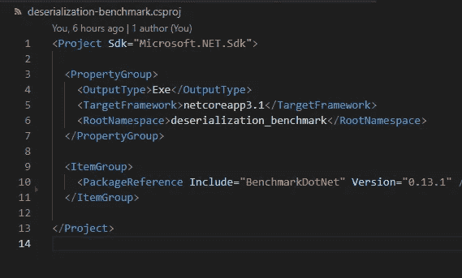
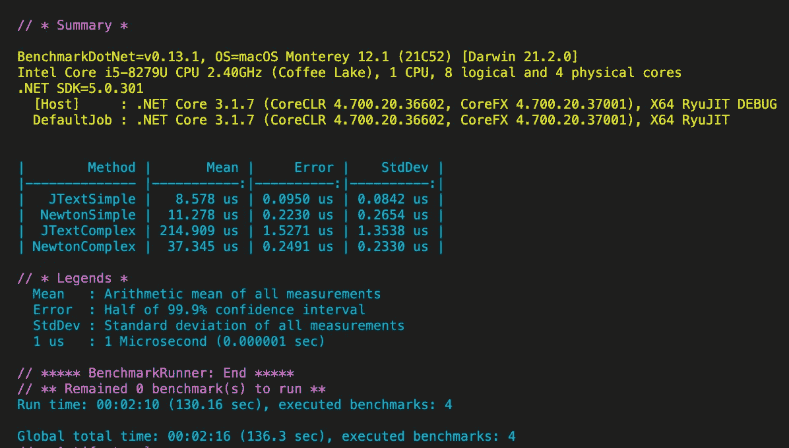
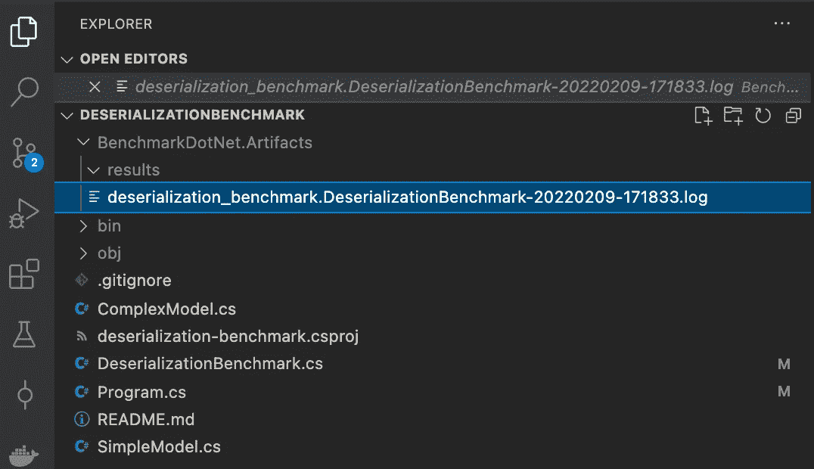
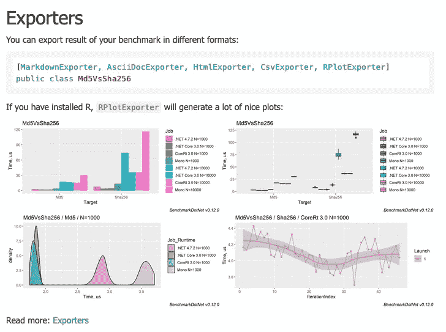
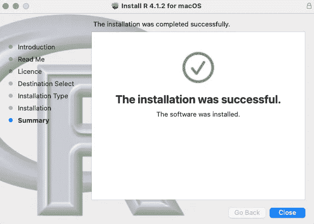
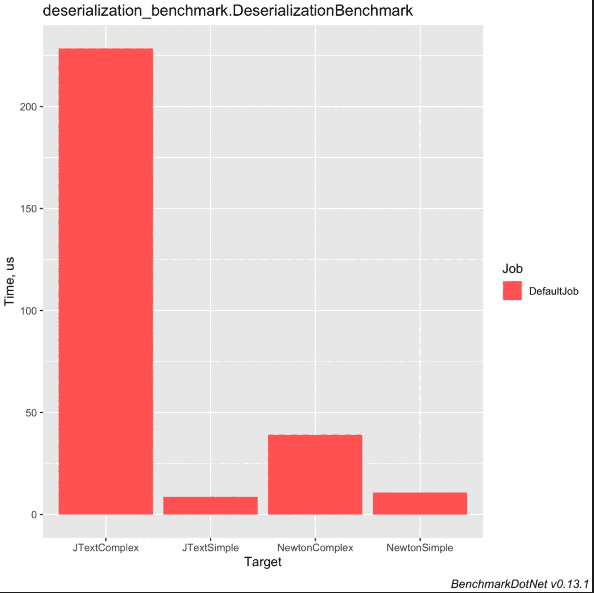
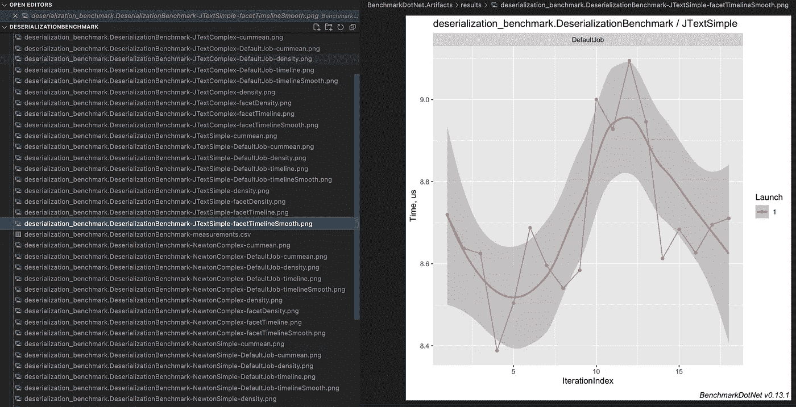

# 比较中的代码性能。网

> 原文：<https://betterprogramming.pub/could-my-code-run-faster-80ca4da7ea29>

## 你能写出更快的代码吗？

由[拍摄的照片](https://pixabay.com/pt/users/wildfaces-932734/)在 [Pixabay](https://pixabay.com/pt/)

当我们编码时，我们通常在头脑中有一个特定的目标，通常是构建一些有用的东西或者修复一个现存的问题。

尽管我们知道性能是需要考虑的一个关键点，但大多数时候我们把它作为次要目标。

因此，与其在解决问题后才开始关注解决方案的性能，不如在开发解决方案时将性能考虑在内。

一个类似的情况是，有人要求你修改一段代码，因为这个人认为他的方法比你的方法有更好的性能。

在确定建议的方法是否真的比我们的好之前，接受建议的情况并不少见。

> 幸好。net 开发人员已经有了 benchmarkdotnet，这是一个可以用来测量我们代码性能的工具，它非常容易使用和理解，在社区中非常有名

今天我将解释如何建立一个简单的项目，比较不同的开发方法，并以一种非常吸引人和有效的方式导出信息。

在实现真正的解决方案之前，您可以拥有这个项目并更改代码来测试您的方法。

## 树立榜样

首先，让我们创建一个新的控制台应用程序，并安装 [benchmarkdotnet 依赖 NuGet 包。](https://www.nuget.org/packages/BenchmarkDotNet/)

在终端中运行`dotnet new console`，当 if 结束时运行`dotnet add package BenchmarkDotNet`，如果您使用。net core 3.1 你的`.csproject`文件看起来会像这样:

csproj 文件

我将从测试[系统之间的反序列化性能开始。Text.Json](https://docs.microsoft.com/en-us/dotnet/api/system.text.json?view=net-6.0) 和 [Newtonsoft。Json](https://www.newtonsoft.com/json) ，这是一个很容易做的测试，你可以在网上找到很多关于它们的比较。

据我所知，根据我们要反序列化的项目的复杂性，性能可能会有所不同，因此，我创建了两个模型，一个简单的模型稍微复杂一点。

现在我将创建`DeserializationBenchmark`类，用于测试代码并生成性能结果

正如你所看到的，这个类非常简单，它有四个用于测试的方法，分别用`[Benchmark]`属性、`JTextSimple`、`NewtonSimple`和`NewtonComplex`修饰，它们只会反序列化在类构造函数中序列化的内容。

我还添加了两个私有方法来序列化名为`SerializeSimpleModeList()`和`SerializeComplexModelList()`的简单和复杂列表

基本上，这两种方法都是序列化一个列表，每个列表包含简单和复杂模型的五个项目。

最后一步是在方法`Program.Main()`中设置基准流道:

就这样，我们完成了基准测试应用。

## 运行并检查结果

在终端中键入`dotnet run`,然后执行

基准结果

我们需要注意的是列方法和均值，看一下数字，很明显反序列化简单和复杂模型之间有很大的差异

因为我们没有添加任何导出器，所以结果没有被持久化，所以如果您在`BenchmarkDotNet.Artifacts`文件夹中检查，您将只有`.log`文件

解决方案文件

## 导出结果

虽然结果在终端很容易解释，但是`benchmarkdotnet`提供了其他出口商，因为我们可以在[文档](https://benchmarkdotnet.org/articles/overview.html)中查看。

benchmarkdotnet 文档中的出口商部分

但是它也说我们需要安装`R`来允许`RPlotExporter`产生许多好的情节。

> R 是一个用于统计计算和图形的自由软件环境。

要安装它，首先在[列表镜像](https://cran.r-project.org/mirrors.html)中选择最近的国家，然后下载相应版本的[操作系统](https://cran.radicaldevelop.com/)

r 下载页面

安装过程非常简单，对于 macOS，它会在安装结束时显示一个这样的摘要

安装摘要屏幕

然后，现在我们需要定制代码，以便在运行解决方案后导出它，这样做非常简单，只需将这两个导出器添加到配置中，并用`HtmlExporter`属性修饰基准类

现在，下次运行控制台时，它将在`BenchmarkDotNet.Artifacts`文件夹中生成图形。

比如这个:

基准柱状图

以及所有这些其他的:

JTextSimple 方法执行的迭代索引

我没有太多的知识来评估这样的图形，但条形图是一个非常简单的例子，每个人都会理解，如果你想，你可以检查文档，以了解到底是什么和如何发生的神奇

当然，我只是解释了 benchmarkDotNet 工具的基础知识，你可以找到许多其他使用它的方法和许多自定义点。

在这里查看 [benchmarkdotnet 文档](https://benchmarkdotnet.org/articles/overview.html)，玩得开心。

我将让解决方案在链接上[可用，随意克隆并运行它，只需在终端上键入`dotnet run` ，看看会发生什么](https://github.com/edsondiasalves/deserializationbenchmark)

我希望它能对你有用，谢谢你的阅读，下次见。