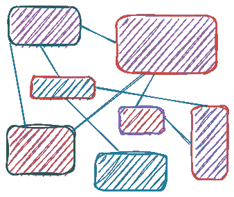
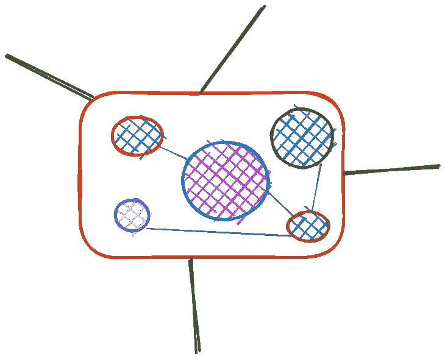
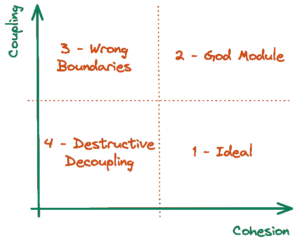
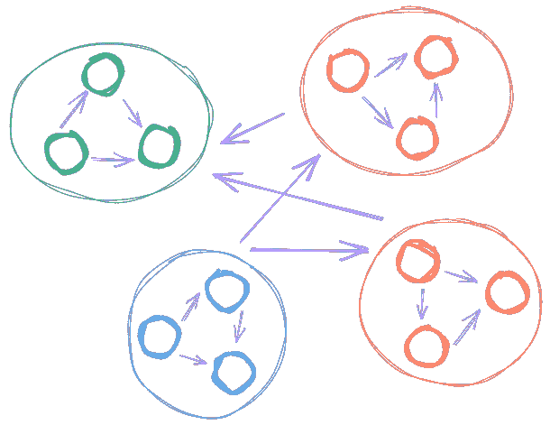
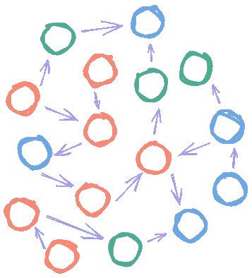
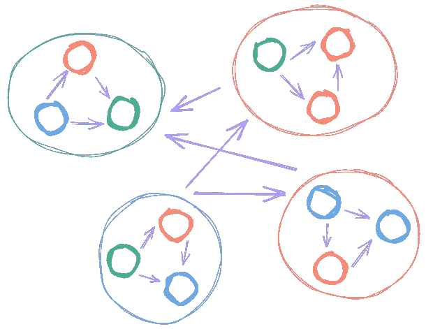

# React 项目中的模块组织——低耦合和高内聚

> 原文：<https://betterprogramming.pub/coupling-cohesion-552b022492b2>

## 设计强大的应用程序

图片由 [XPS](https://unsplash.com/@xps) 在 [Unsplash](https://unsplash.com/photos/7ZWVnVSaafY) 上拍摄

你如何在你正在做的 React 项目中组织模块？我希望您将彼此相关的元素放在一起(模块)，然后在这些元素组之间建立连接。对吗？

上述原理允许设计可扩展的应用程序。听起来是这样的:

> 以解耦和内聚的方式组织系统元素。即偏爱**低耦合**和**高内聚**。

你可能已经听过这个规则了。但是你有没有想过它到底意味着什么，它能提供什么真正的好处？我建议你更深入地探究这些问题，并找到遵循这条规则的理由。

# 连接

耦合类似于系统元素之间的连接。高耦合是指系统中的元素有混乱的连接。

从技术上讲，我们可以度量耦合的价值——这只是系统元素(功能、对象、模块等)之间的一些连接。).该规则规定系统应该具有尽可能少的连接数。在这种情况下，我们可以确定只有预期的连接，并且我们能够有效地管理它们。

图片。1.连接

实际上，我不确定是否有一种简单的方法来计算连接数。我甚至不认为这个数字真的有用！

让我们想象一下，我们已经以某种方式计算了一些连接，结果是“100”。是多还是少？我们如何利用这个数字来改进现有的系统？不确定在这里回答什么。

那么，如何改进现有的系统呢？唯一合适的方法是遵循我们稍后将要讨论的技术。

# 内聚力

内聚是指系统的元素按照某种标准组合在一起。低内聚意味着 app 元素没有清晰的边界。这可能看起来一团糟。

有很多东西我们可以称之为“组”:

*   组件
*   班级
*   反应组件(类和函数)
*   命名空间
*   服务
*   诸如此类…

图片。2.内聚力

但是为什么有用呢？因为在一个内聚的系统中，元素之间的联系要少得多。这导致对这些连接的更好的管理，并且我们可以更确定它们是预期的。

正如您所看到的，“耦合”和“内聚”这两个术语总是在一起。在这种情况下，支持高内聚是减少连接数量并使系统更易于管理和扩展的更好的解决方案。

# 耦合和内聚

我们来探讨不同的案例。下面你可以找到一个描述“耦合”和“内聚”之间联系的图表。这对于分析您的应用程序和创建改进计划可能很有用。

图片。3.耦合和内聚

## **1。理想:低耦合、高内聚**

这是一个我们需要支持的案子。这样的系统是可管理和可扩展的。在大多数情况下，开发人员喜欢使用类似的系统，因为它可以被分成逻辑部分；这导致了开发过程中较低的精神压力。

下面你可以看到在这种情况下元素之间的连接是什么样子。

图片。4.理想:低耦合、高内聚

如何遵循这个规则？并不复杂:将相关元素组织成组(见上文)，并在组之间建立连接。

在这种情况下，项目结构可能是这样的。

要点 1。理想:低耦合、高内聚(结构)

现在让我们来看一个虚构的代码示例。

要点 2。理想:低耦合、高内聚(代码)

## **2。神模块:高耦合、高内聚**

对我来说，这是最坏的情况，每个团队都应该避免。这样的系统很难管理，并且不能以适当的方式扩展。

图片。5.上帝模块:高耦合、高内聚

在这种情况下，系统元素变得一塌糊涂。让我们想象一下这在代码结构中会是什么样子。

要点三。神模块:高耦合、高内聚(结构)

和人为的代码示例。

要点 4。神模块:高耦合、高内聚(代码)

这里的问题是共享组件中嵌入了数据逻辑。这个组件应该是可重用的，新的数据类型不应该影响它。请避免这样的设计，将所有特定的逻辑放在可重用组件之外。

## **3。错误的界限:**高耦合，低内聚

让我们在没有任何额外单词的情况下研究图表和例子。

图片。6.错误的边界:高耦合，低内聚

人为的项目结构。

要点 5。错误的边界:高耦合，低内聚(结构)

和人为的代码示例。

要点 6。错误的边界:高耦合，低内聚(代码)

希望你清楚这个例子中的界限是错误的。这样的应用程序应该重新设计，就像在第一个例子。

## **4。破坏性解耦:低耦合、低内聚**

让我们在没有详细解释的情况下研究图表和示例。

图片。7.破坏性解耦:低耦合、低内聚

人为的代码结构。

要点 7。破坏性解耦:低耦合、低内聚(结构)

和人为的代码示例。

要点 8。破坏性解耦:低耦合、低内聚(代码)

这里的问题是有很多元素被扔在同一个堆里。并且很难理解每个模块(文件)的使用范围。

就是这样！希望您喜欢这些内容，这将帮助您设计健壮的应用程序。