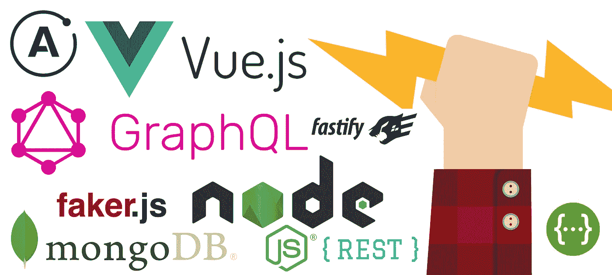
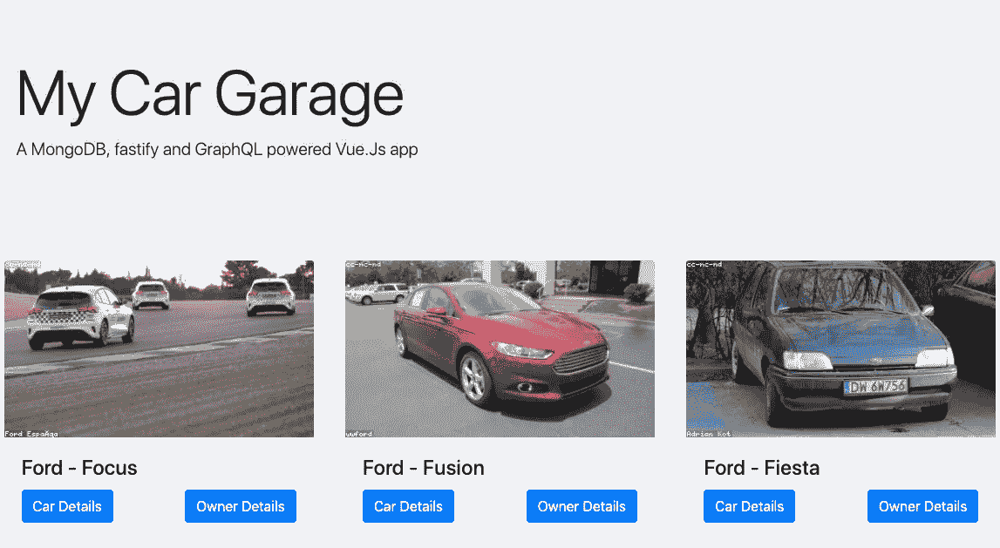

# 用 Vue.js、GraphQL、Fastify 和 MongoDB 构建全栈应用

> 原文：<https://betterprogramming.pub/coupling-vue-js-with-a-graphql-api-e9fb830e3db>

## 从头开始部署功能齐全的全栈应用。第三部分，共四部分。



图片来源:[由 Dooder](https://www.freepik.com/free-vector/hand-with-a-pencil-with-lightning-shape_901992.htm) 设计

*   第 1 部分: [vue 力矩](https://medium.freecodecamp.org/how-to-build-blazing-fast-rest-apis-with-node-js-mongodb-fastify-and-swagger-114e062db0c9#readme)

    > 为您的 [Vue.js](http://vuejs.org/) 项目提供便利的 [Moment.js](http://www.momentjs.com/) 过滤器。在 JavaScript 中解析、验证、操作和显示日期和时间。

    是时候进行理智检查了。让我们运行应用程序:

    ```
    npm run serve
    ```

    您的应用程序现在应该运行在 [http://localhost:8080/](http://localhost:8080/) 上。

# 应用概述

所有的应用程序开发文件都在`src`目录中，该目录被构建到`src`目录中的`dist`目录中。其结构如下:

在`views`目录中，有三个主要视图:

*   Home.vue
*   Car.vue *****
*   Owner.vue *****

你可以在`views`目录下创建这些文件。

在`components`目录中，有三个可重用的组件:

*   Header.vue *****
*   CarCard.vue *****
*   EditCar.vue *****

*您可以在`components`目录中创建这些文件。

我们还有一些用于路由(`router.js`)、状态管理(`store.js`)和设置(`main.js`)文件的支持文件，它们已经由 Vue CLI 工具创建。

# 让我们写一些代码

我们要做的第一件事是导航到`src`文件夹，用下面的代码更新`main.js`文件:

主页. js

在上面的代码中，我们导入了几个依赖项，初始化了库，创建了 [Apollo 客户端](https://www.apollographql.com/docs/react/)和 p[provider](https://www.apollographql.com/docs/react/v2.5/api/react-apollo/#apolloprovider)，并创建了 Vue 实例。

以上链接是通用的 [Apollo](https://www.apollographql.com/docs/react/) 文档，但也适用于跨框架。Vue Apollo 文档可在[这里](https://vue-apollo.netlify.com/)获得。

了解更多关于 Vue 实例的信息也是有帮助的，尤其是生命周期挂钩，在这个视频中有很好的解释。

接下来，我们将以下代码添加到`router.js`文件中:

router.js

上面我们只是导入外部依赖和视图文件。然后，我们初始化路由器并设置路由。

routes 对象由路径、名称、组件(视图)以及是否传递了任何属性组成。

使用以下语法传递[属性](https://router.vuejs.org/guide/essentials/passing-props.html):

```
:id
```

> Vue 路由器是 [Vue.js](http://vuejs.org/) 的官方路由器。它与 Vue.js core 深度集成，使使用 Vue.js 构建单页面应用变得轻而易举。

点击了解有关路由和 Vue 路由器[的更多信息。](https://router.vuejs.org/)

让我们用下面的代码更新`store.js`文件:

商店. js

在上面的代码中，我们导入外部依赖项并初始化 [Vuex](https://vuex.vuejs.org/) 。然后我们建立 Vuex 存储，在其中我们指定初始应用程序状态以及我们期望的突变。

> Vuex 是 Vue.js 应用程序的状态管理模式+库。它充当应用程序中所有组件的集中存储，规则确保状态只能以可预测的方式变化。它还与 Vue 的官方 [devtools 扩展](https://github.com/vuejs/vue-devtools)集成，以提供诸如零配置时间旅行调试和状态快照导出/导入等高级功能。

这里是[一篇深入研究 Vuex 的伟大文章](https://medium.com/vue-mastery/vuex-explained-visually-f17c8c76d6c4)。

现在让我们通过替换下面的代码来更新`App.vue`文件:

App.vue

Vue 路由器将加载与默认页面相同的`Home.vue`，因为我们将主视图指定为默认(`/)`路由。

我们用以下代码将`router-view`加载到我们的应用程序中:

```
<router-view />
```

然后，我们声明并运行将返回数据库中所有汽车的`CarsQuery`，然后将结果提交给Vuex 商店。

注意，`CarsQuery`是在组件挂载之前执行的，使用的是`beforeMount()` [生命周期钩子](https://alligator.io/vuejs/component-lifecycle/)。

请随意将`response`变量记录到控制台或使用 [Vue 开发工具](https://github.com/vuejs/vue-devtools)扩展来查看我们 Vuex 商店中的响应。

# 创建视图和组件

首先，我们可以将下面的代码添加到`Header.vue`组件中:

Header.vue

使用上面的代码，我们用字符串 props `title`和`intro`创建了一个简单的可重用的`Header`组件。使用[引导大屏幕组件](https://bootstrap-vue.js.org/docs/components/jumbotron)构建标题组件。

接下来，我们可以填充`CarCard.vue`组件:

CarCard.vue

这里我们使用[引导卡组件](https://bootstrap-vue.js.org/docs/components/card)和`Car`对象作为道具。汽车的详细信息及其属性使用 [Vue 模板语法](https://vuejs.org/v2/guide/syntax.html)显示，它有两个 click 事件，使用 Vue 路由器导航到单个`Car`视图或`Owner`视图，我们接下来将实现这两个视图。

我们使用下面的代码使用 [Lorem Flickr API](https://loremflickr.com/) 来提供与汽车相关的图像:

```
:img-src="`https://loremflickr.com/350/200/${car.brand},${car.title}`"
```

我们需要指定 API URL、图像宽度和图像高度。然后我们使用模板文字来指定汽车品牌和汽车标题，它们来自汽车对象。

两个点击事件`viewCar(id)`和`viewOwner(id)`使用 Vue 路由器导航到它们各自的页面，但是在它们工作之前，我们必须首先填充这些视图。

最后，还有一些 CSS 样式规则，我们不会深入讨论。

现在我们已经有了将被`Home.vue`使用的两个组件，我们可以用下面的内容更新`Home.vue` :

Home.vue

在上面的代码中，我们使用了之前创建的两个组件。

对于`Header`组件，我们绑定了以下道具:

```
v-bind:title="'My Car Garage'"
v-bind:intro="'A MongoDB, fastify and GraphQL powered Vue.Js app'"
```

对于`CarCard`组件，我们使用[列表呈现函数](https://vuejs.org/v2/guide/list.html)遍历`carData`数组(从 Vuex 存储中检索)。这里我们将汽车对象绑定为道具，并将`car.id`作为键。

您需要为每个项目提供一个唯一的`key`属性，这样 Vue 就可以跟踪每个项目的身份。点击了解更多关于`key`属性[的信息。](https://vuejs.org/v2/api/#key)

在脚本标签中，我们导入依赖项和组件。然后我们使用`mapState`助手为我们生成一个计算的 getter 函数，将`carData`加载到状态中。点击了解更多关于`mapState`帮手[的信息。](https://vuex.vuejs.org/guide/state.html#the-mapstate-helper)

# 健全性检查

如果一切顺利，我们应该会在主页上看到加载的汽车:



主页

如上所述，`@click`事件确实工作，因为它们被重定向到正确的视图，但是此时，这些视图是空的，所以让我们填充它们。

# 汽车视图

在`views`目录和`Car.vue`文件中，添加以下代码:

汽车. vue

让我们从`<template>`标签开始，一段一段地分解每个部分。

与我们的其他视图和组件一样，我们使用 [Vue 模板语法](https://vuejs.org/v2/guide/syntax.html)来呈现汽车的细节。这将创建由标题、面包屑、汽车细节、行动号召和`EditCar`组件组成的布局。

我们循环遍历`car.services`对象中的服务数组，列出所有服务，或者在汽车没有服务时显示一条消息。

在服务循环中，我们使用 [moment.js](https://momentjs.com/) 库来格式化日期。

```
{{ service.date | moment("DD/MM/YYYY") }}
```

在`btn-container` div 中，我们列出了我们对动作的调用以及它们各自的功能。

最后，我们将[引导模式](https://bootstrap-vue.js.org/docs/components/modal)用于编辑汽车表单，它由编辑按钮触发。

在`<script>`标签中，我们导入了依赖项和组件，并声明了两个查询，即`getCar`和`deleteCar`查询，它们用于检索一辆汽车的数据并删除它。

然后，我们声明我们的初始组件数据、属性、计算数据、组件和方法。

在`beforeMount()` [生命周期挂钩](https://alligator.io/vuejs/component-lifecycle/)中，我们运行`getCarDetails()`函数，将`id`作为变量传入，它将返回所有单车的数据，然后将结果提交给 **Vuex 存储。**

`goHome()`功能将在历史中向后导航一页。

`deleteCar()`函数将通过删除带有我们作为变量传入的`id`的汽车来改变我们的数据，然后将结果提交给Vuex 存储。

# 编辑车

EditCar.vue

在`<template>`标签中，我们创建了一个表单，并用`v-model` [指令](https://vuejs.org/v2/guide/forms.html)将每个表单输入绑定到其各自的值。

我们用下面的代码将 OK 按钮绑定到`onSubmit`事件:

```
@ok="onSubmit"
```

在`<script>`标签中，我们导入了依赖项并声明了`editCar`查询，该查询用于编辑一辆汽车的数据。

然后，我们声明我们的初始组件数据和道具。

最后，我们声明了`onSubmit(evt)`方法，该方法使用`editCar`查询来更新汽车，将表单数据(`{ …data }`)作为新的汽车数据传入，然后将这些数据保存到 Vuex 存储中。然后模态被隐藏。

# 所有者视图

到目前为止，您应该已经掌握了代码中的模式，因为`Owner`视图中的大部分代码已经在之前的组件和视图中讨论过了。

我们重用了`Header`组件和`CarCard`组件——只是这次显示了属于特定所有者的所有汽车。

# 结论

我真的希望这篇教程能达到双重目的，一方面展示使用 GraphQL 进行数据检索和操作的简易性，另一方面展示 Vue.js 的编码简易性和直观性。

我知道本教程肯定可以进一步重构，以减少代码和复杂性。如果你有什么建议，请在评论中留下。

# 下一步是什么？

我们唯一要做的就是部署。这听起来可能很容易，但是我们有几个松散的结束绑在一起，真正把所有的东西放在一起。

因此，在下一个教程中，我们将把我们的代码库，包括数据库，转移到云中，我们还将引入环境变量。

像往常一样，上述教程中的所有代码都可以在 [GitHub](https://github.com/siegfriedgrimbeek/Fastify-GraphQL-Vue.Js-Application) 上获得。