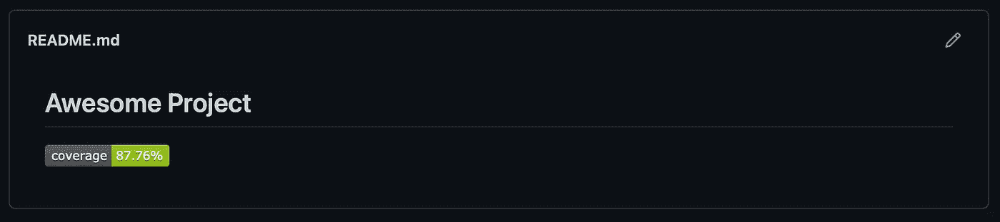
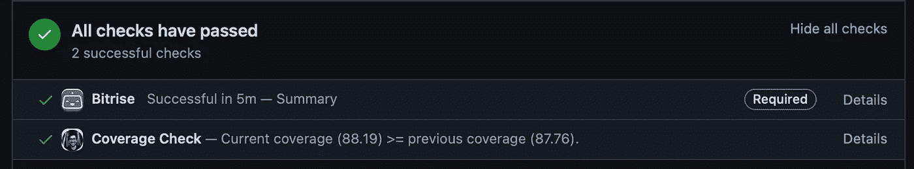
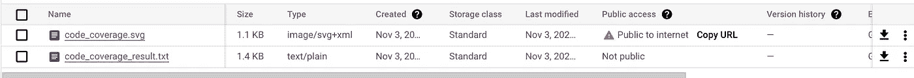
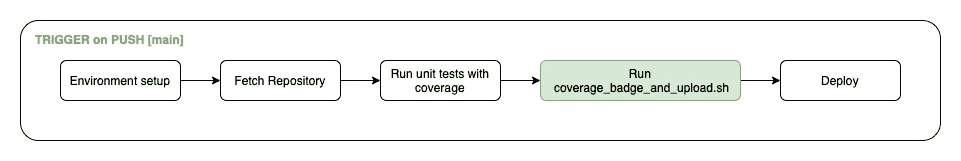
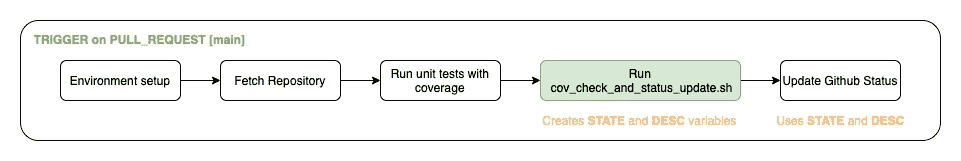

# 在库中的拉请求和覆盖率标记中生成代码覆盖率检查

> 原文：<https://betterprogramming.pub/coverage-checks-in-prs-coverage-badges-in-repository-249dc6bd7e0>

## 如何编写一个脚本来自动完成这项任务


照片由[通讯社跟随](https://unsplash.com/@olloweb?utm_source=medium&utm_medium=referral)于 [Unsplash](https://unsplash.com?utm_source=medium&utm_medium=referral) 拍摄

欢迎阅读我关于代码覆盖率的第二篇文章。在[第一篇文章](https://medium.com/@meliksahcakirr/unit-tests-and-coverage-reports-in-multi-package-flutter-project-5b0ce47d2fc2)中，我试图解释如何为多模块颤振项目创建代码覆盖报告。在这一篇中，我将展示一个平台无关的解决方案，用于在拉请求中创建覆盖率检查，并向您的存储库中添加一个漂亮的覆盖率标记。️​

剧透警报！如果你把文章看完，你会得到类似下面的东西:



README.md 文件中的承保范围徽章



拉动式请求中的附加覆盖范围检查

# 先决条件

在深入研究解决方案之前，我必须假设几件事:

1.  您拥有一个包含全部代码覆盖率信息的文件。不管是 Android 项目，还是 Flutter 项目，还是别的什么都无所谓。只要你有一个综合的覆盖率结果，你就可以了。从现在开始，我把这个文件称为`<COVERAGE_FILE>`。
2.  您可以访问专用云存储。它可以是谷歌云存储，S3 桶，或任何其他你可以上传文件并通过 CLI 获取的存储。在本文中，我将使用 [google cloud CLI 工具](https://cloud.google.com/sdk/gcloud)来上传/下载我们的覆盖报告和我们的覆盖徽章。

# 步骤 1:文件解析和获取覆盖率

在文章的开始，我假设您已经生成了您的`<COVERAGE_FILE>`。我们必须能够在我们的自定义脚本中解析该文件，以便我们可以在我们的覆盖率徽章和 PRs 中使用该百分比。

假设您有一个这样的文件:

覆盖报告的一个例子

我们必须读取文件，确定`GLOBAL`下的行，并解析该行中“%”字符之前的覆盖率值。下面的神奇代码为我们做到了这一点:

```
line=$(grep 'GLOBAL' -A1 $COVERAGE_FILE | grep -v 'GLOBAL')
coverage=$(echo "$line" | cut -d'%' -f 1)
```

# 步骤 2:生成覆盖徽章

在上一步中，我们获得了代码覆盖率。现在，我们想使用这个值创建一个徽章。如果您也想给徽章添加一些颜色，您可以执行以下操作:

```
if (( $(echo "$coverage <= 50" | bc -l) )) ; then
  color=red
elif (( $(echo "$coverage > 80" | bc -l) )); then
  color=green
else
  color=orange
fi
```

现在，我们已经准备好了`coverage`和`color`变量。为了创建一个可爱的徽章，我们将使用一个开发者友好的 [shield.io](https://shields.io/category/coverage) API。我们唯一需要做的是:

```
curl "[https://img.shields.io/badge/coverage-$coverage%25-$](https://img.shields.io/badge/coverage-$coverage%25-$COLOR)color" > coverage_badge.svg
```

开始了。我们创造了我们的徽章。如果您在本地机器上运行这些命令，您现在应该在您的目录中看到`coverage_badge.svg`文件:


coverage_badge.svg

# 步骤 3:上传徽章和<coverage_file></coverage_file>

至此，我们已经准备好了以后需要用到的一切。为了在未来访问这些文件，我们必须将它们存储在云中。我更喜欢使用谷歌云存储，但这个选择完全取决于你。我们在这里要做的事情也与该工具类似。

让我们在 Google 云存储中创建我们的存储桶。在创建它的时候，我们必须考虑一些重要的事情。首先，我们不想“在这个桶上实施公共访问预防”相反，我们将选择“细粒度”访问控制，因为在确保我们的`<COVERAGE_FILE>`是私有的同时，我们希望让`coverage_badge.svg`公开。

创建 bucket 之后，我们需要生成一个服务帐户，以便稍后访问这个 bucket。同样，我们必须确保为服务客户提供正确的角色。否则，我们无法从脚本中控制文件的可见性。我们必须添加存储对象管理员、存储对象创建者、存储查看者和存储管理员。创建新的服务帐户后，我们可以下载`service_account.json`文件，并在建立身份验证时使用它。

```
echo "---- Authenticating google cloud ----"
gcloud auth activate-service-account -q --key-file service_account.json
```

如果认证成功，我们可以继续文件上传部分。下面，您可以看到上传文件的必要命令:

```
echo "---- Uploading badge to Google Cloud Storage ----"
gsutil -h "Cache-Control: no-cache" cp coverage_badge.svg gs://$BUCKET_NAME/coverage_badge.svg
gsutil acl ch -u AllUsers:R gs://$BUCKET_NAME/coverage_badge.svgecho "---- Uploading coverage result to Google Cloud Storage ----"
gsutil cp $COVERAGE_FILE gs://$BUCKET_NAME/$COVERAGE_FILE
```

正如你所注意到的，我们正在上传文件。但是，我们也修改了徽章文件的访问控制列表(ACL)。要在我们的`README.md`文件中看到生成的徽章，我们必须给每个人读权限。此外，为了在我们的存储库中拥有徽章的更新版本，我们需要在命令中添加`no-cache`头。

如果您到达这里并运行您的脚本，您将在您的 bucket 中看到这两个文件:



桶中的文件

如果您看到文件已经上传到存储器，您可以检索徽章文件的公共 URL。要在您的存储库中显示这个，您需要将 URL 添加到`README.md`文件中。

README.md 文件

以下是目前为止的整体脚本:

# 步骤 4:将脚本添加到 CI / CD 主工作流

在这里，我不会深入研究具体的 CI / CD 工具，如 Bitrise、GitHub Actions 等。相反，我将解释工作流的一般行为。

此时，您可以通过在本地运行脚本来确保脚本运行无误。如果一切正常，我们可以将此步骤添加到 CI/CD 工作流中。

每当一个新的提交被推送到我们的默认分支，比如`main`，我们都希望运行这个脚本。每当一个新的 PR 被批准并与这个分支机构合并时，我们希望更新我们的云存储中现有的覆盖徽章和覆盖报告。因此，此工作流的一般图表如下所示:



主分支推送工作流

# 步骤 5:代码覆盖率比较的另一个脚本

在这一步中，我们想要创建另一个脚本来解析`<COVERAGE_FILE>`，就像我们之前在步骤 3 中所做的那样。并且还必须下载云存储中已有的`<COVERAGE_FILE>`并再次解析。因此，最终，我们将拥有主请求代码和拉请求代码。您可以根据这些值更新 GitHub 状态，并确定`COVERAGE_THRESHOLD`。

正如你在最后一部分看到的，我们又创建了两个变量:`STATE`和`DESC`。这可以在 GitHub 状态更新步骤中使用。

# 步骤 6:将脚本添加到配置项/光盘提取请求工作流

与前面的工作流不同，每当针对我们的默认分支`main`创建新的拉请求时，我们都要运行这个脚本。每当一个新的 PR 被创建时，我们想要检查新的代码覆盖率是否小于整个代码覆盖率或者甚至小于`COVERAGE_THRESHOLD`。因此，此工作流的一般图表如下所示:



主分支拉式请求工作流

现在，如果您现在根据默认分支创建一个 PR，您将在您的 PR 状态中看到第二个检查:


覆盖范围登记申请

恭喜你，你坚持到了最后！有点长。

我希望你会对这篇文章感兴趣，并且它会对你的这次冒险有所启发。

```
**Want to Connect?**Feel free to ask for more information if needed. You can also connect with me on [LinkedIn](http://www.linkedin.com/in/meliksahcakir) ☺️.
```