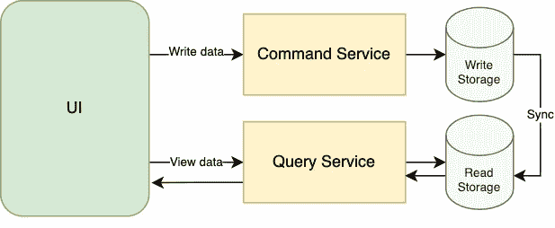
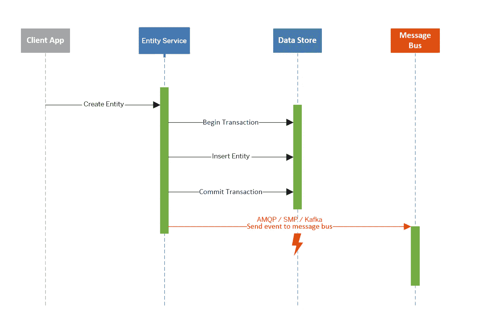
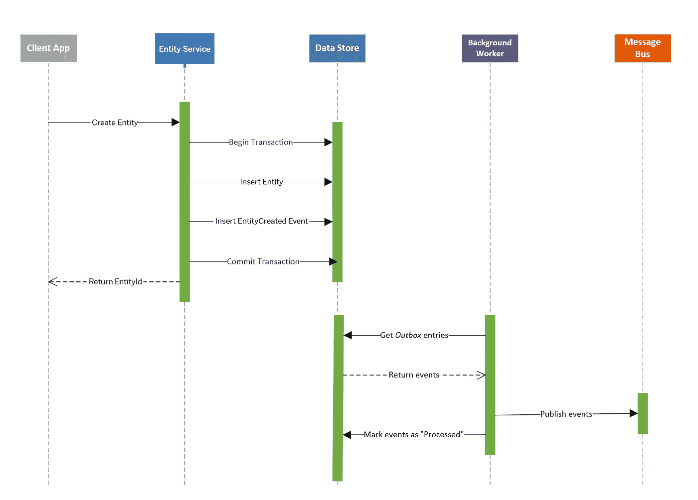
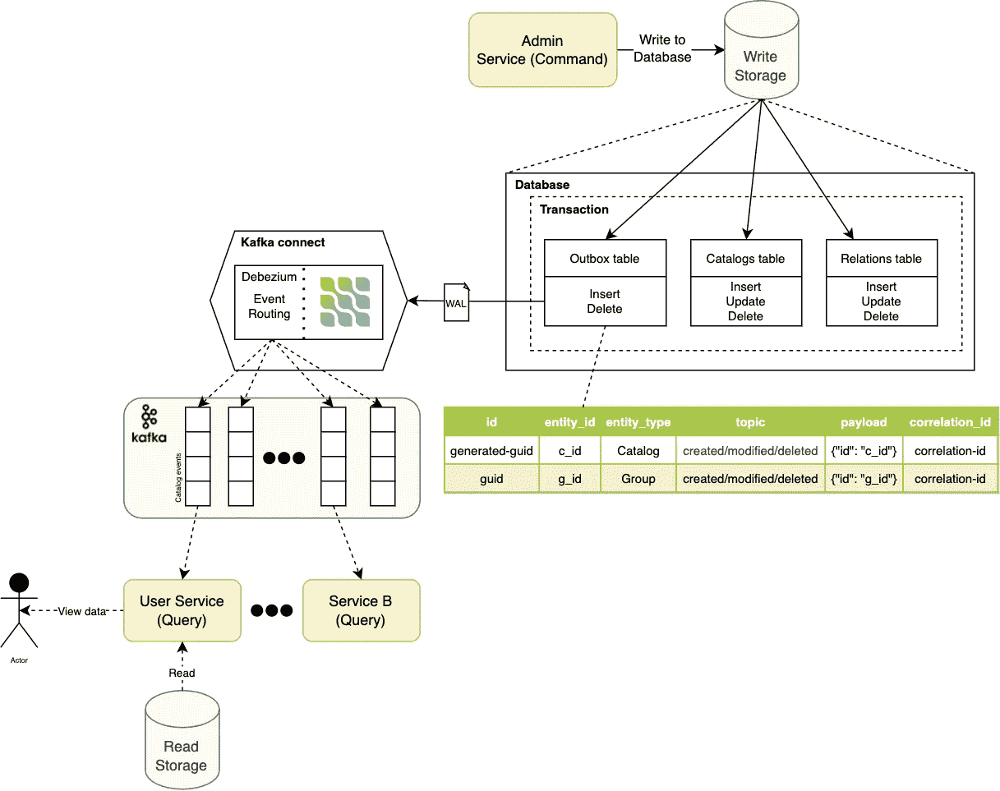
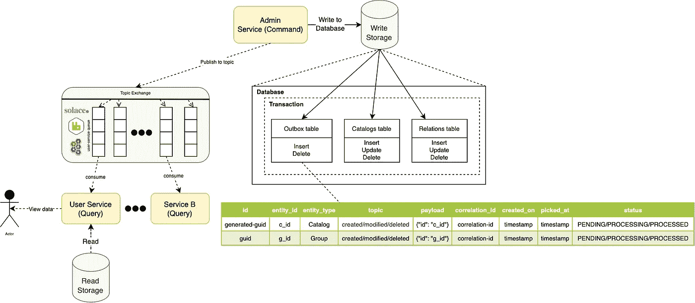

# CQRS 软件架构模式:好的、坏的和丑陋的

> 原文：<https://betterprogramming.pub/cqrs-software-architecture-pattern-the-good-the-bad-and-the-ugly-e9d6e7a34daf>

## 用 CQRS 和事务发件箱模式设计可伸缩架构

Jukan Tateisi 在 [Unsplash](https://unsplash.com?utm_source=medium&utm_medium=referral) 上拍摄的照片

命令和查询责任分离(CQRS)这是一种架构模式，其主要重点是分离读取和写入数据的方式。这种模式使用两种不同的模型:

*   **查询**——负责读取数据
*   **命令**——负责更新数据

简单地说-

> 命令和查询责任分离(CQRS)模式将数据存储的读取和更新操作分开。
> 
> 在您的应用中实现 CQRS 可以最大化其性能、可伸缩性和安全性。

下图展示了 CQRS 模式的一个基本实现。*(图 1。)*

稍后，我将解决两个存储之间的同步问题。

图一。高级 CQRS 实施

# 术语

## 命令

命令表示改变实体状态的意图。它们执行插入、更新、删除等操作。命令对象改变状态并且不返回数据。

命令代表一个业务操作，并且总是处于命令时态，因为它们总是告诉应用服务器做一些事情。

## 问题

查询用于从数据库中获取数据。查询对象只返回数据，不做任何更改。

查询将只包含获取数据的方法。它们用于读取数据库中的数据，以将 d to 返回给客户端，这些数据将显示在用户界面中。

## 活动采购

事件源确保对应用程序状态的所有更改都存储为一系列事件。

我们不仅可以查询这些事件，还可以使用事件日志来重建过去的状态，并以此为基础自动调整状态以应对追溯性的更改。

## 变更数据捕获

变更数据捕获(CDC)解决方案从数据库事务日志(或等效机制)中捕获变更事件，并将这些事件转发给下游消费者。

CDC 最终允许应用程序状态外部化，并与外部数据存储同步。

CDC 可以使用 [Debezium](https://debezium.io/documentation/reference/stable/architecture.html) 实现，如下所示:

*   嵌入式引擎—(仅适用于 Java 应用程序)
*   独立 Debezium 服务器使用 Kafka 连接。

# CQRS 模式

## **何时使用 CQRS**

CQRS 可用于以下场景:

*   对数据消费有很高的需求
*   数据读取的性能必须与数据写入的性能分开调整，尤其是当读取次数远远大于写入次数时。
*   需要一个团队专注于复杂的域模型，它是写模型的一部分，而另一个团队可以专注于读模型和用户界面。
*   该系统预计会随着时间的推移而发展，并且可能包含模型的多个版本，或者业务规则会定期发生变化。
*   与其他系统集成，特别是与事件源相结合，其中一个子系统的暂时故障不应该影响其他子系统的可用性。
*   您可以承受陈旧的数据。

## CQRS 的优势

*   **关注点分离** —当读取和写入端分离时，模型变得更加可维护和灵活。读模型通常更简单，而写模型涉及更复杂的业务逻辑。
*   **独立扩展**—借助 CQRS，读写工作负载可以独立扩展，从而减少锁争用。
*   **优化的数据模式** —在读取端，模式可以针对查询进行优化，在写入端，模式可以针对更新进行优化。
*   **安全性** —更容易确保只有正确的域实体在数据上执行写操作。
*   **更简单的查询** —应用程序查询可以通过在读取的数据库中存储物化视图来避免复杂的连接。

## 实施问题和考虑因素

*   **代码的复杂性**并导致更复杂的应用程序设计，尤其是在使用消息传递时。
*   **消息传递** —虽然 CQRS 不需要消息传递，但是使用消息传递来处理命令和发布更新事件是很常见的。在这种情况下，应用程序必须处理消息失败或重复消息。
*   **最终一致性—** 如果将读取和写入数据库分开，读取的数据可能会过时。

## 分离的数据库

使用 CQRS 时，也有可能拥有单独的数据库，但这不是强制性的:

*   仅用于读取数据和创建物化视图的“读取数据库”
*   而“写数据库”仅用于进行更改。

当我们处理更复杂的应用程序时，如微服务或任何类型的对数据消费有高需求的应用程序，通用方法可能会变得难以处理，因为在同一个数据库中进行大量的写入和读取会影响应用程序的性能(读取和写入工作负载具有非常不同的性能和规模要求)。

如果使用单独的读写数据库，它们必须保持同步。通常，这是通过让写模型在更新数据库时发布事件来实现的。

稍后将提供关于事件和保持读写数据库同步的不同方法的更多信息。

## 分离的服务/模型

所谓独立的模型，我们通常指的是不同的对象模型，可能在不同的逻辑进程中运行，可能在独立的硬件上运行。

经常可以看到 CQRS 系统被分割成独立的服务，与[事件协作](https://martinfowler.com/eaaDev/EventCollaboration.html)进行通信。这使得这些服务可以轻松利用[事件源](https://martinfowler.com/eaaDev/EventSourcing.html)。

## CAP 定理

CAP 定理指出，在一致性、可用性和分区容差(通常被认为是“可伸缩性”)之间，我们只能有两个。

> **CQRS 的一个巨大优势是，您将能够放松读取模型的一致性要求，以便获得高可用性和可伸缩性。**

**那么…为什么我们需要事务发件箱模式？**

事务发件箱模式用于可靠的消息传递和有保证的事件传递。

# 事务发件箱模式

## 问题

微服务通常在执行数据库事务后发布事件。

写入数据库和发布事件是两个不同的事务，它们必须是原子的。

发布事件失败可能意味着业务流程的严重失败。

这种方法工作得很好，直到在保存实体对象和发布相应的事件之间出现错误。此时发送事件可能会失败，原因有很多:

*   网络错误
*   消息服务中断
*   主机故障

无论错误是什么，结果都是`EntityCreated`事件不能发布到消息总线。*(图二。)*

其他服务不会被通知实体已被创建。

`Entity`服务现在必须处理与实际业务流程无关的各种事情。

它需要跟踪仍然需要在重新上线后立即放到消息总线上的事件。

图二。向消息总线发送事件时出错

## 解决办法

有一种众所周知的模式叫做“事务性发件箱”,可以帮助避免这些情况。

这种模式为可靠地发布事件提供了有效的解决方案。这种方法的思想是在命令服务的数据库中有一个“发件箱”表。

当接收到创建实体的请求(命令)时，不仅完成对实体表的插入，而且表示事件的记录也被插入到发件箱表中。

这两个数据库操作是作为同一个事务的一部分完成的。*(图 3。)*

异步后台进程监视发件箱表中的新条目，如果有新条目，它会将事件发布到事件总线。

事务发件箱模式保证了消息传递的可靠性和至少一次传递。

图 3。事务发件箱模式

## 发件箱表格

发件箱表记录描述了命令服务中发生的事件。

例如，JSON 结构表示实体的创建或更新、实体本身的数据以及上下文信息，比如用例标识符。

通过发件箱表中的记录显式发出事件，外部使用者可以确信事件的结构是正确的。

这也确保了当内部域模型或实体表发生变化时，事件消费者不会中断。

# 基于变更数据捕获的实现

[基于日志的变更数据捕获](https://debezium.io/blog/2018/07/19/advantages-of-log-based-change-data-capture/) (CDC)非常适合捕获发件箱表中的新条目，并将它们传输到 Apache Kafka。与任何基于轮询的方法相反，事件捕获几乎实时地以非常低的开销发生。Debezium 为 MySQL、Postgres 和 SQL Server 等几个数据库配备了 [CDC 连接器](https://debezium.io/docs/connectors/)。

下图*(图 4。)*描述了以管理服务和用户服务这两个微服务为中心的整体架构。既然用了 Debezium，那么这两个微服务都应该是用 Java 写的。

Debezium 跟踪管理服务数据库的*事务日志*(【预写日志】， *WAL* )，以便捕获发件箱表中的任何新事件，并将它们传播到 Apache Kafka。有关事件路由的更多信息，请参考[发件箱事件路由器](https://debezium.io/documentation/reference/stable/transformations/outbox-event-router.html)配置。

图 4。使用 CDC 实施 CQRS 的架构

`id` —每条消息的唯一标识；消费者可以使用它来检测任何重复事件，例如在出现故障后重新启动以读取消息时。创建新事件时生成。

`entity_type` —与给定事件相关的*聚合根*的类型；想法是，依靠领域驱动设计的相同概念。

`entity_id` —受给定事件影响的聚合根的 id；例如，这可以是目录的 id。

`topic` —事件的主题，如“目录已创建”或“目录已删除”。允许消费者触发合适的事件处理程序。

`payload` —具有实际事件内容的 JSON 结构，例如包含目录信息。

注册 Debezium 连接器时——我们应该确保放弃删除 Kafka 主题中的事件。通过将`tombstones.on.delete`设置为`false`，当从发件箱表中删除事件记录时，连接器将不会发出删除标记(“tombstones”)。

# 一种基于事件总线的实现

发件箱消息处理可以在一个单独的过程中完成，这取决于用例。但是，您也可以使用相同的进程，但在单独的线程中，而不是创建一个新的进程，这取决于需求。*(图五。)*

图 5。基于事件总线的 CQRS 体系结构。

这个想法是使用一个调度器，它将定期运行并处理来自 O *utbox 表*的消息。任务执行计划可以配置为每隔几秒钟运行一次。调度器的配置实际上取决于系统中有多少消息需要处理。

由于我们使用 Postgres 来保持发件箱表的持久性，我们将使用 Postgres 的 CTE(公共表表达式)来获取 100 条按创建时间排序的消息，我们还识别和获取处理时间超过 2 分钟的消息。注意，我们还在同一个事务中将发件箱消息的状态设置为正在处理。

把这些放在一起—

正如我在前面所写的，如果在处理消息和将它发布到发件箱表中设置为已处理之间存在错误，任务将在下一个任务迭代中从上次拾取消息起 2 分钟后拾取该消息。这样，我们保证至少一次交货。

## 发件箱消息

`status` —

*   待处理—发件箱邮件待处理。
*   正在处理—发件箱邮件当前正在处理中。引入这种状态的目的是避免在不同的线程或应用程序实例中运行多个作业调度执行来拾取和处理相同的消息。这样，我们可以最大限度地减少多次消息传递。
*   已处理—发件箱邮件已成功处理，可以删除。

`picked_at` —作业拾取消息进行处理的时间。该值还用于标识已选择进行处理但其状态未设置为已处理的消息。作业将再次挑选状态设置为“正在处理”且挑选时间超过 2 分钟的消息。

剩下的就不言自明了。

# CQRS 不好和丑陋的一面

## 复杂性

为什么向某个列表添加一个简单的条目并返回新列表作为响应如此困难？这完全取决于具体情况。

让我们从更常见的上下文开始，在这种情况下，数据在一台机器上，用户规模合理，例如，数百或数千用户。在我们的案例中，CQRS 很复杂，我们在用户希望获得一致性的地方优先考虑可用性。

以脸书或 Twitter 为例，它们必须同时为数百万用户提供服务，并且必须针对可伸缩性和可用性进行优化。只要你还能使用他们的平台，继续参与，几分钟内你得到 10 个而不是 11 个赞或评论都没关系。或者让谷歌即时显示最新的搜索结果。

在这种情况下，CQRS 并不困难，因为同步几个存储的工作量比构建完成所有工作的单一模型的开销要少。通过减少可伸缩性的挑战来抵消同步两个模型所增加的复杂性。

## 应用程序更改

CQRS 增加了系统的复杂性，使得改变它更加困难。只有当您遇到一些极端的性能问题时，使用两个数据模型比使用一个数据模型更好，这才有意义。这不适用于大多数应用程序。

## 先有一些数字

CQRS 可能很适合你。你试过更简单的方法吗？您有任何数字来支持您的说法，即典型的关系数据库是不够的吗？您是否创建了概念证明(POC)来证明解决方案的可行性？

最后但同样重要的是，当谈到最终的一致性时，是产品所有者来决定它是否适合业务需求。

## 复杂的查询

如果你用的是 NoSQL，你有没有考虑过迁移到 RDBS？或者您是否考虑过使用物化视图来预先计算您的查询？或者甚至是数据重塑？

# 结论

CQRS 和事件采购并不是一个神秘的组合。在开始您的旅程之前，掌握这两种模式的许多含义是很重要的。否则，很容易在技术和功能层面上搞得一团糟

CQRS 和/或活动采购和/或 CDC 可能是许多问题的优秀解决方案，前提是您对限制和不利因素有清晰的了解。

不要出于必要匆忙做出违背你最初商业计划的决定。在您的系统中实施 CQRS 模式之前，请确保进行概念验证和其他测试。创建概念验证来测试您的解决方案，将确保您获得最佳版本的解决方案，并在此过程中节省您的时间和金钱。不要害怕弄脏你的手。

# 进一步阅读

*   CQRS——马丁·福勒
*   [微服务的分布式数据—事件源与变更数据捕获](https://debezium.io/blog/2020/02/10/event-sourcing-vs-cdc/)
*   [可靠的微服务数据交换与发件箱模式](https://debezium.io/blog/2019/02/19/reliable-microservices-data-exchange-with-the-outbox-pattern/)
*   [microservices.io —事务发件箱](https://microservices.io/patterns/data/transactional-outbox.html)
*   [微软— CQRS 模式](https://docs.microsoft.com/en-us/azure/architecture/patterns/cqrs)
*   [微服务公司 io — CQRS](https://microservices.io/patterns/data/cqrs.html)

感谢阅读！