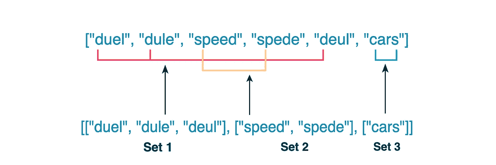
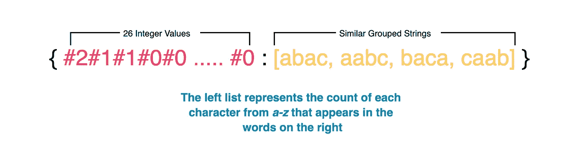
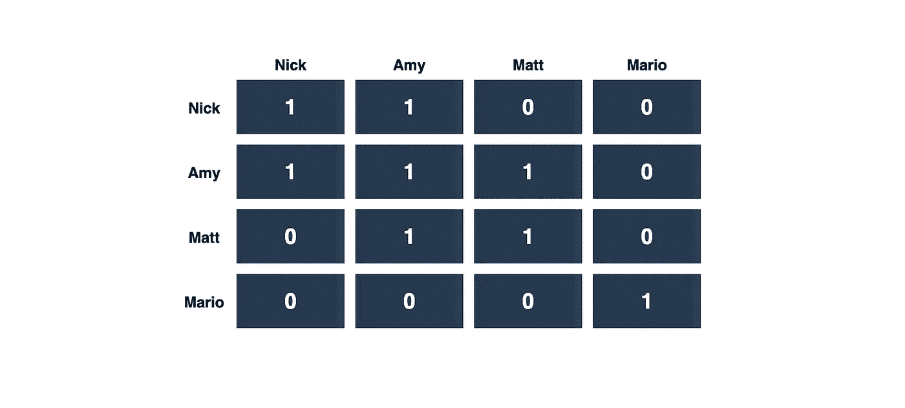
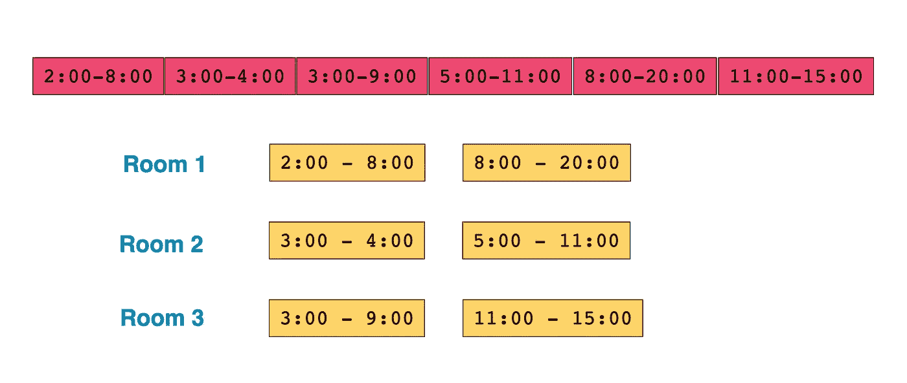
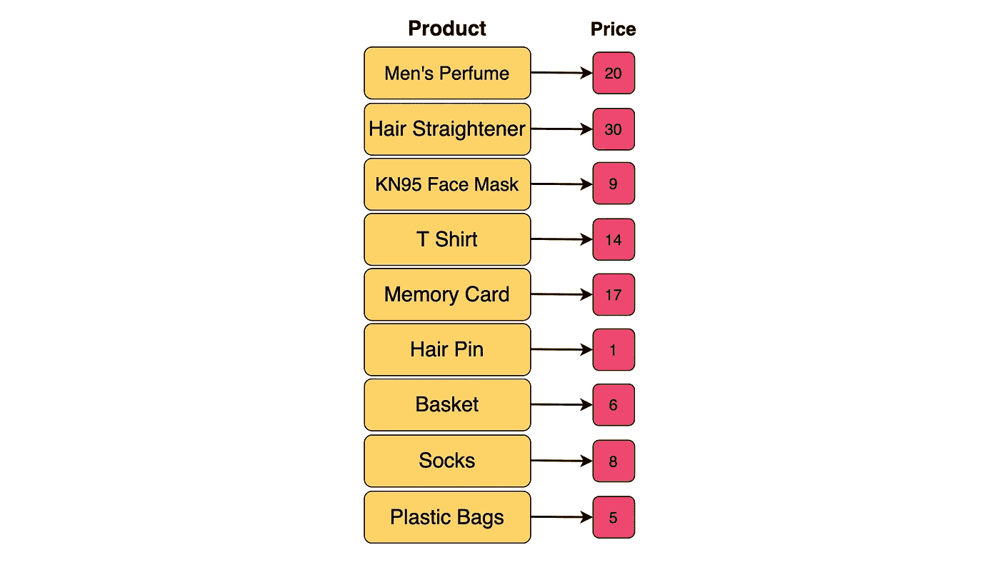
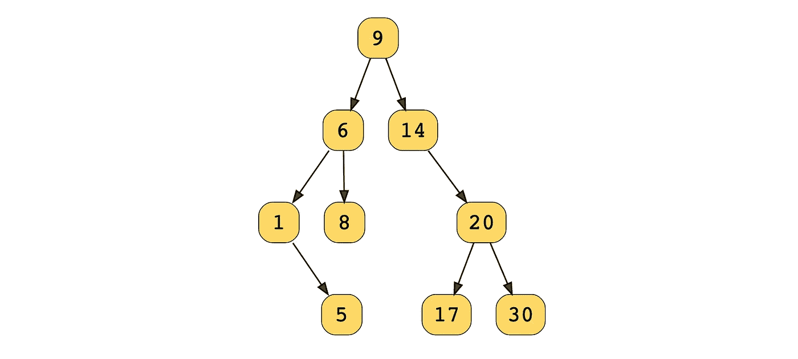

# 通过构建这 5 个真实世界的特征来破解编码面试

> 原文：<https://betterprogramming.pub/crack-coding-interviews-by-building-these-5-real-world-features-4089058d7b0e>

## 今天，我们将以不同的方式准备编码面试，并为网飞和脸书这样的公司构建五个真实世界的功能

作者照片。

准备编码面试不是一件容易的事情。您需要技能来解决问题并部署正确的工具。教育团队一直致力于让工程师更容易进行编码面试准备。我们从第一手资料中了解到，成功的最佳方式不是记住 1500 多个 LeetCode 问题。

这就是为什么我们今天想通过解决科技公司面临的一些现实问题来改变面试准备的方式。学习如何构建现实世界的功能(例如，如何合并亚马逊上的推荐)更有趣，而且这样更容易记住你学到的东西。如果你能理解一个问题的潜在模式，你就能把它应用到任何问题上。

我们将深入研究一些常见的真实世界编码问题的解决方案，并构建五个特性。我们将用 Java 提供我们的解决方案。

本教程一目了然:

*   网飞功能:相似标题分组(散列表)
*   脸书特色:朋友圈(DFS)
*   谷歌日历功能:查找会议室(堆)
*   亚马逊特色:价格范围内的产品(BST)
*   Twitter 功能:添加喜欢(字符串)
*   从这里去哪里

# 1.网飞功能:分组相似的标题(哈希映射)

网飞是最大的视频流媒体平台之一。网飞工程团队一直在寻找显示内容的新方法。对于第一个问题，假设你是这个团队的开发人员。

任务:我们在这里的任务是通过使用户能够看到相关的搜索结果而不受错别字的影响来改善搜索结果。我们称之为“相似标题分组”功能。

首先，我们需要确定如何对给定标题的任意字符组合进行单独分组。让我们假设我们的库有以下标题:`"duel,"` `"dule,"` `"speed,"` `"speed,"` `"deul,"`和`"cars."`你的任务是设计一个功能，以便如果用户拼错一个单词(例如，“速度”作为“spede”)，他们仍然会显示正确的标题。

首先，我们需要将我们的标题分成几组单词，这样一组单词中的单词就是变位词。我们有三套:`{"duel", "dule", "deul"}`、`{"speed", "spede"}`和`{"cars"}`。搜索结果应该包括该字符串所在集合的所有成员。当用户搜索时，最好预先计算我们的集合，而不是形成它们。

组合相似的组

每个集合的成员每个字母的出现频率相同，所以每个字母在同组单词中的出现频率相等。比如，在我们的`{{"speed", "spede"}}`集合中，每个单词中字符的出现频率是相同的:`s`、`p`、`e`、`d`。

那么，我们如何设计和实现这个功能呢？我们来分解一下。

1.  对于每个标题，我们需要计算一个 26 元素的向量。每个向量元素代表一个英文字母在标题中的出现频率。我们可以用一个固定了`#`字符的字符串来表示频率。这个映射过程为字谜字符串生成相同的向量。例如，我们将`abbccc`表示为`#1#2#3#0#0#0...#0`。
2.  然后，我们使用这个向量作为将标题插入散列表的键。我们的字谜都将被映射到同一个条目。当用户搜索一个标题或单词时，它应该根据输入计算 26 个元素的英文字母频率向量。然后它会搜索 hashmap，并使用 vector 返回所有的 map 条目。
3.  然后，我们将计算出的字符数列表作为一个键存储在 hashmap 中，并指定一个字符串作为它的值。
4.  每个值都是一个单独的集合，所以我们返回 hashmap 的值。

将集合存储在键值存储中

## Java 解决方案

如果你想看 Python 中的解决方案，可以查看原始的[帖子](https://www.educative.io/blog/crack-coding-interview-real-world-problems)。

## 复杂性度量

*   时间复杂度:*O*(*n*∫*k*)因为我们是对列表中的每个字符串的每个字母进行计数。
*   空间复杂度:*O*(*n*∫*k*)由于每个字符串都作为一个值存储在字典中，字符串的大小可以是 *k* 。

# 2.脸书特色:朋友圈(DFS)

脸书是世界上最大的社交媒体公司。他们还拥有并运营 Instagram。假设你是一个脸书工程师团队，你的任务是改善他们姐妹平台之间的集成。

任务:我们的任务是找到脸书上所有在用户朋友圈里的人。我们称之为“朋友圈”功能。

我们需要首先确定每个用户的朋友圈里都有哪些人，其中包括与另一个用户直接或间接成为好友的用户。让我们假设脸书上有 n 个用户。友谊连接是可传递的。

例:如果尼克是艾米的直接朋友，艾米是马特的直接朋友，那么尼克是马特的间接朋友。

我们将使用一个 *n*n* 方阵。例如，如果这些用户是朋友，单元格`[i,j]`将保存值`1`。否则，单元格将保存值`0`。在下图中，有两个来自上例的朋友圈。尼克只是艾米的朋友，但艾米是尼克和马特的朋友。这就形成了朋友圈。马里奥自己又做了一个朋友圈。

把我们的对称输入矩阵想象成一个无向图。在我们的图中，在一个朋友圈中的间接朋友和直接朋友也存在于一个连通分量中。这意味着连通图组件的数量将给出我们有多少个朋友圈。

所以，我们的任务是找出连通分量的个数。我们将输入矩阵视为邻接矩阵。那么，我们如何设计和实现它呢？我们来分解一下。

1.  首先，我们初始化一个名为`visited`的数组。这将使用`0`作为每个索引的值来跟踪访问过的大小为`n`的顶点。
2.  然后，如果`visited[v]`是`0`，我们使用 DFS 遍历图。如果没有，我们进入下一个`v`。
3.  然后，为我们的 DFS 遍历遇到的每个`v`设置`visited[v]`为`1`。
4.  当 DFS 遍历完成后，我们应该将循环计数器增加`1`。这意味着已完全遍历了一个连通分量。

## Java 解决方案

## 复杂性度量

*   时间复杂度: *O(n 2 )* 因为我们遍历的是大小为 *n* 的完整矩阵。
*   空间复杂度: *O* ( *n* )因为存储我们访问过的用户的`visited`数组的大小是 *n* 。

# 3.谷歌日历功能:查找会议室(堆)

Google 日历工具是用来管理事件和提醒的 GSuite 的一部分。假设您是 Google Calendar 应用程序团队的开发人员，您的任务是实现一些提高生产力的特性。

任务:你的目标是创建一个安排会议的功能。您需要确定并锁定这些会议的最小会议室数量。

为此，我们有一些会议时间。我们需要找到一种方法来确定安排所有会议所需的会议室数量。每个会议将包含一个`startTime`和一个`endTime`的正整数。

我们的会议时间可以列举如下:`{{2, 8}, {3, 4}, {3, 9}, {5, 11}, {8, 20}, {11, 15}}`。我们可以把每次会议安排在一个单独的房间里，但是我们希望使用最少的房间。我们观察到三个会议重叠:`{2, 8}`、`{3, 4}`和`{3, 9}`。因此，至少这三个需要单独的房间。

为了解决这个问题，我们使用堆或者优先级队列来存储会议时间，使用每个会议的`end_time`作为一个键。我们顶层的房间会最早空出来。如果从顶部开始的会议室没有空闲，那么没有其他房间是空闲的。

那么，我们如何构建这个功能呢？我们来分解一下。

1.  按`startTime`对会议进行排序。
2.  将第一次会议分配到一个房间。将`endTime`作为一个条目添加到堆中。
3.  遍历其他会议，检查顶部的会议是否已经结束。
4.  如果房间是空闲的，提取这个元素，并将其与我们想要处理的当前会议的结束时间一起再次添加到堆中。如果它不是免费的，分配一个新的房间，并将其添加到我们的堆中。
5.  处理完会议列表后，堆的大小将告诉我们分配了多少个房间。这应该是我们需要的最少房间数。

## Java 解决方案

如果你想看 Python 中的解决方案，请查看原始的[帖子](https://www.educative.io/blog/crack-coding-interview-real-world-problems)。

## 复杂性度量

*   时间复杂度:*O*(*n*∫*log*(*n*))
*   空间复杂度: *O* ( *n* ，其中 *n* 为会议次数。

# 4.亚马逊特色:价格范围内的产品(BST)

亚马逊是世界上最大的在线商店，他们总是在寻找更好的方式向客户推荐产品。假设你是亚马逊商店的开发人员。

任务:实现一个搜索过滤器来查找给定价格范围内的产品。产品数据是二叉查找树的形式。价值是产品的价格。

我们正在处理的参数是`low`和`high`，它们代表用户的价格范围。下面的产品列表示例对应于它们的价格。

然后，它们被保存在二叉查找树中:

我们可以假设选择的价格范围是`low = 7`和`high = 20`，所以我们的函数解决方案应该只返回价格`{9, 8, 14, 20, 17}`。那么，我们如何实现这一点呢？我们来分解一下。

我们将使用二叉树的前序遍历的变体来解决这个问题，但是其他二叉树遍历也可以。

1.  为前序遍历实现一个递归帮助函数。
2.  检查当前节点值是否在我们给定的范围内。如果是，将其添加到`output`数组中。
3.  如果当前节点值大于或等于`low`，递归调用节点左边子节点的 preorder 函数。
4.  如果当前节点值小于或等于`high`，递归遍历该节点的右子节点。
5.  遍历完成后，将返回`output`数组。

## Java 解决方案

`BinarySearchTree.java`:

`main.java`:

如果你想看 Python 中的解决方案，可以查看原始的[帖子](https://www.educative.io/blog/crack-coding-interview-real-world-problems)。

## 复杂性度量

*   时间复杂度: *O(n)*
*   空间复杂度: *O(n)*

# 5.Twitter 功能:添加喜欢(字符串)

Twitter 是一个流行的社交媒体平台。假设您是一名 Twitter 开发人员，您的团队必须创建一个 API 来计算某个人的推文中的赞数。

任务:创建一个 API 来计算一个人的推文的总点赞数。创建一个接受两个数并返回这两个数之和的模块。

数据已经提取出来并存储在一个简单的文本文件中。所有的值都应该是字符串，并且*不能转换成整数*。由于这些限制，我们必须一位一位地做加法。那么，我们如何创建这个模块呢？我们来分解一下。

1.  将一个空的`res`变量和`carry`初始化为`0`。
2.  然后，设置两个指针(`p1`和`p2`)，指向`like1`和`like2`的末端。
3.  使用这些指针从末尾开始遍历字符串。设置它在两个字符串都完成时停止。
4.  在`index p1`将`x1`设置为字符串`like1`中的一个数字。如果`p1`已经到达`like1`的起点，则将`x1`设置为`0`。用`index p2`处的`like2`对`x2`进行同样的操作。
5.  使用`value = (x1 + x2 + carry) % 10`计算当前值。然后更新`carry`以便`carry = (x1 + x2 + carry) / 10`。
6.  将当前值追加到结果中。
7.  如果两个字符串都被遍历，但是`carry`仍然是非零的，则将`carry`附加到`res`。
8.  最后，反转结果并将其转换为字符串。返回最后一个字符串。

## Java 解决方案

## 复杂性度量

*   时间复杂度: *O* ( *max* (n，n))
*   空间复杂度: *O* ( *max* (n，n))

# 从这里去哪里

恭喜你坚持到最后！您刚刚使用诸如 DFS、BST、heaps 等技能构建了五个真实世界的特性。正如你所看到的，这是为编码面试做准备的一个强有力的方法，往往更有效。如果你能理解问题的潜在模式，你就能解决任何问题。这是重新设想的编码面试准备。快乐学习！

像这样的练习题还有很多，比如:

*   在 Twitter feed 中合并推文
*   美国电话电报公司确定位置
*   缩放:显示大厅会议
*   搜索引擎:获取单词
*   更多