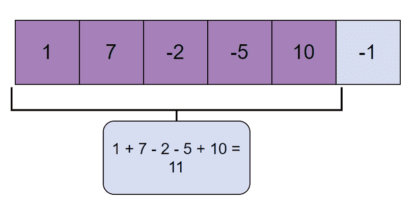
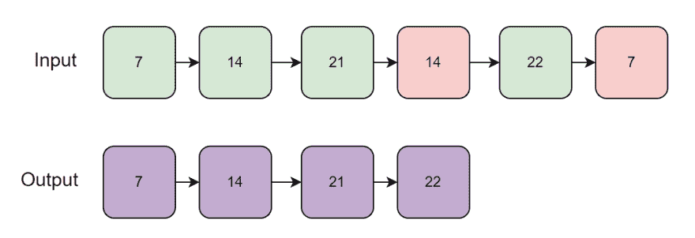
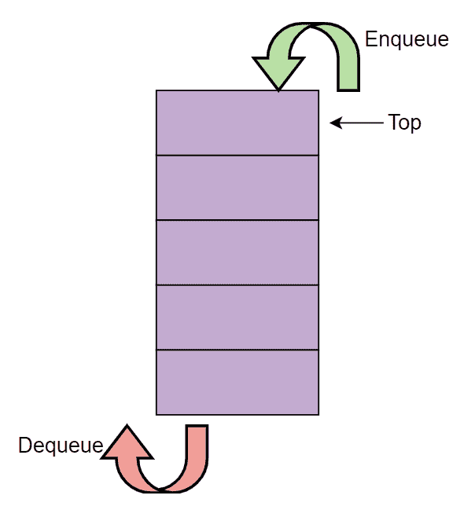
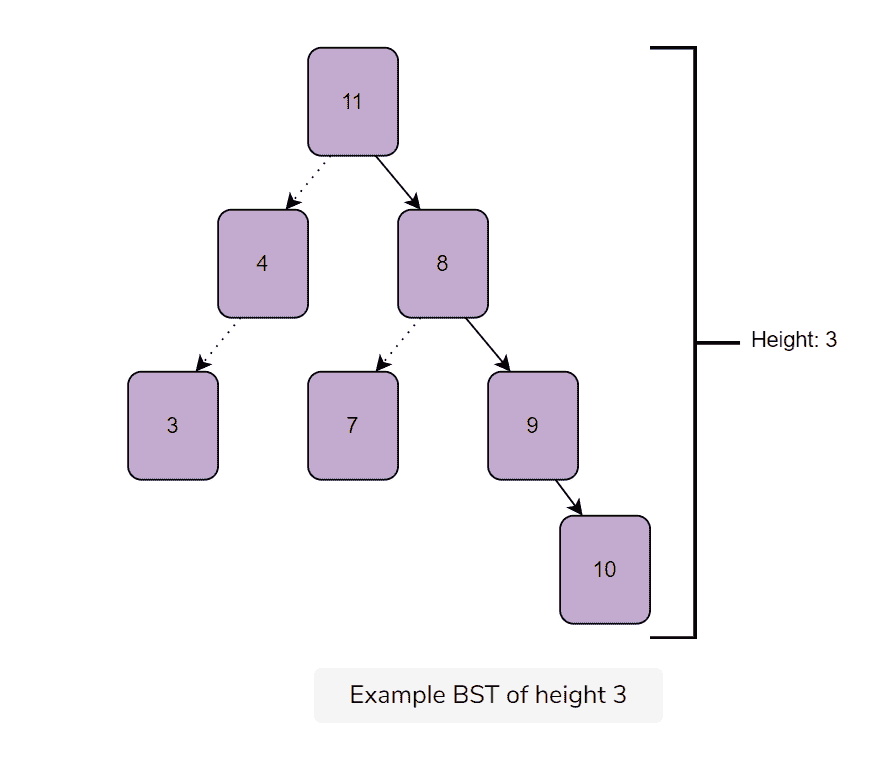
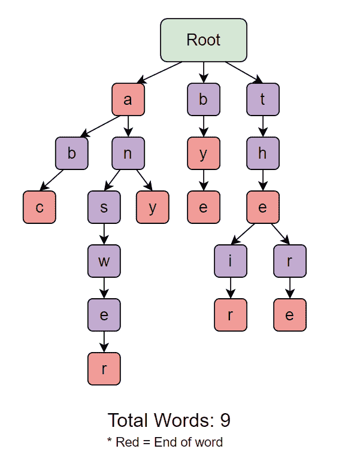
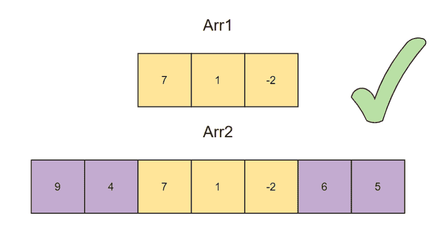

# 面试前 40 个 C#数据结构问题

> 原文：<https://betterprogramming.pub/crack-the-top-40-c-data-structure-questions-5a71608f33ec>

## 从数组和链表到堆和散列，提高你的数据结构技能


图片来源:作者

数据结构问题是编码面试中最常见的问题。这些问题测试您实现、优化和调整数据结构以解决特殊情况的能力。在你的编码面试之前回顾一些常见的问题是很重要的，以确保你不会被一个不熟悉的问题弄得措手不及。

今天，我们将帮助你复习数据结构技能，复习下一次面试前你应该练习的 40 个顶级数据结构问题。

**这是我们今天要讲的内容:**

*   复杂性度量问题
*   C#数组
*   C#链表
*   C#堆栈和队列
*   C#树和尝试
*   C#堆和哈希
*   C#编码面试的 18 个问题
*   接下来学什么

# 复杂性度量问题

## 1.大 O 复杂度:嵌套加法

找出下面代码片段的复杂性。

**解决方案和说明**

O(n)

在外循环的第 11 行，`int i=0;`运行一次。

`i<n;`被执行(n/3)+1 次，`i+=3`被执行 n/3 次
。

在内部循环中，`int j=0;`总共被执行(n/3)次。`j<n;`执行(n/3) * ((n/2) +1)次，`j+=2`执行(n/3) * (n/2)次。

## 2.大 O 复杂度:嵌套乘法

找出下面代码片段的复杂性。

O(n)

将循环变量乘以/除以一个常数的循环语句需要 logk n 次，因为循环运行了那么多次。在外循环中，循环变量在每次迭代中乘以`2`。因此，外部循环运行 O(log2 n)次。

内部循环运行`counter`次，而不是`n`次。在第一次迭代中，`counter`的值是 1，然后是 2，然后是 4，然后是 8，依此类推，直到 2^k 使得(2^k) < n。当你对外部循环的所有迭代的`counter`值求和时，内部循环运行:

1+2+4+8+ …+(2^k)次。

你将使用一个几何级数来计算这个值。为了使计算更简单，你必须假设 2^k = n

(2⁰)+(2 )+(2 )…+(2^k) = 2^(k+1)-1

(2^k)(2)——1

用 n 代替 2^k，你得到:

= 2n-1

似乎内部循环总共运行了 2n-1 次(考虑到外部循环的所有迭代)，但是请记住，当 n>(2^k).实际上，内部循环运行的次数少于 2n-1 次，但是您可以认为这是上限。

## 3.带嵌套乘法的大 O(高级)

找出以下代码片段的复杂性:

O(n)

主函数中的外部循环在从`0`到`n-1`对`i`进行迭代时有`n`次迭代。如果条件`j < i`为真，则进入内部循环。但是，`j`马上翻倍。请注意，代码中的`j`不会重置为`1`，因为`j`会立即加倍。

因此，对于外部循环的所有迭代，内部`while`循环将运行 O(log2 n)次。

# C#数组

## 4.从数组中移除偶数整数

实现一个函数`removeEven( int[]Arr, int size )`，它接受一个数组`Arr`及其大小，并从给定的数组中移除所有偶数元素。

例如:

```
// Input: Arr = [1,2,4,5,10,6,3]
// Output: Arr = [1,5,3]
```

**解决方案和解释**

**时间复杂度** : O(n)

这个解决方案首先检查`Arr`的第一个元素是否是奇数。然后，它将这个元素附加到数组`Arr`的开头；否则，它会跳到下一个元素。重复此过程，直到到达数组`Arr`的末尾，同时将奇数总数`m`的计数保存在`Arr`中。接下来，我们创建一个临时数组`temp`，用来存储所有奇数。

从那里，我们删除分配给`Arr`的内存，并将其指向`temp`数组。最后，我们返回数组`Arr`也就是说，它现在只包含奇数元素。

## 5.查找数组中的最小值

实现一个函数`findMinimum(int arr[], int size)`，它接受一个数组`arr`及其大小，并返回给定数组中的最小数字。

例如:

```
// Input: arr = [9,2,3,6]
// Output: 2
```

**解决方案和解释**

**时间复杂度** : O(n)

从第一个元素开始(在本例中是`9`)，将其保存为最小值。然后，迭代数组的其余部分。每当发现小于`minimum`的元素时，将`minimum`设置为该数字。

到数组结束时，`minimum`中存储的数字将是整个数组中最小的整数。

## 6.最大子阵列和

给定一个未排序的数组`Arr`，找出相加得到最大值的连续元素的集合。

**提示**:记住数组可以包含负数。



图片来源:作者

**解决方案和说明**

时间复杂度 : O(n)

这个解决方案使用 Kadane 的算法来扫描整个阵列。

看看 Kadane 的伪代码算法:

```
currMax = A[0]
globalMax = A[0]
for i = 1 -> size of A
    if currMax is less than 0
        then currMax = A[i]
    otherwise 
        currMax = currMax + A[i]
    if globalMax is less than currMax 
        then globalMax = currMax
```

在数组中的每个位置，我们找到结束于此的子数组的最大和。这是通过为当前数组索引保留一个`currMax`和一个`globalMax`来实现的。最后，我们知道`globalMax`的值将是最高的子阵列，而不考虑`currMax`的值。

# C#链表

下面是您可以在本节中使用的`Node`和`LinkedList`类:

## 7.尾部插入

创建一个函数`insertAtTail()`，它接受一个整数，将该整数添加到一个链表的末尾，并返回更新后的链表。新节点将指向`null`。

**解决方案和解释**

**时间复杂度** : O(n)

如果列表是空的，情况就像在开头插入一样。

否则，您可以简单地使用一个循环到达列表的尾部，并将您的新节点设置为最后一个节点的`nextElement`。

## 8.从链接列表中删除重复项

实现`removeDuplicates()`函数，该函数获取一个链表并返回没有重复节点的链表。



图片来源:作者

**解决方案和解释**

**时间复杂度** : O(n)

在这个实现中，我们对照剩余的列表检查每个节点，看一个节点是否包含相同的值。

`start`遍历外部循环，而`startNext`检查`LinkedList.cs`中**行 90** 上的重复项。

无论何时发现重复，使用**行 103** 将其从列表中删除。

## 9.连接两个链表

实现`Union()`函数，该函数接受两个链表并返回一个包含两个链表中所有唯一元素的链表。

**解决方案和解释**

**时间复杂度** : O(m + n)其中`m`是第一个列表的大小`n`是第二个列表的大小。

遍历第一个列表的尾部，链接到`LinkedList.cs`中**行 125–131**的第二个列表的第一个节点。现在，从组合列表中删除重复项。

# C#堆栈和队列

下面是堆栈和队列的实现，供您在本节中使用:

## 10.生成从 1 到 N 的二进制数

实现一个函数`string [] findBin(int n)`，它使用一个队列生成从`1`到`n`的二进制数，并存储在一个字符串数组中。

**解决方案和解释**

**时间复杂度** : O(n)

在第 17 行，`1`作为起点排队。然后，一个数从队列中出队并存储在结果数组中，以生成一个二进制数序列。

在**行 22-23**、`0`和`1`被附加到它上面，以产生下一个数字，然后这些数字也被排队到**行 24-25** 的队列中。队列接受整数值。在排队之前，解决方案确保将字符串转换为整数。

队列的大小应该比`n`大 1，因为每个数字有两种变化；一个追加`0` ，一个追加`1`。

## 11.使用堆栈实现队列

使用`myStack`类实现`NewQueue`类中的`enqueue()`函数。`enqueue()`取一个整数，将值插入队列后返回`true`。



图片来源:作者

**解决方案和解释**

**时间复杂度** : O(n)

这种方法使用两个堆栈。`mainStack`存储队列元素，`tempStack`作为临时缓冲区提供队列功能。

确保在每个入队操作之后，新插入的值位于主堆栈的底部。

在插入之前，所有其他元素都被转移到`tempStack`，自然，它们的顺序是相反的。新元素被添加到空的`mainStack`。最后，所有元素被推回到`mainStack`中，并且`tempStack`变为空。

## 12.查找堆栈中的最小值

用函数`min()`实现`minStack`类，该函数返回堆栈中的最低值。`min()`一定有$O(1)$的复杂度。

**提示**:元素返回，不弹出。

**解决方案和解释**

**时间复杂度** : O(1)

整个实现依赖于两个栈的存在:`minStack`和`mainStack`。

`mainStack`保存包含所有元素的实际堆栈，而`minStack`是一个堆栈，其顶部总是包含堆栈中的当前最小值。

每当调用 push 时，`mainStack`简单地在顶部插入新值。

但是，`minStack`会检查被推送的值。如果`minStack`为空，该值被推入其中，成为当前最小值。如果`minStack`中已经有元素，则该值与顶部元素进行比较。

如果该值低于`minStack`的顶部，它将被推入并成为新的最小值。否则，顶部保持不变。

由于采取了所有这些保护措施，`min`函数只需要返回`minStack`顶部的值。

# C#树和尝试

下面是二分搜索法树的一个实现，可供您在本节中使用。

## 13.查找二叉查找树中的最小值

实现`int findMin(Node* rootNode)`，它接受一个二叉查找树并返回树中的最小值。

**记住**:当前节点左子树中的节点总是较低的，而右子树中的节点总是较大的。

**解决方案和解释**

**时间复杂度** : O(h)

这个解决方案是递归的，以提高效率。BST 的排序结构使这个解决方案更容易，因为我们只需找到最左边的节点。

首先，我们检查根是否是`null`。如果是，我们返回`-1` ( **第 10-11 行**)。否则，我们检查当前节点的左子节点是否是`null`。如果是，那么这个根就是最左边的节点，你在那里返回值(**第 12-13 行**)。

如果左节点存在，调用其上的`findMin()`函数(**第 14-15 行**)。

## 14.求 BST 的高度

实现`int findHeight(Node* rootNode)`，它接受一个二叉查找树并返回其高度。

树的高度等于根节点和最低节点之间的边数。



图片来源:作者

**解决方案和说明**

**时间复杂度** : O(n)

树的高度等于左边或右边子树的最大高度。

所以必须递归求左右子树的高度。首先，我们检查树是否为空，如果给定的节点是`null`，则返回`-1`。如果没有，我们调用左边和右边子树上的`findHeight()`函数并返回具有较大值加 1 的那个。

## 15.2–3 棵树与 BST

2-3 棵树和二分搜索法树有什么区别？

2–3 树是一种平衡有序的搜索树，它提供了非常高效的存储机制来保证快速操作。

在 2-树中，每个节点最多只有两个子节点。对于三叉树，每个节点最多可以有三个子节点。子元素的排序是最低值在左边，最高值在右边。

与 BST 不同，无论插入还是删除，它总是保持平衡。这是为了确保高度不会增加到某一水平，因为所有操作的时间复杂度主要取决于它。

理想情况下，您希望高度以对数表示，因为随着树越来越大，执行操作将需要更多的时间。

## 16.trie 中的插入

实现`insertNode(string key)`函数，该函数获取一个单词并将其插入到现有的 trie 中。

**记住**:考虑插入的三种情况:无常用前缀、常用前缀、已有单词。

**解决方案和说明**

时间复杂度 : O(n)

该函数采用一个字符串`key`，表示一个单词。`NULL`不允许使用键，所有键都以小写存储。

首先，我们迭代键中的字符。对于每个字符，我们使用`getIndex()`生成一个索引。

下一步是在特定索引处检查`currentNode`的子节点。如果是`NULL`，那么我们在那个索引处创建一个新的`TrieNode`。

最后，我们将最后一个节点标记为叶子，因为单词已经结束。

# 17.一个 trie 中的总字数

实现`totalWords()`函数，该函数将获取一个 trie 并返回 trie 中的单词总数。



图片来源:作者

**解决方案和解释**

**时间复杂度** : $O(n)$

从根开始，我们递归地访问每个分支。每当发现一个节点的`isEndWord`设置为真时，`result`变量就增加 1。

最后，我们返回`result`来统计总字数。

# C#堆和哈希

## 18.实现最大堆

最大堆是一个完整的二叉树，其中每个内部节点的值大于或等于该节点的子节点中的值。

你的 max-heap 必须包含`insert()`和`delete()`函数，但也可以包含任何额外的功能。

**解决方案和解释**

**时间复杂度** : O(n)

注意你从堆的底部开始，也就是`i = size-1` ( **line 78** )。如果堆的高度是`h`，那么层次从`0`(在根节点)到最深的叶节点`h`。通过在叶节点调用`maxHeapify()`，您将有一个常数时间操作。

在`h - 1h−1`级，对于每个节点，`maxHeapify()`最多进行一次比较和交换操作。在级别`h−2`，它对每个节点最多进行两次比较和交换。这一直持续到根节点，在那里它最多进行`h`比较，交换操作。

## 19.查找数组中的最小元素

实现一个函数`findKSmallest(int[] arr, int size, int k)`,该函数将一个未排序的整数数组作为输入，并使用堆返回数组中的最小元素`k`。

您可以使用下面的`minHeap`实现作为起点:

**解决方案和解释**

**时间复杂度** : O(n + klog n)

这里创建一个堆，然后调用`buildHeap` ( **line 12** )函数从给定的数组创建一个最小堆。要找到数组中的`k`最小元素:

你从堆中得到最小值。

将结果保存到矢量输出。

从堆中移除最小值。

重复相同的步骤`k`次(提供`k < size`)。

## 20.Trie 与哈希表

比较尝试和哈希表的使用和性能。

这两种数据结构都可以用于相同的工作，但是它们的性能会根据程序的性质而有所不同。

平均来说，哈希表可以在常量时间内执行搜索、插入和删除，而 trie 通常在$O(n)$内工作。

一个有效的哈希表需要一个智能哈希函数，该函数可以将键分布在所有可用的空间中。trie 实现起来更简单，因为它只在需要的时候访问额外的空间。

最后，trie 将证明对有序数据更有用，因为它的树结构有助于保持数据的顺序。

## 21.子集数组检查器

实现`isSubset(int[] arr1, int[] arr2, int size1, int size2)`函数，该函数将两个数组及其大小作为输入，并检查一个数组是否是另一个数组的子集。

数组将不包含重复值。



图片来源:作者

**解决方案和说明**

**时间复杂度** : O(m+n)其中 *m* 是`arr1`中的元素个数， *n* 是`arr2`中的元素个数。

C#内置的`HashSet`让这个解决方案简单多了。首先，我们在第 16 行上迭代`arr1`。如果当前索引处的值不在`HashSet`中，我们将该值插入**行的`HashSet`中的第 20-21 行**。然后，我们遍历`arr2`，看看它们的元素是否出现在`HashSet`中。

如果`arr2`的所有元素都出现在`HashSet`中，那么你的函数将返回`true` **第 25-32 行**。

## 22.找出两个和相等的配对

实现`string findPair(int[] arr, int size)`函数，该函数将获取一个数组，并在数组中找到两对`[a, b]`和`[c, d]`，使得:

a+b = c+d

**记住**:你只需要找到数组中的任意两对，而不是所有对。

**解决方案和解释**

**时间复杂度** : O(n)

为了简单起见，这个解决方案使用了 C#的内置`Dictionary`类。

在**第 23–33 行**上，`arr`中的每个元素与所有其他元素相加。总和成为`hMap`中的关键。在每个键上，存储其和生成该键的整数对。

每当发现一个和时，它在`hMap`中的键已经存储了一个整数对，您就可以得出结论，这个和可以由数组中的两个不同的对构成。这两对然后在第 36-46 行的**上返回到`result`数组中。**

# C#编码面试的 18 个问题

1.  在 C#中反转字符串
2.  检查给定的字符串是否是回文
3.  旋转数组
4.  使用一个循环找出数组中第二大的整数
5.  将 2D 数组转换为 1D 数组
6.  解释并实现合并排序算法
7.  找出一个链表是否是循环的
8.  平衡二叉查找树
9.  以尽可能低的时间复杂度搜索排序后的数组
10.  0-1 背包问题
11.  反转一个链表
12.  匹配字符串中的开始和结束括号
13.  将整数数组混洗到位
14.  在 BST 中查找给定节点的祖先
15.  找出图中两个顶点之间的最短路径
16.  计算无向图中的边数
17.  使用堆栈检查平衡括号
18.  对堆栈中的值进行排序

# 后续步骤

在这些问题上做得很好！为下一次面试做准备的最好方法是不断地用这些常见的数据结构问题进行实践。

*快乐学习！*