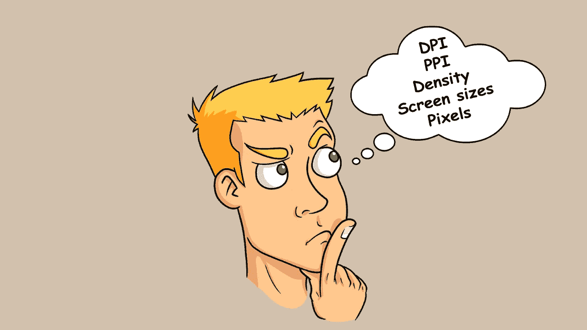
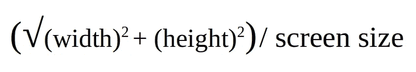
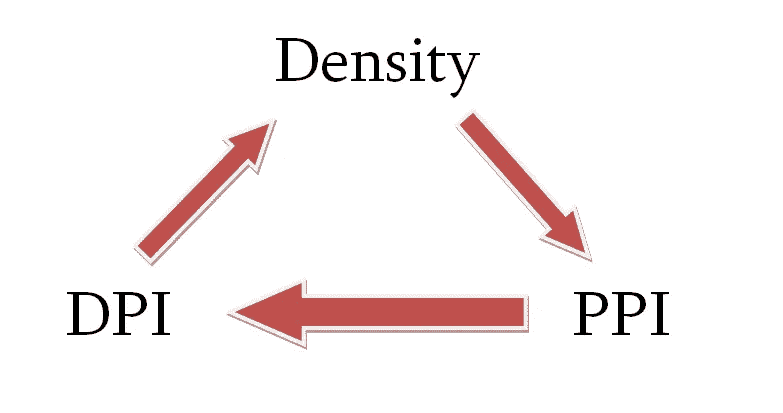
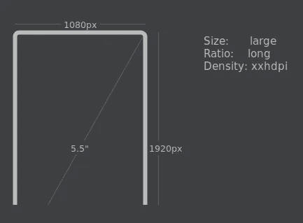
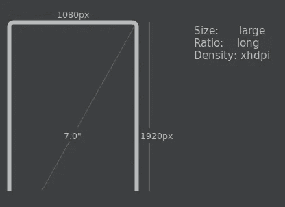
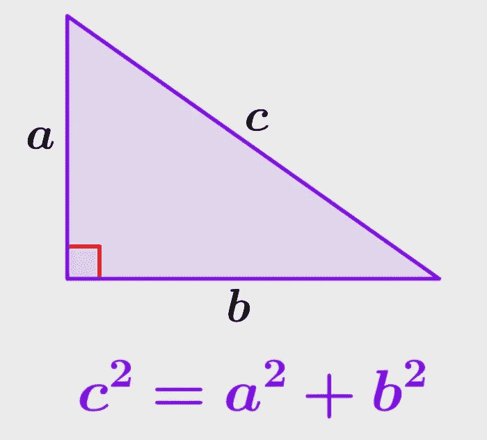
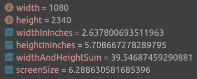

# 破解安卓屏幕尺寸

> 原文：<https://betterprogramming.pub/cracking-android-screen-sizes-88228822-98b28d23260c>

## 我们将探索 Android 的不同屏幕尺寸，并对各种术语有一个清晰的理解



```
**Table of Contents**Introduction
Pixel and Screen size
Pixels Per Inch (PPI) and how it is calculated
Different Densities in Android
How to calculate device density
Working with sizes
Wrap Up
```

# 介绍

在 Android 中，有许多与显示相关的限定符，这有时会让开发人员感到困惑。什么是 DPs？它们和蘸酱有什么不同？各种密度是什么？所有的计算是如何发生的？有可能得到以英寸为单位的屏幕宽度和高度吗？在这篇文章中，我将回答所有这些问题。

P.S .本文不是关于如何支持多种屏幕尺寸。

# 像素和屏幕尺寸

我猜大家都知道什么是像素。如果你捕捉你的监视器并放大，你可以看到带有 RGB 颜色的小方块。所有这些小方块都是像素。Pixel 也代表图片元素(pix =图片，el =元素)。它们是数字图像或显示的基本构件。如果显示器分辨率为 1280 像素宽和 720 像素高，那么显示器的总像素为 921 600 像素。它也代表像素密度。密度越高，图像质量越好。如果显示器分辨率为 3840x2160，则总像素为 8 294 400。

现在，屏幕尺寸是多少？它是对角之间的距离。也叫对角线。如果距离是 6.5 英寸，则屏幕尺寸是 6.5 英寸。

那么这些屏幕尺寸和像素是如何连接的呢？我们拿一个显示器来说，分辨率为 1080x1920(宽 x 高)，屏幕尺寸为 5.5 英寸。总的来说，屏幕上会有 1080 * 1920 = 2 073 600 个像素。

现在问你一个问题:假设我们有 2 台设备，它们的分辨率都是 1080x1920，但是第一台设备屏幕尺寸是 7.0 英寸，另一台是 5.5 英寸。在哪款设备上屏幕质量会更好？我们需要在下一节找到答案。

# 每英寸像素(PPI)及其计算方式

开始之前，我们先明确一件事。在 Android 中，PPI 和 DPI(每英寸点数)是一回事。在现实生活中它们是不同的，但是 Android 团队选择使用 DPI 而不是 PPI。

有时，如果你看一下器件规格，在显示器部分你可能会看到 PPI 值。它代表每英寸像素数，代表设备每英寸的像素数。

PPI 是怎么算出来的？为了计算 PPI，我们需要屏幕分辨率 WxH 和屏幕尺寸。公式是:



计算屏幕 PPI 的公式

让我们从上一节中取值。如果我们的屏幕分辨率为 1080x1920，屏幕尺寸为 7.0 英寸，则 PPI 将为:

```
1080 x 1080 = 1 166 400
1920 x 1920 = 3 686 400
1 166 400 + 3 686 400 = 4 852 800
sqrt(4 852 800) = ~2203
2203 / 7.0 = ~315
```

因此，我们 7 英寸屏幕的 PPI 值约为 315。让我们对另一个分辨率相同但尺寸为 5.5 英寸的屏幕进行相同的操作。在这种情况下，PPI 将大约为 401。

屏幕质量与 1 英寸的像素数(PPI)成正比。如果 PPI 值较高，则该设备的屏幕质量会更好。

现在让我们来回答上一节中的问题。哪款设备屏幕质量会更好？当然，5.5 英寸的屏幕，因为在 1 英寸它有更多的像素。

# Android 中的不同密度

从现在开始，我会用 DPI 代替 PPI，因为那些是一回事。在这里要特别小心，以免以后混淆。

*在 Android 中，当我们创建 UI 时，我们通常使用 DP 作为视图的大小说明符。DP(密度无关像素)和 DIP 一样，不要搞混了。唯一的原因是 DP 更符合 SP(尺度无关像素)。

* SP(独立于比例的像素)与 DP 相同，但增加了一个比例因子，该因子基于用户在设备的系统设置中选择的字体大小。SP 只能用作文本的单位。避免使用 SP 作为非文本组件的单位。

*密度与 DPI 相同，它显示 1 英寸区域内的像素数。在 Android 中，DPI 只是一个计量单位，代表的是密度。例如，对于分辨率为 1080x1920、尺寸为 5.5 英寸的设备，我们可以说设备屏幕密度约为 401。

我希望术语是清楚的。没有吗？再仔细看一遍就好了))



密度，DPI，PPI 是相互联系的。这是一回事。

那么什么是密度无关呢？这意味着，我们的视图大小将与屏幕密度无关。你知道，如果我们以像素为单位指定我们的视图大小，它将根据密度改变它的大小。假设我们有一个宽度和高度都是 200x200px 的 ImageView。现在，如果设备密度为 100 dpi，该 ImageView 将在屏幕上占据 2 英寸的宽度和高度。但如果设备密度将为 400 dpi，则需要 0.5 英寸。我希望术语是清楚的。如果你感到困惑，再看一遍 PPI/DPI。

那么它是如何独立于密度的呢？为了回答这个问题，让我介绍一下 Android 中存在的不同密度的存储桶:

```
ldpi - low density bucket (~120dpi, 0.75x).
mdpi - medium density bucket (~160dpi, 1x)
hdpi - high density bucket (~240dpi, 1.5x)
xhdpi - extra high density bucket (~320dpi, 2x)
xxhdpi - extra-extra high density bucket (~480dpi, 3x)
xxxhdpi - extra-extra-extra high density bucket (~640dpi, 4x)
```

> ldpi 桶已经不太常见了。

如你所见，Android 有 6 个密度桶。当然，还有 nodpi(所有密度的资源)和 tvdpi(打算用于 TVs 的资源)桶，但我们不会在本文中涉及它们。在 160 dpi 的屏幕中，1dp 大约等于 1px。所以才叫中密度。此外，它在某些地方被称为基线密度。

# 如何计算设备密度

让我们以我们示例中的器件为例，其密度约为 315 dpi。如果我们看一下密度表，我们会发现 315 dpi 介于 hdpi 和 xhdpi 之间。现在，我们的设备属于哪个密度桶？也许是 hdpi？或者也许是 xhdpi？嗯，可以是 hdpi，也可以是 xhdpi，我们不敢奢望。制造商在选择密度时有一定的灵活性。但通常，该设备属于其最近的桶。这意味着，315 dpi 的设备将是 xhdpi，401 dpi 的设备将是 xxhdpi。



设备密度为 401 dpi



设备密度为 315 dpi

当我们在 dp 中指定视图大小时，我们的视图会根据屏幕密度进行缩放。但是 Android 怎么知道它需要缩放多少视图呢？如上所述，在 160 dpi 屏幕中，1dp 等于 1px。

就拿密度为 401 dpi 的设备来说吧。为了得到比例因子，我们必须将 401 除以 160。结果决定了视图在此设备上的缩放比例。答案是 2.51。

我们还可以确定它有多少像素。我们用 50x50dp 的尺寸来简单的看一下。在我们的设备中，Android 将 50 乘以比例因子，以获得当前设备的像素视图大小。我们会得到 126 像素。

对于另一个密度约为 315 dpi 的设备，比例因子约为 1.97。因此，50dp 大小的相同视图在该设备中将是 99 像素。这就是 dp 与密度无关的原因。每个屏幕都有自己的比例因子，它决定了屏幕上将显示多少像素。

# 使用尺寸

在这一点上，我们已经知道了许多关于 dp、px、屏幕尺寸和密度的事情。现在该编码了:)

我们将在这里讨论一些副主题:

*   如何获得显示器的真实宽度和高度？
*   如何确定器件密度及其比例因子？
*   我们能得到以英寸为单位的显示宽度和高度吗？
*   查找设备屏幕尺寸。

## **如何获得显示器的真实宽度和高度？**

我们可以使用 WindowManager 类以像素为单位获得显示器的实际宽度和高度。

```
fun WindowManager.currentDeviceRealSize(): Pair<Int, Int> {
    return if (Build.VERSION.*SDK_INT* >= Build.VERSION_CODES.*R*) {
        return Pair(
            *maximumWindowMetrics*.*bounds*.width(),
            *maximumWindowMetrics*.*bounds*.height())
    } else {
        val size = Point()
        *defaultDisplay*.getRealSize(size)
        Pair(size.x, size.y)
    }
}val (width, height) = windowManager.currentDeviceRealSize()
```

在上面的程序中，我们有 1 个扩展函数，它返回一对 Int。这对表示显示宽度和高度。从 Android 11 (API 30)开始`defaultDisplay.getRealSize()`功能已弃用。

## **如何确定器件密度及其比例因子？**

如何确定器件密度及其比例因子？我们能以某种方式确定什么是设备 dpi 吗？

不幸的是，不能保证我们总能得到正确的值。有一类叫做`DisplayMetrics`。它包括关于我们显示器特性的信息。我们可以使用以下方法检索`DisplayMetrics`实例:

```
val displayMetrics = *resources*.*displayMetrics*
```

`DisplayMetrics`有一些变数:

```
displayMetrics.density //The scale factor of the density
displayMetrics.densityDpi // The density of the screen
```

坏消息是:这些值没有返回关于比例因子和密度的正确信息。但是取而代之的是，有两个变量，它们通常返回更准确的值。

```
displayMetrics.xdpi // The pixels count in inch for screen width
displayMetrics.ydpi // The pixels count in inch for screen height
```

“xdpi”代表 X 维度上屏幕每英寸的像素。“ydpi”是相同的，但用于 Y 维。即使在这种情况下，我们也不能 100%保证我们会得到正确的值。但是在我的实践中，我利用了这些价值。在大多数情况下,“xdpi/ydpi”返回相同的值，因此使用哪一个取决于您。

## **我们能得到以英寸为单位的显示宽度和高度吗？**

如果我们运气好，得到了正确的值，我们可以很容易地计算出显示器的宽度和高度。

```
val (width, height) = *windowManager*.currentDeviceRealSize()
val displayMetrics = *resources*.*displayMetrics* val widthInInches = width / displayMetrics.xdpi
val heightInInches = height / displayMetrics.ydpi
```

我们只需要用像素宽度除以每英寸的像素数。对于宽度，我们使用 xdpi，对于高度，我们使用 ydpi，因为在坐标系中，x 轴是宽度，y 轴是高度。

## **查找设备屏幕尺寸**

这很容易计算，因为我们已经有了以英寸为单位的屏幕宽度和高度。利用勾股定理，我们可以很容易地确定我们的屏幕尺寸。



该程序将如下所示:

```
val (width, height) = *windowManager*.currentDeviceRealSize()
val widthInInches: Double = (width / *resources*.*displayMetrics*.xdpi).toDouble()
val heightInInches: Double = (height / *resources*.*displayMetrics*.ydpi).toDouble()

val widthAndHeightSum = widthInInches.*pow*(2) + heightInInches.*pow*(2)
val screenSize = *sqrt*(widthAndHeightSum)
```

我们也可以使用 Math class `hypot()`函数，它会在内部为我们做这个计算。

`hypot()` -计算`sqrt(x^2 + y^2)`，没有中间溢出或下溢。

```
val (width, height) = *windowManager*.currentDeviceRealSize()
val widthInInches: Double = (width / *resources*.*displayMetrics*.xdpi).toDouble()
val heightInInches: Double = (height / *resources*.*displayMetrics*.ydpi).toDouble()

val screenSize = *hypot*(widthInInches, heightInInches)
```

在这两种情况下，我们的程序都运行良好。我的设备屏幕尺寸是 6.3。我得到的输出是:



输出

# 包裹

在本文中，我们讨论了令 Android 开发人员困惑的大部分事情。现在，您已经清楚地了解了像素和 PPI、不同的密度桶及其说明符、什么是 dp，以及它如何独立于密度。你知道所有的公式，你可以自己计算得到屏幕密度。

最后我们甚至还写了一个程序，进行了不同的计算，你会有一个清晰的认识。从现在开始，你可以潜得更深，探索更多。感谢您抽出时间。

你可以在这个[要旨](https://gist.github.com/Hayk985/ba0945ef7d8da2289f07119dfa77504e)里找到上面的源代码。