# 破解亚马逊访谈

> 原文：<https://betterprogramming.pub/cracking-the-amazon-interview-cf6a6c5f954a>

## 看看亚马逊编码面试中的热门问题


图片由作者提供

在亚马逊找到一份工作是全球许多开发者的梦想。亚马逊是世界上最大的公司之一，拥有超过 50 万的员工。亚马逊正在快速招聘，其独特的招聘流程强调公司文化和领导原则。今天，我将为你介绍一次亚马逊面试所需的一切，包括编码问题和一步一步的准备指南。

**今天我们将复习以下内容:**

*   45 个常见的亚马逊编码面试问题
*   亚马逊编码访谈概述
*   如何准备编码面试
*   包扎


图片由作者提供

# 45 个常见的亚马逊编码面试问题

## 1.找出数组中缺少的数字

给你一个从`1`到`n`的正数数组，这样从`1`到`n`的所有数字都存在，除了一个数字`x`。你得找到`x`。输入数组未排序。查看下面的数组，并查看 Python 中的解决方案。*点击* [*此处*](https://www.educative.io/m/find-the-missing-number) *查看 C++、Java、JavaScript、Ruby 的解决方案。*

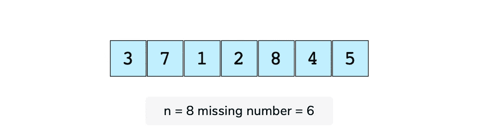

```
def find_missing(input):# calculate sum of all elements
# in input list
sum_of_elements = sum(input)# There is exactly 1 number missing
n = len(input) + 1
actual_sum = (n * ( n + 1 ) ) / 2
return actual_sum - sum_of_elementsdef test(n):
 missing_element = random.randint(1, n)
 v = []
 for i in range(1, n):
 if i != missing_element:
    v.append(i)actual_missing = find_missing(v)
print("Expected Missing = ", missing_element, " Actual Missing = ", actual_missing)
assert missing_element == actual_missingdef main():
   for n in range(1, 10):
   test(1000000)main()
```

**运行时复杂度:**线性，O(n)

**记忆复杂度:**常数，O(1)

一个简单的解决方案是在输入数组中搜索`1`和`n`之间的每个整数，只要有一个数字丢失，就停止搜索。但是我们可以做得更好。这是一个线性的 O(n)解，使用算术级数求和公式。以下是查找缺失数字的步骤:

*   求数组中所有数字的和`sum_of_elements`。这将需要线性扫描，O(n)。
*   然后使用算术级数求和公式计算第一个`n`数字的和`expected_sum`
*   两者之差，即`expected_sum - sum_of_elements`，是数组中缺失的数字。

## 2.确定两个整数之和是否等于给定值

给定一个整数数组和一个值，确定数组中是否有任意两个整数的和等于给定值。如果总和存在，返回`true`,如果不存在，返回`false`。考虑这个数组和目标和。*点击* [*此处*](https://www.educative.io/m/sum-of-two-values) *查看 C++、Java、JavaScript、Ruby 的解决方案。*

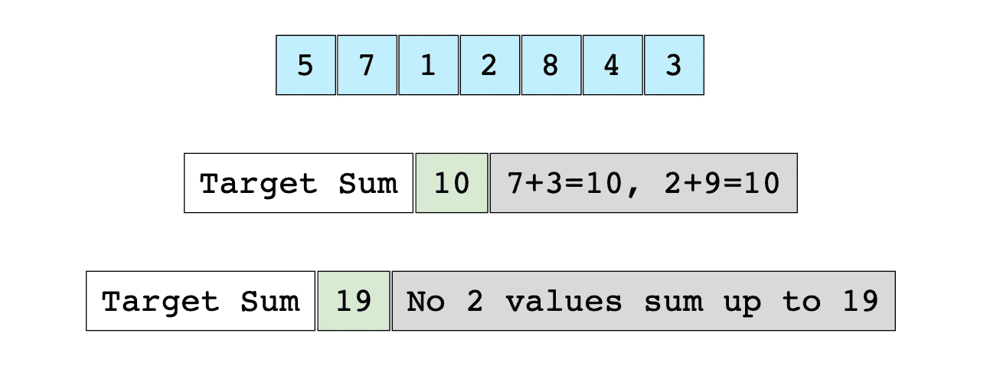

```
def find_sum_of_two(A, val):
  found_values = set()
  for a in A:
     if val - a in found_values:
        return True found_values.add(a)return Falsev = [5, 7, 1, 2, 8, 4, 3]
test = [3, 20, 1, 2, 7]for i in range(len(test)):
  output = find_sum_of_two(v, test[i])
  print("find_sum_of_two(v, " + str(test[i]) + ") = " + str(output))
```

**运行时复杂度:**线性，O(n)

**记忆复杂度:**线性，O(n)

你可以使用下面的算法找到一对加起来的目标(比方说，`val`)。

*   扫描整个数组一次，并将访问过的元素存储在哈希集中。
*   在`scan`期间，对于数组中的每个元素`e`，我们检查`val - e`是否存在于哈希集中，即`val - e`是否已经被访问过。
*   如果在 hash 集中找到了`val - e`，说明数组中有一对(`e`，`val - e`)，其和等于给定的`val`。
*   如果我们已经穷尽了数组中的所有元素，但没有找到任何这样的元素对，函数将返回`false`。

## 3.合并两个排序的链表

给定两个已排序的链表，合并它们，使得结果链表也是已排序的。以两个排序链表和它们下面的合并链表为例。*点击* [*此处*](https://www.educative.io/m/merge-two-sorted-linked-lists) *查看 C++、Java、JavaScript、Ruby 的解决方案。*

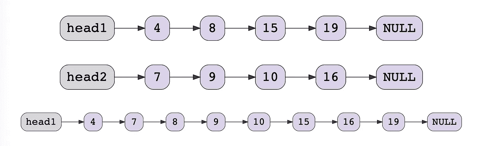

```
def merge_sorted(head1, head2):
  # if both lists are empty then merged list is also empty
  # if one of the lists is empty then other is the merged list
if head1 == None: 
   return head2
elif head2 == None:
   return head1mergedHead = None;
if head1.data <= head2.data:
   mergedHead = head1
   head1 = head1.next
else:
   mergedHead = head2
   head2 = head2.nextmergedTail = mergedHeadwhile head1 != None and head2 != None:
   temp = None
   if head1.data <= head2.data:
   temp = head1
   head1 = head1.next
else:
   temp = head2
   head2 = head2.next mergedTail.next = temp
 mergedTail = tempif head1 != None:
   mergedTail.next = head1
elif head2 != None:
   mergedTail.next = head2return mergedHead array1 = [2, 3, 5, 6]
array2 = [1, 4, 10]
list_head1 = create_linked_list(array1)
print("Original1:")
display (list_head1)
list_head2 = create_linked_list(array2)
print("\nOriginal2:")
display (list_head2)
new_head = merge_sorted(list_head1, list_head2)print("\nMerged:")
display(new_head)
```

**运行时复杂度:**线性，O(m+n)其中 m 和 n 是两个链表的长度

**记忆复杂度:**常数，O(1)

在合并的链表上保持一个头指针和一个尾指针。然后通过比较两个链表的第一个节点来选择合并链表的头。对于两个列表中的所有后续节点，选择较小的当前节点，将其链接到合并列表的尾部，并将该列表的当前指针向前移动一步。

当两个列表中都有一些剩余元素时，继续此操作。如果只有一个列表中还有一些元素，您可以将这个剩余的列表链接到合并列表的尾部。最初，合并的链表是`NULL`。

比较前两个节点的值，将值较小的节点作为合并链表的头节点。在本例中，是从`head1`开始的`4`。因为它是合并列表中的第一个也是唯一的节点，所以它也是尾部。然后向前移动`head1`一步。

## 4.用任意指针复制链表

给你一个链表，其中的节点有两个指针。首先是常规的`next`指针。第二个指针叫做`arbitrary_pointer`，它可以指向链表中的任何一个节点。你的工作是编写代码来深度复制给定的链表。这里的*深度复制*是指对原始列表的任何操作都不应该影响复制的列表。*点击* [*此处*](https://www.educative.io/m/copy-linked-list-with-arbitrary-pointer) *查看 C++、Java、JavaScript、Ruby 的解决方案。*

```
def deep_copy_arbitrary_pointer(head):
  if head == None:
    return Nonecurrent = head;
new_head = None
new_prev = None
ht = dict()# create copy of the linked list, recording the corresponding
# nodes in hashmap without updating arbitrary pointer
while current != None:
   new_node = LinkedListNode(current.data)# copy the old arbitrary pointer in the new node
   new_node.arbitrary = current.arbitrary;if new_prev != None:
   new_prev.next = new_node
else:
   new_head = new_nodeht[current] = new_node new_prev = new_node
   current = current.nextnew_current = new_head# updating arbitrary pointer
while new_current != None:
  if new_current.arbitrary != None:
    node = ht[new_current.arbitrary] new_current.arbitrary = node new_current = new_current.nextreturn new_headdef create_linked_list_with_arb_pointers(length):
  head = create_random_list(length)
  v = []
  temp = head
  while temp != None:
    v.append(temp)
    temp = temp.next for i in range(0, len(v)):
    j = random.randint(0, len(v) - 1)
    p = random.randint(0, 100)
    if p < 75:
      v[i].arbitrary = v[j]return head
```

**运行时复杂度:**线性，O(n)

**记忆复杂度:**线性，O(n)

这种方法使用映射来跟踪原始列表指向的任意节点。您将分两步创建原始链表的深层副本(比如`list_orig`)。

*   在第一遍中，创建原始链表的副本。创建该副本时，在新列表中使用相同的数据和`arbitrary_pointer`值。此外，用条目更新映射，其中键是旧节点的地址，值是新节点的地址。
*   创建副本后，对复制的链表再进行一次遍历，并使用第一次遍历中创建的映射更新指向新地址的任意指针。

## 5.二叉树的层次顺序遍历

给定二叉树的根，显示每一层的节点值。所有级别的节点值应该显示在单独的行上。让我们看看下面的二叉树。*点击* [*此处*](https://www.educative.io/m/level-order-traversal-binary-tree) *查看 C++、Java、JavaScript、Ruby 的解决方案。*


```
# Using two queuesdef level_order_traversal_1(root):
  if root == None:
    return queues = [deque(), deque()] current_queue = queues[0]
  next_queue = queues[1] current_queue.append(root)
  level_number = 0while current_queue:
   temp = current_queue.popleft()
   print(str(temp.data) , end = " ") if temp.left != None:
     next_queue.append(temp.left) if temp.right != None:
     next_queue.append(temp.right) if not current_queue:
     print()
     level_number += 1
     current_queue = queues[level_number % 2]
     next_queue = queues[(level_number + 1) % 2]
 print()arr = [100,50,200,25,75,350]
root = create_BST(arr)
print("InOrder Traversal:", end = "")
display_inorder(root)
print("\nLevel Order Traversal:\n", end = "")
level_order_traversal_1(root)
```

**运行时复杂度:**线性，O(n)

**记忆复杂度:**线性，O(n)

这里使用了两个队列:`current_queue`和`next_queue`。您可以根据当前级别号交替推送两个队列中的节点。

您将使节点从`current_queue`中出列，打印节点的数据，并将节点的子节点加入到`next_queue`中。一旦`current_queue`变为空，您就已经处理了当前`level_number`的所有节点。为了指示`new level`，打印一个换行符(`\n`，交换两个队列，继续上述逻辑。

从`current_queue`打印叶节点后，交换`current_queue`和`next_queue`。因为`current_queue`是空的，你可以终止循环。

## 6.确定二叉树是否是二叉查找树

给定一棵二叉树，算出它是否是二叉查找树。在二叉查找树中，每个节点的键值都小于右边子树中所有节点的键值，并且大于左边子树中所有节点的键值。下面是一个有效 BST 的二叉树示例。*点击* [*此处*](https://www.educative.io/m/is-binary-tree-a-binary-search-tree) *查看 C++、Java、JavaScript、Ruby 的解决方案。*

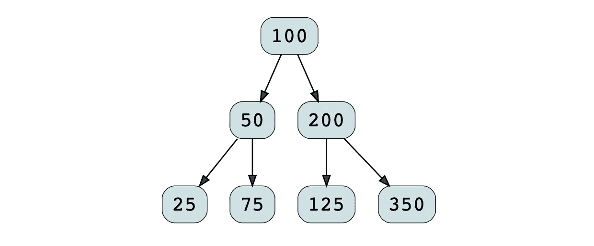

```
def is_bst_rec(root, min_value, max_value):
   if root == None:
      return True if root.data < min_value or root.data > max_value:
     return False return is_bst_rec(root.left, min_value, root.data) and is_bst_rec(root.right, root.data, max_value)def is_bst(root):
   return is_bst_rec(root, -sys.maxint - 1, sys.maxint)root = create_random_BST(15)
root2 = create_random_BST(15)
root2.data = 100
print("\nInOrder Traversal")
display_inorder(root)
print("\nIs BST\n\n")
print("\nInOrder Traversal")
display_inorder(root2)
print("\nIs not BST\n\n")
```

**运行时复杂度:**线性，O(n)

**记忆复杂度:**线性，O(n) *O*

有几种方法可以解决这个问题。一个基本的算法是检查每个节点，其左子树的最大值小于该节点的数据，而其右子树的最小值大于该节点的数据。这是非常低效的，因为对于每个节点，它的左和右子树都被探索。

另一种方法是进行常规的有序遍历，在每次递归调用中，传递最大和最小边界，以检查当前节点的值是否在给定的边界内。

## 7.字符串分段

给你一个单词字典和一个大的输入字符串。您必须找出输入字符串是否可以完全分割成给定词典中的单词。以下两个例子进一步阐述了这个问题。*点击* [*此处*](https://www.educative.io/m/string-segmentation) *查看 C++、Java、JavaScript、Ruby 的解决方案。*

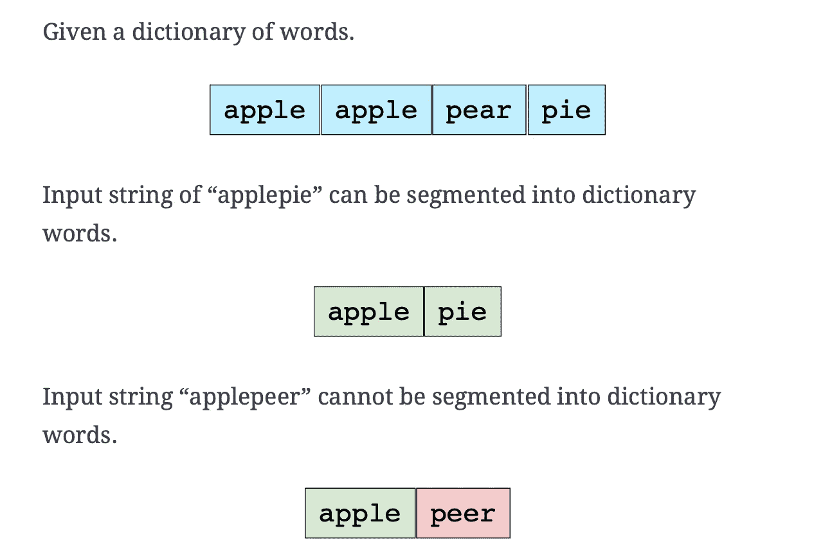

```
def can_segment_string(s, dictionary):
   for i in range(1, len(s) + 1):
     first = s[0:i]
     if first in dictionary:
        second = s[i:]
        if not second or second in dictionary or can_segment_string(second, dictionary):
          return True 
   return Falses = "hellonow";
dictionary= set(["hello","hell","on","now"])
if can_segment_string(s, dictionary):
   print("String Can be Segmented")
else:
   print("String Can NOT be Segmented")
```

**运行时复杂度:**指数级，O(2^n)

**记忆复杂度:**多项式，O(n^2)

您可以通过在每个可能的位置分割大字符串来解决这个问题，看看该字符串是否可以完全分割成字典中的单词。如果您分步编写算法，将如下所示:

```
n = length of input string
for i = 0 to n - 1
  first_word = substring (input string from index [0, i] )
  second_word = substring (input string from index [i + 1, n - 1] )
  if dictionary has first_word
    if second_word is in dictionary OR second_word is of zero length, then return true
    recursively call this method with second_word as input and return true if it can be segmented
```

该算法将在循环的每次迭代中从头开始计算两个字符串。最坏的情况是，每次都会递归调用`second_word`。这使得时间复杂度达到了 2^n.，你可以看到你可能多次计算同一个子串，即使它不存在于字典中。这种冗余可以通过记忆来解决，在记忆中你记住了哪些子串已经被解决了。为了实现记忆，您可以每次将`second`字符串存储在一个新的集合中。这将减少时间和内存的复杂性。

## 8.颠倒句子中的单词

反转给定句子中单词的顺序(字符数组)。*点击* [*此处*](https://www.educative.io/m/reverse-words-in-a-sentence) *查看 C++、Java、JavaScript、Ruby 的解决方案。*


```
def str_rev(str, start, end):
  if str == None or len(str) < 2:
    return

  while start < end:
    temp = str[start]
    str[start] = str[end]
    str[end] = temp

    start += 1
    end -= 1

def reverse_words(sentence):

  # Here sentence is a null-terminated string ending with char '\0'.

  if sentence == None or len(sentence) == 0:
    return

  #  To reverse all words in the string, we will first reverse
  #  the string. Now all the words are in the desired location, but
  #  in reverse order: "Hello World" -> "dlroW olleH".

  str_len = len(sentence)
  str_rev(sentence, 0, str_len - 2)

  # Now, let's iterate the sentence and reverse each word in place.
  # "dlroW olleH" -> "World Hello"

  start = 0
  end = 0

  while True:

  # find the  start index of a word while skipping spaces.
    while start < len(sentence) and sentence[start] == ' ':
      start += 1

    if start == str_len:
      break

  # find the end index of the word.
    end = start + 1
    while end < str_len and sentence[end] != ' ':
      end += 1

  # let's reverse the word in-place.
    str_rev(sentence, start, end - 1)
    start = end

def get_array(t):
  s = array('u', t)
  return s

def print_array(s):
  i = 0
  while i != len(s):
    stdout.write(s[i])
    i += 1
  print ()

s = get_array('Hello World!')
print_array(s)
reverse_words(s)
print_array(s)
```

**运行时复杂度:**线性，O(n)

**记忆复杂度:**常数，O(1)

解决这个问题的步骤比看起来简单:

*   反转绳子。
*   遍历字符串，将每个单词颠倒过来。

## 9.有多少种方法可以用硬币和总数来找零？

假设我们有[1，2，5]的硬币面额，总数是 7。我们可以通过以下六种方式做出改变。*点击* [*此处*](https://www.educative.io/m/coin-changing-problem) *查看 C++、Java、JavaScript、Ruby 的解决方案。*

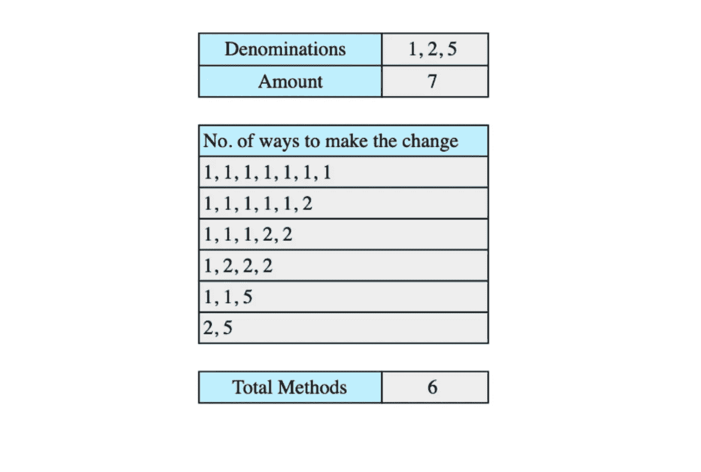

```
def solve_coin_change(denominations, amount):
  solution = [0] * (amount + 1)
  solution[0] = 1;
  for den in denominations:
    for i in range(den, amount + 1):
      solution[i] += solution[i - den] 

  return solution[len(solution) - 1]

denominations = [1, 2, 5]
amount = 7
result = solve_coin_change(denominations, amount)
# printing the answer
print("solve_coin_change(" + str(denominations) + ', ' + str(amount) + ') = ', end = '' )
print(result)
```

**运行时复杂度:**二次，O(m∫n)

**记忆复杂度:**线性，O(n)

为了解决这个问题，我们将保持一个大小为`amount + 1`的数组。保留了一个额外的空间，因为我们还想存储`0`数量的解决方案。只有一种方法可以改变`0`，即选择无硬币，所以我们将初始化`solution[0] = 1`。我们将解决每个金额的问题，从面额到金额，使用硬币到一个面额，`den`。不同面值的结果应存储在阵列解决方案中。使用面额`den`的金额`x`的解决方案将是:

```
solution[x] = solution[x] + solution[x - den]
```

我们将对所有的面额重复这个过程，在`solution`数组的最后一个元素，我们将有解决方案。

## 10.寻找第 k 个排列

给定一组 n 个元素，求它们的第 k 次排列。考虑以下一组元素。*点击* [*此处*](https://www.educative.io/m/find-permutation) *查看 C++、Java、JavaScript、Ruby 的解决方案。*

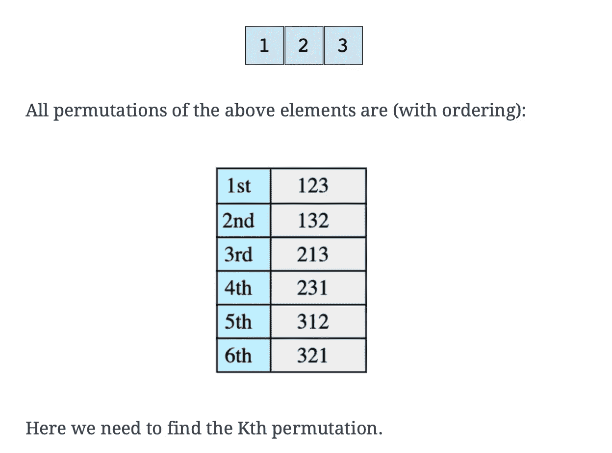

```
def factorial(n):
  if n == 0 or n == 1:
    return 1
  return n * factorial(n -1 )

def find_kth_permutation(v, k, result):
  if not v:
    return

  n = len(v)
  # count is number of permutations starting with first digit
  count = factorial(n - 1)
  selected = (k - 1) // count

  result += str(v[selected])
  del v[selected]
  k = k - (count * selected)
  find_kth_permutation(v, k, result)

def get_permutation(n, k):
  v = list(range(1, n + 1))
  result = []
  find_kth_permutation(v, k, result)
  return ''.join(result)

def main():
  n = factorial(4)
  for i in range(1, n + 1):
    print(str(i) + "th permutation = \t", get_permutation(4, i))

main()
```

**运行时复杂度:**线性，O(n)

**记忆复杂度:**线性，O(n)

这是我们将遵循的算法:

```
If input vector is empty return result vector

block_size = (n-1)! ['n' is the size of vector]

Figure out which block k will lie in and select the first element of that block
(this can be done by doing (k-1)/block_size)

Append selected element to result vector and remove it from original input vector

Deduce from k the blocks that are skipped i.e k = k - selected*block_size and goto step 1
```

## 11.查找给定整数集的所有子集

给我们一组整数，我们要找出这组整数所有可能的子集。以下示例对此进行了进一步阐述。*点击* [*此处*](https://www.educative.io/m/find-all-subsets) *查看 C++、Java、JavaScript、Ruby 的解决方案。*

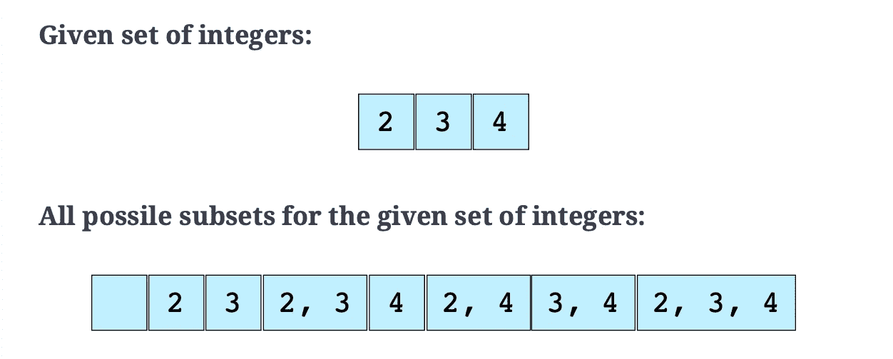

```
def get_bit(num, bit):
    temp = (1 << bit)
    temp = temp & num
    if temp == 0:
      return 0
    return 1

def get_all_subsets(v, sets):
    subsets_count = 2 ** len(v)
    for i in range(0, subsets_count):
      st = set([])
      for j in range(0, len(v)):
         if get_bit(i, j) == 1:
            st.add(v[j])
      sets.append(st)

def main():
    v = [8,13,3,22,17,39,87,45,36]
    subsets = []
    get_all_subsets(v, subsets);
    print("****Total*****" + str(len(subsets)))
    for i in range(0, len(subsets)):
        print("{", end = "")
        print(subsets[i], end = "")
        print("}")
    print("****Total*****" + str(len(subsets)))

main()
```

**运行时复杂度:**指数级，O(2^n∗n)

**记忆复杂度:**指数，O(2^n∗n)

有几种方法可以解决这个问题。我们将讨论一个简洁易懂的例子。我们知道，对于一组`n`元素，存在 2^n 子集。例如，具有三个元素的集合将具有八个子集。下面是我们将使用的算法:

```
n = size of given integer set
subsets_count = 2^n
for i = 0 to subsets_count
    form a subset using the value of 'i' as following:
        bits in number 'i' represent index of elements to choose from original set,
        if a specific bit is 1 choose that number from original set and add it to current subset,
        e.g. if i = 6 i.e 110 in binary means that 1st and 2nd elements in original array need to be picked.
    add current subset to list of all subsets
```

## 12.打印平衡括号组合

打印给定值 n 的所有大括号组合，使它们平衡。对于这个解决方案，我们将使用递归。*点击* [*此处*](https://www.educative.io/m/all-possible-braces) *查看 C++、Java、JavaScript、Ruby 的解决方案。*

```
def print_all_braces_rec(n, left_count, right_count, output, result):

  if left_count >= n and right_count >= n:
    result.append(copy.copy(output));

  if left_count < n:
    output += '{'
    print_all_braces_rec(n, left_count + 1, right_count, output, result)
    output.pop()

  if right_count < left_count:
    output += '}'
    print_all_braces_rec(n, left_count, right_count + 1, output, result)
    output.pop()

def print_all_braces(n):
  output = []
  result = []
  print_all_braces_rec(n, 0, 0, output, result)
  return result

result = print_all_braces(3)

for rs in result: 
  print(rs)
```

**运行时复杂度:**指数级，2^n

**记忆复杂度:**线性，O(n)

解决方案是保持`left_braces`和`right_braces`的计数。基本算法如下:

```
left_braces count: 0
right_braces count: 0

if left_braces count is less than n:
  add left_braces and recurse further
if right_braces count is less than left_braces count:
  add right_braces and recurse further
stop recursing when left_braces and right_braces counts are both equal to n
```

## 13.克隆一个有向图

给定一个有向图的根节点，通过创建它的深层副本来克隆这个图，以便克隆的图与原始图具有相同的顶点和边。让我们以下面的图表为例。如果输入图是 G=(V，E)，其中 V 是顶点集，E 是边集，那么输出图(克隆图)G' = (V '，E ')使得 V = V '和 E = E '。我们假设所有的顶点都可以从根顶点到达，也就是说，我们有一个连通图。*点击* [*此处*](https://www.educative.io/m/clone-directed-graph) *查看 C++、Java、JavaScript、Ruby 的解决方案。*

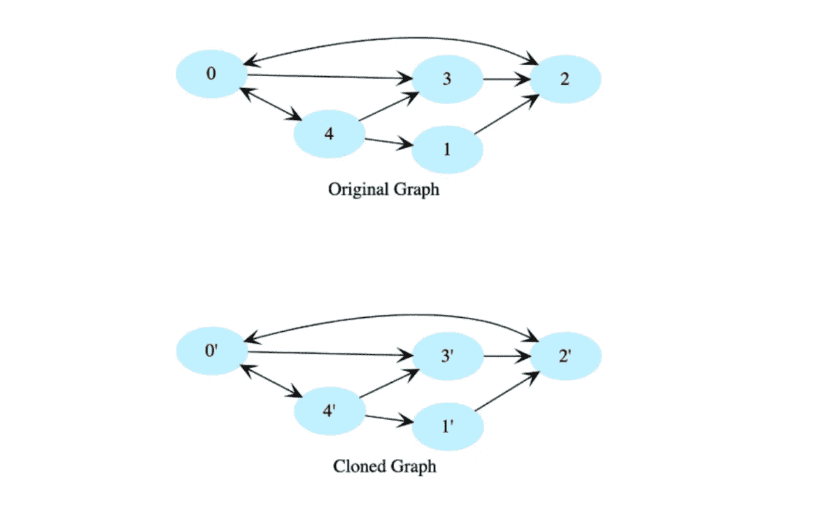

```
class Node:
  def __init__(self, d):
    self.data = d
    self.neighbors = []

def clone_rec(root, nodes_completed):
  if root == None:
    return None

  pNew = Node(root.data)
  nodes_completed[root] = pNew

  for p in root.neighbors:
    x = nodes_completed.get(p)
    if x == None:
      pNew.neighbors += [clone_rec(p, nodes_completed)]
    else:
      pNew.neighbors += [x]
  return pNew

def clone(root):
  nodes_completed = {}
  return clone_rec(root, nodes_completed)

# this is un-directed graph i.e.
# if there is an edge from x to y
# that means there must be an edge from y to x
# and there is no edge from a node to itself
# hence there can maximim of (nodes * nodes - nodes) / 2 edgesin this graph
def create_test_graph_undirected(nodes_count, edges_count):
  vertices = []
  for i in range(0, nodes_count):
    vertices += [Node(i)]

  all_edges = []
  for i in range(0, nodes_count):
    for j in range(i + 1, nodes_count):
      all_edges.append([i, j])

  shuffle(all_edges)

  for i in range(0, min(edges_count, len(all_edges))):
    edge = all_edges[i]
    vertices[edge[0]].neighbors += [vertices[edge[1]]]
    vertices[edge[1]].neighbors += [vertices[edge[0]]]

  return vertices

def print_graph(vertices):
  for n in vertices:
    print(str(n.data), end = ": {")
    for t in n.neighbors:
      print(str(t.data), end = " ")
    print()

def print_graph_rec(root, visited_nodes):
  if root == None or root in visited_nodes:
    return

  visited_nodes.add(root)

  print(str(root.data), end = ": {")
  for n in root.neighbors:
    print(str(n.data), end = " ")
  print("}")

  for n in root.neighbors:
    print_graph_rec(n, visited_nodes)

def print_graph(root):
  visited_nodes = set()
  print_graph_rec(root, visited_nodes)

def main():
  vertices = create_test_graph_undirected(7, 18)
  print_graph(vertices[0])
  cp = clone(vertices[0])
  print()
  print("After copy.")
  print_graph(cp)

main()
```

**运行时复杂度:**线性，O(n)

**记忆复杂度:**对数，O(logn)

我们使用深度优先遍历，并在遍历图时创建每个节点的副本。为了避免陷入循环，我们将使用一个哈希表来存储每个完成的节点，并且不会重新访问哈希表中存在的节点。hashtable 键将是原始图中的一个节点，它的值将是克隆图中相应的节点。

## 14.查找低/高索引

给定一个排序的整数数组，返回给定键的高低索引。如果没有找到索引，必须返回`-1`。数组长度可以达到数百万，有许多重复。

在下面的例子中，根据`key`,`low`和`high`指数将是:

*   `key` : 1，`low` = 0，`high` = 0
*   `key` : 2，`low` = 1，`high` = 1
*   `key` : 5，`low` = 2，`high` = 9
*   `key` : 20，`low` = 10，`high` = 10

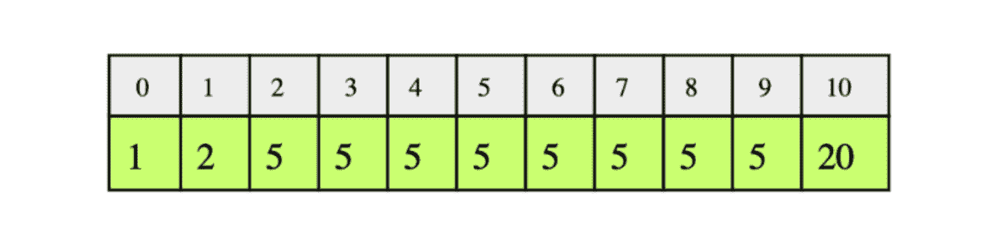

为了测试您的代码，输入数组将是:

```
1, 1, 1, 2, 2, 2, 2, 2, 3, 3, 3, 4, 4, 4, 4, 5, 5, 5, 6, 6, 6, 6, 6, 6
```

*点击* [*此处*](https://www.educative.io/m/find-low-high-index) *查看 C++、Java、JavaScript、Ruby 的解决方案。*

```
def find_low_index(arr, key):

  low = 0
  high = len(arr) - 1
  mid = int(high / 2)

  while low <= high:

    mid_elem = arr[mid]

    if mid_elem < key:
      low = mid + 1
    else:
      high = mid - 1

    mid = low + int((high - low) / 2)

  if low < len(arr) and arr[low] == key:
    return low

  return -1

def find_high_index(arr, key):
  low = 0
  high = len(arr) - 1
  mid = int(high / 2)

  while low <= high:
    mid_elem = arr[mid]

    if mid_elem <= key:
      low = mid + 1
    else:
      high = mid - 1

    mid = low + int((high - low) / 2);

  if high == -1:
    return high

  if high < len(arr) and arr[high] == key:
    return high

  return -1

array = [1, 1, 1, 2, 2, 2, 2, 2, 3, 3, 3, 4, 4, 4, 4, 5, 5, 5, 6, 6, 6, 6, 6, 6]
key = 5
low = find_low_index(array, key)
high = find_high_index(array, key)
print("Low Index of " + str(key) + ": " + str(low))
print("High Index of " + str(key) + ": " + str(high))

key = -2
low = find_low_index(array, key)
high = find_high_index(array, key)
print("Low Index of " + str(key) + ": " + str(low))
print("High Index of " + str(key) + ": " + str(high))
```

**运行时复杂度:**对数，O(logn)

**记忆复杂度:**常数，O(1)

线性扫描排序后的数组来寻找`low`和`high`索引是非常低效的，因为我们的数组可能有几百万个。相反，我们将使用稍微修改的二分搜索法来查找给定键的`low`和`high`索引。我们需要做两次二分搜索法:一次是寻找`low`指数，一次是寻找`high`指数。

让我们看看寻找`low`索引的算法。在每一步，考虑`low`和`high`索引之间的数组，并计算`mid`索引。

*   如果`mid`索引处的元素小于`key`，则`low`变为`mid + 1`(向范围起点移动)。
*   如果`mid`处的元素大于或等于`key`，`high`变为`mid - 1`。T4 的指数保持不变。
*   当`low`大于`high`时，`low`将指向第一次出现的`key`。
*   如果`low`处的元素与`key`、`return -1`不匹配。

类似地，我们可以通过稍微修改上面的条件来找到`high`索引:

*   当`mid`索引处的元素小于或等于`key`时，将`low`索引切换到`mid + 1`。
*   当`mid`处的元素大于`key`时，将`high`索引切换到`mid - 1`。

## 15.搜索旋转数组

在一个排序的数组中搜索一个给定的数字，该数组具有唯一的元素，并且被旋转了任意的数字。如果号码不存在，返回`-1`。假设数组不包含重复项。*点击* [*此处*](https://www.educative.io/m/search-rotated-array) *查看 C++、Java、JavaScript、Ruby 的解决方案。*


```
def binary_search(arr, start, end, key):
  # assuming all the keys are unique.

  if (start > end):
    return -1;

  mid = int(start + (end - start) / 2)

  if arr[mid] == key:
    return mid

  if arr[start] <= arr[mid] and key <= arr[mid] and key >= arr[start]:
    return binary_search(arr, start, mid - 1, key)

  elif arr[mid] <= arr[end] and key >= arr[mid] and key <= arr[end]: 
    return binary_search(arr, mid + 1, end, key)
```

**运行时复杂度:**对数，O(logn)

**记忆复杂度:**对数，O(logn)

该解决方案本质上是一个二分搜索法，但做了一些修改。如果我们仔细观察示例中的数组，我们会注意到至少有一半的数组总是被排序的。我们可以利用这一特性。如果数字`n`位于数组排序后的一半，那么我们的问题就是一个基本的二分搜索法。否则，丢弃已排序的一半，继续检查未排序的一半。因为我们在每一步都将数组分成两半，所以我们的运行时复杂度为 O(logn)*O*(*logn*)。

# 更常见的亚马逊编码面试问题

*   数组中 k 个最大的元素
*   将二叉树转换为 DLL。
*   给定一棵二叉树 T，求最大路径和。该路径可以在树中的任何节点开始和结束。
*   将矩阵旋转 90 度。
*   基于动态规划的装配线调度
*   用 O(1) *O* (1)时间实现一个`push()`、`min()`、`pop()`的栈。
*   如何将一个数组旋转 K？
*   使用面向对象的分析和设计技术设计贪吃蛇游戏。
*   使用递归打印给定字符串的所有排列。
*   使用链表实现队列。
*   找出数组中最长的递增子序列。
*   二叉查找树和二叉树的最低共同祖先
*   将给定列表向右旋转`k`位，非负。
*   编写一个函数，计算一个 32 位整数中设置位的总数。
*   如何检测单链表中的循环？
*   成组反转数组。
*   给定一棵二叉树，检查它是否是自身的镜像。
*   递归的约瑟夫问题
*   零和子阵列
*   贪婪算法的霍夫曼解码
*   动态规划的落蛋难题
*   n 皇后问题
*   检查字符串是否是彼此的旋转。
*   0-1 背包问题
*   无界背包问题
*   最长回文子序列
*   打印斐波纳契数列中的`nth`数。
*   最长公共子串
*   最长公共子序列

# 亚马逊编码访谈概述

要想在亚马逊找到一份软件工程的工作，你需要知道前方有什么。你准备得越充分，你就会越自信。所以，我们来分解一下。

*   **面试时间表:**整个面试过程需要六到八周完成。
*   **面试类型:**亚马逊编码面试由五到七个面试组成。这包括一次体能和资质评估、一两次在线测试和四至六次现场面试，也称为*循环。*
*   **循环:**现场面试包括一至三次与招聘经理的面试，以及一次评估亚马逊 14 项领导原则的面试。
*   **编码问题:**亚马逊编程问题集中在算法、数据结构、谜题等方面。
*   **招聘级别:**亚马逊通常招聘入门级别的员工(总共 12 名)，该级别的平均年薪为 10.6 万美元至 11.4 万美元。
*   **招聘团队:**亚马逊基于团队招聘。最常见的招聘团队是 Alexa 和 AWS。
*   **编程语言:**亚马逊对于编码问题更喜欢以下编程语言:Java、C++、Python、Ruby、Perl。

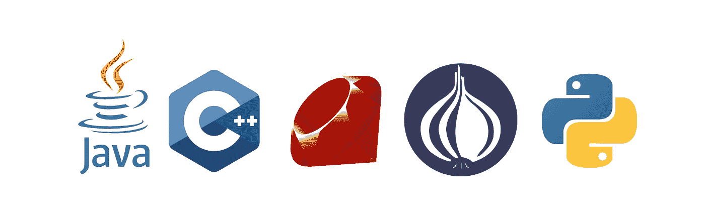

图片由作者提供

# 亚马逊的 14 条领导原则

尽管亚马逊的编码面试与其他大型科技公司的相似，但他们的流程还是有一些不同，特别是*酒吧老板*。亚马逊引入了一个名为 Bar Raiser 的客观第三方面试官，他根据亚马逊的 14 项领导原则评估候选人。酒吧老板对你是否会被雇佣有完全的否决权。提高门槛者确保亚马逊雇佣该级别候选人中排名前 50%的人。

你不太可能知道哪个面试官是酒吧老板。关键是要认真对待面试的每一个部分，并始终假设你正在接受文化契合度和技术能力的评估。你可以在这里阅读[亚马逊的 14 条领导原则](https://www.amazon.jobs/en/principles)。


图片由作者提供

# 如何准备亚马逊编码面试

既然你对面试有所了解，也知道会问什么样的问题，那么让我们根据亚马逊独特的[面试流程](https://www.codinginterview.com/amazon)来学习一些准备策略。

## 更新你的简历

确保你已经更新了你的简历和 LinkedIn 个人资料。尽可能使用可交付成果和度量标准，因为它们是您所完成工作的具体例子。通常，招聘人员会浏览 LinkedIn 寻找候选人。如果亚马逊的招聘人员认为你很合适，他们会联系你(通过电子邮件或 LinkedIn)安排时间聊天。

## 准备编码评估

这取决于你来参加一个为技术评估做好充分准备的编码面试。我建议至少自学三个月才能成功。这包括选择编程语言、复习基础知识、学习算法、数据结构、系统设计、面向对象编程、操作系统和并发概念。你还需要为行为面试做准备。

## 与招聘人员一起进行预筛选

期待一个 15 到 30 分钟的电话，招聘人员会评估你的兴趣水平，并确定你是否适合。招聘人员可能会涉及一些技术方面。他们只是想了解一下你的技能。典型的问题可能包括你过去的工作经历、你对公司/职位的了解、薪水和其他后勤问题。准备好七到十个你自己的问题来问面试官是很重要的。在早期阶段提出问题显示了对该职位的投入和兴趣。

## 在线评估

一旦你完成了与招聘人员的通话，他们将进行在线编码测试、调试测试和能力测试。调试部分会有大约六七个问题，你有 30 分钟的时间来解决。能力部分将有大约 14 道选择题，涉及基本排列组合和概率等概念。

编码测试包括两个问题。你将有大约 1.5 小时来完成它。预计测试将通过 Codility、HackerRank 或其他网站进行。期待一些简单到中等的问题，这些问题通常与算法相关。例子包括:

*   反转链表的后半部分
*   查找字符串中的所有变位词
*   合并重叠间隔

## 电话采访

一旦你通过了预筛选和在线评估，招聘人员会安排你的下一轮面试，可能会和招聘经理或你希望加入的团队的经理一起。在这一阶段，还会有一到三次面试。在这里，他们会问你与简历直接相关的问题，以及数据结构、算法和其他各种适用于该职位的编码问题。您可以编写代码，审查代码，并展示您的技术知识。

## 现场采访:循环

如果你成功通过了一系列的电话面试，你将被邀请到现场参观。这一整天的现场访谈被称为循环。一整天，你会遇到四到六个人。预计这些面试一半是技术性的，另一半是评估软技能。准备在白板上解决问题，并讨论您的思考过程。

亚马逊喜欢测试的概念是数据结构和算法。了解不同类别算法的运行时间、理论限制和基本实现策略非常重要。

*   **你应该知道的数据结构:**数组、栈、队列、链表、树、图、哈希表
*   **你应该知道的算法:**广度优先搜索、深度优先搜索、二分搜索法、快速排序、归并排序、动态规划、分治

## 提议/不提议

一般来说，你会在面试后一周内收到招聘人员的回复。如果你没有得到报价，亚马逊会给你打电话。你可能要再等六个月才能重新申请。如果你的现场面试进行得很顺利，他们会联系你，这时他们会给你一个提议，发给你文件让你签字，并讨论你的任何进一步的问题。

# 包扎

破解亚马逊编码面试归结于你花在准备上的时间，比如练习编码题，研究行为面试，了解亚马逊的公司文化。没有金奖券，但更多的准备一定会让你成为一个更自信、更令人向往的候选人。

学习如何清晰地表达你的解决问题的过程伴随着实践和面试经验。记住:如果你没有马上得到一份工作，要有耐心。重新申请或者申请不同的职位/团队都没问题。坚持不懈的意愿很重要。

继续学习学习！