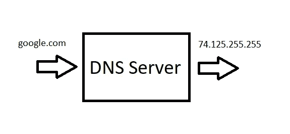
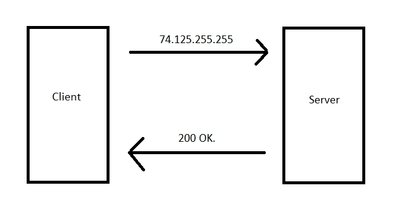

# 使用 Python 的 HTTP 请求速成班

> 原文：<https://betterprogramming.pub/crash-course-in-http-requests-using-python-59246373a187>

## 让您的 Python 代码与互联网对话

马库斯·斯皮斯克在 [Unsplash](https://unsplash.com?utm_source=medium&utm_medium=referral) 上的照片

很多时候，人们纠结于如何将他们的编程知识应用到现实世界的场景中。我当然经历过，这可能会令人沮丧。编写简单的程序，除了显示对概念的理解之外，没有任何真正的用途，是不能令人满意的。我们是创造者。我们想开发一些有某种真正目的的东西。也许你刚刚学习 Python，想用它做更多的事情，或者你可以使用来自 API 的数据来帮助你的其他项目。使用 [Python 请求模块](https://pypi.org/project/requests/2.7.0/)是实现这些目标的好方法，有助于让你的创造力源源不断地流向未来。

# 互联网

这本身很可能是一个完整的主题，但是对于请求模块的目的，我们只需要理解最基本的内容。互联网，从一个非常基本的意义上来说，就是一堆连在一起的电脑，可以互相交流。当您键入一个 URL，例如 www.google.com，会出现以下几种情况:

*   DNS 查找——你可以把它想象成互联网上的电话簿。您输入的 URL 会进入 DNS 服务器，并将其转换为 IP 地址。这个 IP 地址是您实际发送请求的目的地。

*   请求/响应周期—这是客户端(您的计算机)向服务器发出请求的阶段。然后，该服务器处理您的请求并向您发出响应。

# 应用程序接口

应用程序编程接口是两个应用程序相互通信的一种方式。某些网站或 web 应用程序有一个 API，允许您从其中提取数据，用于您正在创建的任何内容。不是每个网站都有 API，虽然不使用 API 也可以提取数据，但这是一个更适合网络抓取的话题。一些流行的 API 包括谷歌地图、脸书、推特和开放天气地图。通过使用请求模块和 API，您能够检索数据，然后用它创建一些东西。

# 请求模块

Requests 模块是一个 HTTP 库，允许您发送请求，并能够使用 Python 的字典添加头、表单数据和参数。它还将接收 JSON 文件，并允许您将它们转换成字典。如果你还没有安装 [PIP](https://pypi.org/project/pip/) ，我建议你下载它。这是 Python 常用的包安装程序。

一旦你安装了这个命令，你的终端将会下载请求模块:
`python3 -m pip install requests`

将模块导入您的。py 文件:
`import requests`

要从源请求信息并保存到对象“响应”中，我们使用这个 get 请求:
`response = requests.get(“https://www.example.com”)`

最好使用:
`response.status_code`来检查响应的状态代码

您也可以检查状态代码是否正常，它将返回一个布尔值:
`response.ok`

要从响应中访问数据，我们可以使用:
`print(response.text)`

通过使用头文件，我们可以使用 Python 字典指定 JSON 文件类型，而不是上面使用
`response = requests.get("https:example.com", headers={"Accept": "application/json"})`得到的 HTML

然后我们可以使用一种方法将 JSON 文件转换成 Python 字典:
`print(response.json())`

当使用 API 时，通过浏览文档，您可以找到可以包含在 get 请求中的参数，以发送关于特定请求的更多数据:
`response = requests.get("https:example.com", headers={"Accept": "application/json"}, params={"key1": "value1"})`

# 例子

这是我第一次学习使用请求模块时创建的一个简单示例。它连接到一个提供爸爸笑话的 API。这个程序询问用户他们想听什么类型的笑话，在 API 中搜索该笑话类型，并返回一个笑话或随机笑话(如果不止一个的话)。

# 结论

[请求文档](https://2.python-requests.org/en/master/)将为您提供关于该模块的更多信息，同时也是您遇到困难时的宝贵资源。这个速成课程旨在让您熟悉如何处理 HTTP 请求，并让您了解如何使用 Python。查找有趣的 API，看看有了这些信息，您可以创建什么样的项目。这是一种利用您的 Python 编程技能与真实世界的数据进行交互的有趣方式。