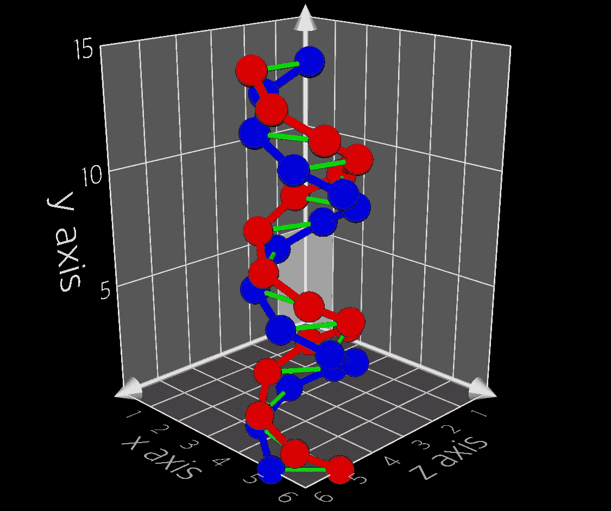

# 使用 Plot3d 在 iOS 上创建 3D 图形

> 原文：<https://betterprogramming.pub/create-3d-graphs-on-ios-with-plot3d-22f2237dbcc1>

## 为你的用户构建漂亮的可视化效果

使用 Plot3d 在 iOS 上的 3D 空间中绘图

如果数据绘制得很好，那么以三维方式绘制数据是一种很好的可视化数据的方式。要想出一个有用的三维数据图，需要创造力和蛮力迭代。

在 iOS 上，三维绘图更具挑战性，因为没有太多的框架可供使用——我找到的唯一一个框架也不是免费的！

Plot3d 是一个开源项目，我一直致力于在 iOS 上绘制三维数据。[cocoa pods 上有 plot 3d](https://cocoapods.org/pods/Plot3d)。

# 它是如何工作的

Plot3d 使用 [SceneKit](https://developer.apple.com/documentation/scenekit) 来表示三维数据。接下来的两节将简要总结这些框架。

## **场景概述**

在`SceneKit`中，`SCNScene`是 3D 的一切所在。场景中的任何视觉对象都是一个`SCNGeometry`。

一个几何图形被附加到一个`SCNNode`，它是一个场景的结构元素，代表一个位置和在 3D 坐标空间中的变换。

## **Plot3d 概述**

Plot3d 提供了一个`PlotView`来管理一个场景，该场景包含在 3d 中绘制数据所需的所有节点和几何体。A `PlotView`是`UIView`的子类，场景中的所有东西都被添加到 a `PlotSpaceNode`中。

一个`PlotSpaceNode`是一个`PlotView`中场景的根节点。大多数 3D 工作都是由一个绘图空间处理的，这个空间对开发者是隐藏的。

使用类似于`UITableView`工作方式的数据源和委托模式确定要在绘图空间中绘制的数据。

# 使用 Plot3d

首先，用给定的配置创建一个视图，然后提供数据。下面所有的代码都被假定在一个`UIViewController`中。

## **创建绘图视图**

使用自定义配置初始化`PlotView`，并设置轴标题以开始。

## 三维绘图

使用类似于 UITableView 的数据源和委托模式在 3D 中绘制点。

绘图空间使用`PlotDataSource`和`PlotDelegate`绘制数据。由于没有暴露`PlotSpaceNode`，数据源和代理通过`PlotView`分配。

要打印数据，请扩展视图控制器以实现数据源和委托协议，然后将它们分配给打印视图。

```
plotView.dataSource = self
plotView.delegate = self
plotView.reloadData()
```

## **绘图数据源**

数据源用于指定要绘制的点数和要建立的连接。基础绘图空间将遍历给定的数量，并相应地绘制每个点和连接。

## **PlotDelegate**

下面是一些可以被实现来向绘图空间提供数据的委托方法。

1.  为每个要绘制的点提供一个`PlotPoint`(一个 3D 坐标)。(需要实现。)
2.  提供在每个绘制点使用的几何图形。(需要实现。)
3.  提供在每个刻度线使用的`PlotText`。(实现是可选的。)

## **添加连接**



可以通过指定需要连接的绘制点的索引来添加连接。

我们可以通过在绘制的点之间添加连接来进一步帮助数据更容易可视化。

将以下代码添加到`PlotDataSource`将指定要建立的连接数。

将以下代码添加到`PlotDelegate`将指定要连接的点，以及每个连接应该是什么样子。

# 结束

Plot3d 的目标是使在 iOS 上开发数据的 3d 可视化更加容易。

我承认，iPhones 上对 3D 图形的需求可能不是很大，但现在我可以更放心地睡觉了，因为我知道开发者可以选择开源。你可以在 GitHub 上查看[源代码。](https://github.com/stokatyan/Plot3D)