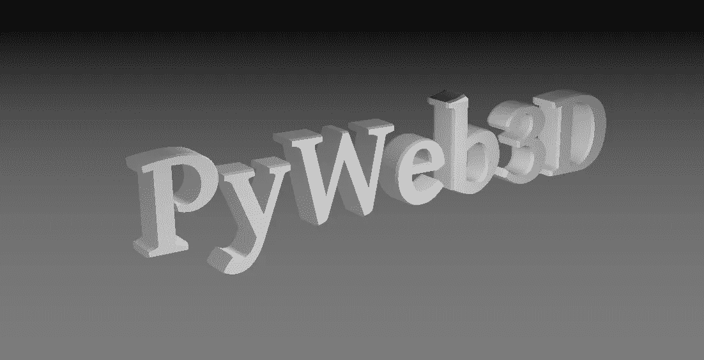
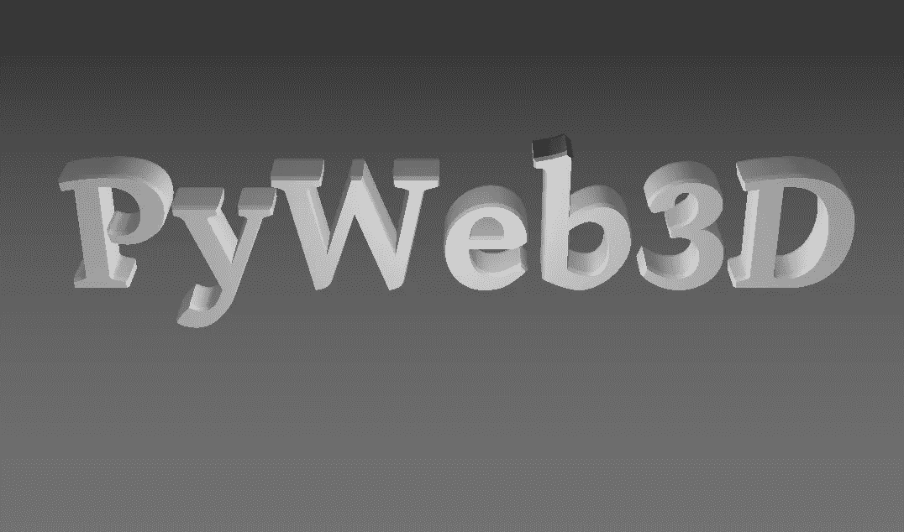

# 使用 PyWeb3D 创建 3D 文本

> 原文：<https://betterprogramming.pub/create-3d-text-using-pyweb3d-b4950a437322>

## 使用 Python 语法的 Three.js



图片作者:用 [PyWeb3D](https://www.pyweb3d.org/) 和 [three.js](https://threejs.org/) 创建的 3D 文本

欢迎阅读关于 [PyWeb3D](https://www.pyweb3d.org/) 的第二篇文章。如果你没看过上一篇文章，请在这里查看[。](/three-js-with-python-syntax-pyweb3d-2152bed1a43d)

在 web 浏览器中使用 Python 的想法已经深入人心。在今天的文章中，我们将使用 [PyWeb3D](https://www.pyweb3d.org/) 创建一个漂亮的 3D 文本。

# PyWeb3D 是什么？

PyWeb3D 是带有 Python 语法的 three.js。也可以说是 three.js 的 Python 文档。

我们已经在前一篇文章中介绍了 PyWeb3D 和技术栈。如果你错过了，请在这里阅读上一篇文章[或阅读](/three-js-with-python-syntax-pyweb3d-2152bed1a43d) [PyWeb3D 文档](https://www.pyweb3d.org/docs/docs.html#manual/en/introduction/Installation)(截至今天仍在进行中)。

## HTML 样板文件

[https://gist . github . com/Bruno-Odinukweze/9df 447 afba 96180 cf 4 E1 a 09 c 99 c 0 ab 47](https://gist.github.com/Bruno-Odinukweze/9df447afba96180cf4e1a09c99c0ab47)

让我们检查一下 HTML 文件的内容，特别是`<head>`和`<body>`标签。

## 标签

在 head 标记中，我们加载了所有必要的文件，以便成功地使用 PyWeb3D。

*   行`6`和`7`我们加载了 [Brython](https://brython.info/) 脚本
*   行`8`我们加载了 t [hree.js](https://threejs.org/) 的脚本版本(不是模块版本)
*   第`9`行我们加载了 [pyweb3d](http://pyweb3d.org/) 脚本。

## 标签

我们在 body 标签中加载了三个外部脚本和一个内联脚本。前三个脚本是使用 PyWeb3D 创建 3D 文本所需的 three.js 插件。我做了一些调整，使这些文件非常容易使用 PyWeb3D 进行交互。您可以从下面下载它们:

[TextGeometry.js](https://www.pyweb3d.org/jsm/geometries/TextGeometry.js) 、 [FontLoader.js](https://www.pyweb3d.org/jsm/loaders/FontLoader.js) 和 [OrbitControls.js](https://www.pyweb3d.org/jsm/controls/OrbitControls.js)

*   第一行`15`，第一个脚本将加载 TextGeometry 插件(TextGeometry 是一个 three.js 类，用于将文本生成为单个几何图形)。
*   第`16`行，我们加载了`FontLoader`插件(FontLoader 是一个 three.js 类，用于加载 JSON 格式的字体)。
*   线`17`，我们加载了`OrbitControls`插件(轨道控制将允许相机围绕一个给定的目标)。
*   最后，第`20 -24`行的内联脚本标签是我们的 Python 代码所在的地方。

# 创建 3D 文本

有趣的部分来了；网络浏览器中的 Python。

下面我会嵌入 Python 代码，并做相应的解释。

[https://gist . github . com/Bruno-Odinukweze/9e6e 9302 b 63822 AFB 1d 09 c 74 DC E3 E0 d 1](https://gist.github.com/Bruno-Odinukweze/9e6e9302b63822afb1d09c74dce3e0d1)

上面的 Python 代码将进入内联脚本标签。从[这里](https://www.pyweb3d.org/examples/fonts/gentilis_bold.typeface.json)下载 JSON 字体。

让我们一行一行地检查内容。

*   从第`1 — 3`行，我们导入了必要的库和包。
    在第一行中，我们从`browser`导入了`window`和`document`实例(browser 是一个 Brython 包，它是您的浏览器的一个实例)。第二行，我们从 pyWeb3D 模块中导入了所有三个. js 类和函数。在第三行，我们从 JavaScript 模块(来自 Brython)导入了`Math`
*   从第`5 — 7`行开始，我们将 FontLoader、TextGeometry 和 OrbitControls 类直接从 JavaScript 文件加载到我们的 Python 代码中(这就是 [Brython](https://brython.info/) 的强大之处)。
*   从第`9 — 11`行开始，我们创建了一个 webGL 渲染器，并将其附加到 HTML 文件的主体。
*   从第`13 — 15`行，我们创建了一个透视相机，设置它的位置和一个要看的目标。
*   根据第 14 行，我们创建了一个场景，给它一个背景色，并添加了一层雾。
*   从线`22 — 24`开始，我们创建了一个平行光并将其添加到场景中。
*   从线条`26 — 28`中，我们创建了一个点光源，并将其添加到场景中。
*   线`30 — 31`，我们创建了一个环境光，并添加到场景中。
*   在第`34`行，我们实例化了 OrbitControls 并给了它一个目标。
*   从第`38 — 44`行，我们创建了一个`resize`处理函数，并在第`44`行添加了一个`resize`事件监听器
*   在第`46`行，我们实例化了字体加载器
*   从第`48 — 74`行开始，我们为字体加载器创建了一个回调函数。
*   从第`49 — 59`行开始，我们创建了一个 TextGeometry，它接受一个要绘制的文本和一些文本设置(如字体、高度等)。)作为论据。
*   在第`60`和`61`行，我们计算了刚刚创建的文本的边界框，并计算了第`61`行文本的中心。
*   从第`62 — 65`行开始，我们创建了一个稍后使用的材料列表。
*   在第`66`行，我们创建了一个网格，将文本几何图形和材料作为参数。素材对于网格就像 CSS 对于 HTML 一样。
*   从第`67 — 74`行开始，我们对创建的网格做了一些调整，并将其添加到第`74`行的场景中。
*   从第`76 — 82`行，我们创建了一个平面几何体，做了一些调整，并将其添加到场景中。
*   在第`85`行，我们加载了字体，并将之前创建的字体加载器函数作为回调函数进行传递。同样，你可以从[这里](https://www.pyweb3d.org/examples/fonts/gentilis_bold.typeface.json)下载 JSON 字体。
*   从第`87–91`行，我们创建了一个动画循环，并将其命名为第`91`行。注意传递给`animate`函数的参数和自变量吗？这对动画工作很重要

# 现在运行代码

在浏览器中打开 HTML 文件。你应该会看到漂亮的 3D 文字:)



图片作者:用 [PyWeb3D](https://www.pyweb3d.org/) 和 [three.js](https://threejs.org/) 创建的 3D 文本

我希望你喜欢这篇文章。感谢阅读。

源代码:[https://github . com/Bruno-Odinukweze/py web 3d/blob/main/examples/creating _ 3d _ text . html](https://github.com/Bruno-Odinukweze/PyWeb3D/blob/main/examples/creating_3d_text.html)

```
**Want to Connect?**Would you like to contribute to PyWeb3D? Join me, and let’s create something awesome together. Join me [here](https://github.com/Bruno-Odinukweze/PyWeb3D).
```

# 学分和参考

*   灵感来自 [three.js](https://threejs.org/)
*   [布里森](https://brython.info/)
*   P [ython](https://python.org/)