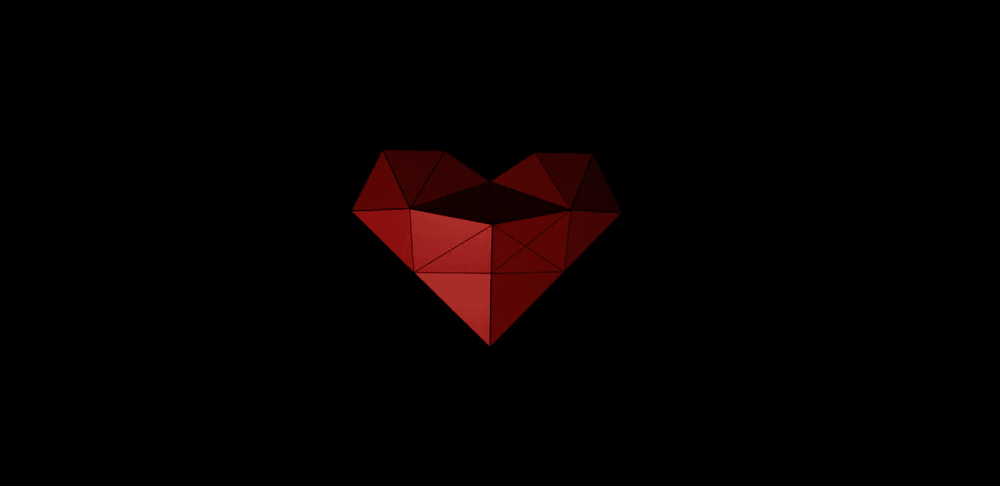
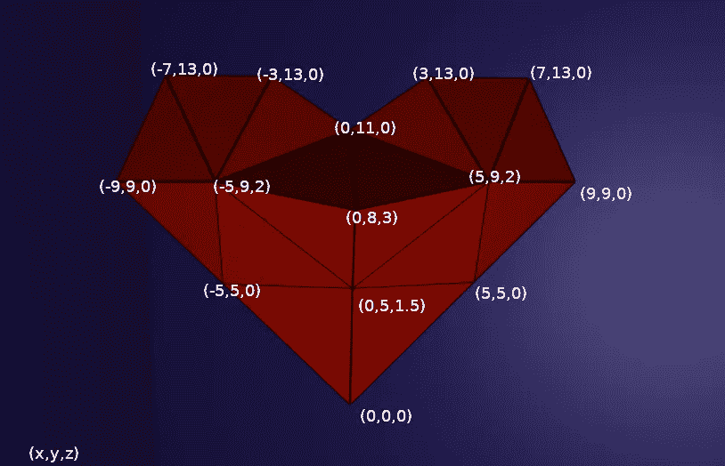

# 用 Three.js 创建情人节的 3D 心形图案

> 原文：<https://betterprogramming.pub/create-a-3d-heart-for-valentines-day-with-three-js-438aabf2d795>

## 你可以在一年中的任何时候做它！



最近(取决于你的时区，我猜)，是情人节季节。无论你是想向某个特别的人敞开心扉，还是想简单地将爱传播到全世界，可能没有比用 JavaScript 更好的方法了！

本教程将展示我们如何使用 three.js 库来定义和修改自定义 3D 模型并在浏览器中渲染它。

首先，我们将简要介绍什么是 three.js，以及我们为什么在这里使用它。

然后，我们将进入技术细节，看看如何创建一个场景，建立和渲染一个自定义模型，控制相机欣赏它的所有荣耀，最后，如何触发一个简单的动画。

准备好升级你的基本表情符号了吗？❤

# 为什么是 Three.js

three.js 是一个依赖于 WebGL 的 JavaScript 3D 库，web GL 是一个在浏览器中渲染 2D 和 3D 模型的 API。

当在常规 HTML 画布中绘制并使用 GPU 处理渲染过程时，three.js 允许直接高效地操纵 3D 模型。甚至 NASA 也用它来模拟他们的火星车登陆火星。

虽然仅使用 WebGL 提供的工具来创建我们的心脏是完全可行的，但是您会看到 three.js 提供了丰富的 API，使我们的工作变得更加简单。

**注意** : three.js 也提供画布 2D、SVG 和 CSS3D 渲染器，但是在这个例子中我们将坚持使用 WebGL 渲染器。

安装 three.js 有不同的方法，但这次我们将通过 CDN 加载它。我们可以创建一个经典的`index.html`文件，并在其中加载带有`script`标签的库。

然后我们将在一个`heart.js`文件中工作。此时，不需要其他任何东西。画布元素将由脚本自动添加到正文中。

```
<html>
  <head>
  <meta charset="utf-8">
  <title>in my heart</title>
  </head>
  <body>
    <script src="https://cdnjs.cloudflare.com/ajax/libs/three.js/r124/three.min.js"></script>
    <script src="./heart.js"></script>
  </body>
</html>
```

# 进入场景

在制作实际模型之前，我们将为它创建一个友好的环境。

把你的艺术作品放在合适的场景中是你最起码应该做的。谢天谢地，我们可以使用我们得到的 three.js 工具。

让我们从第一个函数开始:

首先，我们需要定义一个实际的场景对象，它将包含我们将要渲染的几乎所有内容。很大的责任，但这是一句俏皮话。

然后，我们还需要创建一个相机对象。它代表你可以看到场景的点。Three.js 提供了不同类型的相机，但这款很适合我们的情况。

如文档中所述:

> “这种投影模式旨在模拟人眼的视觉方式。这是渲染 3D 场景最常用的投影模式。

那好吧。您可以按照 doc 的指导来设置您的首选配置。注意，第二个参数用于摄像机的纵横比，这就是为什么它是从这里的窗口大小计算出来的。

```
camera.position.z = 30
```

我们还需要把摄像机放在离我们要放置形状的地方更远的地方。

```
const renderer = new THREE.WebGLRenderer({ antialias: true })
```

现在，我们可以实例化我们的`WebGLRenderer`。你可以决定是否设置抗锯齿为真。

```
renderer.setSize(window.innerWidth, window.innerHeight)
document.body.appendChild(renderer.domElement)
```

我们设置大小以匹配窗口，并将画布附加到主体上。

```
const color = 0xFFFFFF
const intensity = 0.75
const light = new THREE.PointLight(color, intensity)
light.position.set(-15, -10, 30)scene.add(light)
```

最后，我们将添加一个光源到我们的场景。Three.js 还提供了不同种类的灯光。我在这里选择了点光源，因为它很容易可视化。它的行为就像一个灯泡——没有任何方向或任何东西。

让我们在一个`init`方法中调用这个`createScene`函数，这将是我们程序的入口点。

```
function init () {
 const {scene, camera, renderer} = createScene()
}init()
```

# 制造心脏

现在我们有了我们的场景，我们终于可以开始工作的明星…嗯，表演的核心！由于我们使用的是 WebGL 渲染器，我们知道可以用点(或顶点)坐标轻松绘制三角形。

首先，我们将定义这些坐标；然后我们将看看如何在它们之间画三角形。

# 协调

我们需要为我们的模型定义一组顶点。考虑这些点将连接你的形状的每一个边缘。在 three.js 中，可以使用`Vector3`对象对它们进行配置。我们选择的位置可以是完全任意的。我通过在一张纸上画出我的模型算出了它们，但我会在这里作弊，给你看我用成品模型的图片选的坐标。



心脏前侧各点的坐标

你可以看到每个点在一个(x，y，z)空间里有三个坐标，它中间比较厚，周围的边都在 z=0 平面上。让我从另一个角度展示给你看:


心脏模型的侧视图

我们将需要另一组点的另一边，但他们是对称的，从第一个，所以我会饶你一个新的截图。

现在，我们要渲染这些点之间的表面。你可能已经注意到，我们最终模型上的每个平面都是一个三角形。如果在一个空间中有三个点，三角形是你能画出的最简单的形状，它被广泛用于 3D 渲染中，作为任何模型的基础部分。

我们试图让它在这里容易可视化，所以我们只使用了几个三角形，但如果你想创建一个更平滑的形状，你可以使用更多。

# 三角形

好了，我们有了坐标，但是我们需要告诉 three.js 我们想要显示的三角形在哪里。我们将在这里使用的方法是存储这些坐标的索引，以便每三个索引的组代表一个三角形。

现在，是时候看看我们的第二个函数了。它看起来是这样的:

第一个数组(`vertices`)表示将塑造我们的模型的所有点，从 0 到 17。第二个(`triangleIndexes`)代表我们要根据那些点画出的所有三角形。它只是一个整数数组，是第一个数组中顶点的索引。

重点是对于每三个索引，我们可以用第一个数组的三个对应点组成一个三角形。图中第一个三角形对应的是上面提到的点 A、B、C。

## 创建网格

有了这些数据，我们现在就能画出东西来了！
虽然我们完全可以让 three.js 绘制没有任何链接的三角形，但是如果有一个对象引用我们的模型会更好。

在 three.js 中它被称为一个`mesh`。

为了实例化一个新的`mesh`，我们仍然需要创建两个对象:一个`geometry`和一个`material`。

将`geometry`视为造型的参照物，将`material`视为造型的质地或面料的参照物。

完成后，我们还需要一个函数:

让我们分析一下这是怎么回事。首先，我们创建一个默认的`geometry`。不需要进一步的配置，因为我们将分配它的所有面。

```
for (let i in trianglesIndexes) {
 if ((i+1)%3 === 0) {
  geo.vertices.push(coordinatesList[trianglesIndexes[i-2]], coordinatesList[trianglesIndexes[i-1]], coordinatesList[trianglesIndexes[i]])
  geo.faces.push(new THREE.Face3(i-2, i-1, i))
 }
}
```

通过这个循环，我们将遍历`triangleIndexes`数组，对于每三个索引，我们可以用它存储相应的顶点和前两个顶点。

现在我们的几何图形已经有了这三个顶点，我们还可以给它添加一个`face`。three.js 中的`Face3`对象由三个顶点索引定义。我们已经完成了匹配我们的点和三角形的工作(或者我们现在应该说面)，所以它是我们用来给几何体添加顶点的相同索引。

> 另外，默认情况下，three.js 一次只渲染一个面的正面。它是由索引的顺序定义的，所以如果它不适合你，也许你需要改变这个顺序。
> 
> 如果需要的话，可以通过配置材质来渲染两面。

既然我们已经确定了我们的几何图形，我们可以创建一个`material`，如下所示:

```
geo.computeVertexNormals()
const material = new THREE.MeshPhongMaterial( { color: 0xad0c00 } )
```

我们将使用一种可以渲染光线反射的特定材质(因为为什么不可以)，所以在此之前我们将需要调用`computeVertexNormals`。我们用漂亮的深红色来配置材料。

好了，让我们将它添加到`init`函数中，如下所示:

```
function  init () {
 const {scene, camera, renderer} = createScene()
 const { vertices, trianglesIndexes} = useCoordinates()
 const { geo, material, heartMesh } = createHeartMesh(vertices, trianglesIndexes)
```

现在还不足以考虑我们努力的结果，但是我们很快就会谈到场景的渲染。让我们在此之前添加最后一笔。

## 三维线框模型

现在我们可以看到它漂浮在空中，我们想添加一个效果，将每张脸分开。这不仅是为了让它超级时尚，也是为了更好地理解我们的三角形是如何在我们的模型上显示的。

渲染网格面的边缘的对象被称为线框，一旦我们知道如何创建网格，这是非常容易的。

我们可以从之前创建的第一个几何图形自动创建一个`WireframeGeometry`,并使用正确的材质和线对象创建线框。

最后，我们可以将其添加到我们的心脏网格中。

嗯，一切似乎都在点上。我们来试着渲染一下吧！

# 将模型放到场景中

```
scene.add(heartMesh)
```

搞定了。下一步是什么？

更严重的是，如果将我们的网格添加到场景中是如此容易，我们还需要看看如何渲染它并对它进行修改。

## 翻译

渲染非常简单，因为我们实例化了一个渲染器对象，并且拥有了我们需要的一切。

然而，特别是如果我们想要动画我们的模型，我们将定期调用一个新的渲染。如今，平滑移动的通常频率是每秒六十帧。

我们可以简单地使用一个`setInterval`并将其设置为六十分之一秒，但是浏览器提供了一个函数来获得相同的效果，而不需要太依赖主线程:`requestAnimationFrame`。

```
const animate = function () {
 requestAnimationFrame( animate )
 renderer.render( scene, camera )
 heartMesh.rotation.y -= 0.005
}
animate()
```

`requestAnimationFrame`接收一个回调作为它的参数，并将为每个可用的帧调用它。您可以在 [MDN 文档上了解更多信息。](https://developer.mozilla.org/fr/docs/Web/API/Window/requestAnimationFrame)

```
heartMesh.rotation.y -= 0.005
```

通过这种行为，我们可以对模型进行简单的修改。通过减少(或增加)网格的旋转，我们可以使它围绕所需的轴旋转。

增量值越高，效果越快。

让我们试着在`init`函数中调用所有这些。

如果你做到了这一步，你现在已经有了一个漂亮的心脏绕着自己旋转的 3D 模型，你已经准备好向你周围的每个人敞开心扉了。恭喜你！

现在，如果你认为你可以处理得更多一点，我们可以添加一个更复杂的动画，看看它是如何被用户输入触发的。

## 跳动的动画

让我们用另一个动画来给我们的模型赋予生命。

我们将使用我们在旋转动画中学到的东西，但是要让它看起来像我们的心脏在跳动。

你知道该怎么做。让我们写另一个函数:

我们在这里要做的是放大网格，然后将其缩小到原始值。为了使变换一致，我们应该向网格的缩放属性的三个轴添加相同的增量值。

我们可以确定一个最大值，一旦达到这个值，我们就可以按比例缩小。我取了 1.4，但是你可以随意放大或缩小它来制作一个更微妙的动画。

然后我们的算法非常简单:我们将把`beatingIncrement`加到每个刻度属性上，一旦超过最大值，我们就切换一个布尔标志，然后从刻度属性中减去增量值。

这个函数将被我们之前定义的`animate`函数多次调用，因此尽管它看起来像是可以在 while 循环中编写的那种代码，但迭代是由渲染场景的递归方式触发的。

让我们用下面的代码给`animate`体添加跳动函数:

```
const animate = function () {
  requestAnimationFrame( animate )
  renderer.render( scene, camera )
  heartMesh.rotation.y -= 0.005
  beatingAnimation(heartMesh)
}
```

精彩！我们有脉搏了！

让我们继续下去，让用户决定心脏应该何时跳动。

# 交互性

我们的模型自豪地站在我们的场景中，甚至自己移动，但如果你再坚持一会儿，我们可以看到我们如何处理用户交互。

首先，我们将使用光线投射来理解如何处理画布上的点击事件。之后，我们将设置相机控件，这不仅仅是 3D 建模世界中的有用工具。

## 用 Raycaster 处理用户输入

通常，raycaster 类通过利用鼠标指针和 3D 模型之间的交集来处理用户交互。

开始了。下面是更多的代码:

这个函数需要一个对摄像机、场景的引用，以及一个将与指针交互的唯一网格 ID。它返回一个函数，该函数将在单击/触摸事件时被调用。

该处理程序方法设置鼠标对象的坐标，并允许光线投射者找出哪些网格截取了指针。

```
if (intersects.length && intersects[0].object.uuid === meshUuid) {
    startAnim = true
}
```

之后，我们只需测试第一个被相交对象的 id 是否与参数中传递的 id 相匹配。

它必须是第一个，否则就意味着它隐藏在其他网格后面。在这种情况下，我们可以切换我们的标志变量。

这个变量可以在`animate`函数中触发我们的跳动动画。

```
const animate = function () {
 requestAnimationFrame( animate )
 renderer.render( scene, camera )
 heartMesh.rotation.y -= 0.005
 startAnim && beatingAnimation(heartMesh)
}
```

动画结束后切换回`false`。

我们需要修改`beatingAnimation`功能。下面是如何做到这一点:

```
function beatingAnimation (mesh) {
  // [...]
   if (mesh.scale.x <= 1) {
    scaleThreshold = false
    startAnim = false // we must stop it right here or it will start over again
   }
 }
}
```

我们可以从`init`函数中调用`handleMouseIntersection`，然后将它返回的事件处理程序挂钩到窗口对象的 click listener。

精彩！你现在控制了殴打！事后看来，这听起来像是一项重大责任。

# 控制

你可以骄傲。你的模型在你面前，你获得了对它的动画的控制，但是我们最后一次把它推得更远一点，并设置控制，以便你可以从各个角度欣赏它，怎么样？

听起来很有趣，对吧？让我们先尝试添加动态观察控件，然后为移动用户使用设备定向 API。

## 轨道控制

动态观察控件允许您使相机围绕目标动态观察。这意味着我们可以将摄像机移动到离它所在的点越来越近的位置，并围绕这个点旋转摄像机，同时仍然朝向目标。

这让我们可以改变角度和观点。

尽管 three.js 本身不支持这一点，但我们可以使用一个 API 来设置这些控件。[看这里的 doc](https://threejs.org/docs/#examples/en/controls/OrbitControls)。

我们可以用脚本标签在`index.html`中添加这个新的依赖项。

```
<script src="[https://threejs.org/examples/js/controls/OrbitControls.js](https://threejs.org/examples/js/controls/OrbitControls.js)"></script>
```

我们现在可以通过`THREE`对象访问它的构造函数。让我们在一个专用函数中实例化它。

```
function setControls (camera, domElement) {
 const controls = new  THREE.OrbitControls( camera, domElement )
 controls.update()
}
```

我们可以在`init`函数中调用它，就这样！现在，你可以通过按住左键环绕你的心脏，用滚轮放大和缩小，甚至用右键移动相机(或在触控板或触摸屏上的等效操作)。

注意，可以限制相机移动的范围；这可能是有用的。

这些动作已经足够欣赏你的创作了，但是当使用移动设备时，你还可以利用设备的方向将物理运动转换成相机运动。

# 设备方向控制

像轨道控制一样，有一个我们可以使用的非本机 API，你可以在这里阅读更多关于它的信息[。](https://threejs.org/docs/#examples/en/controls/DeviceOrientationControls)

与轨道一号相反，它只能改变相机的方向，所以你可以假装你的手机是你心脏居住和跳动的平行宇宙的一个窗口。

`DeviceOrientationControls`的代码可以在[示例部分](https://github.com/mrdoob/three.js/blob/master/examples/jsm/controls/DeviceOrientationControls.js)的 three.js GitHub 存储库中找到，但是它引用了我们项目中没有的构建文件夹。你可以用我改编的这个做一个更独立的版本或者自己做。只要确保在你的`index.html`文件中引用它。

完成后，我们可以在之前的函数中使用它。最好不要删除我们刚刚做的，所以让我们使控件的初始化更有条件。

这次我们需要返回`controls`引用，因为当使用`DeviceOrientationControls`时，我们还必须在渲染循环中调用 c `ontrols.update()`。

```
const  animate = function () {
 requestAnimationFrame( animate )
 renderer.render( scene, camera )
 heartMesh.rotation.y -= 0.005
 startAnim && beatingAnimation(heartMesh)
 controls.update() // this line is new
}
animate()
```

现在，您可以通过改变`setControls`调用中的参数，在两种控制模式之间轻松切换。不难将它与用户输入和其他想法联系起来。

```
const { controls } = setControls(camera,  renderer.domElement, true)
```

可能有一种方法可以将两种控制结合成一个，并获得相机的全部动力，但在我写这篇文章的时候，我还没有找到它，我想它可能会变得有点乱。

# 恭喜你！

如果你做到了这一步，你现在已经建立了一个美妙的脉动指挥三维心脏！

我们通过初始化和使用 three.js API 来创建一个场景并渲染其中的网格，但我们也使用了一个坐标系来从头开始构建整个模型。

最后，我们处理用户与画布的交互，并让他们控制相机对象。

你可以在这里找到源代码[，在这里](https://github.com/Eddinos/eddinos.github.io/tree/master/in-my-heart)找到现场演示[。](https://eddinos.github.io/in-my-heart/)

你也可以看看[高级版本](https://eddinos.github.io/in-my-heart/advanced/)，它有更多的细节，例如，控件限制，心脏周围的墙壁模型，以及让你在加载页面时选择控件的用户输入。

如果你对 3D 渲染感兴趣，我强烈推荐 Maxime Euzière 的这本指南。

这是我做了这个实验之后写的。与其说我是专家，不如说我是初学者，所以如果你发现了一些可以改进的地方并与其他读者分享，请随时告诉我！

希望你能从我的经历中学到一些东西。感谢您的阅读！