# 使用 Swift 在 iOS 中创建漂亮的启动屏幕动画

> 原文：<https://betterprogramming.pub/create-a-beautiful-launch-screen-animation-for-ios-app-using-swift-590074765214>

## 为你的 iOS 应用程序设计类似 Dribbble 的用户界面！

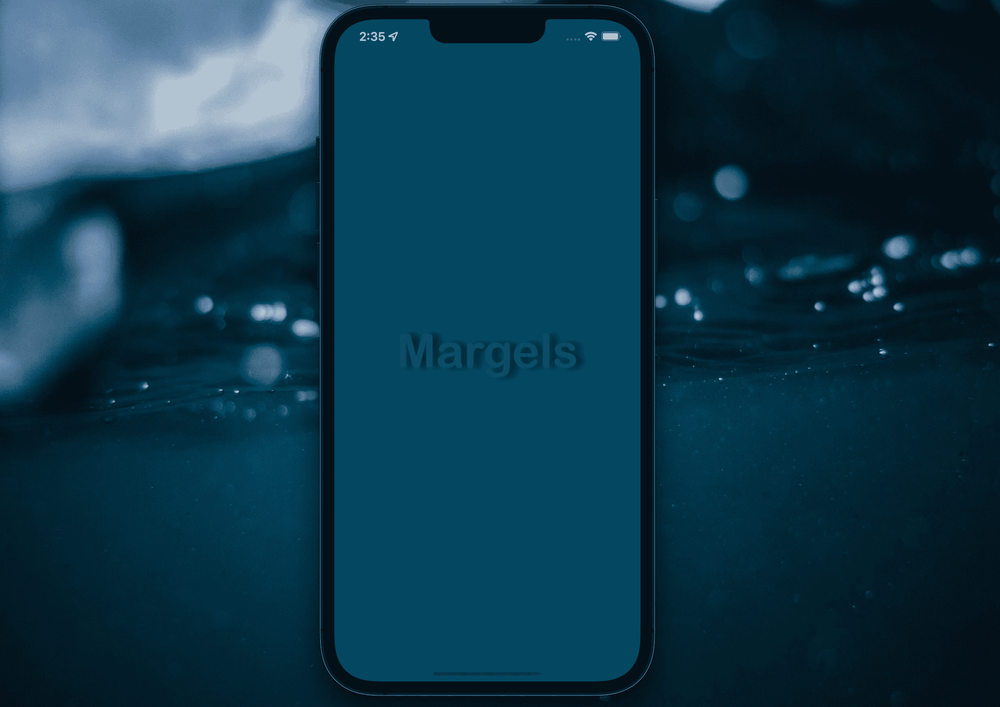

启动屏幕将是你的用户看到的第一个东西，所以创建一个给你的用户留下好的第一印象是很重要的。有什么比围绕你的 logo 的轻游戏更好的呢？

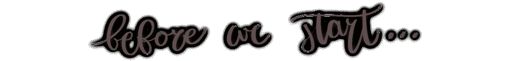

对于今天的教程，我们将使用`shadowOffset`来移动`UILabel`周围的阴影，并创建一个灯光效果。为了更生动的阴影效果，我计划用`UIImageView`上的`shadowPath`制作另一个教程。请继续关注我的内容，以便在它发布时获得更新！

在这里下载启动项目[，让我们开始吧！](https://github.com/Margels/light-Game)

# 第一步:创建灯光效果

不仅仅是影子。也是光。随着假想光线从左向右移动，视图由暗变亮再变暗:

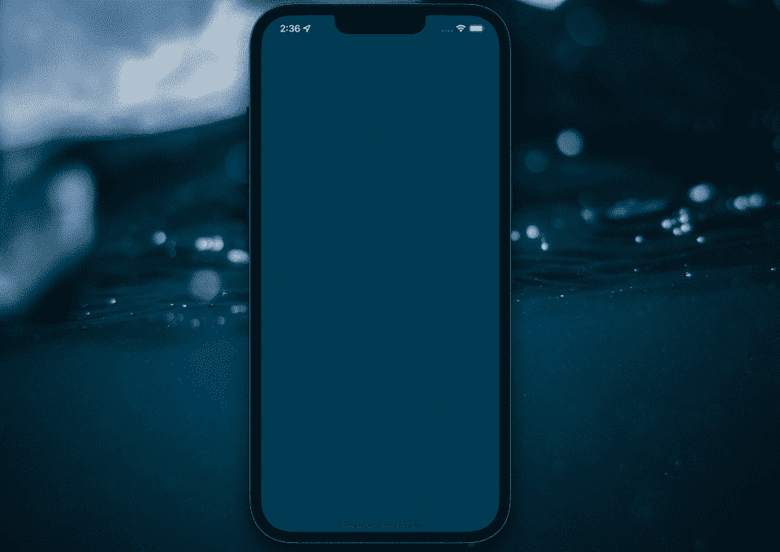

我所做的是在整个视图上放置一个深色的`UIView`，并在整个动画中将它的 alpha 值改为一个较低的值来创建一个灯光效果。

去你的资产和创建你的颜色:我有一个为背景，一个较亮的标签文本，一个强烈的黑暗的我的黑暗的看法，都是相同的蓝色调(从 aqua 婴儿蓝到孔雀蓝)。


我不知道为什么我称它为“黑暗”，而不仅仅是“影子”...我想我那天感觉很戏剧化。

将你的启动屏幕故事板视图控制器设置为与你刚刚为你的黑暗视图创建的颜色相同的背景颜色。

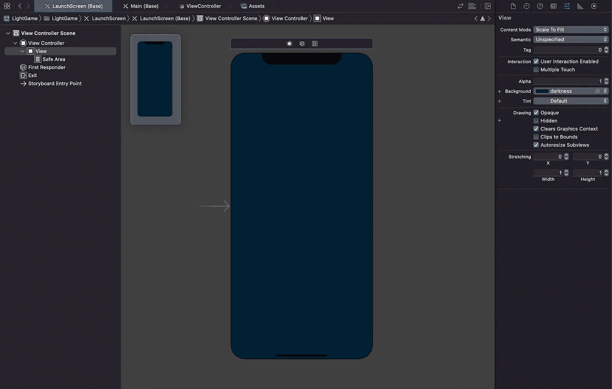

现在移动到你的主故事板，给你的背景视图和标签文本分配相应的颜色。

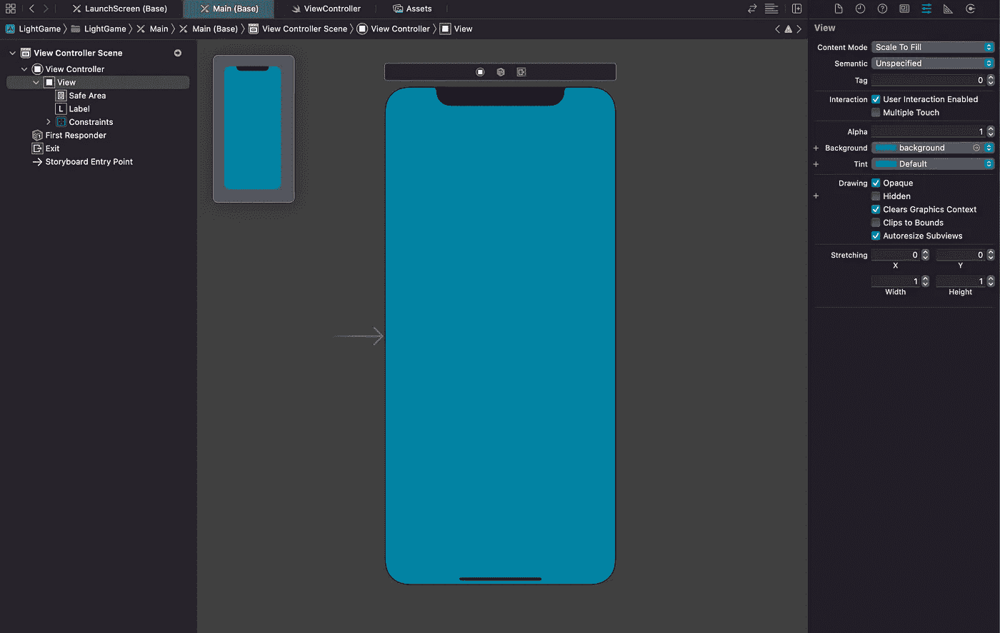

在视图控制器类中，添加以下代码以创建整个屏幕大小的视图:

在`viewDidLoad()`中，添加以下代码行，将视图添加到您的屏幕:

```
// add light effect view
view.addSubview(shadowView)
view.bringSubviewToFront(shadowView)
```

太棒了。现在，让我们到阴影处。

# 步骤 2:创建阴影

将您的标签连接到该类，并为其命名。我简单地称它为`label`,因为它将是一个非常小的项目，然而，你应该使用一个更具体的名字。

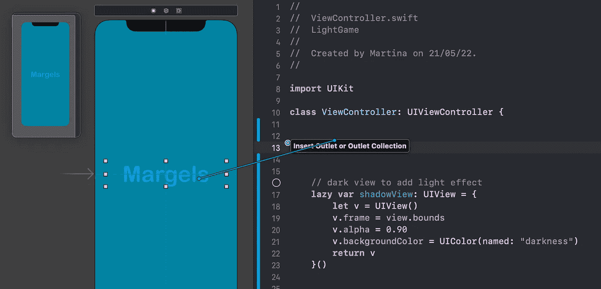

在我的`viewDidLoad()`中，我将添加以下代码来为我的标签创建阴影:

```
// set initial shadow: shadowOffset
label.alpha = 0
label.layer.shadowColor = UIColor.black.cgColor
label.layer.shadowRadius = 5
label.layer.shadowOpacity = 1
// add shadow offset here
```

用你的阴影偏移量替换`// add shadow offset here`。在这个例子中，我们希望我们的阴影完全在右边，所以我将把它的`x` 值设置为 10，把它的`y`值设置为 0，如下所示:

```
label.layer.shadowOffset = CGSize(width: 10, height: 0)
```

其中零表示标签的中心，任何其他值将测量距标签的距离。

如果您不太熟悉这种工作方式，并且仍然有一点困惑，我将尝试用一些图片来表示它。

假设我们有一个对象，在这种情况下，一个标签:


它的中心将是图像中的绿点:

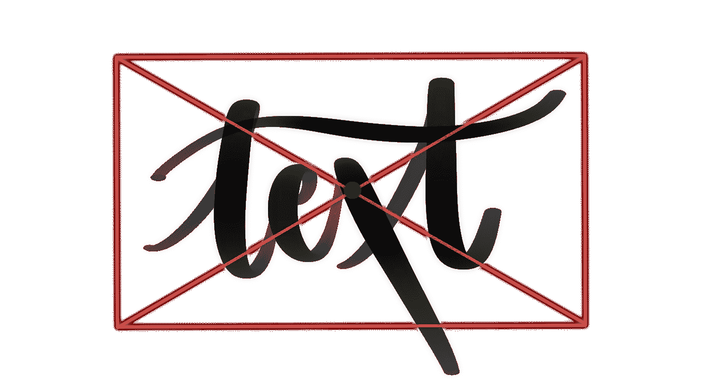

现在，如果我们给它加上阴影:

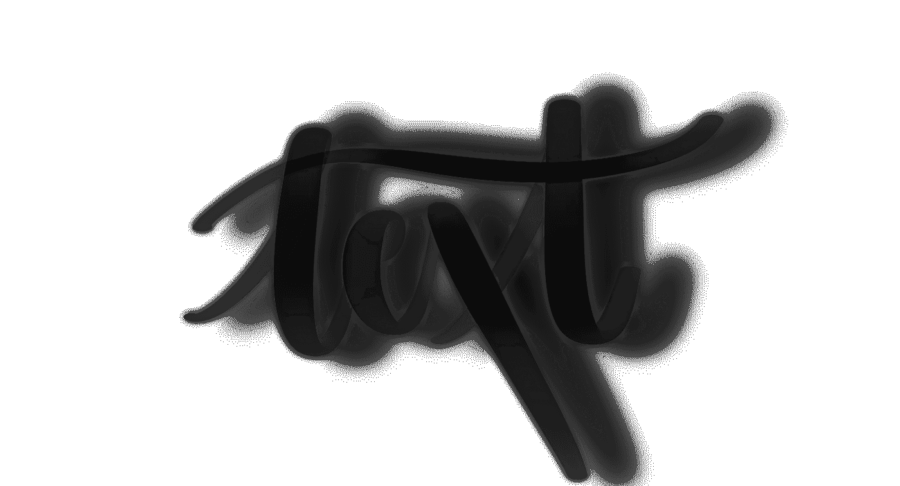

这次我们考虑阴影的中心，而不是标签的中心，我们会注意到它稍微偏向标签的右侧。阴影的中心由图像中的粉红色圆点表示:

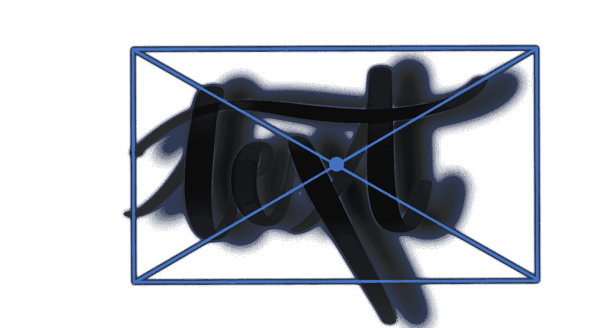

在我们的代码中，阴影中心和标签中心之间的差异是 x 轴上的`10`和 y 轴上的`0`:

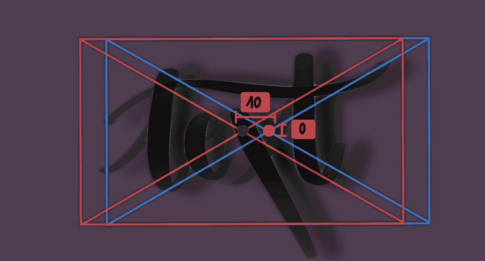

有道理？

总之，阴影偏移量定义了对象中心(我们的标签)和阴影本身中心之间的差异。

回到我们的代码，标签现在被设置为不可见，但是如果它是不可见的(并且阴影视图不在那里)，结果将是这样的:

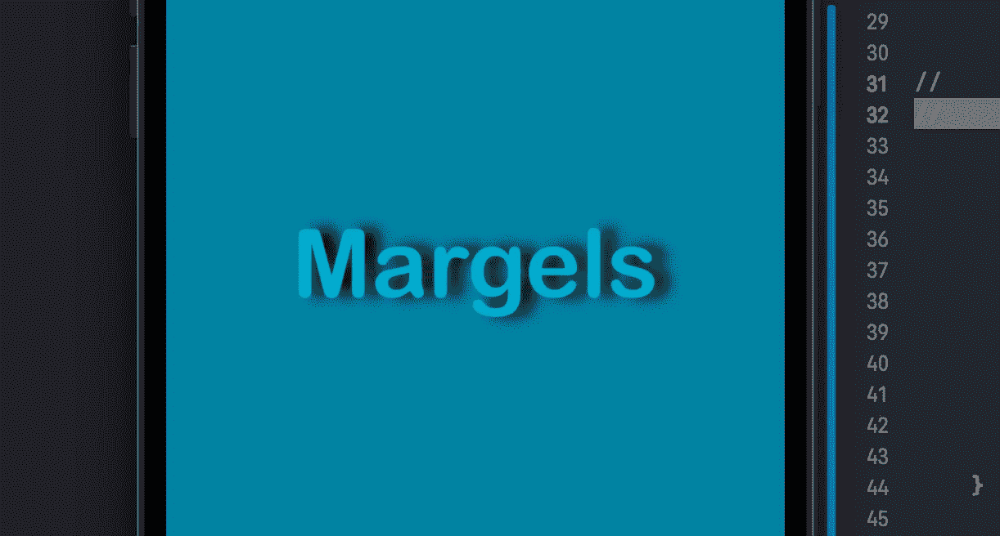

很可爱，对吧？现在，让我们让阴影四处移动！

# 第三步:让影子移动

正如你可能已经猜到的，我们将需要很快改变我们的阴影的偏移点，以使它向左移动一个半圆。由于我们只能设置阴影的水平和垂直偏移，[我们将使用三角学](https://medium.com/better-programming/how-to-make-automatic-trigonometry-calculations-on-swift-e8a49f68879c)来设置我们形状的 x 和 y 值。

该运动将类似于此:

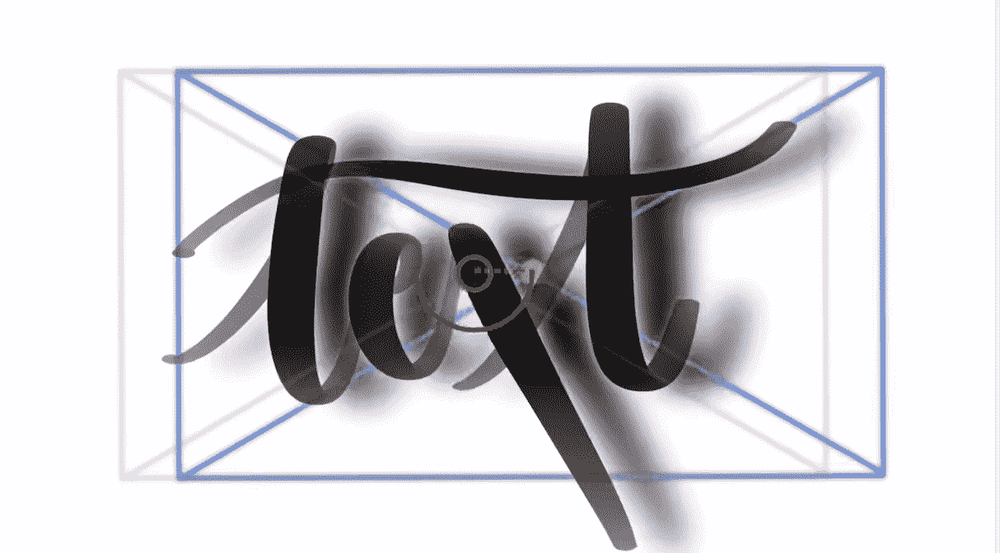

粉红色的点，即阴影的中心，围绕标签的中心做圆周运动，用绿色圆圈表示。

现在，我们知道从标签中心到阴影中心的当前距离是`10`，这意味着假想圆的半径也将是`10`。

阴影的中心会像这样向下移动:

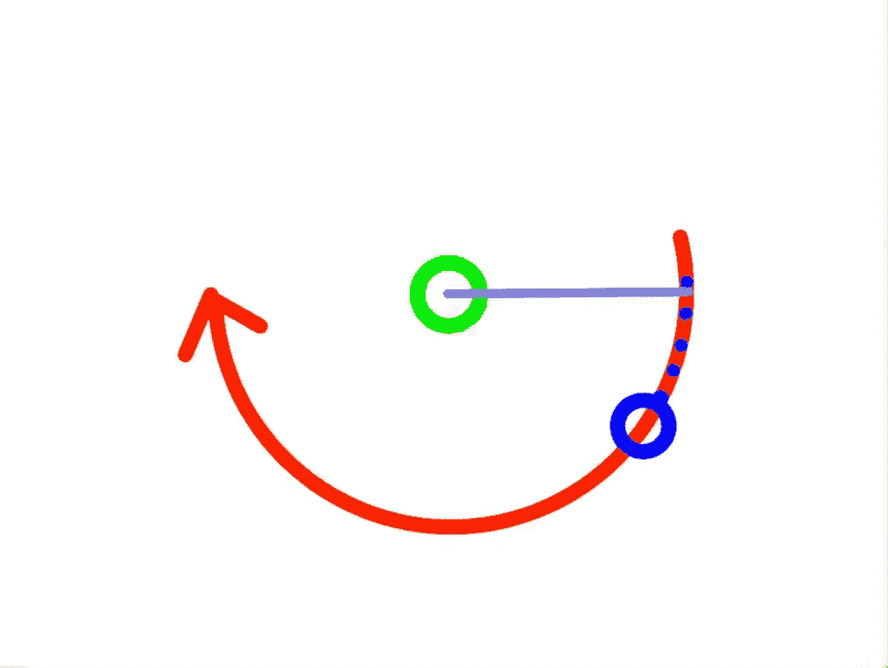

阴影的中心沿着红线移动，并停在蓝色圆圈处。

如果我们建立一个三角形，使用该线段作为斜边，x 轴作为相邻的线段，我们可以使用三角学来找到 x 和 y 值，以移动我们的阴影中心，就像我们喜欢围绕我们的圆一样！

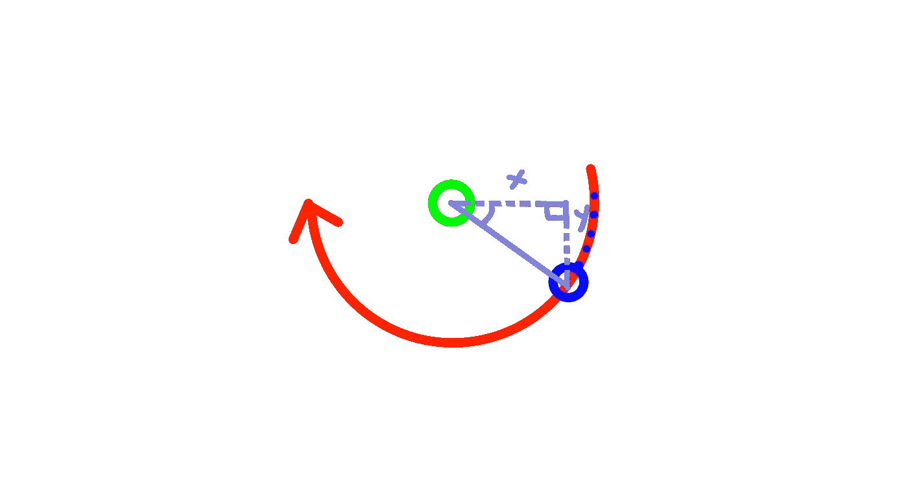

如果你没有得到它，不要担心。消化这个理论需要一点时间。另外，我写了一个函数，可以帮你做所有的计算！你需要做的就是定义其中一个线段的长度(在这个例子中，我们的斜边，它总是圆的半径)，它的长度(在我们的例子中，它将是`10`)，以及它与我们的 x 轴(靠近绿色圆的那个)形成的角度。

将以下函数复制粘贴到您的代码中，以自动进行三角计算:

现在，在我们继续我们的三角学之前，创建一个名为`rightShadow()`的函数，其中你将:

*   增加你的标签的可见性(它的 alpha 组件目前设置为`0`，记得吗？)
*   降低阴影视图的可见性，因为光线越来越强，阴影就会显现出来
*   完成后调用下一个函数来定义阴影的新中心

代码如下:

是的，`rightHalfBottomShadow()`是下一个函数的名字…我不知道那天我是怎么了，竟然要取这么难听的名字。但是，嘿，当你调整对象的名字和东西时，你也可以自由地改变它们！

现在，如你所见，标签的 alpha 还不是`1`。我将把它添加到下一个动画中，使过渡更加平滑。我还将进一步降低我们的`shadowView`的可见度，让它看起来越来越亮。但最重要的是，我会使用我们的三角计算器功能！

所以，现在我们的假想圆中的假想三角形(哇，这可太难想象了)的角度是…零度。因为它是平的。这就是为什么`x`线段等于`10`(正如我们的斜边一样，因为三角形是平的)而`y`线段等于`0`。但是，如果我们把视角降低一点，再往左一点，情况就会改变。

我们知道从圆心到圆内任何一点的距离都是一样的，所以那就是`10`，我们的半径。虽然`x`的值可以改变，但是我们的斜边，也就是我们的半径，不会改变大小。这意味着我们已经有了函数的两个参数:T9 和 T10。那么，我们的`angle`呢？

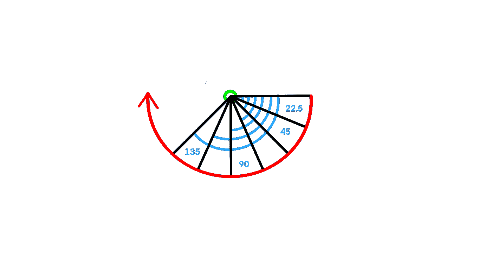

我在 135 度上创建了 7 个点来定义我的阴影的圆周运动。

根据你想如何移动阴影，我建议你在圆圈周围创建尽可能多的点，以避免动画急转弯和运动看起来不那么圆。对我起作用的是每 22.5 增加一个点，所以我会在圆的第一个四分之一处有四个点(度数`22.5`、`45`、`67.5`、`90`)，在另一边有两个点，因为我让我的动画停在了度数 135。

摆弄你的动画持续时间，延迟，阴影视图阿尔法组件等。，以获得期望的结果。这是我的七个功能:

你所需要做的就是在`viewDidLoad()`中调用`rightShadow()`就大功告成了！

您的结果应该与此类似:


我是说，谁不会下载这样的应用呢？

这就是我们如何拥有美丽的启动屏幕！如果你能走到这一步，那就太好了！

你喜欢这个教程吗？它和你的项目合作得好吗？

```
**Want to Connect?** Follow me on…
❤️ [YouTube](https://www.youtube.com/channel/UC5hqYiHxie458KSO1PAnA8Q)
💖 [Dribbble](https://dribbble.com/margelss)
💜 [Instagram](https://www.instagram.com/itsmargels/)
💙 [Ko-Fi](https://ko-fi.com/margelss)
🖤 [GitHub](https://github.com/Margels)
```