# 如何用 Nuxt 和 Prismic 创建一个超快的现代博客

> 原文：<https://betterprogramming.pub/create-a-blazing-fast-modern-blog-with-nuxt-and-prismic-7d19935d849c>

## 让我们用 Vue，Nuxt，和 Prismic 建立一个现代博客

让我们用 [Vue](https://vuejs.org/) 、 [Nuxt](https://nuxtjs.org/) 和 [Prismic](https://prismic.io/) 来建立一个现代博客。

我选择 Vue 和 Nuxt 是因为和它们一起工作很有趣。它们易于启动，提供大量现成的基本功能，并提供良好的性能。

Nuxt 是一个用于服务器端渲染的 Vue 框架。它是 Vue 生态系统中的一个工具，您可以使用它从头开始构建服务器渲染的应用程序，而不会受到将 JavaScript 应用程序渲染到服务器的底层复杂性的困扰。

# 为什么是 Nuxt？

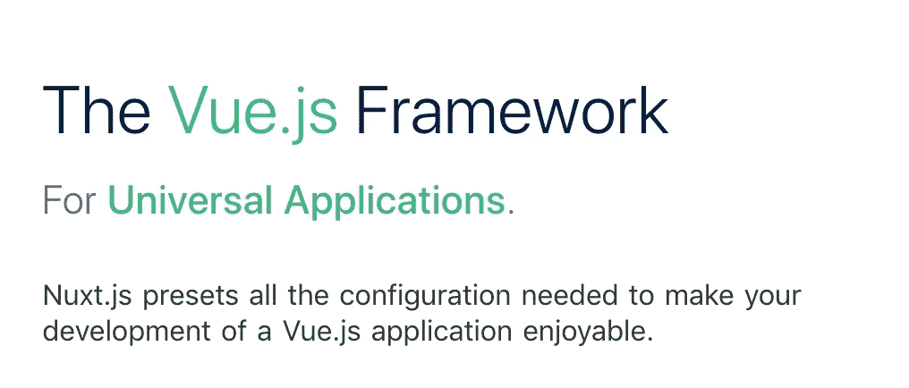

[https://nuxtjs.org/](https://nuxtjs.org/)

js 是我们所说的通用应用程序的实现。

它因 [React](https://reactjs.org/) 而出名，但目前越来越受许多客户端库的欢迎，如 [Angular](https://angular.io/) ，Vue.js 等。

通用应用程序是一种在服务器端呈现组件的应用程序。

js 提供了一种简单的方法，首先从任何数据源中检索异步数据，然后以 HTML 的形式呈现并发送给浏览器。

在 SEO 方面，Google bot 爬虫将获得渲染的内容并对其进行适当的索引。除此之外，事实上，你的内容可以预先呈现，并准备提供，增加了你的网站的速度。这样，它也提高了你的搜索引擎优化。

Nuxt 生态系统是一个永无止境的便捷工具和软件包流。

# 虚拟 DOM 和最短加载时间确保了快速渲染

Vue.js 和核心模块、路由器和 Vuex 一起压缩只有 30 KB 左右。

最小的内存占用提供了较短的加载时间，这意味着更高的用户速度和更好的谷歌爬虫速度标准排名。

# 虚拟 DOM

Vue.js 也从 ReactJS 获得了灵感，从 2.0 版本开始实现了一个虚拟 DOM。虚拟 DOM 基本上是一种在内存中生成 DOM 版本的方法，每次您更改一个状态并将其与实际 DOM 进行比较，因此您可以只更新需要更新的部分，而不是重新呈现所有内容。

# 标杆管理

Vue.js 提供了一些非常好的整体性能，您可以在以下基准测试中看到:

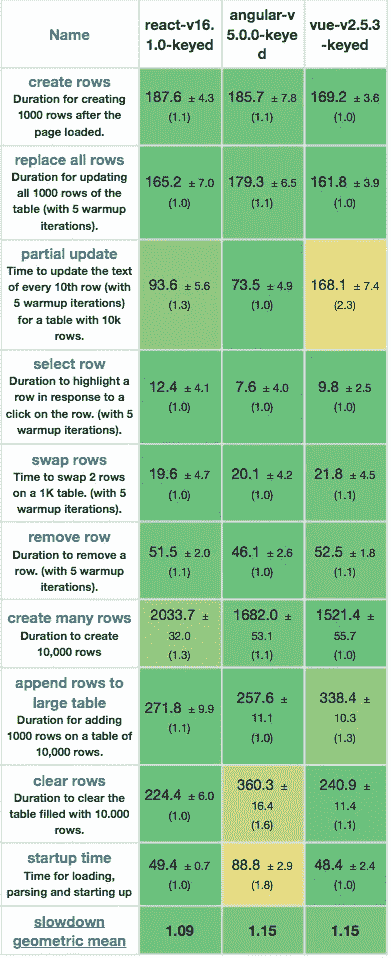

来源:[Stefan Krause 的第三方性能指标评测](https://www.stefankrause.net/js-frameworks-benchmark7/table.html)

以毫秒为单位的持续时间标准差(减速=持续时间)。

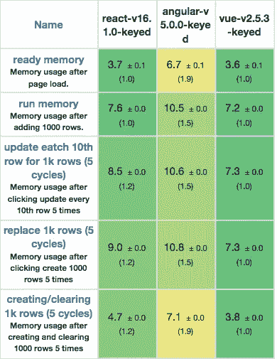

来源:[Stefan Krause 的第三方基准](https://www.stefankrause.net/js-frameworks-benchmark7/table.html)

以 MB 为单位的内存分配。

# 什么是 Prismic，为什么与它相关？

Prismic 是个无头 CMS。这意味着你在你自己的服务器上编辑你的模板，但是后端运行在云上。这带来了一些优势，比如能够使用 API 将您的内容提供给外部应用程序。

想象一下，你建立了一个博客，不是为你自己，而是为其他不是开发者的人，这样他们可以编辑他们的内容。您希望完全控制布局(使用 Vue 构建)，但是您不希望每次为新的博客文章创建新文件时都经历繁琐的部署过程。

这就是在你的应用中包含一个无头内容管理系统(CMS)的用处所在——所以你不必处理它。

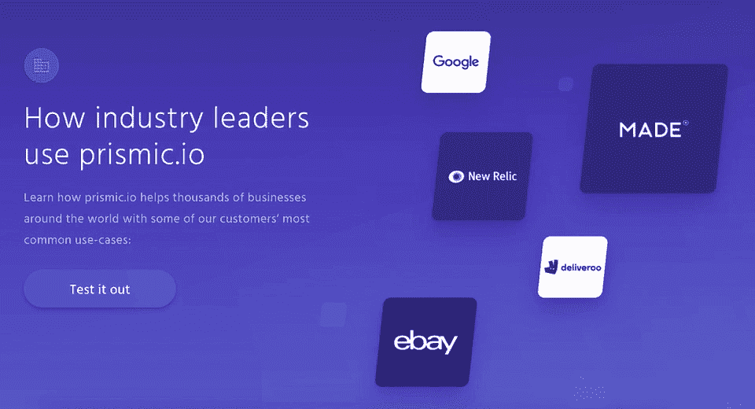

【https://prismic.io/usecases 号

# 无头 CMS 和普通 CMS 的区别

像 Wordpress 这样的传统 CMS 会提供管理内容的编辑工具。但是，它也会完全控制你网站的前端。内容显示的方式在很大程度上是在 CMS 中定义的。

无头内容管理系统(headless content management systems)，或称[无头 CMS，](https://en.wikipedia.org/wiki/Headless_content_management_system)是一个仅支持后端的内容管理系统，从头开始构建为一个内容存储库，使内容可以通过 RESTful API 访问，并显示在任何设备上。

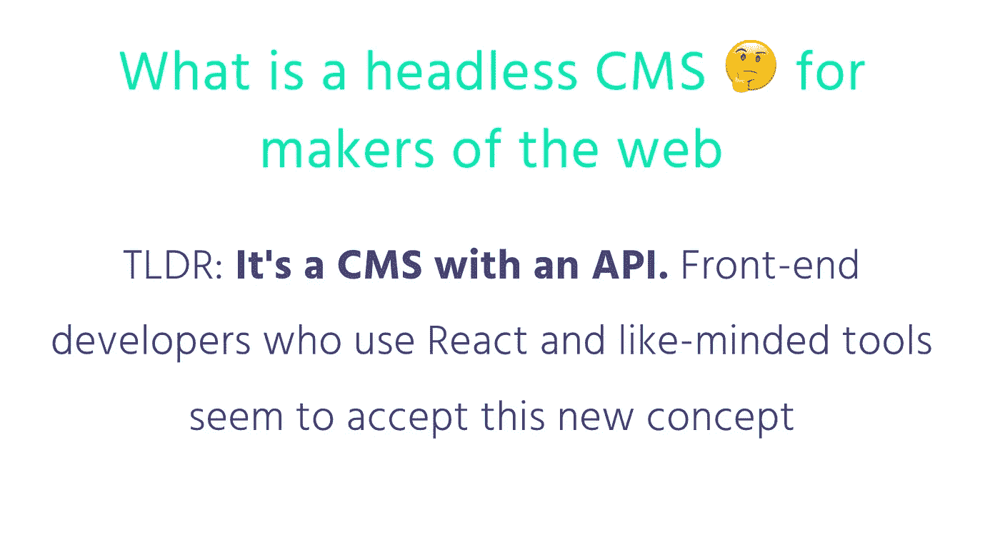

[如果你想了解更多，Prismic 写了一篇关于无头 cms 的清晰文章](https://prismic.io/headless-cms-intro)

我选择了 [Prismic](https://prismic.io/) 作为我的无头 CMS——它的设置超级简单，开箱即用，功能强大。

# 我为什么选择 Prismic

*   易于设置。我只花了几个小时就设置好了环境并投入生产。
*   [实时预览模式](https://user-guides.prismic.io/preview/how-to-preview-your-content/preview-a-document)。这使得编辑可以在他们的网站和应用程序上预览他们的内容——无论是草稿，还是计划稍后发布的内容。例如，这使得营销团队可以在特定的日期和时间全面预览他们的网站。这对于管理即将发布的博客和预览编辑非常有用。
*   [切片](https://user-guides.prismic.io/content-modeling-and-custom-types/field-reference/slices)。切片是可重用的组件。在模板中启用切片将允许作者选择在他们创建的内容中添加文本部分、图像或引用。它让作者可以自由地撰写博客文章，根据他们的需要对这些选项/内容块进行交替和排序。
*   简单而全面的[文档](https://prismic.io/docs/rest-api/basics/introduction-to-the-content-query-api)。
*   强大的社区，例如 Google、New Relic、Ebay 等。，[都在用 Prismic](https://prismic.io/we-deploy-everyday-and-this-is-how) 。
*   友好的自由层。

# 开始设置 Prismic

前往 Prismic 网站并[创建一个新用户](https://prismic.io/signup)。

在 Prismic 上创建一个新用户后，我们应该会看到类似这样的内容:

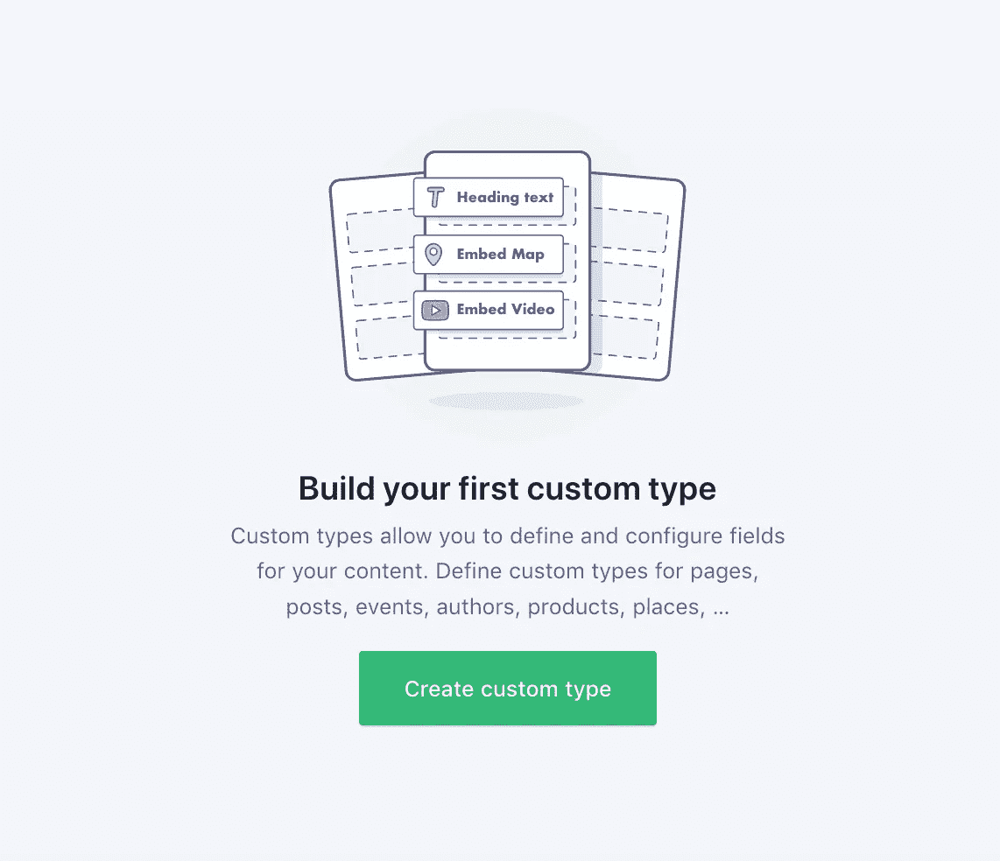

构建我们的自定义类型

自定义类型是我们为营销或写作团队设置的内容模型。营销团队将用内容(文本、图像等)填充它们。)，我们将能够通过 Prismic 的 API 检索这些内容。

有两种自定义类型—单一类型和可重复类型。

*   单一类型用于只有一个实例的页面(主页、定价页面、关于我们的页面)。
*   可重复的自定义类型是模板，在多个文档中使用(即博客文章页面、产品页面、您网站的登录页面)。

我们想要一篇博文。事实上，我们想要很多博客文章，所以它应该是一个可重复的类型。

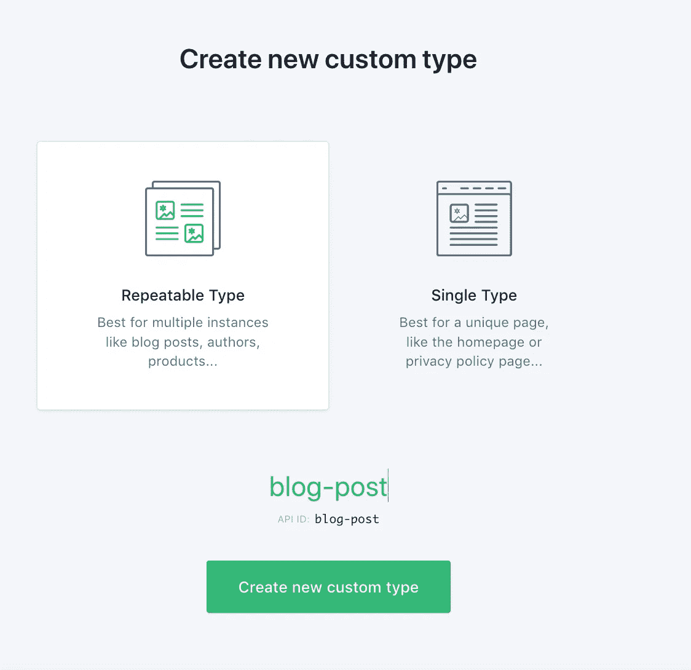

选择类型

# 创建可重复类型的博客文章

我们现在应该在构件编辑器中。Prismic 给了我们很多选择。如果你看右边，你会看到一个有很多选项的边栏——图片、标题、相关内容和 SEO 选项。

让我们用 Prismic builder 创建一个可重复使用的博客帖子。我们的博客将包括标题和正文。

首先添加以下字段:

*   UID 字段
*   标题字段
*   富文本字段

每次添加字段时，您都可以为其定义格式选项。UID 字段是一个唯一的标识符，可以专门用于创建 SEO 和用户友好的网站 URL。

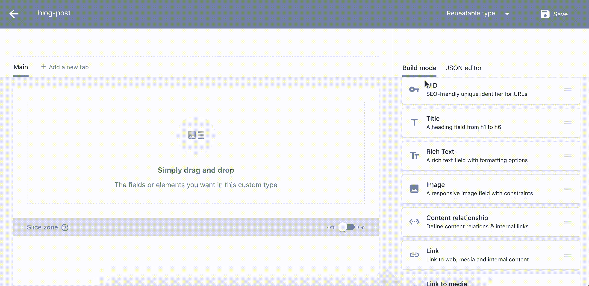

创建我们的博客文章标题

别忘了保存我们的进度！

确保您为博客文章准备了以下字段:

*   `uid`
*   `blog_post_title`
*   `blog_content`

到目前为止，我们已经有了可重用博客文章的布局。

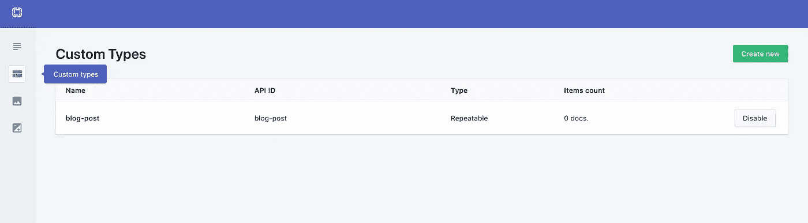

自定义类型菜单

是时候写一篇博文了。转到左边的内容选项卡。

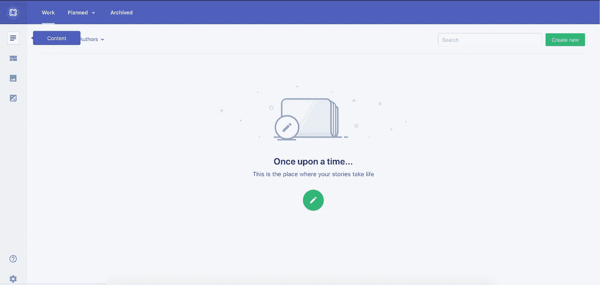

内容选项卡

这将把我们带到我们之前构建的博客布局。为`**uid**`、`**post_title**`、**、**、`**blog_content**`、**、**模块**插入所需文本。**

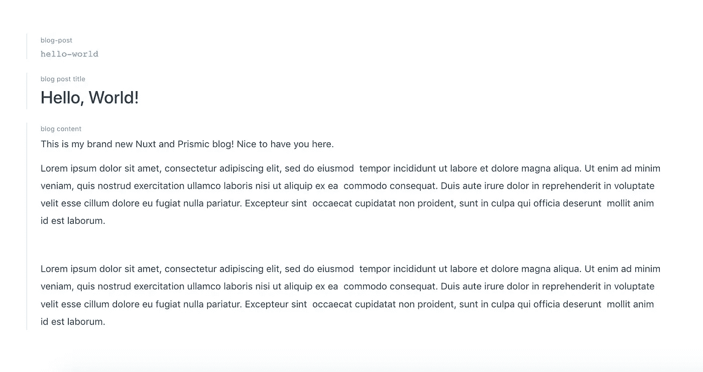

用 Prismic 布局生成器构建我们的页面

太好了！我们现在已经建立了我们的博客帖子。看右上方；我们应该会看到一个`save`按钮。点击此处保存我们的进度。保存后，我们可以发布我们的内容。发布内容使得它可以通过 API 供我们的前端使用。

# 开始一个新的 Nuxt 项目

打开您的终端并运行这个命令。确保您已经安装了 [npx](https://www.npmjs.com/package/npx) (默认随 npm +5.2.0 一起提供)。

`$ npx create-nuxt-app vue-nuxt-prismic-blog`

Nuxt 安装程序方便地询问我们的偏好并创建项目。

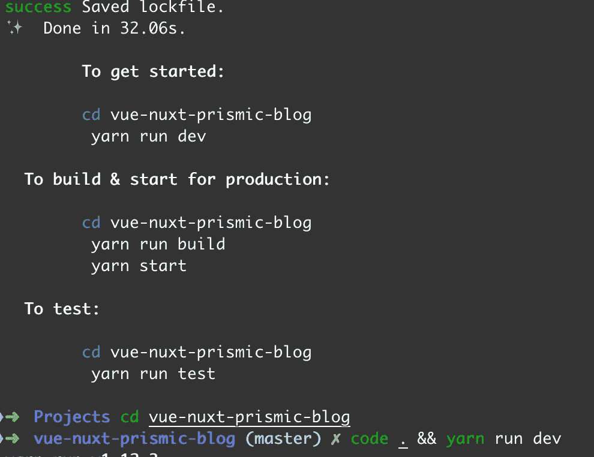

我们应该以如下所示的项目结构结束:

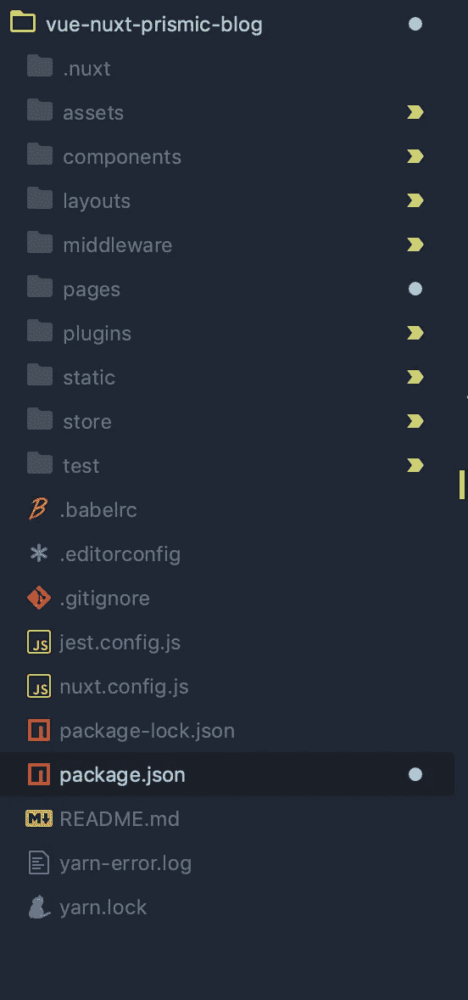

Nuxt 项目结构

让我们现在建立我们的博客。我们需要从 Prismic 获取博客内容。幸运的是，Prismic 给了我们很多方便的工具。

安装 Prismic JavaSCript 包

`prismic-javascript`包包含许多实用程序，包括从我们的 API 获取。`prismic-dom`为我们提供了帮助函数来呈现标记。

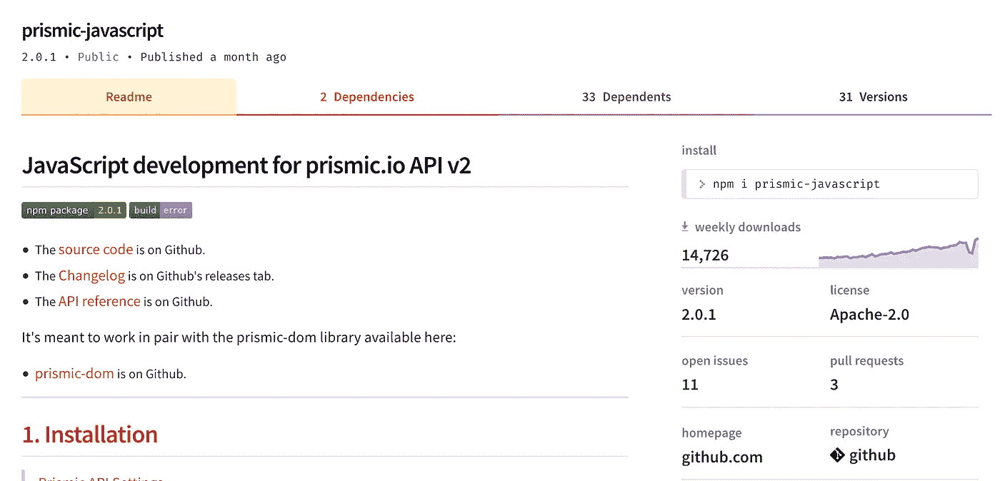

https://www.npmjs.com/package/prismic-javascript 的普里斯米克·NPM 套餐

让我们在根目录下创建`prismic.config.js`文件。这是我们放置 Prismic 相关配置的地方。

**prismic.config.js**

注意:确保使用与您的博客相关联的 API 端点。

打开`pages/index.vue`文件，用我们的配置导入 Prismic 库。

**页数/index.vue**

首先，我们用端点初始化我们的 API。然后，我们查询 API 来返回我们的博客文章。我们可以指定语言和文档类型。

Prismic API 是基于承诺的，这意味着我们可以调用 API 和 chain promises。承诺万岁。我们还可以使用`async/await`语法来解析承诺。

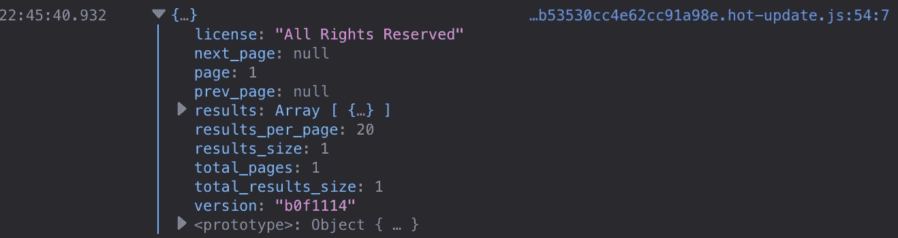

棱镜反应

我们现在需要做的就是呈现标记。

给你。我们已经成功地从 Prismic API 中获取了我们的博客文章。

要应用样式—抓取一个副本并将其放在 Vue 组件的`style`部分:

如果我们打开我们的应用程序，这就是我们应该看到的。

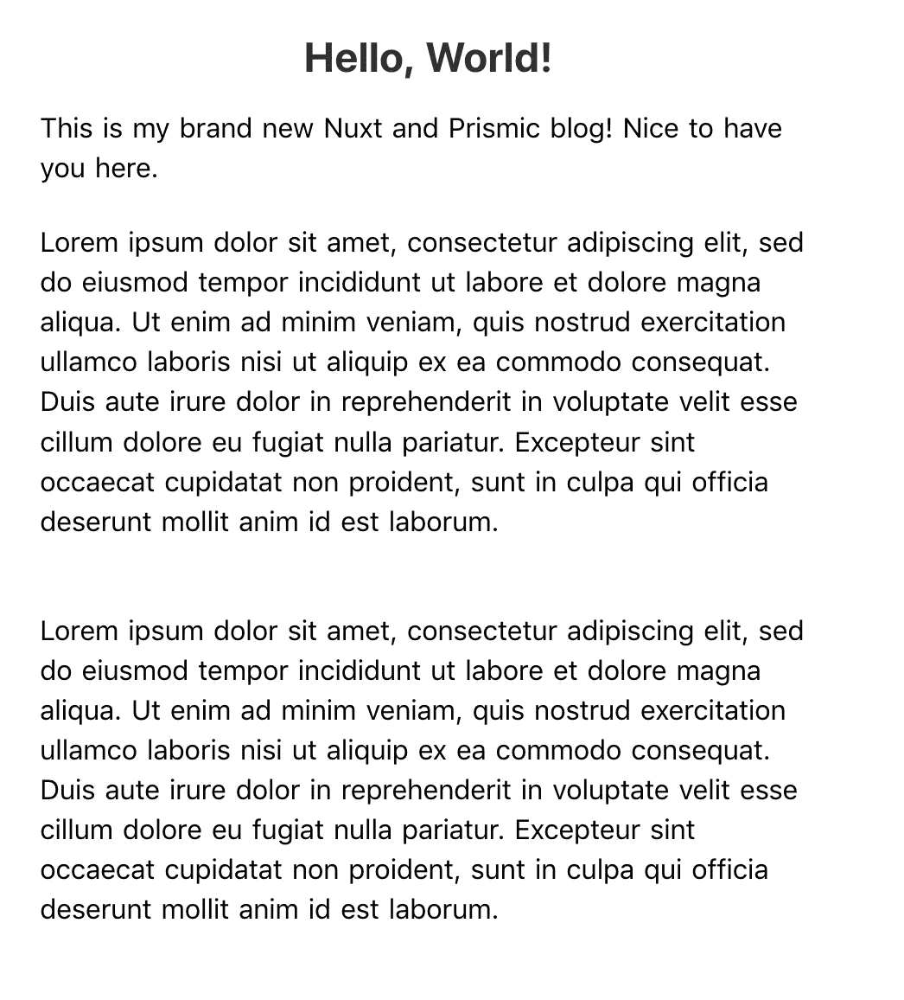

最终结果

瞧啊。我们有一个现代的服务器端渲染博客，用 Nuxt 和 Prismic 构建。

我们几乎没有触及表面。我们可以用 Nuxt 和 Prismic 做更多的事情。我最喜欢的 Prismic 功能是切片和实时预览。我鼓励你去看看！

Slices 将允许您创建内容更丰富的动态页面，而实时预览将允许您即时预览您在网页上的编辑。

[切片](https://intercom.help/prismicio/content-modeling-and-custom-types/field-reference/slices)

例如，在这个项目中，我们只做了一个帖子。然而，如果我们在 Prismic 中创建了很多帖子，那么 Nuxt.js 的一个真正伟大之处就是它会自动为你创建路线。

在幕后，它仍然使用 [Vue 路由器](https://router.vuejs.org/en/)来实现这一点，但是您不再需要手动创建路由配置。取而代之的是，您使用文件夹结构——在`pages`文件夹中——来创建您的路由。但是你可以在 Nuxt.js 中的[关于路由的官方文档中读到这些。](https://nuxtjs.org/guide/routing)

如果你正在考虑推出你的博客，这本“ [*主要内容策略*](https://amzn.to/2YAdV6c) ”的书对我制定一个可靠的博客策略帮助很大。

## 感谢阅读！

这是我们博客的存储库:

 [## we share hoodies/nuxt-prismic-blog

### 在 GitHub 上创建一个帐户，为 wesharehoodies/nuxt-pris mic-blog 的发展做出贡献。

github.com](https://github.com/wesharehoodies/nuxt-prismic-blog) 

# 资源

*   [官方资源](https://github.com/nuxt-community)