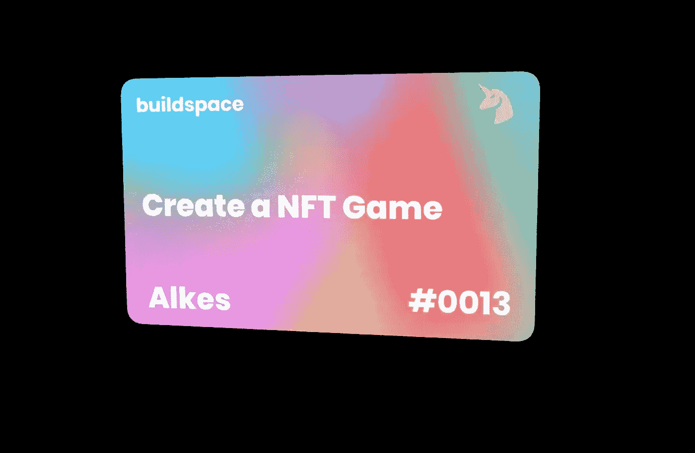

# 用 Solidity，Web3，和 Vue.js 创建一个区块链游戏

> 原文：<https://betterprogramming.pub/create-a-blockchain-game-with-solidity-web3-and-vue-js-c75eed4b49a6>

## 使用以太坊区块链建造一个分散的游戏


[Zoltan·塔斯](https://unsplash.com/@zoltantasi?utm_source=medium&utm_medium=referral)在 [Unsplash](https://unsplash.com?utm_source=medium&utm_medium=referral) 上拍照

在本文中，我们将看到使用以太坊公共区块链创建分散式游戏的一步一步的方法:

*   建筑工人
*   固态
*   vue . j

在下一部分中，我们将更多地关注前端，但是首先，我将简单解释一下可靠性以及如何将它部署到 Rinkeby `testnet`。

这是我的第一篇文章，我觉得缺乏关于 Web3 和 Vue.js 的信息，因为它也需要一些关注。

在我们开始之前，我想赞扬 buildspace 制作这个项目。我加的是 Vue.js 部分。如果您是这个领域的新手，请随时查看它们！他们有最好的学习工具和社区！

因此，在我们开始之前，让我们谈谈如果您刚刚开始进入这个领域，您真正需要的是什么:

*   你需要安装 MetaMask 并在 Chrome 中启用扩展
*   元掩码的基本知识
*   关于坚固性的基本知识
*   关于 JavaScript 和 Vue.js 的知识。

# 我们今天要建造什么

我们将构建一个基于区块链的游戏(受`buildspace`启发)，在这里你可以铸造你的角色并与老板战斗！

你可以在这里查看最终结果:

*   [App](https://epic-game-buildspace-a2c4ixjyk-zlayine.vercel.app/)
*   [GitHub 库](https://github.com/zlayine/epic-game-buildspace)

# 固态

对于 Solidity 的初学者，我建议你[遵循 buildspace](https://www.google.com/search?q=buildspace+solidity&oq=buildspace+solidity&aqs=chrome..69i57.1665j0j7&sourceid=chrome&ie=UTF-8) 。

我们的智能合同将允许我们创造角色，铸造我们选择的角色，然后用它打一个老板！简单吧？

这是我们的`MyEpicGame.sol`智能合同:

对于`Base64.sol`文件，可以在这里找到[。](https://github.com/zlayine/epic-game-buildspace/blob/master/contracts/libraries/Base64.sol)

这基本上为我们提供了一些帮助函数，让我们将任何数据编码成 Base64 字符串——这是将一些数据编码成字符串的标准方式。

# 试验

部署前。我们应该检验合同以确保我们能使用它。

在根目录下新建一个名为`[test](https://buildspace.so/)` 的文件夹。该文件夹可以包含客户端和以太坊测试。

在`test`文件夹中添加一个新的 JS 文件，名为`test.js`。该文件将在一个文件中包含合同测试。你可以创建你自己的，我创建一个简单的测试文件:

要运行测试:

```
npx hardhat test
```

# 部署(到 Rinkeby 测试网络)

让我们在 hardhat 项目的 scripts 文件夹中创建一个新文件`deploy.js`。里面有这段代码。

这将从我们的构造函数中创建 3 个默认角色和一个 boss。

要部署合同，请运行以下命令:

```
npx hardhat run scripts/deploy.js --network rinkeby
```

我们完成了坚实的部分。现在我们要做一个前端接口与之交互。

# 前端 Vue.js

我不会在这里分享 CSS，请随时查看我的 GitHub repo。

让我们从创建项目开始:

```
vue create frontend
cd frontend
```

我们将使用 ethers 进行 Web3 交互，使用 Vuex 进行状态管理。以下是安装它们的方法:

```
npm install --save vuex ethers
```

好了，现在项目准备开始了！让我们来谈谈制作前端应用程序的步骤:

*   连接用户的钱包
*   选择一个角色
*   攻击老板

# 连接钱包

为了让用户与我们的应用程序进行交互，他们必须安装 Metamask 并选择 Rinkeby 网络。但是我们会在最后一部分处理它。

我们的`App.vue`模板应该是这样的，有一个连接按钮，它将在 Metamask 中打开一个提示，允许我们的应用程序请求用户接受的事务:

connect 按钮有一个 click 事件，该事件将向我们的商店发送一个动作(Vuex)，我们稍后将讨论它—现在，让我们看一下我们的商店结构:

状态对象具有以下属性:

*   `account`:我们关联账户的保存位置
*   `error`:显示错误
*   `mining`:用于检查事务是否被挖掘的布尔值
*   我们选择的角色将被保存在哪里
*   `characters`:默认字符的保存位置
*   `boss`:会和我们性格打架的老板
*   `attackState`:攻击 boss 时，在挖掘交易的同时状态发生变化
*   `contract_address`:我们将合同部署到 Rinkeby 网络时返回的地址。

并且不要忘记在部署契约之后从构建中导入`MyEpicGame.json`。我们将需要它为我们的 web3 电话与合同在区块链。

我们为状态创建了 getters 和 setters(突变)。现在让我们开始行动吧。

首先，我们有之前讨论过的`connect`行动，现在我将向大家详细介绍:

首先，我们在这里检查是否安装了元掩码:

```
const { ethereum } = window;
if (!ethereum) {
  commit("setError", "Metamask not installed!");
  return;
}
```

如果一切正常，我们检查用户是否已经授予我们的应用程序访问 Metamask 的权限，然后我们只需连接帐户，如果没有，它返回 0，即找到的帐户数。这意味着我们必须向用户请求访问权限:

```
if (!(await dispatch("checkIfConnected")) && connect) {
	await dispatch("requestAccess");
}
```

注意:`connect`变量帮助我们知道它是一个被点击的按钮，还是实际上是调用它的挂载函数

在我们检查了选定的网络后，如果它不是 Rinkeby 网络，我们会发送一个请求来更改它:

```
await dispatch("checkNetwork");
```

找到帐户后，我们将帐户提交给突变，以将其保存在我们的状态中:

```
// in checkIfConnected action
commit("setAccount", accounts[0]);
```

这就是我们的连接行动。

现在，我们将创建一个操作来获取默认字符，供用户从智能合约中选择:

```
async getCharacters({ state, commit, dispatch }) {
  try {
    const connectedContract = await dispatch("getContract");
    const charactersTxn = await connectedContract.getAllDefaultCharacters();
    const characters = charactersTxn.map((characterData) =>
      transformCharacterData(characterData)
    );
    commit("setCharacters", characters);
  } catch (error) {
    console.log(error);
  }
},
```

为了从我们的契约中调用一个函数，我们需要通过创建一个动作来获取契约，并返回它。我们提供一个提供者、契约 abi 和签名者:

```
async getContract({ state }) {
  try {
    const { ethereum } = window;
    const provider = new ethers.providers.Web3Provider(ethereum);
    const signer = provider.getSigner();
    const connectedContract = new ethers.Contract(
      state.contract_address,
      MyEpicGame.abi,
      signer
    );
    return connectedContract;
  } catch (error) {
    console.log(error);
    console.log("connected contract not found");
    return null;
  }
},
```

然后，我们可以调用智能契约中返回默认字符的函数，并在函数的帮助下映射每个字符，该函数将字符数据转换为 JavaScript 可用的对象:

```
const charactersTxn = await connectedContract.getAllDefaultCharacters();
const characters = charactersTxn.map((characterData) =>
  transformCharacterData(characterData)
);
```

`transformCharacterData`功能添加在 [Vuex 之上。存储](http://Vuex.Store)初始化。它将`hp`、`attackDamage`从`bigNumber`转换成可读的数字:

```
const transformCharacterData = (characterData) => {
  return {
    name: characterData.name,
    imageURI: characterData.imageURI,
    hp: characterData.hp.toNumber(),
    maxHp: characterData.maxHp.toNumber(),
    attackDamage: characterData.attackDamage.toNumber(),
  };
};
```

现在让我们回到我们的`App.vue`来设置我们的视图并创建一个名为`SelectCharacter`的组件。

修改我们的`App.vue`，这样当用户连接他们的钱包时，我们在我们的商店中保存了一个帐户，然后他可以从我们之前获取的默认值中选择角色。

向我们的 connect div holder 添加一个`v-if`，并在视图中添加我们的 character select 组件:

```
<div class="connect-wallet-container" v-if="!account">
  "
    alt="Monty Python Gif"
  />
  <button class="cta-button connect-wallet-button" @click="connect">
    Connect Wallet To Get Started
  </button>
</div>
<select-character v-else-if="account" />
```

对于帐户，它实际上是一个从我们的存储中返回的计算变量:

```
computed: {
  account() {
    return this.$store.getters.account;
  },
}
```

来到我们的`SelectCharacter`组件:

一旦组件被安装，我们必须获取`defaultCharacters`并在视图中显示它们。

对于每件商品，我们都有一个点击事件，该事件将根据选择的`characterId`或索引向我们名为`mintCharacterNFT`的商店发送一个新的操作。让我们将此操作添加到我们的商店:

```
async mintCharacterNFT({ commit, dispatch }, characterId) {
  try {
    const connectedContract = await dispatch("getContract");
    const mintTxn = await connectedContract.mintCharacterNFT(characterId);
    await mintTxn.wait();
  } catch (error) {
    console.log(error);
  }
},
```

就像之前我们调用负责铸造的智能合约函数一样。

但是这里有一个问题，我们没有在我们的州设置我们的新角色？别担心，如果你记得我们在智能契约中的功能，一旦角色被铸造出来，我们就有一个事件。

所以我们现在要做的就是听那个事件，从中设定角色。让我们创建一个操作来设置事件侦听器:

```
async setupEventListeners({ state, commit, dispatch }) {
  try {
    const connectedContract = await dispatch("getContract");
    if (!connectedContract) return;
    connectedContract.on(
      "CharacterNFTMinted",
      async (from, tokenId, characterIndex) => {
        console.log(
          `CharacterNFTMinted - sender: ${from} tokenId: ${tokenId.toNumber()} characterIndex: ${characterIndex.toNumber()}`
        );
        const characterNFT = await connectedContract.checkIfUserHasNFT();
        console.log(characterNFT);
        commit("setCharacterNFT", transformCharacterData(characterNFT));
        alert(
          `Your NFT is all done -- see it here: <https://testnets.opensea.io/assets/$>{
            state.contract_address
          }/${tokenId.toNumber()}`
        );
      }
    );

  } catch (error) {
    console.log(error);
  }
},
```

要监听 web3 中的事件，我们只需使用`contract.on("event_name", callback)`。

在事件内部，我们检查 NFT 用这个函数`checkIfUserHasNFT`选择的用户，并把它提交给我们的状态。如果用户希望看到 NFT 链接，该警告只是附加信息。那么你认为这个动作应该在哪里调用呢？

我们将把它添加到`checkNetwork`分派下面的连接操作中:

```
await dispatch("setupEventListeners");
await dispatch("fetchNFTMetadata");
```

我们还可以添加另一个操作来检查用户在访问我们的应用程序时是否已经拥有 NFT:

```
async fetchNFTMetadata({ state, commit, dispatch }) {
  try {
    const connectedContract = await dispatch("getContract");
    const txn = await connectedContract.checkIfUserHasNFT();
    if (txn.name) {
      commit("setCharacterNFT", transformCharacterData(txn));
    }
  } catch (error) {
    console.log(error);
  }
},
```

这个动作和事件几乎一样，但是只在它被调用后检查它。

现在我们已经完成了我们的角色选择，让我们回到我们的`App.vue`,建立我们的竞技场去和老板战斗。我们必须修改我们在`App.vue`中调用的选择角色孩子，如果用户已经选择了一个 NFT，我们必须直接进入竞技场:

```
<select-character v-else-if="account && !characterNFT" />
<arena v-else-if="account && characterNFT" />
```

`characterNFT`变量是计算变量，如账户:

```
characterNFT() {
  return this.$store.getters.characterNFT;
},
```

让我们创建我们的`Arena`组件:

一旦安装了这个组件，我们调用一个动作来获取 boss，并在点击攻击按钮时调用另一个动作，这就是`attackState`在(攻击/命中)之间变化的地方:

```
async fetchBoss({ state, commit, dispatch }) {
  try {
    const connectedContract = await dispatch("getContract");
    const bossTxn = await connectedContract.getBigBoss();
    commit("setBoss", transformCharacterData(bossTxn));
  } catch (error) {
    console.log(error);
  }
},
async attackBoss({ state, commit, dispatch }) {
  try {
    const connectedContract = await dispatch("getContract");
    commit("setAttackState", "attacking");
    console.log("Attacking boss...");
    const attackTxn = await connectedContract.attackBoss();
    await attackTxn.wait();
    console.log("attackTxn:", attackTxn);
    commit("setAttackState", "hit");
  } catch (error) {
    console.error("Error attacking boss:", error);
    setAttackState("");
  }
},
```

让我们不要忘记`setupEventListeners`动作中的`attackComplete`事件，这将更新 boss 和玩家`hp`:

```
connectedContract.on(
  "AttackComplete",
  async (newBossHp, newPlayerHp) => {
    console.log(
      `AttackComplete: Boss Hp: ${newBossHp} Player Hp: ${newPlayerHp}`
    );
    let boss = state.boss;
    boss.hp = newBossHp;
    commit("setBoss", boss); let character = state.characterNFT;
    character.hp = newPlayerHp;
    commit("setCharacterNFT", character);
  }
);
```

您可以添加这个负载指示器组件以获得更好的 UX:

```
<template>
  <div class="lds-ring">
    <div></div>
    <div></div>
    <div></div>
    <div></div>
  </div>
</template><script>
export default {};
</script>
```

现在，你已经使用 Vue.js 完成了你的第一个 web3 游戏。你可以像我一样在`vercel`上运行它——免费。

这里是我的应用程序和 GitHub 库的完整源代码。

再次大声喊出来 [buildspace](https://buildspace.so/) 帮助做这个项目！

我还因为完成了这个项目而获得了 NFT 奖:



编码快乐！在 Twitter 上与[我联系。](https://twitter.com/zouln96)