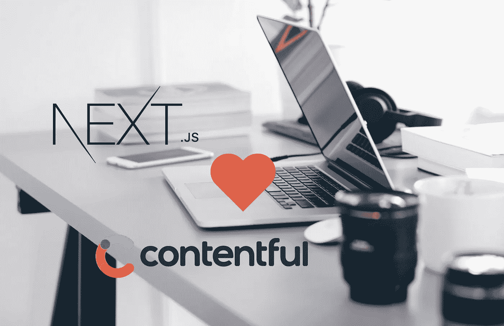
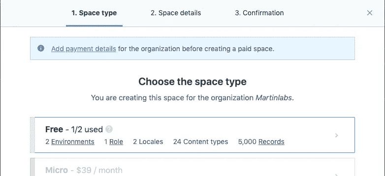
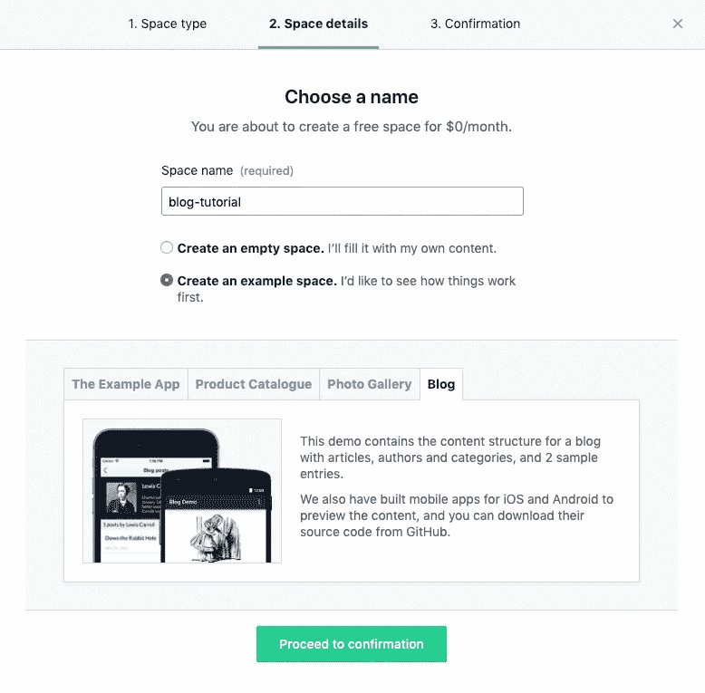
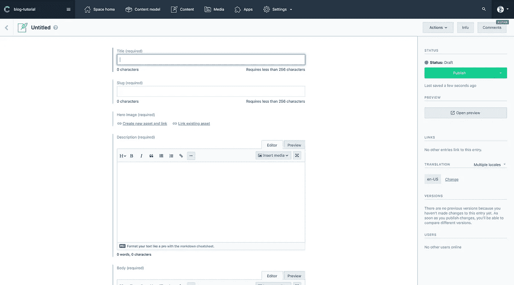
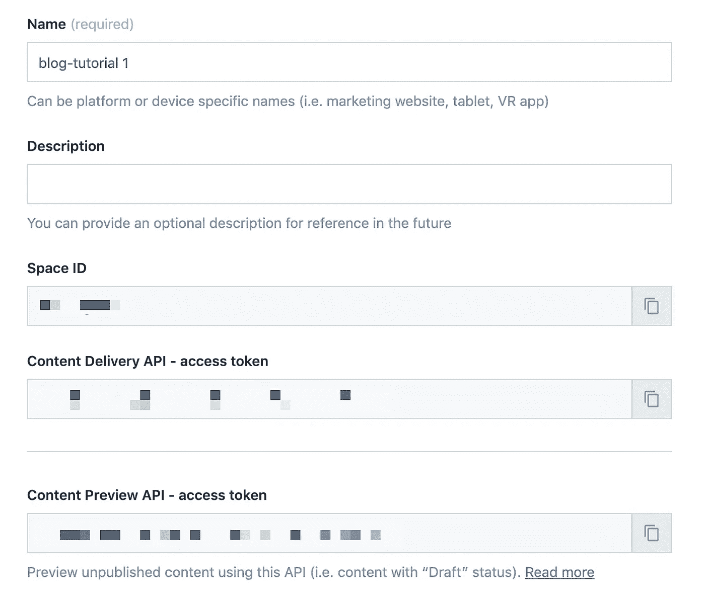
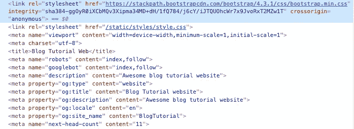

# 使用 Next.js 和 Contentful API 创建博客应用程序

> 原文：<https://betterprogramming.pub/create-a-blog-app-with-nextjs-and-contentful-api-7927af49b3b>

## 一个如何在 Next.js 网站上用内容丰富的 headless CMS 构建博客功能的例子



Next.js 和 Contentful

我有使用 React 和 [Next.js](https://nextjs.org/) 框架构建 web 应用程序的丰富经验。我最近写了一篇关于使用 Docker 建立一个 [Flask](https://palletsprojects.com/p/flask/) 和 Next.js 应用程序的文章。

这一次，在这篇文章中，我将分享一个使用 Next.js 和 [Contentful](https://www.contentful.com/) 构建简单博客应用程序的教程。我在这里描述的步骤类似于我在 [Passporr](https://passporr.com/blog) 中显示博客内容的步骤。

请继续关注，希望这篇教程能帮助你在你的网站上展示博客，而不会有太多的麻烦。

我从我的经验中了解到，为了让你的网站在 SEO 排名中变得更好，你必须为你的网站建立大量的内容。有什么比通过博客产生大量内容更好的方法呢？

但是，如果你建立了一个网站或应用程序，并不打算显示博客。例如，您使用`create-react-app`模板创建了一个 website/ [Sass](https://sass-lang.com/) 产品，随着时间的推移，您希望添加显示博客内容的功能。

除非你用一个已经准备好的平台(例如 [Wordpress](https://wordpress.com/) 、 [Ghost.js](https://ghost.org/) 或许多其他 CMS)来建立你的网站，否则你可能需要:

*   从头开始构建您自己的简单 CMS。
*   使用现有的 CMS 建立一个完整的博客功能，并在您的子域下发布。

如果你不着急或者想抓住机会学习更多关于构建 CMS 的知识，第一种选择可能是可行的。第二个选择可以很快完成，但是你会错过你的主域的有机交通。

然后，还有第三种选择，使用无头 CMS。根据[维基百科](https://en.wikipedia.org/wiki/Headless_content_management_system)，

> *无头内容管理系统(headless content management system，简称 CMS)是一个后端内容管理系统(CMS ),作为一个内容存储库从头开始构建，可通过 RESTful API 访问内容，以便在任何设备上显示。*

因此，它基本上是一个完整的后端服务，包括数据库、编辑器和为您设置的一切，没有任何视图表示。有几个无头 CMS 的例子。

例如，在这篇文章中，我将展示一个如何在 Next.js 网站中用 Contentful headless CMS 构建博客功能的例子。这就是我们将在本教程中开发的内容。


简单的博客应用程序

# 创建一个令人满意的帐户

在开始之前，我们先为它设置一下后端。你需要注册一个内容丰富的帐户，并创建一个内容丰富的基本博客模板。

注册后，你会被要求创建一个新的空间，这基本上是一个项目的地方，你的后端。让我们选择现有的空间模板，现在，博客的例子。

*   选择可用空间。



创造新空间

*   命名空间，并选择一个示例空间。从选项中点击*博客*标签。对于这个例子，我将空间命名为`blog-tutorial`。然后，确认一下。



选择示例空间

在您确认创建空间后，Contentful 将为您创建空间。这个博客空间将包含一个简单的博客结构和四篇博文的样本。

创建空间后，您将被重定向到主页，在那里您可以在导航栏中看到一个菜单。在这里，您可以在*内容模型*菜单中看到您博客的数据结构，在*内容*中看到博客文章的样本。

正如您所看到的，一切都为您设置好了，包括一个 WYSIWYG 编辑器。



心满意足的邮报编辑

# 创建内容丰富的 API 令牌

在我们继续之前，我们还需要为 Next.js 应用程序创建一个 API 令牌。

您可以通过选择*设置*，然后选择 *API 键*来完成此操作。在 API 密钥页面上，点击*添加 API 密钥*。在 API Key 页面上，您可以填写所有的文本框。

您需要记下的是*空间 ID* 和*内容交付 API -访问令牌。*



创建新的 API 访问令牌

# 索引页

对于下一个. js 应用程序，我们将使用我之前设置的 starter 项目开始构建应用程序。[初学者工具包](https://github.com/martindavid/nextjs-typescript-starter)将包含一个基本的 Next.js 应用程序，带有已经为您设置好的类型脚本、[样式组件](https://www.styled-components.com/)和 Docker。

首先，让我们将回购克隆到我们的机器中(您可以将`<project name>`更改为您想要命名的文件夹)。我们还将安装项目所需的依赖项。

```
*# clone the initial project repo*
$ git clone git@github.com:martindavid/nextjs-typescript-starter.git <project name>*# install dependencies package*
$ npm i — save contentful moment
```

下面的代码和步骤将向我们展示如何将博客组件添加到下一个应用程序中。

首先，我们将在`next.config.js`中添加一个环境变量。

内容丰富的 API 的环境变量

我们设置好环境变量后，在 *pages* 下创建一个新文件夹，命名为 *blog* ，之后在 blog 下添加一个名为`index.tsx`的新文件。

在`index.tsx`中，我们将编写一个基本的 React 组件。

index.tsx

目前，它只会显示一个带有文本的标题。在为 Contentful 设置服务类之后，我们将向组件中添加更多内容。

接下来，让我们创建一个服务类，它将调用 Contentful API 并获取数据。这是我目前在所有工作中使用的模式，用于将 API 调用集中到一个服务类中。

在`services`文件夹中，我将创建两个文件，`blog.ts`和`blog.types.ts`。在`services/blog.types.ts`中，我们将存储来自 Contentful API 的响应类型。

现在，在`services/blog.ts`中，我们将添加服务类来调用 Contentful API。

在这里，我们创建一个类名`BlogApi`。这个类导入了`ContentfulClientApi`类型和`createClient`方法，这样我们可以用它在构造函数中实例化 Contentful 客户端。

在`BlogApi`类中，我们添加了两个新方法来获取所有博客条目，并使用 slug 获取一篇博客文章。

最后，我们将在`BlogApi`类中添加一个 helper 方法，将来自 API 的响应映射到我们的类型。

让我们回到`blog/index.tsx`，添加`BlogApi`并获取那里的博客文章列表。在`blog/index.tsx`中，我们将添加`getInitialProps`方法，这样它将实现 SSR 并服务于内容服务器端。

我们还想修改`render`方法来呈现博客文章列表。

从上面的代码清单中可以看出，我创建了一个助手方法来呈现`entry`的集合。

# 详细页面

我们已经完成了博客申请的一半。

在这一部分，我们将为一篇博客文章构建细节。如果你回头看看内容菜单中的 Contentful 页面，你可以看到博客内容是以 markdown 格式编写的。

为此，我们将安装新的 [npm](https://www.npmjs.com/) 包，这些包将在博客的 React 组件中呈现 markdown 内容。

```
$ npm i — save react-markdown
```

之后，我们需要在名为`[slug].tsx`的 *blog* 文件夹下添加一个新的 Next.js 页面。我们还需要添加一个名为`BlogDetail`的新组件，它将接受一个单独的`post`作为道具。

`BlogDetail`是一个基本上只使用`react-markdown`渲染内容的功能组件。同样感谢 Next.js 的动态路由，我们可以传递博客条目 slug，`[slug].tsx`会自动将其解析为查询对象。

使用 Next.js 中的动态路由，我们可以有一个类似于`/blog/<slug>`的 URL，而不是在我们的 URL 中有一个查询字符串。这也将提高我们网站的搜索引擎优化。

最后，为了完成我们的博客详细页面，我们将修改代码以包含`BlogDetail`组件，并调用服务类来获取单个博客条目。

现在我们将测试我们的网站。您需要将`CONTENTFUL_SPACE_ID`和`CONTENTFUL_ACCESS_TOKEN`作为环境变量传递。

```
$ CONTENTFUL_SPACE_ID=<space_id> CONTENTFUL_ACCESS_TOKEN=<access_token> npm run dev
```

将`<space_id>`和`<access_token>`替换为您从 Contentful 网站获得的值。现在，您可以从`[http://localhost:3000](http://localhost:3000/)`访问应用程序。

# 部署到现在

为了方便上网，你可以使用云服务，比如带有 CLI 的 [Zeit](https://zeit.co/) 。要将它发布到现在，您可以运行:

```
now -e CONTENTFUL_SPACE_ID=<space_id> -e CONTENTFUL_ACCESS_TOKEN=<access_token>
```

成功发布后，您可以通过它生成的 URL 访问它。

# 好处:将 SEO 集成到 Next.js 应用程序中

在这篇文章的开始，我提到了在我们的网站上建立博客的原因之一是为了增加我们的 SEO 排名。

我们已经为自己准备好了博客，现在让我们做一个小的修改，为我们的网站提供一个 SEO 标签和元数据。为此，我们需要向我们的内容丰富的博客结构中添加一个字段，并使用`next-seo`将元标签放置到位。

# 在 Contentful 中添加元数据字段

在 Contentful dashboard 页面中，点击*内容模型*菜单并选择*博客文章*模型。

1.  点击*添加字段*按钮，添加一个新的文本字段。我们把它命名为`Meta Title`，然后创建它。添加另一个文本字段，并将其命名为`Meta Description`。
2.  添加另一个新字段，选择一个媒体类型，并将其命名为`Meta Image`。
3.  更新博客的一个内容，并填写`Meta Title`和`Meta Description`的值，还为`Meta Image`字段上传一张图片。

# 将 SEO 付诸实践

由于 Contentful 数据结构中新增了三个字段，我们还需要修改 Next.js 应用程序来反映这些变化。首先，我们将在`blog.types.ts`中添加新的字段。

我们还需要更新`convertPost`方法来映射 meta 标签字段。

在我们更新服务类之后，接下来，我们需要更新博客详细信息页面以包含 meta 标记。为此，我们将使用`[next-seo](https://www.npmjs.com/package/next-seo)`包。

```
$ npm i — save next-seo
```

首先，我们需要更新`_app.tsx`来包含一个默认的 SEO 配置。我们可以使用`next-seo`组件覆盖每个页面的默认配置。我们将为默认的 SEO 配置创建一个新的常量。

我们还需要更新这个组件的渲染方法。

```
*// import the component on the top*
import {DefaultSeo} from ‘next-seo’;*// Update the return from the render method*
return (
  <>
    <DefaultSeo {...DEFAULT_SEO} />
    <Component {...pageProps} />;
  </>
);
```

在我们更新了`_app.tsx`之后，如果你检查元素并查看`<head>`部分，你现在可以看到正在呈现的元描述。



最后，我们需要更新`[slug].tsx`来覆盖默认的 SEO 配置，以反映单个博客条目的 meta 标签字段。

```
*// Import the NextSeo component on top of the file*
import {NextSeo} from ‘next-seo’; *// Update the render method to include the NextSeo component*
<NextSeo
  openGraph={{
    type: 'article',
    title: post.metaTitle,
    description: post.metaDescription,
    images: [
      {
        url: post.metaImage,
        width: 850,
        height: 650,
        alt: post.metaTitle,
      },
    ],
  }}
  title={post.metaTitle}
  description={post.metaDescription}
/>
```

# 摘要

为了让你的网站有一个好的搜索引擎优化策略，我们需要在我们的网站上有很多好的内容。获得这些内容的方法之一是通过博客。

在现有网站上集成 CMS 可能需要时间和精力。如果我们使用当前的 CMS 解决方案，我们可能需要在不同的子域中设置它。

在本文中，我向您展示了如何使用 Next.js 和 Contentful headless CMS 构建一个简单的博客应用程序。像 Contentful 这样的无头 CMS 是一个平台，它消除了创建内容管理系统的所有麻烦。

它还提供了设置我们需要的内容结构和我们想要的博客视图的灵活性。我希望这篇教程能让你知道如何轻松地将博客整合到你的网站中。

此应用程序的源代码可从[这里](https://github.com/martindavid/nextjs-contentful-app)获得

# 资源

*   [https://en . Wikipedia . org/wiki/Headless _ content _ management _ system](https://en.wikipedia.org/wiki/Headless_content_management_system)
*   [https://moz.com/learn/seo/url](https://moz.com/learn/seo/url)