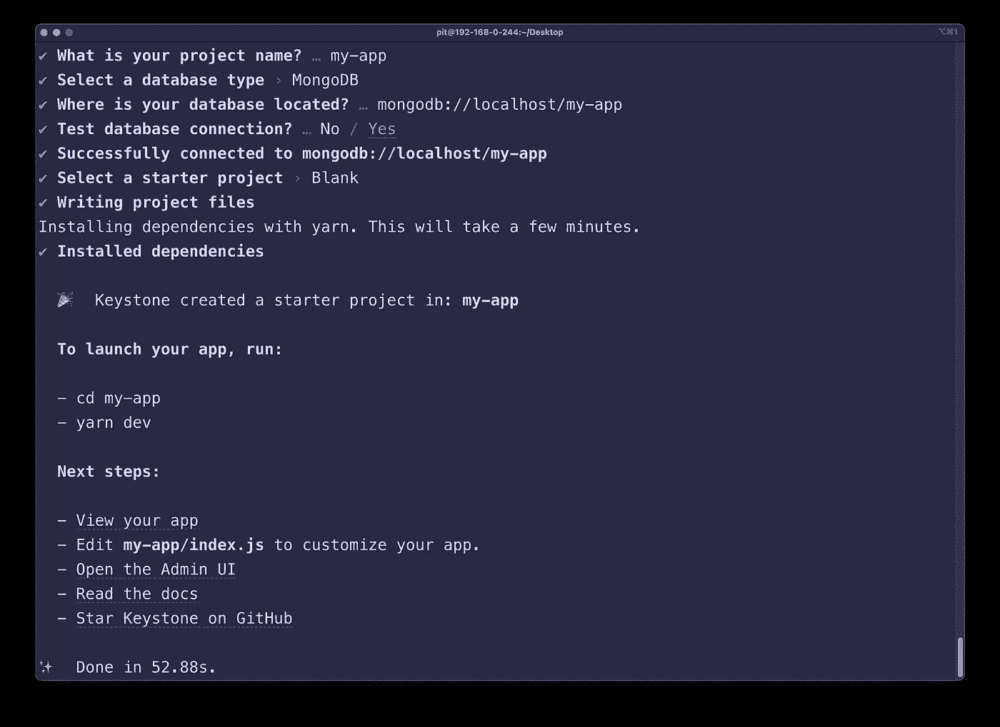
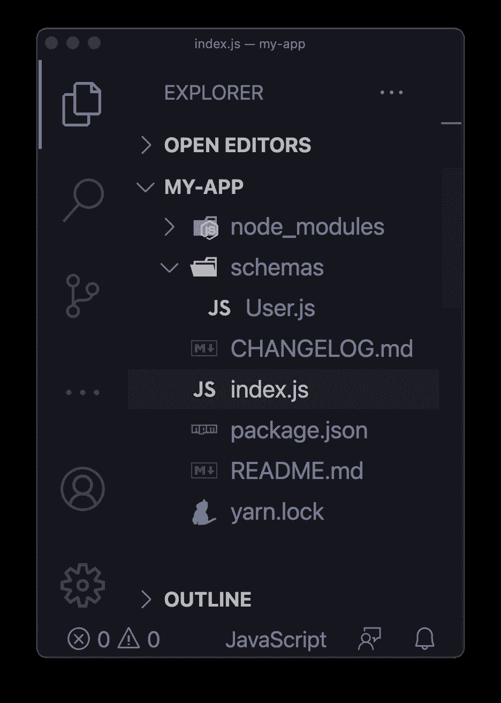
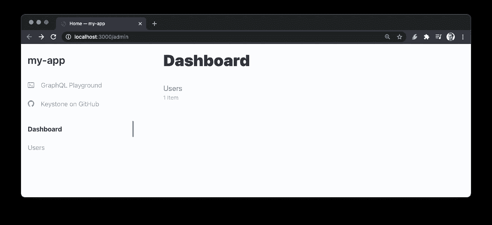
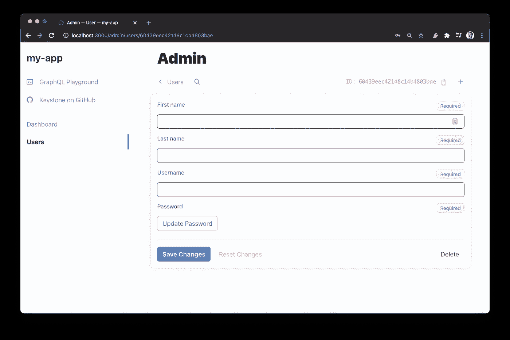
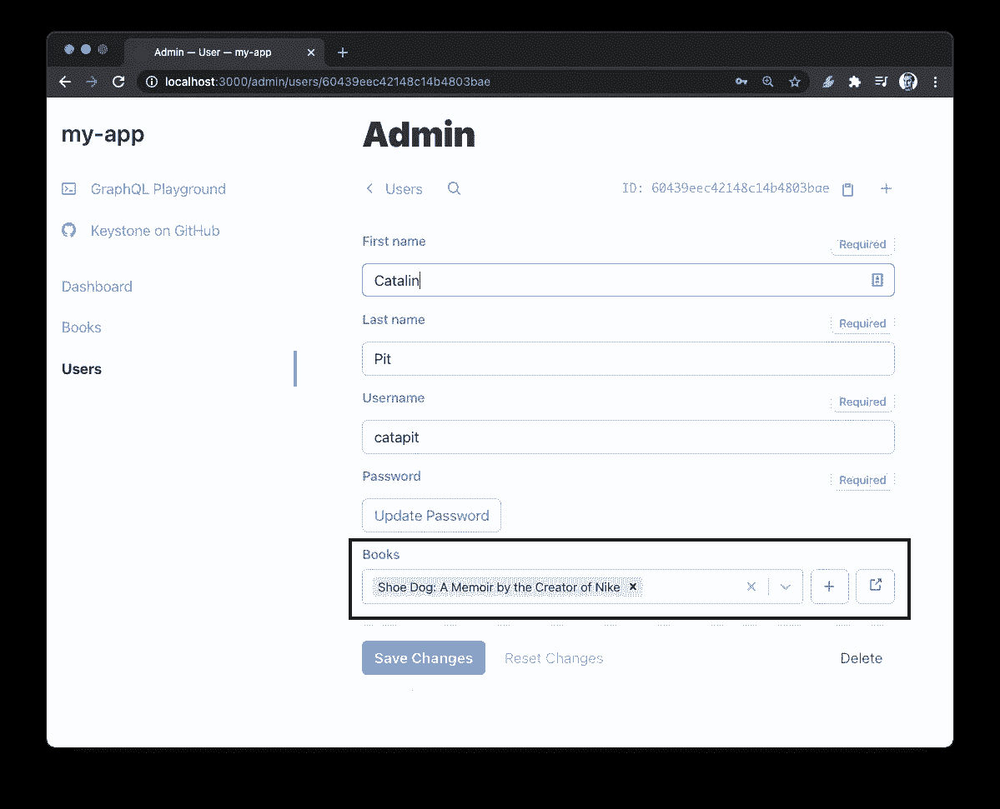
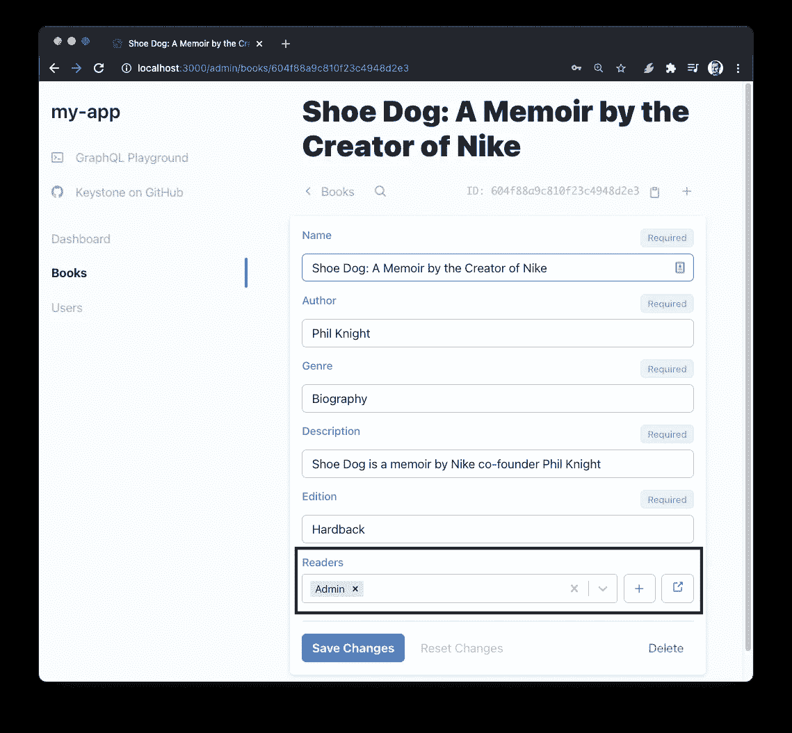

# KeystoneJS 管理 UI 和 CRUD GraphQL API 课程

> 原文：<https://betterprogramming.pub/create-a-book-content-management-system-with-keystonejs-and-graphql-301e0af5a687>

## 构建您自己的图书清点应用程序


由[汤姆·赫曼斯](https://unsplash.com/@tomhermans?utm_source=medium&utm_medium=referral)在 [Unsplash](https://unsplash.com?utm_source=medium&utm_medium=referral) 上拍摄

[KeystoneJS](https://www.keystonejs.com/) 是一个无头内容管理系统(CMS)和一个用于 [Node.js](https://nodejs.org/en/) 的 GraphQL API。像 Keystone 这样的内容管理系统允许我们创建和存储内容。然后，它通过 API 提供对内容的访问。

几分钟后，您将能够构建一个简单的库存应用程序。我们将使用的例子是书评，但同样的概念可以用于任何事情。

# 1.安装拱顶石

[文档](https://www.keystonejs.com/quick-start/)很好地解释了如何开始使用 Keystone。因此，我不打算重新发明轮子。

您可以使用 npm 或 yarn 初始化 Keystone 应用程序。从两者中选择适合你的:

```
npm init keystone-app my-appyarn create keystone-app my-app
```

运行命令后，系统会提示您回答五个问题。这些问题的目的是为您配置一个默认项目。它们如下:

1.  **您的项目名称是什么？** —为您的项目选择您想要的名称。
2.  **选择一个数据库类型**——在这里，您可以选择三个选项:

*   [MongoDB](https://www.mongodb.com/) (本教程我们将使用 Mongo)
*   一种数据库系统
*   普里斯马

3.你的数据库在哪里？ —我们将从我们的机器上使用本地的 MongoDB。因此，URL 是`mongodb://localhost/db_name`。(将`db_name`替换为您想要的数据库名称。)

4.**测试数据库连接？你可以在`Yes/No`中选择。我总是选择`Yes`，因为我想在继续下一步之前测试 DB 连接。**

5.**选择一个启动项目** —在这里您可以选择预先配置的项目。您可以在四个选项中进行选择:

*   Starter(用户+身份验证)—用户和基本身份验证的简单起点
*   空白——完全空白的项目。提供一个 AdminUI 和 GraphQL 应用程序供您配置
*   todo——一个非常简单的待办事项应用程序，有一个静态的前端，用传统的 HTML、CSS 和 JavaScript 编写
*   nuxt——使用 Nuxt.js 前端框架的简单应用程序

选择`blank`选项，让本练习从头开始。现在，您需要等待几分钟，让 Yarn 安装项目依赖项。

# 2.打开项目

安装完依赖项后，您应该会看到以下输出:



现在，让我们打开项目，开始着手研究:

*   `cd my-app`(用您的项目名称替换`my-app`)
*   在您最喜欢的代码编辑器中打开项目

**注意:**运行`yarn dev`就可以启动应用，但是没什么可看的。让我们添加一些东西，然后运行它！

# 3.一些基础知识

在继续学习之前，您需要了解一些关于 Keystone 的基本知识。先说列表。

**列表** —列表是一种表示数据的方式。如果您使用 Node.js 和 MongoDB，您可以将列表与模型相关联。例如，在这个应用程序中，我们有一个用户列表。这是用户的模型。该列表指定了您存储的每个用户的信息以及这些字段的作用。

**字段** —列表由字段组成。一个字段代表一条关于用户的信息(在我们的例子中)。例如，在`User`列表中，您可以添加如下字段:

*   西方人名的第一个字
*   姓
*   电子邮件

…以此类推！

看到例子就更好理解了。因此，下面你可以看到`User`列表的一个可能的表示。

现在我们已经清楚了基础知识，我们可以进一步构建应用程序。

`User`列表为用户提供了以下字段:

*   西方人名的第一个字
*   姓
*   用户名
*   密码

# 4.创建文件夹结构

首先，您需要设置应用程序的文件夹结构。

首先在项目的根文件夹中创建一个新文件夹`schemas`。这是我们放列表的地方。模式是一个很好的术语，因为它有助于自我描述 GraphQL API 角色，但是您可以将其命名为`lists`、`models`或任何您喜欢的名称。

在新创建的文件夹(`schemas`)中，创建一个名为`User.js`的新文件。

您的项目结构应该如下所示:



# 5.创建用户列表(模型)

现在您已经有了项目结构，让我们创建`User`列表。打开文件`schemas > User.js`并编写以下代码:

在这个应用程序中，您只存储用户的名字、姓氏、用户名和密码。需要注意的是，您从`'@keystonejs/fields'`导入了字段`Text`和`Password`。

对于本文，我们将保持简单，只使用这些字段。不过，您可以扩展它来存储更多信息。

## 使用用户列表

尽管您创建了列表，但您还不能使用它。返回到`index.js`，在文件顶部的任意位置添加以下代码:

```
const UserSchema = require('./schemas/User');
```

通过这一行，您将`User`列表导入到`index.js`文件中以使用它。现在在`keystone`常量后添加以下代码行:

```
keystone.createList('User', UserSchema);
```

上面的代码行用您创建和指定的模式创建了一个`User`列表。在`index.js`中写入上述行后，文件应该如下所示:

保存所有文件，在终端运行`yarn dev`启动应用程序。一旦应用程序启动，前往`http://localhost:3000/admin`看看你做了什么！

现在，您应该看到您指定的用户和字段。您应该看到与下图相同的视图:



干得好！现在你准备好了。

# 6.创建图书列表(模型)

下一步是创建一个图书模型，这样使用该应用程序的人就可以跟踪他们正在阅读的图书。

在`schemas`文件夹中创建一个新文件`Book.js`。创建文件后，编写以下代码(或根据需要修改):

这一步类似于您如何创建`User`列表。

**注**:还有很多字段，你可以在这里[看到文档](https://www.keystonejs.com/keystonejs/fields/)。然而，对于本教程/课程，我们通过使用`Text`字段保持简单。我没有使用其他字段，因为它们需要通过 npm/yarn 单独安装。作为练习，将一些字段更改为不同的类型。

接下来，您需要包含新的模式并在`index.js`文件中使用它。与`User`列表一样，打开`index.js`并编写以下代码:

```
const BookSchema = require('./schemas/Book');
keystone.createList('Book', BookSchema);
```

现在您的`index.js`文件应该如下所示:

此时，我们已经有了`User`和`Book`列表。下一步是在他们之间建立关系。

# 7.创建用户和书籍之间的关系

到目前为止，您已经创建了用户和图书模型。但是，这两者之间没有任何关系。用户如何添加图书？因此，在本节中，您将创建关系。

关系会是什么样子？

*   一个用户可以有许多本书
*   一本书可以有很多读者

因此我们有一个多对多的关系。

## 修改 User.js

第一步是导入`Relationship`字段，如下面的代码所示:

```
const { Text, Password, Relationship } = require('@keystonejs/fields');
```

现在您需要添加一个新的字段，它属于`Relationship`类型。在`password`字段后的`User.js`中编写以下代码:

```
books: {
    type: Relationship,
    ref: 'Book.readers',
    many: true
}
```

这个`User.js`文件几乎是一样的，除了两处增加。让我们逐一查看每个字段，看看它们的含义:

*   `type: Relationship` —正如`username`字段的类型是“文本”，我们对这个字段有“关系”。
*   `ref: 'Book.readers'` —该字段表示`books`字段与`Book`列表中的`readers`字段相关。
*   `many: true` —每个用户可以读很多本书，每本书可以有很多读者(多对多关系)。

这就是你要为`User`列表所做的一切。

## 修改 Book.js

现在你需要做一些类似于`Book`列表的事情。转到文件`Book.js`并导入`Relationship`字段。

```
const { Text, Relationship } = require('@keystonejs/fields');
```

之后，在`edition`字段后添加以下代码:

```
readers: {
    type: Relationship,
    ref: 'User.books',
    many: true
}
```

这与您对`User`列表所做的类似，只有一点不同，`ref: 'User.books'`。

## 关系已创建

干得好！你创造了读者和书的关系。您可以通过添加读者和书籍并链接它们来测试这种关系。

举个例子，我创造了一个阅读器和一本书给你看。参见下图:



到目前为止，您已经拥有了基本的运行功能。如果你想要另一个练习，你可以做以下步骤:

1.  创建一个`Review`模型。
2.  创建模型之间的关系(例如，一本书可以有多个评论，每个作者可以留下多个评论，等等)。
3.  测试一下。

让我们进入下一部分！

# 管理字段

在进入授权和认证之前，您需要向`User`列表添加一个新字段。这个新字段被称为`isAdmin`，它用于授予用户管理权限。

转到`schemas`文件夹，打开`User.js`。在文件的顶部，导入`Checkbox`字段，如下面的代码所示:

```
const { Text, Password, Relationship, Checkbox } = require('@keystonejs/fields');
```

之后，在文件中的任意位置添加以下字段:

```
isAdmin: {
    type: Checkbox,
    defaultValue: false
}
```

现在，当您创建一个新用户时，您可以让该用户成为管理员。在继续之前，我建议您创建:

*   管理员用户
*   普通用户

否则，您将无法访问和测试该应用程序。

# 认证和授权

在继续之前，如果您不熟悉术语，请阅读 Okta 的这篇关于[认证与授权](https://www.okta.com/identity-101/authentication-vs-authorization/#:~:text=Authentication%20and%20authorization%20might%20sound,permission%20to%20access%20a%20resource)的文章。

既然你知道了这两个术语的区别，让我们继续。您有一个可以工作的应用程序，但是有一个缺陷。缺陷是每个人都可以访问和修改数据。你不想那样，对吗？

因此，在本节中，我们限制对管理面板的访问以及对资源的访问和修改。

## 检查权限

第一步是打开您的`index.js`文件，并在 Keystone 常量(`const keystone.....`)后编写以下代码:

代码太多了！让我们来分解一下:

*   `isAdmin`检查用户是否是管理员(duh ),并基于此授权/拒绝访问管理面板。
*   `isLoggedIn`简单检查用户是否通过认证。
*   `isOwner`检查用户是否是资源的所有者。例如，您可能希望限制用户删除不是由他们创建的资源。
*   `isAdminOrOwner`检查用户是管理员还是所有者，并返回值。

在最后一行，我们在`access`对象上添加了功能，这样我们就可以像`access.isAdmin`一样访问它们。

## 修改列表

让我们使用这些方法。进入您的`index.js`文件并找到以下代码:

```
keystone.createList('User', UserSchema);
keystone.createList('Book', BookSchema);
```

您要做的是提供一个对象，而不是模式。将上面两行修改成以下代码:

如我所说，您现在提供了一个对象，而不是直接提供模式。对于`fields`，您可以从本文开头创建的模式中提供字段。基本上，这两者是等价的:

```
keystone.createList('User', UserSchema);// orkeystone.createList('User', { fields: UserSchema.fields});
```

新增的是`access`对象，它允许对资源进行更严格的控制。代码相当直观，对于每个 CRUD 操作，您都要指定访问权限。

例如，**只有管理员可以创建/读取/更新/删除其他用户**。此外，用户只能看到自己的帐户，而不能看到其他人的帐户。另一方面，你**允许所有人看你的书评** ( `read: true`)。用户必须登录才能创建书评。关于更新和删除书籍，一个人必须是管理员或所有者。

## 创建授权策略

为了能够允许或限制访问，您必须安装`auth-password`包。您可以通过运行以下任一项来实现:

```
npm install @keystonejs/auth-password// oryarn add @keystonejs/auth-password
```

软件包安装成功后，在您的`index.js`文件的顶部添加下面一行:

```
const { PasswordAuthStrategy } = require('@keystonejs/auth-password')
```

现在，您已经准备好配置身份验证了。在`module.exports`行之前编写以下代码:

在这里您创建了一个`authStrategy`常量，在这里您指定了类型、它应该使用的列表(在本例中为`User`)以及用于登录的字段。在这个应用程序中，用户使用他们的`username`和`password`登录。

观察下面代码中的最后两行— `authStrategy`和`isAccessAllowed: isLoggedIn`。如果用户没有登录，您通过`authStrategy`并限制对管理面板的访问。

保存所有内容，并运行应用程序— `yarn dev`。干得好！您可以在应用程序中设置授权和身份验证！现在管理员拥有完全的权力，而其他用户在创建书籍和管理他们的书籍方面受到很大的限制。

`isAccessAllowed: isLoggedIn`只要登录，任何人都可以访问管理页面。如果您想只允许管理员，请将该行更改为:

```
isAccessAllowed: isAdmin
```

## isAdmin 字段的警告

在实现身份验证和授权之前，您向用户添加了`isAdmin`字段。但是，有一个问题:每个人都可以让自己成为管理员。幸运的是，有一种方法可以限制这种情况。

打开`User.js`文件，修改如下字段:

进行此更改后，只有管理员可以让其他用户成为管理员。这是防止每个人把自己变成管理员的好方法。

**P.S** :你设置访问字段的方式类似于你在`index.js`文件中为用户和图书列表设置的方式。

# 结论

在本教程中，您学习了 Keystone 的基础知识。从这里开始，您可以添加更多的特性来创建一个复杂的应用程序。

一些想法:

*   添加前端
*   允许人们评论书籍
*   为每个用户创建配置文件

*如果对 JavaScript 教程感兴趣，我推荐* [*前端高手*](https://catalins.tech/frontend-masters-membership-is-it-worth-it) *！*

*如果你想用技术写作赚钱，就去查查* [*那些付钱让你写*](https://catalins.tech/websites-that-pay-you-to-write-technical-articles) *技术文章的网站吧！*

*如果你想学习 JavaScript，我推荐这些* [*5 资源作为初学者学习 JavaScript*](https://catalins.tech/5-best-resources-to-learn-javascript-as-a-beginner)*！*

*谈判你的工资是必不可少的——学习* [*作为一名开发者如何谈判你的工资*](https://catalins.tech/how-to-negotiate-your-salary-as-a-developer) *！*

*用* [*Git 别名*](https://catalins.tech/git-aliases-what-are-they-and-how-to-use-them) *加速你的开发。*

*如果你想* [*以开发者身份开博客*](https://catalins.tech/how-to-start-your-blog-as-a-developer) *，我推荐你阅读《* [*如何以开发者身份开博客*](https://catalins.tech/how-to-start-your-blog-as-a-developer) *》一文！*

你是否很难跟上科技领域的最新消息？参见 [*作为开发者保持最新状态的一种方法*](https://catalins.tech/one-way-to-stay-up-to-date-as-developer) *！*

*学习* [*如何在 JavaScript*](https://catalins.tech/how-to-use-asyncawait-in-javascript) *中使用 Async/Await！*

GitHub 简介目前风靡一时。了解 [*如何创建 GitHub 个人资料页面*](https://catalins.tech/how-to-create-a-kickass-github-profile-page) *！*

*查看这 7 个* [*资源，帮你通过求职面试*](https://catalins.tech/7-github-repositories-to-help-you-crush-your-job-interviews) *！*

*查看即将到来的新功能*[*JavaScript ECMAScript 2021 es 2021*](https://catalins.tech/javascript-es2021-you-need-to-see-these-ecmascript-2021-features)*！*

*你是初学程序员吗？查看这些* [*编程项目思路适合初学者*](https://catalins.tech/10-programming-project-ideas-for-beginners) *！*

*你是在学习编码还是打算去做？查看* [*免费学习编程的最佳地点*](https://catalins.tech/20-best-places-to-learn-programming-for-free) *！*

[*用这 9 个浏览器扩展提高你的开发者生产力*](https://catalins.tech/my-9-must-have-browser-extensions-for-increased-developer-productivity) *！*

*如果你是 Node.js 的开发者，我建议你查看 Node.js* *中的这些* [*4 个创意设计模式！*](https://catalins.tech/the-4-creational-design-patterns-in-nodejs-you-should-know)

*查看这些惊人的*[*JavaScript ECMAScript 2020 特性*](https://catalins.tech/javascript-es2020-the-features-you-should-know) *！*