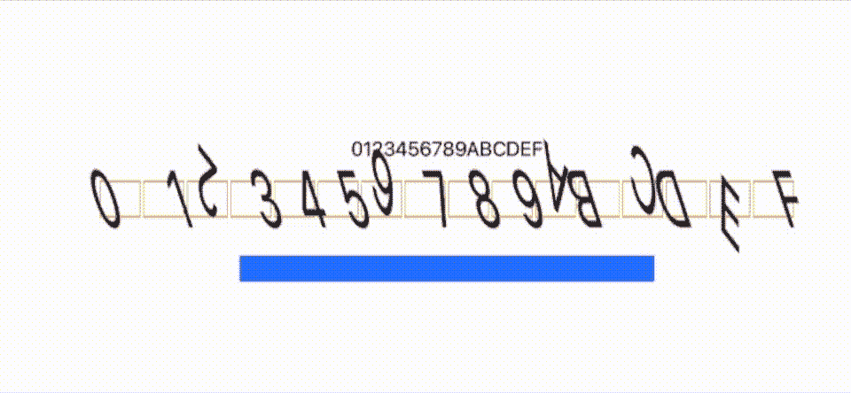
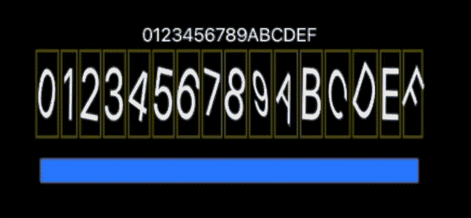
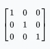
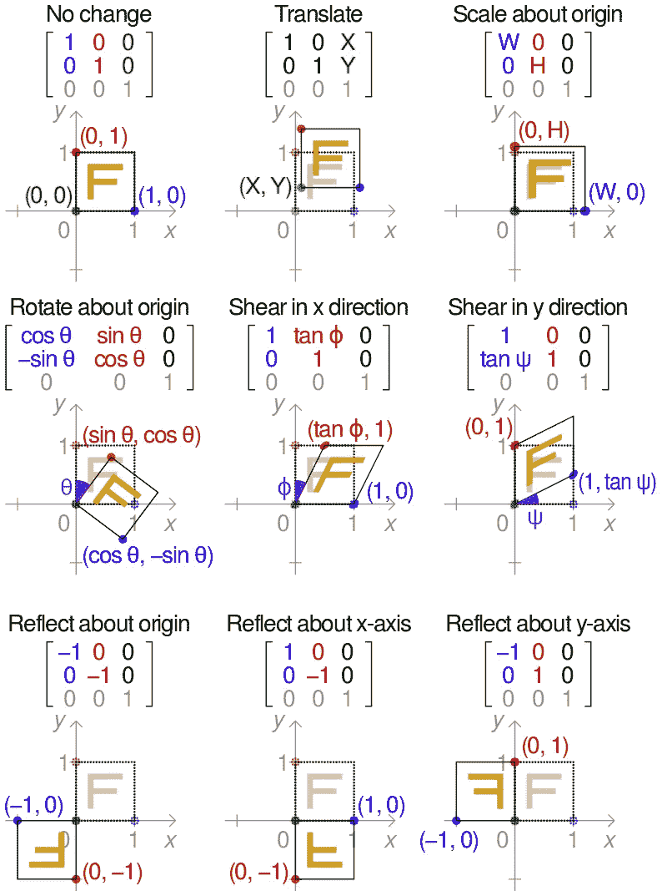

# 使用 SwiftUI 创建验证码

> 原文：<https://betterprogramming.pub/create-a-captcha-with-swiftui-ff75b750971d>

## 弄清楚你是不是在和人类打交道

验证码的一个例子。作者 GIF。

如今，试图弄清楚你在和一个人还是一个机器人说话变得越来越困难。近年来，解决这一问题的实际方法是验证码——一种挑战/响应协议，它要么给你一组图像，并要求你识别其中一些图像中的某些东西，要么是一串被扭曲的文本(如上所示)。

在本文中，我将重点讨论后者。我们将试图伪装一串文本，这样人类仍然可以理解它说的是什么，但机器人会很难理解。我将在 SwiftUI 中提出一个解决方案。

我们从哪里开始？前阵子我在[旋转图片](https://medium.com/better-programming/how-to-draw-in-3d-with-swiftui-7989cfcd35fc)上发表了[的几篇文章](https://medium.com/better-programming/drawing-in-3d-using-swiftui-ed211d7c2c91)。他们广泛讨论了`rotationEffect`，这是一个可能的起点。我可以转动并扭曲文本中的数字和字母，生成一个验证码版本:

十六进制字母表被 captcha'd 旋转 3DEffect

在这张 GIF 中，我随机翻转了每个轴上的字母，尽管我将角度限制在 65%以保持可读性。还可以，但是还有很大的改进余地。我在这里已经要解决的一个问题是，字母保留了它们自己的空间，这对于试图分析它正在看的东西的机器人来说是一个真正的泄露。

现在，答案就在核心图形框架中，其中一个方面可以在 SwiftUI 构造中访问。一种源于数学分支仿射几何的方法。它在 SwiftUI 中特别可用，带有`transformEffect`标签。

仿射几何有五种可能的变换:

*   平移，就是简单地移动 X 和 Y 原点。
*   倒影，这是一个镜像。
*   缩放，使其变大或变小。
*   旋转，就是这么做的。
*   剪毛，这是我们真正感兴趣的。

剪切图像会使其扭曲或变形。这对我们的验证码很重要，因为人类的大脑擅长纠正这种事情，但你的普通机器人不擅长。巧合的是，上周我写了一篇文章关于剪切图像产生的形状。它被称为梯形。

到代码。这一切意味着什么，它是如何工作的？如果你有一个模板，理解离线转换是很容易的。

来源:[维基百科](https://en.wikipedia.org/wiki/Affine_transformation)

这就是所谓的单位矩阵——一个表示没有任何变换的图像的矩阵。现在，通过改变不同位置的值，您可以有效地描述如何改变它所涉及的仿射空间。

例如，通过代码，我们可以定义 10 度的剪切变换:

这些字母映射到我之前介绍的矩阵。使用 warping，我们可以创建一个更加狂野的 captcha(本文开头给出的那个)。请注意，我从模板的维基百科页面获取了这里需要的值。

来源:[维基百科](https://en.wikipedia.org/wiki/Affine_transformation#/media/File:2D_affine_transformation_matrix.svg)

所有这些让我想到这篇短文的结尾。以下是使用核心动画进行各种变换所需的 iOS 代码:

但是等等，在我离开之前，这里还有另外两个技巧。

首先是用一种无论如何都很难读懂的字体。这听起来有点愚蠢，不是吗？但如果你想想手头的任务，这是有意义的。

第二种方法是在图片中引入噪声——足以扰乱图像处理算法，但又不至于让你看不清文字。这是一条微妙的线，我将留给你去探索。

保持冷静，继续编码。