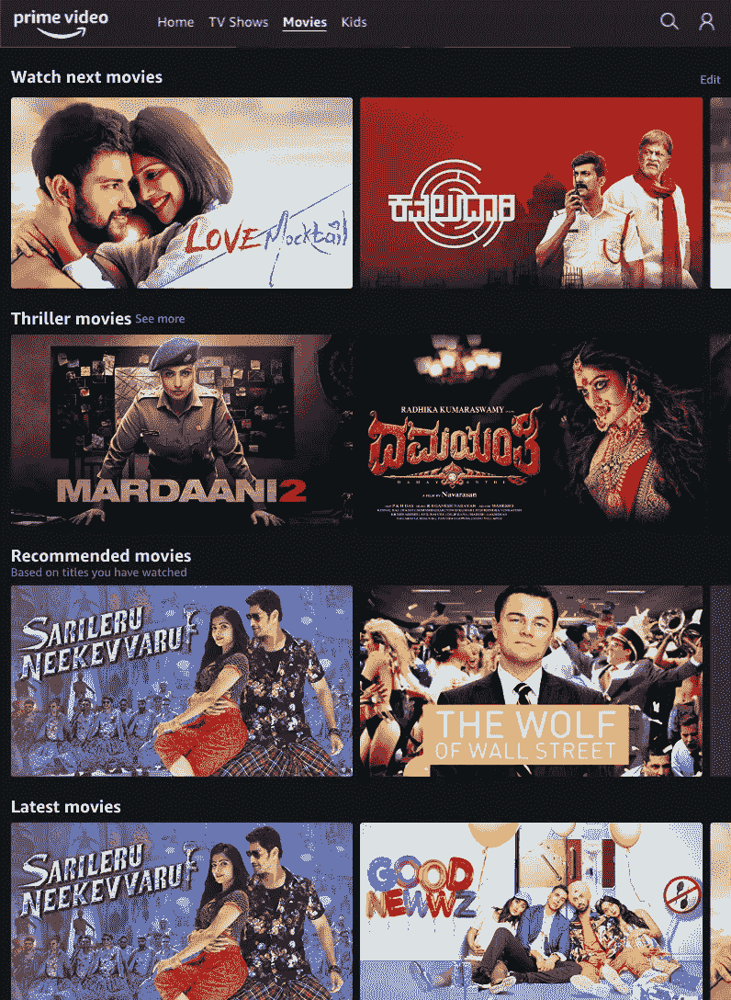
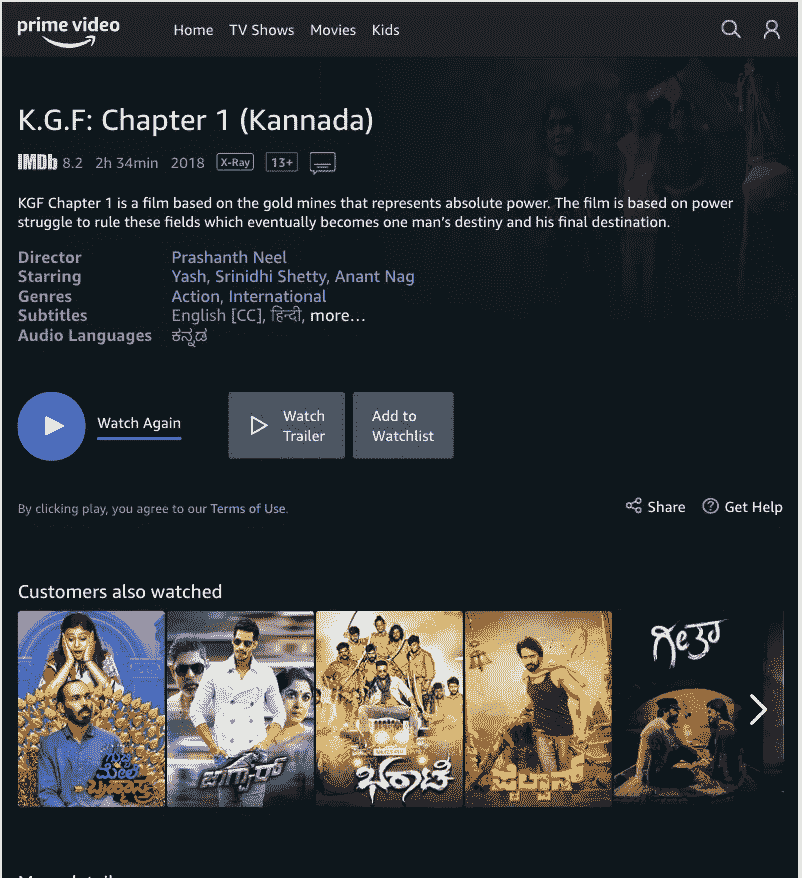
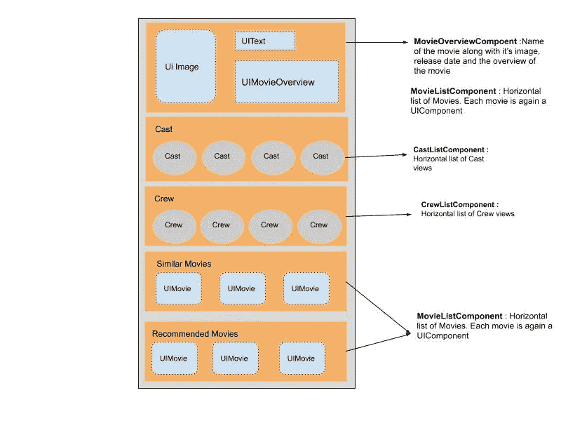
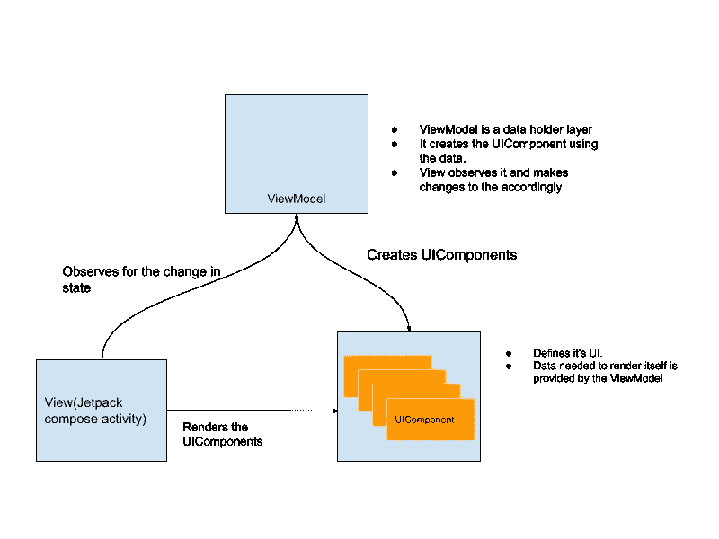
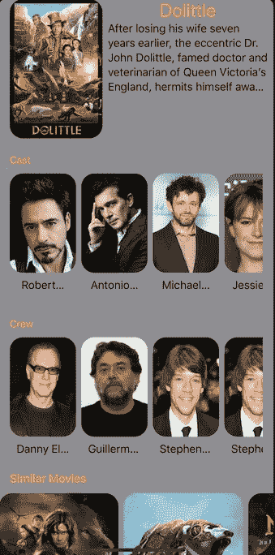

# Android Jetpack Compose——创建基于组件的架构

> 原文：<https://betterprogramming.pub/create-a-component-based-architecture-in-android-jetpack-compose-96980c191351>

## 以不同的方式思考你的用户界面，以声明性函数和相应架构的形式

[娜塔莉亚 Y](https://unsplash.com/@foxfox?utm_source=medium&utm_medium=referral) 在 [Unsplash](https://unsplash.com?utm_source=medium&utm_medium=referral) 上的照片

动机:你可能运行过像网飞/亚马逊 Prime 这样的应用程序，其中一个单独的屏幕包含许多视图，这些视图可以在整个应用程序中重复使用。例如，考虑亚马逊 Prime 视频应用程序。

亚马逊 Prime 视频的主屏幕

考虑主屏幕，，它包含一个接一个堆叠在另一个下面的*观看下一部电影、惊悚电影*、*推荐电影*和*最新电影*的列表。以上都有相同的 UI，不同的数据集。

考虑电影屏幕，包含电影的概述，在它下面，您可以找到*客户也观看了*部分。这与主屏幕上使用的 UI 相同*。*因此，部分视图在整个应用程序中被重用。

# 设计屏幕

你会如何设计这样的屏幕？

## **天真的方式**

创建上述屏幕的一种方法是对每个屏幕的视图进行硬编码。但是我们遇到了问题。

首先，我们的领域或表示层不能有改变视图的逻辑。如果我们只是想在屏幕的 UI 中添加一些类似演职人员的东西，我们最终会改变很多文件。

第二，重复的问题。

使用上面的方法，我们最终会复制代码来在主屏幕和电影屏幕上呈现电影列表。当你听到*重复*的时候，我们把它们移到一个平常的地方。

使用建议的架构(如下)，我们可以通过将重复代码放在一个普通的叫做 *UIComponents* 的地方来克服上述问题。

## **什么是 UIComponents？**

可以被*重用*和*独立*的 UI 片段称为 *UIComponents* 。你可以把它们插在任何屏幕上的应用程序的任何地方，你就可以开始了。

## **什么是基于组件的架构？**

这里，一个活动的屏幕是由一堆可重用的 UIComponents 组成的。活动不负责在其 XML 文件中创建视图。相反，它只包括 UIComponents。

在本文中，我们只关注在屏幕上呈现 UIComponents。稍后，我们在这里看处理 UIComponents 与外界的交互。

电影屏幕 ui 组件

# **Android Jetpack 撰写**

[Jetpack Compose](https://developer.android.com/jetpack/compose) 是一个设计工具包，用于简化 Android 中的 UI 开发。它是完全声明性的，意味着您通过调用一系列函数*来描述您的 UI，这些函数*将数据转换成 UI 层次结构——定义

在 Jetpack Compose 中，视图是可组合的函数。

这是您在 Jetpack Compose 中定义视图的方式:

# Jetpack 组件中基于组件的体系结构

本文的剩余部分将分成三个部分，并包含一些代码。

1.  定义/构建 UIComponents。
2.  通过提供 UIComponent 所需的数据，由我们的`ViewModel`创建 ui component。
3.  将 UIComponents 合并到 Jetpack 组合活动中。

应用程序不同层的相互连接如下所示。我们以后会随机应变。

Android Jetpack compose 中基于组件的架构

出于本演示的目的，我们将创建一个具有以下屏幕的应用程序:

1.  主屏幕，播放热门/顶级电影。
2.  电影详细信息屏幕，包括电影概述、演员/工作人员、推荐电影和类似电影。

# **1。构建 ui 组件**

一个方便的可组合视图的可组合函数类型别名。(记得吗？视图是可组合的函数。)

UIComponent 接口将由所有 ui component 实现。这是我们 UIComponent 的基本版本。当我们开始处理交互时，我们会修改它。

为了更好地适应我们的目的，也为了更好地解释事情，我们将建造一个`MovieDetailScreen`。它具有以下 ui 组件:

*   电影概述(`MovieOverviewUIComponent`)
*   电影演员阵容(`CastListUIComponent`
*   电影剧组(`CrewListUIComponent`)
*   类似电影(`MovieListUIComponent`)
*   推荐电影(`MovieListUIComponent`)

带有电影概览、演员表和剧组名单的上部屏幕

底部屏幕显示相似和推荐的电影

现在，我们将构建可用于在屏幕上渲染类似电影和推荐电影的`MovieListUIComponent`。

让我们为垂直和水平滚动添加两个扩展函数。

我们来造一个`MovieListUIComponent`。

1.设计`MovieView`(可组合)。这将是一个可组合的函数。温馨提示:视图是 Jetpack Compose 中的函数。

2.接下来，我们创建一个水平滚动的电影列表— `HMovieListView.kt` *。*我们将使用之前创建的扩展函数(`HStack`)。

3.既然已经创建了`View`，我们可以创建一个`MovieListUIComponent`。组件从`ViewModel`接收其数据(`movieList`)。该数据由`HMovieListView`使用。

我们的第一部分已经结束，我们已经创建了 UIComponents。你可以在 [GitHub](https://github.com/AnupAmmanavar/MovieBrowsing/tree/master/jetpackui/src/main/java/com/kinley/jetpackui/jetcompose) 上获得完整的代码。

# **2。构建表示层**

注意:下面的代码实际上比你在这里看到的更简单。

1.让我们创建一个数据类来保存 UI 的数据，`MovieDetailPageUiModel`。它是不可变的(都是`val` s)。我们使用减速器来更新状态。它包含了视图所需的所有 UIComponents。下面看看。

2.在`ViewModel`中，这将是`MutableLiveData`。这保存了特定 Jetpack 编写活动的完整状态。

3.`ViewModel`是数据持有者，负责创建 UIComponents。正如前面指出的，`ViewModel`从多个数据源(API 或持久性)获取数据，这是创建组件所必需的。

当我们获得数据时，我们创建我们的 UIComponents 并更新(减少)我们的`mutableLiveData`。

例如:当我们获取推荐的电影时，我们创建`MovieListUIComponent`并更新`movieDetailPageUiModel`中的`recommendedMoviesListUIComponent`值。

这适用于`movieDetailPageUiModel`中的所有值。看一下代码，它清楚地表明:

就是这样！你可以在 GitHub 上看看我们完整的`ViewModel` [。](https://github.com/AnupAmmanavar/MovieBrowsing/tree/master/app/src/main/java/com/kinley/moviebrowsing/features)

# **3。构建最后一部分—视图(Jetpack 撰写活动)**

目标:活动应该像`RecyclerView`一样以垂直方式呈现所有的 UIComponents。目前，我们通过使用`VStack`来模仿`RecyclerView`。但是你要考虑用`AdapterList`。

1.  在我们的`MovieDetailPageView`中，我们有一个垂直滚动条来垂直呈现所有的 ui 组件。视图观察数据的变化并自我更新。

看看我们是如何遍历 UIComponents 列表并以垂直方式呈现它们的。(类似于一个`RecyclerView`中的多个视图类型，其中每个 UIComponent 是一个不同的视图类型。)

2.继续上述观点。在`HomePageUIModel`中将需要一个小的改变。我们添加了一个返回 UIComponents 列表的函数(`components()`)。

3.观察`HomePageUIModel`(我们的`ViewModel`中的`pageData`)并在它变化时更新视图。

可以看看 GitHub 上的代码[。](https://github.com/AnupAmmanavar/MovieBrowsing/blob/master/app/src/main/java/com/kinley/moviebrowsing/screens/MovieDetailActivity.kt)

**服务器驱动的 UI:** 另外，我们可以通过 API 响应来驱动 UI。我们没有在 ViewModel 中创建 UIComponents，而是将它移动到一个公共位置，如下所示。UIComponents 是基于服务器响应创建的。

# **结论**

接下来，我们可以将 UIComponents 移到一个单独的库中，该库可以跨不同的应用程序重用。

目前，我们只在屏幕上显示了 UIComponents。在下一篇文章中，将处理 UIComponents click 事件上的交互👇🏼。

 [## 如何使用基于组件的架构和 Jetpack Compose 处理用户交互

### 使 UIComponents 与 ComposeActivity 交互

medium.com](https://medium.com/better-programming/how-to-handle-user-interactions-with-component-based-architecture-and-jetpack-compose-196e8cdd1aee)