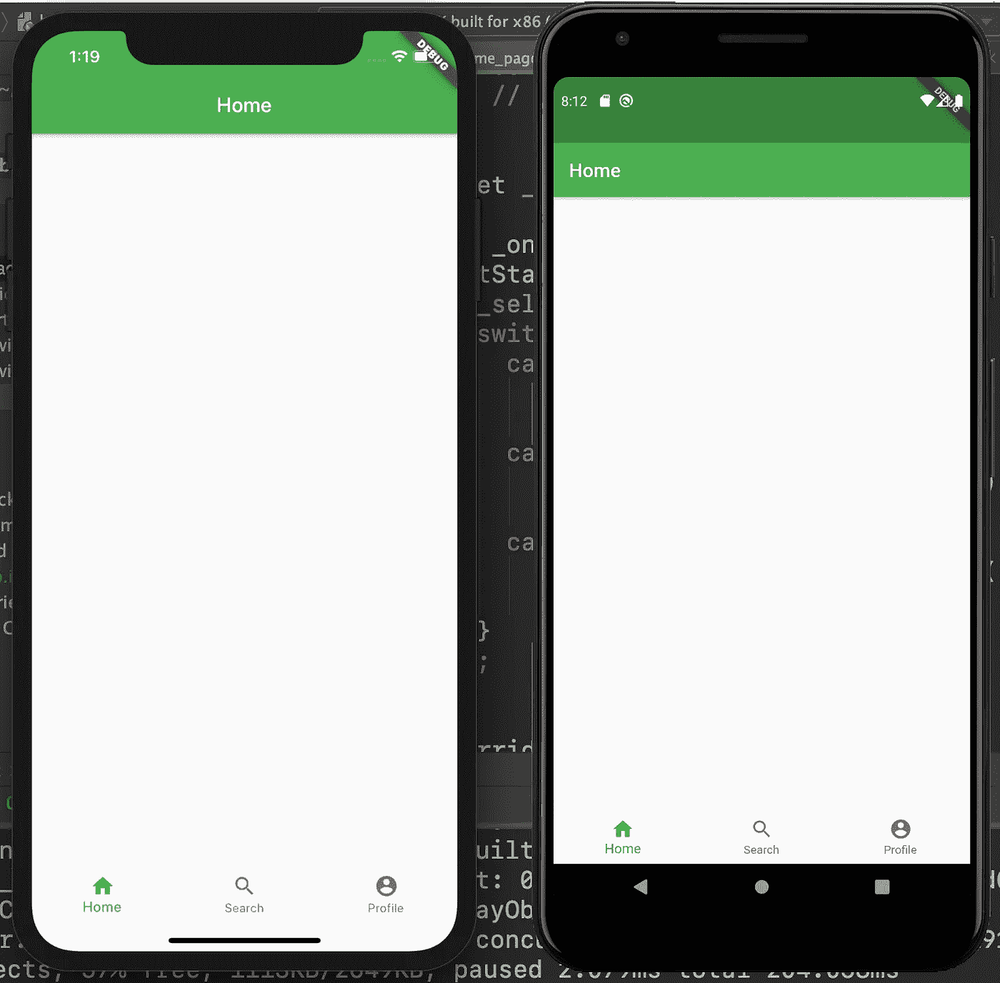

# 在 Flutter 中创建跨平台的选项卡式应用程序

> 原文：<https://betterprogramming.pub/create-a-cross-platform-tabbed-app-in-flutter-c728ca5e30f6>

## 使用 MaterialApp、AppBar 和 BottomNavigationBar 小部件

马克斯·尼尔森在 [Unsplash](https://unsplash.com?utm_source=medium&utm_medium=referral) 拍摄的照片

在这个简短的教程中，我们将学习如何在 [Flutter](https://flutter.dev/) 中快速创建一个选项卡式的跨平台(iOS 和 Android)应用。

该项目的源代码可以在文章的底部找到。

# 我们开始吧

首先，让我们创建一个全新的项目，并设置我们的`MaterialApp`和`HomePage`小部件:

现在，让我们更新一下`_HomePageState`类:

我们定义了`_selectedIndex`属性来跟踪哪个选项卡被点击。我们还创建了包含三个项目的`_navigationBarItems`列表:`Home`、`Search`和`Profile`。

最后，我们将这个列表添加到`build`方法内的小部件树中。现在让我们为每个`BottomNavigationBarItem`添加单独的屏幕。

# 主页

让我们创建一个内部带有`AppBar`的`Scaffold`小部件:

# 搜索

类似地，我们添加另一个屏幕:

# 轮廓

最后，我们添加了`Profile`小部件:

现在让我们在应用程序中显示我们创建的屏幕。在`home_page.dart`中，我们应该添加一个`_currentWidget`属性并更新`_onItemTapped`方法:

并将`_currentWidget`属性包含在`build`方法中:

我们已经使用 Flutter 成功实现了一个选项卡式应用程序。

# 资源

项目的源代码:

 [## zafarivaev/TabbedFlutterApp

### 演示 MaterialApp、AppBar 和 BottomNavigationBar 小部件使用的 Flutter 应用程序。为一篇中等文章而写。…

github.com](https://github.com/zafarivaev/TabbedFlutterApp) 

# 包扎

想了解更多关于 Dart 和 Flutter 的知识？请随意查看我的其他相关作品:

 [## Flutter 中的' copyWith()'操作是什么？

### 通过一些修改重用现有的小部件

medium.com](https://medium.com/better-programming/what-is-the-copywith-operation-in-flutter-2567e4d924bf)  [## Flutter 中的导航仪是什么？

### 如何促进跨平台应用内部的流动

medium.com](https://medium.com/better-programming/what-is-the-navigator-in-flutter-640e864892e2)  [## 如何在 Dart 中实现委托设计模式

### 了解 Dart 中的 mixins 以及它们与 Swift 协议的比较

medium.com](https://medium.com/better-programming/how-to-implement-the-delegation-design-pattern-in-dart-d782de77c886) 

感谢阅读！