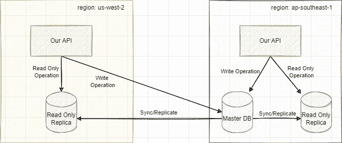
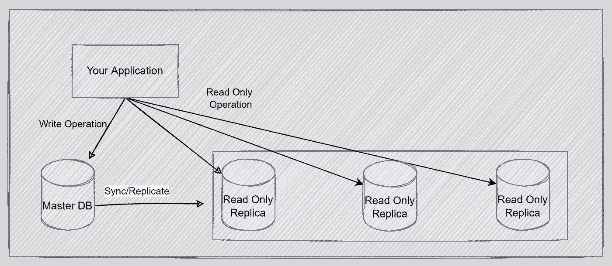
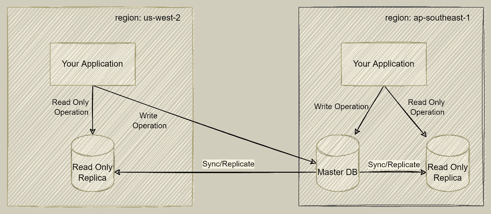

# 用 DBResolver 库处理跨区域数据库连接

> 原文：<https://betterprogramming.pub/create-a-cross-region-rdbms-connection-library-with-dbresolver-5072bed6a7b8>

## 连接到 Golang 应用程序中的多数据库和跨区域数据库

[菲利斯](https://unsplash.com/@miniminion?utm_source=medium&utm_medium=referral)在 [Unsplash](https://unsplash.com?utm_source=medium&utm_medium=referral) 上的照片

一个月前，我在做一个 Golang 项目。这个项目与一些授权数据有关。简而言之，由于我们服务的需要，该项目必须部署在多个地区。

我们使用全球数据库，所有地区都有复制数据库。例如，在我们的例子中，我们的应用程序部署在`us-west-2`和`ap-southeast-1`区域。如果绘制成图表，它将是这样的:

所以这个没有错。但问题是，在处理连接分离时，我花时间去理解如何在 Golang 中轻松地做到这一点。我搜索了一个可以帮助解决这个问题的库，我找到了一个，来自 Gorm 的 DBResolver，但是问题是我们没有使用 Gorm。经过一些权衡，我决定用 Golang 编写我的库，它将利用数据库的连接分离。

# 为内置 Golang sql 引入 Golang dbresolver。分贝

从上述问题出发，我创建了自己的 Golang 库来处理数据库连接。

*   [https://github.com/bxcodec/dbresolver](https://github.com/bxcodec/dbresolver)

## **用例 1:分离的 RW 和 RO 数据库连接**

假设您正在构建一个对数据库进行大量读取操作(查询)的应用程序(例如，像 Medium.com 这样的媒体平台)。假设您的数据库限制连接数只有 100，但是您有许多并发用户进入并最终使用数据库的所有最大连接数。这将影响性能和用户体验。

如何轻松地处理这一点是通过复制数据库和分离“写”和“读”数据库。在这种情况下，我们将定义一个主(主/主)数据库，并根据需要创建其他副本(可能有 2-3 个只读副本)。

所以总结一下:

*   您已经部署了应用程序
*   您的应用程序需要大量的读取操作
*   您的数据库被复制到多个副本以实现更快的查询
*   您为优化的查询分离连接

用例#1 dbresolver

## **用例 2:跨区域数据库**

这是一个与用例 1 相似的用例。不同之处在于，在用例#1 中，您的应用程序只在一个区域中部署和运行。在这个用例中，您需要为一个多区域应用程序提供服务，但是仍然希望它在各个区域之间保持一致。

假设授权和认证服务可能是这个用例的一个例子。因为它需要大量的读取操作，例如选择用户信息、获取用户许可列表、获取用户角色等。，因为这是一个授权系统，它应该是全球可用的。因此，如果我们阻止一些用户的访问，它应该在每个地区都被阻止。这就是为什么我们需要确保该应用程序部署在所有地区。

*   您的应用程序部署到多个地区。
*   您已经对数据库进行了全局配置。

用例 2 dbresolver

# 使用 dbresolver

基于我上面提到的用例，用内置的`*sql.DB`构建它需要时间。别担心。我创建这个库是为了在面对类似用例时节省您的时间。

以下是主要功能:

*   主副本之间的明显区别。
    有了这个库，您可以明确定义您的主数据库和副本数据库，而不用担心配置错误。
*   对主服务器读写，对副本服务器只读
    所有写操作将自动转到主服务器，对副本服务器的读操作将自动转到副本服务器(如果使用多个副本服务器，目前仅支持循环调度)。
    因此，每当您在应用程序中调用这些函数(`Exec`、`ExecContext`、`Begin`、`BeginTx`)时，它将自动使用主数据库。但是如果您使用这些函数(`Query`、`QueryContext`、`QueryRow`、`QueryRowContext`)，它将自动使用副本数据库。

例子

# 用例 1 的例子:一个地区有多个阅读器

为了举例说明如何在多阅读器数据库中使用它，下面是代码:

这里很清楚——我们只需要定义所有读者的联系。并初始化库。之后，我们可以在应用程序中使用它进行数据库操作。

# 用例 2 的例子:多区域应用

这是一个如何在多区域应用程序中使用它的示例。

这个例子很不一样。对于用例#1，我们需要显式声明所有的连接字符串。这里，你只需要声明一个阅读器，但是你需要做一种分支逻辑，比如`if region is 'us-west-2' then use the 'us-west-2 environments`

其余的将由图书馆处理。

# GitHub 知识库

听起来很棒？没错，现在您可以在业务逻辑上节省更多时间。让这个库处理您的连接数据库。

在此找到 GitHub repo:

*   [https://github.com/bxcodec/dbresolver](https://github.com/bxcodec/dbresolver)

如果你有更好的想法来改进这个小而有用的库，请随时提出问题或公关。