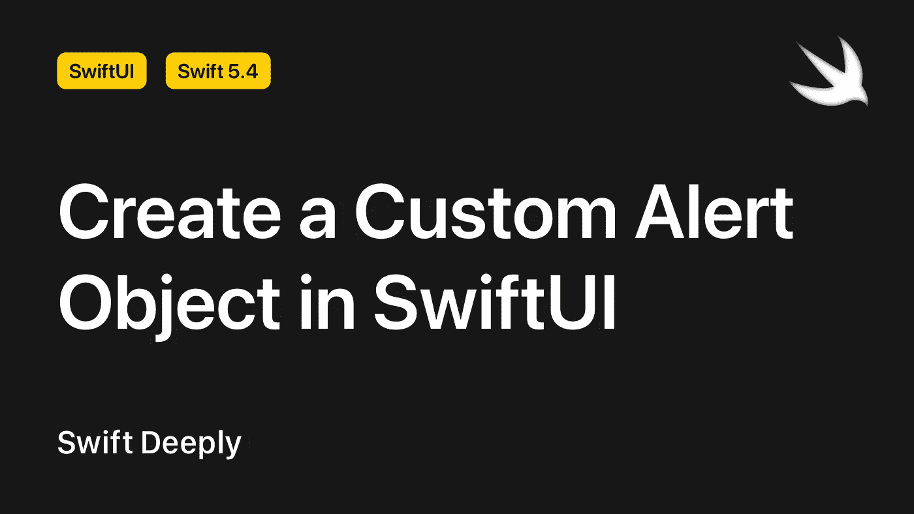
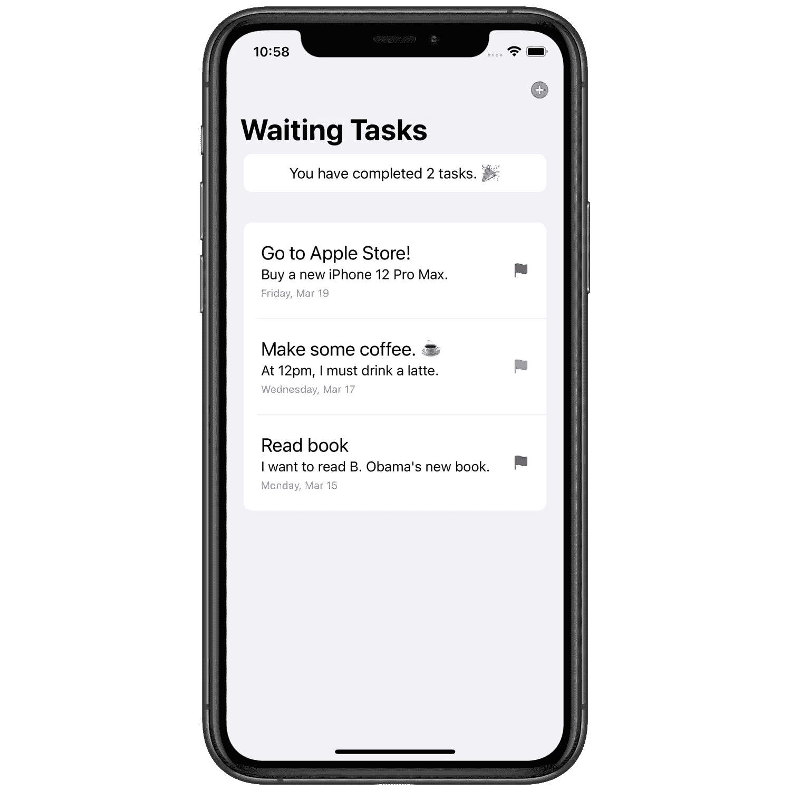
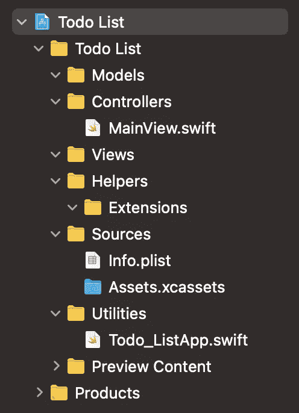
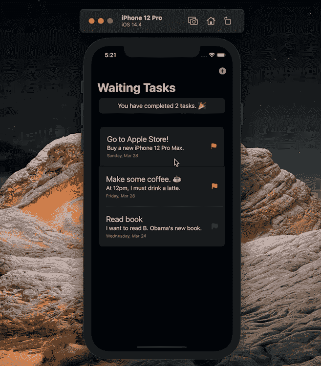
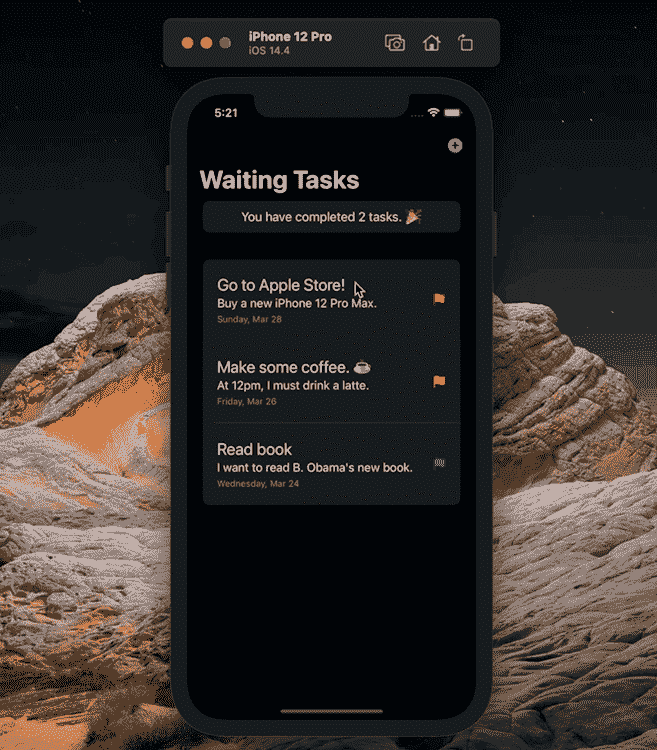

# 在 SwiftUI 中创建自定义警报对象

> 原文：<https://betterprogramming.pub/create-a-custom-alert-object-in-swiftui-bddf98923a1>

## 在 iOS 应用程序中开发您自己定制的提醒



作者图片

SwiftUI 还不支持定制的`Alert`对象，但是多亏了`UIViewControllerRepresentable`，我们可以开发自己的`Alert`对象，它支持我们想要的特性。在本文中，我们将创建一个能够适应多种情况的`Alert`对象。

**注意**:您可以[在 GitHub](https://github.com/SwiftDeeply/Crate-Custom-Alert-Object-in-SwiftUI) 上下载本文的示例项目和源代码。

# 项目概述

在解释一个主题时，你能做的确保主题被理解的最好的事情之一就是用真实的例子来解释这个主题。这就是为什么我还将创建一个自定义的`Alert`对象，用于待办事项应用程序。(当然，我将用来创建`Alert`对象的几乎所有特性都可以在不同的场景中使用。)

在待办事项应用中，我们将使用上下文菜单来删除和编辑待办事项列表项，并使用导航项来创建新的待办事项。事实上，这些 UI 元素不会直接删除、编辑或创建我们的待办事项列表项。它们只会作为一个`Alert`对象出现，允许我们进行这些操作。



不同属性的内容删除、编辑和创建操作所调用的`Alert`对象中的元素也需要不同。当然，为了做到这一点，我们首先需要创建一个项目并概述实现。

# 创建新项目

首先，创建一个新的 SwiftUI 项目，然后为我们将要创建的文件创建新文件夹。我通常在基本项目中使用这种团队方法。当然，你可以使用不同的分组方法。



当您将`Info.plist`文件移动到一个文件夹中时，您会遇到一个错误。您可以使用下面文章中的信息来解决这个问题。

[](https://canbalkaya.medium.com/how-to-set-info-plist-path-62cce55059b) [## 如何设置 Info.plist 路径？

### 了解如何解决 Info.plist 路径错误问题

canbalkaya.medium.com](https://canbalkaya.medium.com/how-to-set-info-plist-path-62cce55059b) 

# 构建数据模型

在这个项目中，我们将需要两个数据模型。第一个用于待办事项，第二个用于提醒操作。让我们建造第一个。

选择`Models`文件夹，按 CMD+N 创建新的 Swift 文件。创建 Swift 文件后，创建一个名为`TodoItem`的新结构。(在这个 Swift 文件中，我们将使用 UIKit 属性。这就是为什么你不应该忘记导入 UIKit 框架。)

```
**import** UIKit

**struct** TodoItem: Identifiable {

}
```

**注:**当我们要使用`ForEach`中的`TodoItem`对象时，我们会需要`Identifiable`协议，所以我们已经在`TodoItem`中写好了`Identifiable`协议。

`TodoItem`对象将有五个属性:标题、描述、优先级、日期、完成。`Priority`是一个自定义枚举对象，如下所示。

**注意**:我们使用`CaseIterable`协议在一个属性中定义所有情况。

现在我们可以定义所有的属性。(我们为下面的`Identifiable`协议定义了一个额外的属性`id`。)

定义一个静态的`TodoItem`数组，当应用程序第一次启动时，在应用程序界面中有样本数据。

当您键入这些代码时，会遇到一些错误。这些错误的原因是我使用了一个扩展来更改`Date`对象的值。我们将在这个项目中使用的`Date`扩展如下。

将来，我们将根据“优先级”值来更改我们将在界面元素中使用的颜色和文本。要做到这一点，我们需要创建一个如下所示的扩展。多亏了这个扩展，我们可以创建自定义的`RawValue`。(如你所见，我们的`RawValue`的数据类型是`(name: String, color: UIColor)`。这是一个元组。)

`TodoItem`型号完成！让我们开始创建和`Action`模型。

```
**struct** Action: Identifiable {

}
```

在这个模型中我们还需要一个 enum，因为我们将在项目中使用的`Alert`对象将有多种类型。

如您所见，我们不需要定义自定义的`RawValue`，因为 enum 的输出只是`String`。

这些是`Action`模型的属性。

我们不会用`Action`模型创建动态对象。它只是用于创建静态对象。因此，让我们在`Action`模型内部创建一个元组。这个元组拥有我们将在项目中使用的所有`Action`对象。

数据模型完成了！

# 准备数据存储类

现在我们需要一个数据管理器类。当然，我们需要在一个单独的 Swift 文件中定义这个类。如果你和我使用相同的组方法，这个 Swift 文件也应该在`Helpers`类中。

```
**import** SwiftUI

**class** DataStore: ObservableObject {

}
```

**注意:**我们使用`ObservableObject`协议通过`@Published`属性包装器来定义属性。

为了在项目的不同部分将`DataStore`类作为单例使用，我们定义了一个名为`shared`的属性。这样，通过键入`DataStore.shared`，就可以直接访问`DataStore`类。

```
// MARK: - Properties
**static** **let** shared = DataStore()
```

让我们将所有的`TodoItem`对象放在一个名为`allTodoItems`的数组中。用`@Published`定义这个属性的原因是为了让它在`DataStore`类之外发生变化时立即改变。

```
@Published **var** allTodoItems = TodoItem.example
```

创建两个单独的数组来对接受`true`和`false`对象的`TodoItem`值进行分组，如下所示。

定义以下属性，以定义将立即采取的动作、相应的菜单动作以及是否出现`Alert`对象。

```
@Published **var** currentAction: Action? = **nil**
@State **var** menuActions: [Action] = []
@Published **var** alertShowing = **false**
```

我们将在`DataStore`类之外使用的大多数函数中编写一个`TodoItem`参数。我们需要一个方法来找出所选的`TodoItem`对象在`allTodoItems`数组中的索引。下面的函数就是为了这个。

```
// MARK: - Methods
**private** **func** getSelectedTodoItemIndex(selected todoItem: TodoItem) -> Int {
    allTodoItems.firstIndex(where: { $0.id == todoItem.id })!
}
```

我们将在项目中使用`contextMenu`修改器。我们将给出下面的函数作为这个修改器的输出。

最后，将我们对`TodoItem`对象的所有更改定义为函数，如下所示。正如你所看到的，所有的函数都改变了`allTodoItems`数组。所以一切都根据`allTodoItems`变化。

`DataStore`下课了！

# 创建自定义警报对象

是时候创建我们的自定义`Alert`对象了，然后我们将创建应用程序的主 UI。这样我们的申请就完成了。

首先，在名为`TextFieldWrapper`的`Views`文件夹中创建一个新的 Swift 文件。然后编写如下代码。(该元件调整`Alert`对象是否出现在屏幕上。)

当你写这段代码时，你会得到一个错误，因为`TextFieldAlert`对象丢失了。让我们创建这个对象。

你可以把`TextFieldAlert`想象成一个定制的`Alert`对象，因为在这个对象中，我们将把一个`UIAlertViewController`对象转换成一个带有`UIViewControllerRepresentable`协议的 SwiftUI 元素。

因为我们将从我们定义的`Action`对象接收与`Alert`相关的所有信息，所以我们在里面定义了一个`Action`属性。

当然，我们定义了一个`UIViewControllerRepresentable`扩展来将`UIAlertViewController`对象转换成 SwiftUI 元素。

如您所见，这次我们得到一个错误，因为我们没有一个`TextFieldAlertViewController`。

要创建`TextFieldAlertViewController`对象，创建一个新的 Swift 文件并编写以下代码。(我们导入 Combine 框架的原因是为了使用`AnyCancellable`对象。)

当我们的`Action`类型是“创建”或“编辑”时，我们将在我们的`Alert`对象中使用两个`UIPickerView`对象。我们将把`UIToolbar`添加到这些`UIPickerView`对象中的一个。让我们用以下方法定义这个`UIToolbar`中要使用的按钮的动作。

现在我们将为我们的`UIAlertViewController`对象定义主方法。

在这里，我们根据当前`Action`对象的类型来确定将出现在`UIAlertController`中的 UI 元素。

我们在第三个`UITextField`中遇到了一个错误，因为我们还没有定义`datePicker`方法。让我们将下面的内容写入`UITextField`扩展来定义方法。

为了让`TextFieldAlert`对象像`alert`修改器一样工作，我们需要创建自己的修改器。我们可以在一个`View`扩展中做到这一点。

自定义`Alert`对象完成！

# 准备用户界面

我们将创建两个屏幕。第一个是针对未完成的任务，另一个是针对已完成的任务。

## 第一屏

实际上，第一个屏幕的 Swift 文件现在在我们的 Xcode 项目上:`ContentView.swift`。让我们把名字从`ContentView`改成`UncompletedTasksView`。

要在这个页面上使用`DataController`类，定义一个名为`dataController`的值。

正如你在文章的开头所看到的，在这一页的顶部有一个部分显示了已经完成的任务的数量。让我们编写下面的代码来创建这个部分。

如果我们把这个部分改成 UI 组件会更好。为此，创建一个名为`CompletedTasksSectionView`的新 SwiftUI 文件。

定义一个名为`count`的`Int`属性来显示有多少任务。

```
// MARK: - Properties
**let** count: Int
```

然后在这里写我们几行前写的`Section`元素。

我们可以在页面内部使用`CompletedTasksSectionView`组件来代替旧的组件。

编写以下修饰符对`NavigationView`和`List`元素进行修改。

现在是时候使用我们的`textAlert`修改器了。就像写`alert`修饰符一样，我们在`NavigationView`之外写`textAlert`修饰符。我们用于`isPresented`和`action`参数的属性来自`dataController`。

现在让我们创建`List`元素的第二个`Section`。(这个元素将是我们列表的动态部分。)

首先如下定义我们需要的属性。

```
// MARK: - Properties
**let** dataStore = DataStore.shared
**let** todoItem: TodoItem
```

然后通过编写以下代码创建接口。

我们的`ListCellView`元素如下所示:


`ListCellView`元素已准备就绪。返回`UncompletedTasksView`结构。如果我们将它与`ForEach`元素一起使用，我们可以在界面中即时动态显示`incompleteTodoItems`数组中的所有对象。

我们将在第一个屏幕中使用`sheet`修改器，因为我们的第二个屏幕将是一个工作表屏幕。因此，我们现在需要创建第二个屏幕。

```
**struct** CompletedTasksView: View {

    // MARK: - View
    **var** body: **some** View {
        Text("Hello, World!")
    }
}
```

使用`@State`属性包装器为`sheet`修改器的`isPresented`参数创建一个`Bool`属性。

```
@State **private** **var** completedTasksViewIsAppear = **false**
```

最后，在`NavigationView`外面写`sheet`修饰符。

```
NavigationView {
    // ...
}
.sheet(isPresented: $completedTasksViewIsAppear, content: {
    CompletedTasksView()
})
```

第一屏完成了！来体验一下吧。



## 第二屏

现在我们要做的就是创建`CompletedTasksView`元素。为了实现这一点，让我们在`CompletedTasksView`结构中定义以下两个属性。

```
// MARK: - Properties
@ObservedObject **var** dataStore = DataStore.shared
@Environment(\.presentationMode) **var** presentationMode
```

然后创建接口。(如您所见，下面的代码与第一个屏幕的代码非常相似。)

当我们运行`presentationMode`属性中的`dismiss()`方法时，我们将返回到第一个屏幕。所以当这个人按下完成按钮时，它将返回到第一个屏幕。

对，app 做好了！让我们一起来看看它是如何工作的。



# 结论

我们现在创建的`Alert`对象拥有尽可能多的我们可以在 UIKit 中添加的特性。所以现在您有了一个可以在 SwiftUI 项目中实际使用的`Alert`对象。

我希望你喜欢阅读这篇文章。如果你有任何问题，请在评论区留言。

**我的其他文章:**

*   [在 SwiftUI 中使用文件管理器](/using-filemanager-in-swiftui-44bc0f33995e)
*   [使用 SwiftUI 构建跨平台应用](/building-cross-platform-apps-with-swiftui-3fea88cdb0ae)
*   [如何在 SwiftUI 的新应用生命周期中使用 Firebase](/how-to-use-firebase-in-swiftuis-new-application-lifecycle-c77a8a306d63)