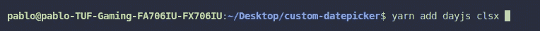

# 使用 Day.js 创建带有 React 和 TypeScript 的自定义日期选择器

> 原文：<https://betterprogramming.pub/create-a-custom-date-picker-with-react-and-typescript-from-scratch-25d44dc0b76d>

## 为什么不呢？—事实证明，这很简单。

在本文中，我们将从头开始创建一个简单的 react 日期选择器。作为我们的日期操作助手，我们将使用一个名为“ [Day.js](https://day.js.org/) ”的库。请不要太在意造型。我们的目标是创建一个基本组件，您可以随意修改它。

## 那么 Day.js 是什么呢？

> Day.js 是一个极简主义的 JavaScript 库，可以解析、验证、操作和显示日期。真的很轻量级(只有 2 kB！)并公开了非常简单的 API。

## 为什么我们不能使用一些库，比如" [react-datepicker](https://www.npmjs.com/package/react-datepicker) "？

首先，这篇文章一点都不会有趣，如果我只是给你演示如何安装一个库)。此外，我认为有些情况下，不需要任何第三方包(通常很难定制)就可以轻松实现。

# 我们最后的结果是什么？

我们这里有什么功能？

1.  显示当月日期和工作日名称的日历。此外，它可以向前或向后翻转。
2.  选择特定日期的功能。默认情况下，将选择当前日期。

# 我们开始吧！

## 依赖性。

首先，我们需要安装我们的依赖项。正如我之前提到的，我们将使用`Day.js`和名为“clsx”的库，这允许我们轻松地组合类名(这完全是可选的，我只是更喜欢使用它)

## App 组件。

一切都很简单。我们将为我们的应用程序创建一个框架，并为我们的日历添加一个状态。注意，我们在这里调用`dayjs`作为初始值。它返回给我们包含当前日期信息的`dayjs`的实例。此外，我们将选定的日期格式化并放在标题中。不要担心`DatePicker`的导入，下面我们会稍微实现一下。

## 日期选择器组件

接下来，我们应该创建我们的`datepicker`根组件。我会把它分成两个独立的部分。

第一部分是`DatePickerSelector`，这是包含我们翻转逻辑的地方。

第二个部分叫做`DatePickerCalendar`负责显示日历和选择具体日期。

我们的组件接收两个道具:

1.  `selectedDate`是`dayjs`实例，代表选择的日期。
2.  `onChange`是单击日期单元格时调用的处理程序，它获取新的日期作为第一个参数。

另外，请注意，我们还有另一个名为`shownDate`的本地状态。它将负责在我们的日历中显示正确的月份和年份。

## 日期选择器组件

正如我之前提到的，这个组件将包含我们的翻转逻辑。这里没有什么特别的，我们只是处理我们的点击事件，并按月增加/减少我们的`shownDate`。

`changeDateMonth`也是一个决定我们是否需要加减年份的函数。

## 日期选择器日历组件

为了实现这一部分，我们需要提前创建一些助手。首先，让我们创建一个界面来表示日历中的单个单元格，它将被称为`ICalendarCell`。此外，我们将编写另外两个函数:

1.  `getCalendarCells`将获取当前显示的日期并返回一个单元格数组。此外，它将添加上个月和下个月的天数，以完全填充我们的日历行。
2.  `getCalendarRows`将返回日历的行数组。

在此之后，我们可以移动到我们的用户界面。

这里的一切都很简单:

1.  `handleSelectDate`是一个选择日期处理程序，它利用闭包并调用`onChange`和所需的日期。
2.  `rows`是我们`getCalendarRows`的一个记忆返回值。所以它只在显示的日期改变时才重新计算。
3.  在 29–35 行中，我们渲染工作日。
4.  在 37–56 行中，我们呈现日历日行。此外，我们根据选择的日期附加适当的类名。

本文到此为止。现在我们的`Datepicker`组件已经可以使用了。

 [## 如何在 4 个月内成为前端开发人员

### 寿命测试指南

javascript.plainenglish.io](https://javascript.plainenglish.io/how-to-become-frontend-dev-in-4-months-ec3f61576251)  [## 对那些会让你被解雇的错误做出反应

### 5 种常见的反应使用状态错误以及如何避免它们

普通英语。](https://javascript.plainenglish.io/5-react-usestate-mistakes-that-will-get-you-fired-b342289debfe)  [## 前端架构:“经典”方法(无架构)

### 了解最常见前端架构的优缺点

javascript.plainenglish.io](https://javascript.plainenglish.io/frontend-architectures-classic-approach-no-architecture-d3c839e46403) 

**感谢阅读！**

我希望，这篇文章对你有用。如果您有任何问题或建议，请留下评论。你的反馈帮助我变得更好。

别忘了 subscribe⭐️