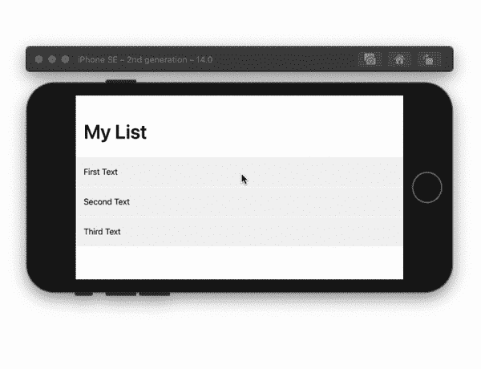
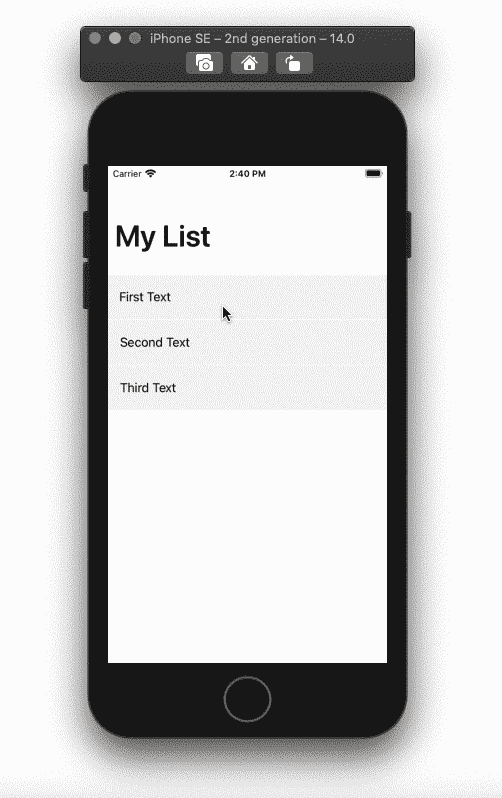
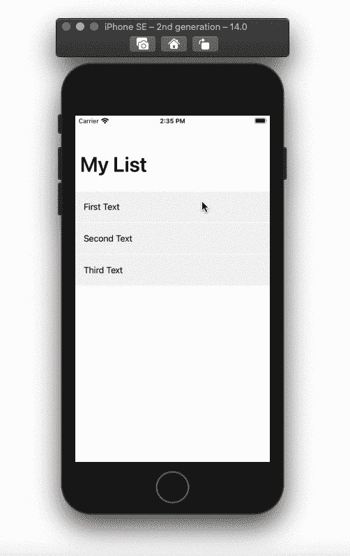

# 在 SwiftUI 中创建自定义列表

> 原文：<https://betterprogramming.pub/create-a-custom-list-in-swiftui-f7fda59a9e0a>

## 带有定制侧按钮的 SwiftUI 列表

SwiftUI 中的自定义列表(GIF 由作者提供)

在本教程中，我们将创建一个带有两个操作按钮的自定义列表，当您向左滑动一行时，会出现这两个按钮。我们将从一侧按钮开始。这将是一个删除按钮。然后我们可以添加第二个按钮来展示如何向该行添加更多的按钮。

开始一个新的 iOS 14 项目，然后跟着做。

# 常量和变量

创建一个类型为`View`的新结构，并声明以下变量:

*   `Text`:存储我们行的内容。
*   `index`:行的索引。用于删除/隐藏一行。
*   `width`:所有侧边按钮的宽度。以前知道向左滑动多少。
*   `indices`:存储删除/隐藏行索引的绑定数组变量。
*   `offset`:当滑动动作发生时，用于向左移动一行的浮动变量。
*   `scale`:用于动画显示侧边按钮出现时的比例。

# 行内容

在 body 变量中，使用`GeometryReader`获取我们的行的宽度和高度。在一个`VStack`中，插入你所在行的所有内容。在本教程中，我们有一个`Text`视图，它接受我们的文本变量和将作为删除按钮的侧边按钮。

使用 SF 符号名为“trash”的图像作为“删除”按钮。使用`onTapGesture`而不是将图像放入`Button()`中。在`onTapGesture`内部，将删除/隐藏行的索引追加到`indices`数组中。

使用`HStack`上的背景修改器添加颜色。如果没有背景色，您将只能在`Text`视图顶部开始滑动时滑动该行。我们希望能够从一行中的任何位置开始刷卡:

# 滑动动画

将以下修改器添加到背景修改器下的`HStack`:

*   `offset`:用于将行向左偏移，回到正确位置。偏移量的宽度值在零和减号中侧按钮的宽度之间交替。
*   `animation`:动画显示行的移动和垃圾桶按钮的比例。
*   `gesture`:使用`DragGesture()`通过检查手势的开始和结束平移宽度值来检测向左滑动。当检测到滑动时，我们可以偏移行并改变垃圾桶按钮的比例。

# 内容视图

在我们的`ContentView`中，我们将使用一个`ScrollView`和一个`LazyVStack`来代替列表。这是因为我们不想要我们的行之间的分隔线。

创建一个保存文本内容的数组，然后使用`ForEach`遍历它。在使用`RowContent`并向其传递`text`、`index`和`indices`变量之前，我们需要检查`index`是否在`indices`数组中，该数组保存了我们删除/隐藏的行的索引。给我们的`RowContent`一个帧修改器来调整每行的高度:

自定义列表—删除行

# 添加按钮

为了展示如何在我们的行中添加更多的按钮，我们将添加一个带有重叠图像的图像。首先，删除宽度常量，并为每个按钮的宽度使用一个常量值，如 60。将`DragGesture()`内的偏移值调整为所有按钮的宽度总和。在这里，它将是 120。

我添加了一个`offsetY`变量，它将被用来激活我们的新按钮。该按钮将由两个重叠的图像组成。当滑动发生时，第二个图像将在其 y 轴上偏移。给重叠图像添加一个偏移修改器，然后改变`DragGesture`中的`offsetY`值。该值将在-20 和零之间变化。

SwiftUI 中的自定义列表

全部完成！感谢阅读。