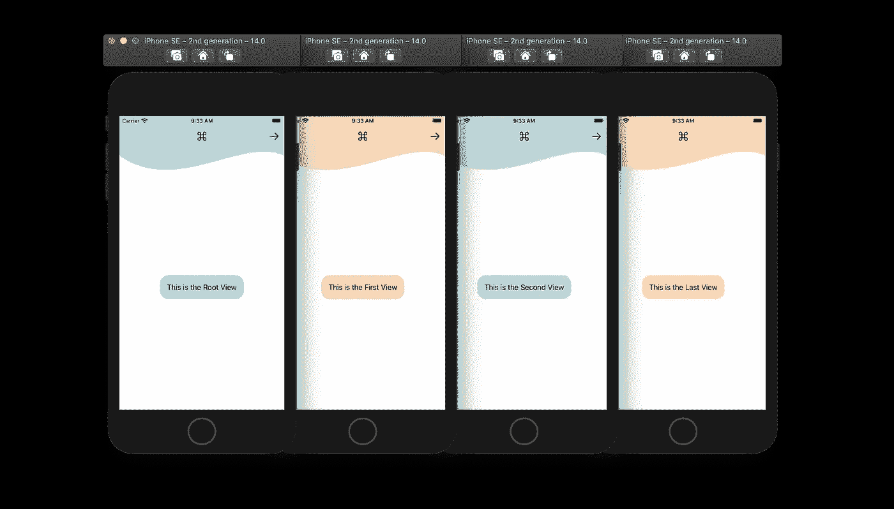
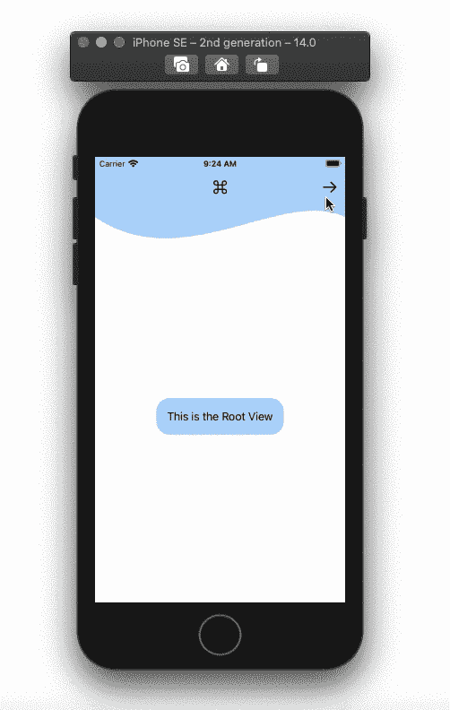

# 在 SwiftUI 中创建自定义导航视图

> 原文：<https://betterprogramming.pub/create-a-custom-navigation-view-in-swiftui-88e70c32ffed>

## 如何使用@ViewBuilder、PresentationMode 和 NavigationLink 自定义导航视图和栏



作者照片。

用两种通用类型定义您的自定义导航视图。第一种类型是`Content`，用于在我们的自定义导航视图中传递视图。第二种是`Destination`，用来传递任意目的视图。

```
**struct** CustomNavigationView<Content: View, Destination : View>: View {
}
```

*   `Content`:符合视图的通用类型。它将允许我们添加一个闭包来提供多个子视图。
*   `Destination`:符合 View 的泛型。它用于传递目的链接。

# 常量和变量

在我们的自定义导航视图中，添加以下变量和常量。使用`init()`将`@ViewBuilder`属性添加到内容中。

*   `destination`:用于将目的地视图传递给我们的自定义导航视图。没有目的地视图时给它一个`EmptyView()`。
*   `isRoot`:用于建立根视图的布尔值。我们将使用它来控制后退箭头按钮的不透明度。
*   `isLast`:用于确定最后一个视图的布尔值。对于本教程，我们将使用这个值来控制导航链接按钮的不透明度。
*   `color`:自定义导航栏颜色。
*   `content`:为将子视图传递给我们的自定义导航视图提供闭包。
*   `active`:用于控制导航链接的状态变量。
*   `mode`:一个环境变量处理程序，用于关闭视图。

# 导航栏形状

对于导航条，你可以有一个带背景色的`HStack`，或者你可以创建一个自定义的形状，将导航条项目堆叠在上面。对于本教程，我们将创建一个波形，并将其添加到一个`ZStack`，然后添加一个带有导航项目的`HStack`。

# 自定义导航视图正文

在 body 变量中，在一个`NavigationView`中添加一个`GeometryReader`。`GeometryReader`将用于确定我们的 UI 元素的大小。给我们的`GeometryReader`，加上`color`，会把视图尺寸扩大到屏幕尺寸。在`color`下，添加一个`VStack`，它将包含我们上面创建的`WaveShape()`。将波形嵌入到`ZStack`中，并调整其框架。要移除屏幕顶部的安全区域，请使用修饰符`.edgesIgnoringSafeArea(.top)`。

对于同一个`VStack`，插入我们的`content`常量以及您希望内容拥有的修饰符。在`VStack`中的所有元素之间使用`Spacer()`。这应该会将我们的自定义导航栏移动到屏幕的顶部，并将我们的内容移动到屏幕的中央。

`NavigationView`只是被雇佣来让`NavigationLink`工作。我们将不会使用使用`NavigationView`时附带的默认导航栏。要删除默认导航栏，添加修饰符`.navigationBarHidden(true)`。

# 导航栏

我们需要做的最后一件事是向导航栏添加项目。在本教程中，我们将有一个居中的图像，可用于徽标，还有两个箭头图像，分别位于左侧和右侧，带有点击手势，用于在视图之间导航。确保给图像相同的宽度，并在它们之间添加`Spacer()`。

在第一个箭头的点击手势中，使用 mode 变量关闭当前视图。在第二个箭头的点击手势中，切换我们在本教程开始时定义的`active`变量。

添加`NavigationLink`并将其传递给`active`和`destination`变量。给`destination`视图添加`.navigationBarHidden(true)`修改器。

# 内容

创建多个视图以在它们之间导航。在你创建的每个视图中使用我们的`CustomNavigationView`。在内容闭包中，添加您的 UI 内容。看看下面的例子，看看如何填写参数。



完整代码[点击这里](https://github.com/SarahAlsharif/CustomNavigationView)。

感谢阅读！