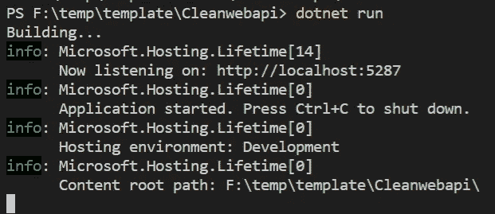
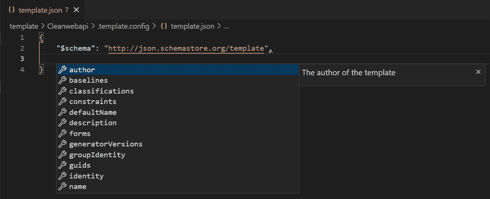

# 为点网新建创建自定义模板

> 原文：<https://betterprogramming.pub/create-a-custom-template-for-dotnet-new-9feae7ed5b55>

## 编程技巧和诀窍

## 停止浪费时间清理初始项目


罗曼·辛克维奇·🇺🇦在 [Unsplash](https://unsplash.com?utm_source=medium&utm_medium=referral) 上拍摄的照片

当开始一个新项目时，我经常使用`dotnet new webapi`命令。我必须做的第一件事是清理项目。我删除我不需要的文件，并重命名和修改我想保留的文件。然后，我想，“必须有一种方法来定义我自己的模板，这样我就可以跳过清理。”嗯，有。

在本文中，我将向您展示如何创建一个自定义模板来使用`dotnet new`命令。这样，您就可以获得您想要的项目，而不必清理示例代码。

有趣的是，我必须做的第一件事是创建一个 Web API 项目并清理它。在名为`template`的文件夹中，我运行`dotnet new webapi`来创建一个示例项目。

```
dotnet new webapi --no-https -n Cleanwebapi
```

然后，像往常一样，我清理样本代码。我不再需要天气预报文件，所以我删除了它。

```
PowerShell
--------------------------------------------------------------------
ri .\Cleanwebapi\WeatherForecast.cs
```

我还将默认的控制器文件重命名为`CleanWebApiController`。

```
PowerShell
--------------------------------------------------------------------
ren .\Cleanwebapi\Controllers\WeatherForecastController.cs CleanwebapiController.cs
```

现在我打开`CleanwebapiController.cs`，找到并替换`WeatherForecast`到`Cleanwebapi`。我取出`Summaries`阵。最后，我替换 GET 方法并添加一个 POST 方法。在 GET 方法中，我记录它被调用并返回“Hello World”在 POST 方法中，我记录被发布的主体。当代码运行时，日志消息将可见。

随着项目的更新，我执行它以确保它能够编译和运行。



模板正在工作

接下来，我使用 [REST 客户端扩展](https://marketplace.visualstudio.com/items?itemName=humao.rest-client)为 [Visual Studio 代码](https://code.visualstudio.com/)创建一个 HTTP 文件来发送测试方法的请求。我首先测试 GET 方法，在`port 5287`到`cleanwebapi` 路由上请求 localhost。

发送请求返回状态码 200，值“Hello World”，终端显示记录的消息。现在我用 JSON 主体测试 Post 方法。发送这个请求还会返回一个状态码 200，终端会显示 JSON 主体的日志消息。


应用程序日志

测试完代码后，我停止它并删除 bin 和 obj 文件夹，这样它们就不会包含在模板中。

```
PowerShell
--------------------------------------------------------------------
ri .\bin\ -fo -r
ri .\obj\ -fo -r
```

为了将这些文件转换成模板，我添加了一个`.template.config`文件夹，并在其中放置了一个`template.json`文件。注意:以下命令(mcd 和 touch)需要[轨迹。Utils PowerShell 模块](https://www.powershellgallery.com/packages/Trackyon.Utils/0.2.1)。

```
PowerShell
--------------------------------------------------------------------
mcd .template.config
touch template.json
```

首先，我将一个架构添加到文件中，这将使 Visual Studio 代码能够提供智能感知。在对模式进行编辑时，按 CTRL + space 组合键会列出可以添加到该文件中的所有属性。



所有可能的元素

我从`author`开始，输入我的 Twitter 账号。然后我添加了`classifications`，这是用户可以用来搜索模板的特征。当使用`dotnet new`命令列出可用模板时，`classifications`也会出现在标签栏中。接下来，我在`identity`属性中为模板添加一个惟一的名称。`name`属性是列出可用模板时用户看到的值。

`shortName`是从命令行使用的，是在`dotnet new`之后键入的。将`preferNameDirectory`设置为 true 将创建一个目录，而不是直接在当前文件夹中创建内容。模板中的`sourceName`将被替换为用户提供的名称。这将在文件和文件名中被替换。注意这个值的大小写，并确保它匹配，否则将不会被替换。最后，我使用`tags`属性来设置`language`和`type`。

随着`template.json`文件的完成，我现在可以安装和使用这个模板了。为了安装，我使用带有`-i`选项的`dotnet new`命令指向当前文件夹 Cleanwebapi。

```
PowerShell
--------------------------------------------------------------------
dotnet new -i .
```

该命令的输出显示了新的“干净的 ASP.NET 核心 Web API”模板。安装好模板后，我使用 cleanwebapi 模板创建了一个新项目。

```
PowerShell
--------------------------------------------------------------------
dotnet new cleanwebapi -n Test
```

列出新测试文件夹的内容显示了使用传入的名称创建的`Test.csproj`文件。

```
PowerShell
--------------------------------------------------------------------
lsDirectory: F:\temp\template\TestMode            Length Name
----            ------ ----
d----                  Controllers
d----                  Properties
-a---           127    appsettings.Development.json
-a---           151    appsettings.json
-a---           527    Program.cs
-a---           327    Test.csproj
```

列出*控制器*目录显示控制器文件名为 *TestController.cs* 。

```
PowerShell
--------------------------------------------------------------------
lsDirectory: F:\temp\template\Test\ControllersMode            Length Name
----            ------ ----
-a---           600    TestController.cs
```

最后，打开该文件会显示名称空间和类名也是使用由`-n`选项提供的名称创建的。

使用`dotnet new`创建自定义模板很容易，并且可以节省您的时间。

感谢阅读。下次见！

## 信用

编辑:[切尔西·布朗](https://cbrownauthor.com/)