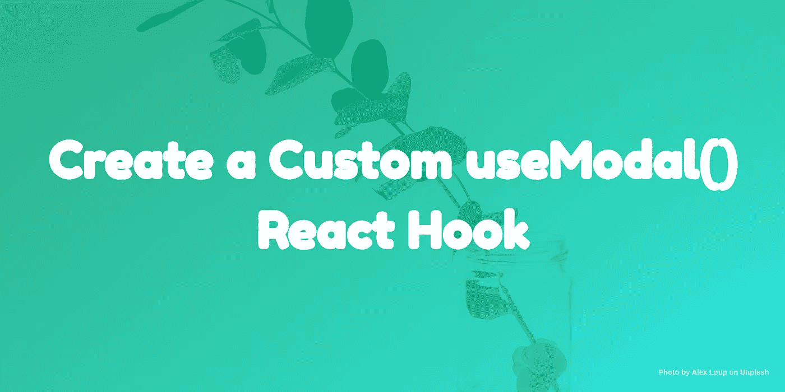

# 创建一个自定义的 useModal() React 挂钩

> 原文：<https://betterprogramming.pub/create-a-custom-usemodal-react-hook-449b5909cc09>

## 谁不喜欢好的、简单的模态呢？

我正在通读 [Scotch.io](https://scotch.io/) ，我看到了 Chris Nwamba 的一篇关于创建自定义 [React](https://reactjs.org/) Hook: `useFetch`的[文章。](https://scotch.io/tutorials/create-a-custom-usefetch-react-hook)

定制钩子是我一直在工作和兼职项目中使用的东西，我已经创建了几个(包括`useModal`)来分享。

众所周知，React 挂钩是 JavaScript 函数，它允许您从函数组件中使用 React 状态和效果。自定义钩子是一个名字以`use`开头的函数，调用其他钩子的函数。

关于自定义 React 挂钩，我不会详细介绍，上面的文章是一个很好的起点。

如果你想直接得到代码和演示，你可以看看下面的链接:

1.  [演示](https://csb-n1drq.netlify.com/)
2.  [GitHub 代码](https://github.com/CITGuru/custom-react-modal-hook)
3.  [项目](https://codesandbox.io/s/cocky-gauss-n1drq)

# 入门指南

在本教程中，我将解释如何为模态组件创建自定义的 React 钩子。

由于 React 中的可访问性和结构问题，模态组件非常麻烦。模态在屏幕上有一个覆盖层，它比所有其他元素具有更高的视觉优先级。

如果我们使用 z 指数，它应该是最高的。然而，这是一种不好的做法，因为它嵌套很深，并且树中的父元素优先于 CSS。

因此，要构建一个好的 React 模态组件，我们需要:

*   出于可访问性的原因，使用门户将模态添加到 DOM body 属性的末尾。
*   一旦呈现了 DOM，就将模态挂载到 DOM。
*   当模态被隐藏时，从 DOM 中移除它们。

# 构建一个反应模式组件

我们将从构建一个使用自定义`useModal`的 React 模态组件开始。

对于这个教程，我将使用[blomer](https://bloomer.js.org/)的模式，你可以用`yarn add bloomer`安装它们。

让我们看看下面这个简单的模态分量:

这是一个相当容易理解的组件，有助于将我们的组件包装在一个函数中。我们可以用以下方式启动它:

# 编写自定义钩子:useModal

我们的模态组件已经准备好了，让我们看看主主题，看看如何创建一个`useModal`钩子。

考虑下面的代码:

上面我们做了不少事情:

*   为我们的`modalOpen`状态添加了`useState`钩子，并将值设置为`initialMode`。
*   声明了一个调用`setModalOpen`的`toggle`函数，它将改变我们的`modalOpen`值。
*   返回了`modalOpen`、`setModalOpen`和`toggle`，因此组件可以访问它们。

# 使用

然后，为了同时使用`CustomModal`和`useModal`，考虑下面的例子:

Tada！我们现在可以使用一个定制的钩子来启动我们的模态了:`useModal`。

我们在这里所做的就是:

*   导入我们的`useModal`函数，初始化它，并访问`itemModalOpen, setItemModalOpen, toggleModal`。
*   我们将`toggleModal`传递给按钮，这样我们就可以用按钮切换我们的模态。
*   接下来，我们将`itemModalopen`传递给`isActive`道具。
*   然后我们将`setItemModalOpen`传递给我们的`handleClose` prop 函数。

# 将数据传递给模式:useModalWithData

我们的`useModal`工作得很好，可以毫无故障地使用。

但是，启动模型的速度很快，而且无法知道是哪个元素启动了它，也无法通过钩子向它传递数据。

让我们假设您正在处理一个包含数据列表的表。您希望能够单击一行或一列，并让一个模态显示您所单击内容的全部细节。

一种方法是，您需要将一个`id`，或者您点击的元素的完整数据，传递给`useModal`，然后传递给将使用该数据的组件。

考虑下面的定制挂钩`useModalWithData`:

我们在上面所做的是:

*   初始化我们之前的`useModal`，从钩子访问`modalOpen`和`setModalOpen`。
*   初始化`useState`以存储我们选择的`id`状态，以及`setSelected`以应用更改。
*   声明一个将`state`作为道具的`setModalState`函数，调用`setModalOpen`来控制模态，如果`state`为假，则将`selected`设置为空。
*   然后我们返回钩子之外可以访问的东西。

# 使用

在本例中，我们将创建三个组件:

*   `UserTable`:以表格形式显示用户列表。
*   `UserDetail`:显示用户的全部详细信息。
*   `UserInformation`:用于`UserTable`和`UserDetail`的组件包装器。

让我们从创建一个表格组件开始:

上面是一个简单的 React 组件，它映射给定的数据，并在一个表格中显示出来。

接下来要看的是显示全部细节的`UserDetail`组件:

上面的组件应该很容易理解，因为我们只显示了道具的数据。

让我们看看如何将所有这些放在`UserInformation`组件中:

最后，让我们添加虚拟数据来填充我们的表。我们现在可以使用它，如下例所示:

# 结论

由于 React 构造 DOM 的方式，模态可能是 React 中一个棘手的组件。与 React 挂钩一起使用会使它更复杂。

现在你已经学会了如何创建一个定制的模态钩子，你可以将相同的模态逻辑扩展到不同类型和风格的模态。

在以后的文章中，我会写一系列关于我使用钩子的方法，从无限卷轴到表单等等。

你也应该订阅我的 YouTube 视频教程。

感谢阅读！