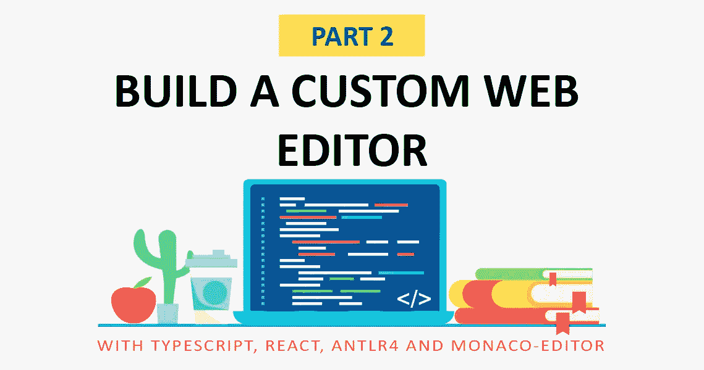
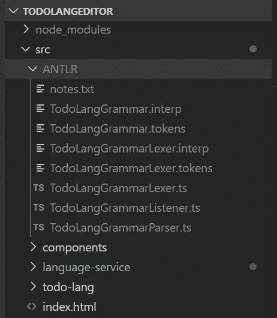
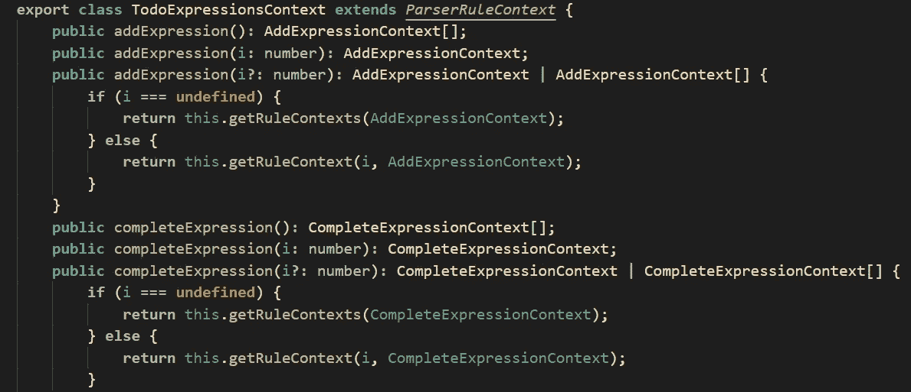
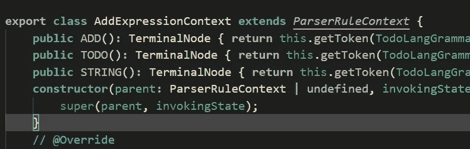
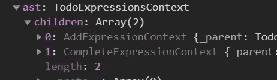
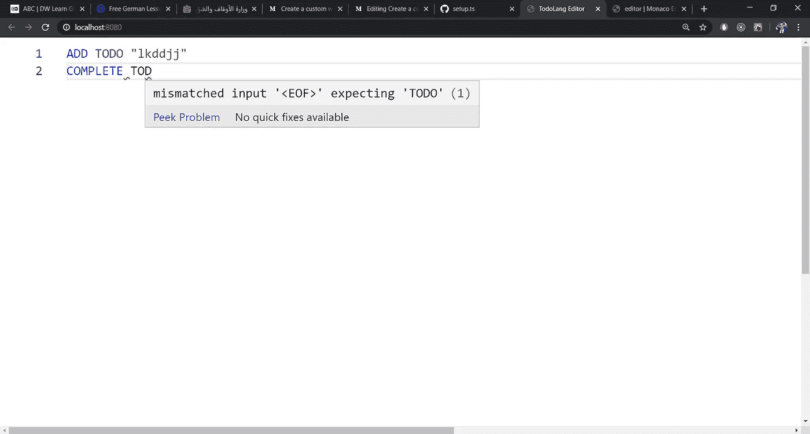
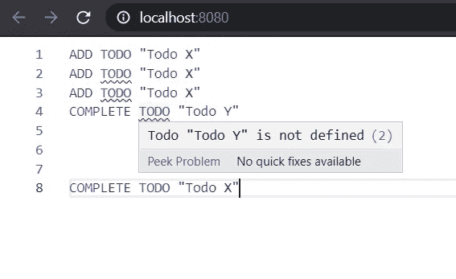
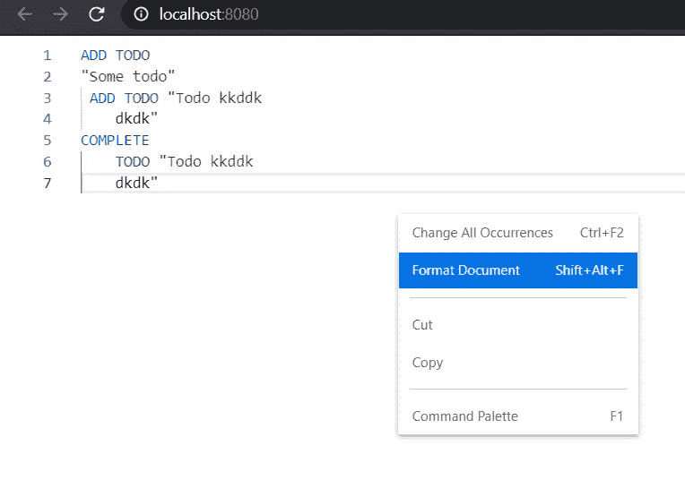
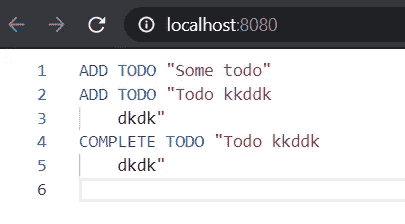

# 使用 TypeScript、React、ANTLR 和 Monaco-Editor 创建自定义 Web 编辑器

> 原文：<https://betterprogramming.pub/create-a-custom-web-editor-using-typescript-react-antlr-and-monaco-editor-bcfc7554e446>

## 第 2 部分:实现语言服务、自动完成、语法和语义验证以及自动格式化



你好，欢迎来到我的文章的第 2 部分，介绍如何使用 **Typescript** 、 **React** 、[、 **ANTLR、**](https://www.antlr.org/) 和[**Monaco-Editor**](https://microsoft.github.io/monaco-editor/)。如果还没有阅读第一部分，这里有一个链接。

在本文中，我将向您展示如何实现语言服务，它将负责在编辑器中解析当前键入的文本的繁重工作。然后，我们使用由解析器返回的生成的 [***【抽象语法树(AST)***](https://en.wikipedia.org/wiki/Abstract_syntax_tree) 来检测任何语法或语义错误，格式化键入的文本或在用户开始键入时向他们建议定义的待办事项(自动完成，我不打算实现这一项。我就给个提示，怎么做和需要的 API)。

基本上，该服务将公开三个功能:

*   `format(code: string): string`
*   `validate(code: string): Errors[]`
*   `autoComplete(code: string, currentPosition: Position): string[]`

所以让我们开始吧。

# 添加鹿角，从语法中生成词法分析器和语法分析器

我将添加 **ANTLR** 库，并添加一个脚本来从我们的`*TODOLang.g4*`语法文件生成解析器和词法分析器。

所以先说第一件事，添加必要的库: [**antlr4ts**](https://www.npmjs.com/package/antlr4ts) 和 [**antlr4ts-cli**](https://www.npmjs.com/package/antlr4ts-cli) 。

**antlr4ts** 是***typescript***[**ANTLR 4 ts-cli**](https://www.npmjs.com/package/antlr4ts-cli)中 **ANTLR** 的运行时库，另一方面顾名思义就是我们将用来为该语言生成解析器和词法分析器的 CLI。

```
npm add antlr4tsnpm add -D antlr4ts-cli
```

现在，在根目录中添加以下包含`TodoLang`语法规则的文件:

现在我们在`package.json`文件中添加一个脚本，通过 **antlr-cli** 为我们生成解析器和词法分析器:

```
"antlr4ts": "antlr4ts ./TodoLangGrammar.g4 -o ./src/ANTLR"
```

文件将在`./src/ANTLR`目录下生成。

让我们运行 **antlr4ts** 脚本，看看生成的文件:

```
npm run antlr4ts
```



生成的 ANTLR 文件

正如我们所看到的，有一个词法分析器和一个语法分析器。如果检查解析器文件，会发现它导出了一个类`TodoLangGrammarParser`；这个类有一个构造函数`constructor(input: TokenStream)`，它将`TodoLangGrammarLexer`为给定代码生成的`TokenStream`作为参数。

`TodoLangGrammarLexer`有一个构造函数`constructor(input: CharStream)`，它将代码作为参数。

解析器包含一个方法`public todoExpressions(): TodoExpressionsContext`，它返回代码中定义的所有`TodoExpressions`的上下文。猜猜`TodoExpressions`这个名字是怎么来的？这是我们语法规则中第一条规则的名字:

```
todoExpressions : (addExpression)* (completeExpression)*;
```

`TodoExpressionsContext`是我们 [AST](https://en.wikipedia.org/wiki/Abstract_syntax_tree) 的根；其中的每个节点都是另一个规则的另一个上下文。有终端和节点上下文，终端持有最终的令牌(可能是 ADD 令牌、todo 令牌或“TODO 的名称”令牌)。

`TodoExpressionsContext`包含`addExpressions`和`completeExpressions`，分别来自以下三个规则:

```
todoExpressions : (addExpression)* (completeExpression)*; addExpression : ADD TODO STRING;
completeExpression : COMPLETE TODO STRING;
```



TodoExpressionsContext 根节点

另一方面，每个上下文类都包含终端节点，终端节点主要保存文本(代码片段或标记，如“ADD”、“COMPLETE”、“表示 TODO 的字符串”)。AST 的复杂性取决于你的语法规则；在我们的例子中，非常简单。

在`**TodoExpressionsContext**`中我们可以看到，它包含`ADD`、`TODO`和`STRING`终端节点，分别对应这些规则:

```
addExpression : ADD TODO STRING;
```



AddExpressionContext

字符串终端节点保存我们试图添加的 Todo 的文本。

让我们解析一个简单的`TodoLang`代码，看看 AST 是什么样子的。

在目录`./src/language-service`中创建一个包含以下内容的`parser.ts`文件:

这个文件所做的就是导出一个函数`parseAndGetASTRoot(code)`，它接受 TodoLang 代码并生成相应的 AST。

解析下面的`TodoLang`代码:

```
parseAndGetASTRoot(`ADD TODO "Create an editor"COMPLETE TODO "Create an editor"`)
```

将产生以下 AST:



# 实现词法和语法验证

在这一节中，我将带您了解如何在编辑器 ANTLR 中添加语法验证，它会为我们生成现成的词法和语法错误。我们只需要实现一个`ANTLRErrorListner`，并将其提供给词法分析器和解析器，这样我们就可以在 ANTLR 解析代码时收集错误。

在`./src/language-service`目录中创建一个实现`ANTLRErrorListner`的类`TodoLangErrorListener`:

每次 ANTLR 在代码解析过程中遇到错误时，它都会调用这个侦听器，向它提供有关错误的信息。

我们返回一个错误列表，其中包含错误在代码中出现的位置以及生成的错误消息。

现在让我们将监听器添加到`parser.ts`文件中的词法分析器和语法分析器，将其内容更改为:

现在在`./src/language-service`目录中，创建一个文件`LanguageService.ts`，该文件导出以下内容:

我们现在可以向编辑器添加错误了。为此，首先我将创建我在上一篇文章[中提到的 web worker，并添加我们的 worker 服务代理，它将使用语言服务来完成这项工作。](https://medium.com/@amazzal.elhabib/create-a-custom-web-editor-using-typescript-react-antlr-and-monaco-editor-part-1-2f710c69c18c)

## 创建 web worker:

首先让我们创建`TodoLangWorker`，它是将由 **monaco 代理的工人。** `TodoLangWorker` 将使用语言服务方法来执行编辑器功能，那些在 web worker 中执行的方法将由 **monaco** 代理，所以调用 web worker 中的方法就是调用主线程中被代理的方法。

在`./src/todo-lang`文件夹中，创建一个文件`TodoLangWorker.ts`，内容如下:

正如您所看到的，我们创建了语言服务的一个实例，并添加了一个调用语言服务 validate 的`doValidation()`方法。其他东西只是为了从编辑器中获取文档文本。如果你想支持多文件编辑，有很多东西需要添加。

`_ctx: IWorkerContext`是编辑器的上下文，它保存模型(打开文件…

现在让我们在`./src/todo-lang`目录下创建一个 web worker 文件`todolang.worker.ts` ，内容如下:

我们使用内置的`worker.initialize`来初始化我们的 worker，并从`TodoLangWorker`中创建必要的方法代理。

那是一个 web worker，所以我们必须告诉 **webpack** 捆绑它自己的文件。直接转到 **webpack 配置文件**并添加以下内容:

我们将我们的工人文件命名为`todoLangWorker.js`。

现在，我们应该进入编辑器设置功能，并添加以下内容:

这就是 **monaco** 如何获取 web worker 的 URL。注意，如果工人的标签是 ID**todo lang**，我们返回我们在 **webpack** 中捆绑工人时使用的相同文件名。

如果您现在构建项目，您会发现有一个名为`todoLangWorker.js`的文件(或者在 dev-tools 中，您会在 thread 部分找到两个 workers)。

现在让我们创建一个`WorkerManager`,它管理 worker 的创建，并帮助我们获得代理 worker 的一个客户机，这样我们可以在以后使用它来进行调用。

如果 web worker 还没有创建，我们使用`[createWebWorker](https://microsoft.github.io/monaco-editor/api/modules/monaco.editor.html#createwebworker)`来创建或运行它。否则，我们获取并返回代理客户端。

我们可以使用`workerClientProxy`来调用被代理的方法。

让我们创建`DiagnosticsAdapter`类，该类将把语言服务返回的错误修改为 **monaco** 需要在编辑器中标记的错误。

我所做的是为用户所做的每一个改变添加一个`[onDidChangeContent](https://microsoft.github.io/monaco-editor/api/interfaces/monaco.editor.itextmodel.html#ondidchangecontent)`监听器。我们对更改进行 500 毫秒的去抖，然后调用工作人员来验证代码，并在修改后添加标记。

当文件(模型)被创建时，API `[onDidCreateModel](https://microsoft.github.io/monaco-editor/api/modules/monaco.editor.html#ondidcreatemodel)`被调用，所以在那时我们添加了用于改变的监听器。

`[setModelMarkers](https://microsoft.github.io/monaco-editor/api/modules/monaco.editor.html#setmodelmarkers)`告诉 **monaco** 添加错误标记，或者简单地说，给给定的错误加下划线。

要应用这些验证，请确保在设置函数中调用它们，并注意我们正在使用`WorkerManager`来获取被代理的工人。

现在一切都正常了。运行项目，开始输入一些不好的`TodoLang`代码；您应该会看到错误被加了下划线。



这是目前为止的项目:

[](https://github.com/amazzalel-habib/TodoLangEditor/tree/add-syntax-validation) [## amazzalel-habib/TodoLangEditor

### 这是一个自定义语言的 web 编辑器。通过创建一个……

github.com](https://github.com/amazzalel-habib/TodoLangEditor/tree/add-syntax-validation) 

# 实现语义验证

现在让我们为编辑器添加语义验证。还记得我在上一篇文章中提到的两条语义规则吗？

*   如果 TODO 是使用`ADD TODO`指令定义的，我们不能重新添加它。
*   完整指令不应应用于未使用`ADD TODO`声明的 TODO

要检查 TODO 是否已定义，我们所要做的就是遍历 AST，获取每个 ADD 表达式，并将它们推送到一个列表中。然后，我们检查已定义的待办事项列表中是否存在待办事项。如果存在，这是一个语义错误，所以从 ADD 表达式的上下文中获取错误的位置，并将错误推送到一个数组中。第二条规则也是如此。

现在调用这个函数，在 validate 函数中将语义错误和语法错误连接起来。

我们现在有了支持语义验证的编辑器。

[](https://github.com/amazzalel-habib/TodoLangEditor/tree/add-semantic-validation) [## amazzalel-habib/TodoLangEditor

### 这是一个自定义语言的 web 编辑器。通过创建一个……

github.com](https://github.com/amazzalel-habib/TodoLangEditor/tree/add-semantic-validation) 

# 实现自动格式化

对于自动格式化，您需要通过调用 API `[registerDocumentFormattingEditProvider](https://microsoft.github.io/monaco-editor/api/modules/monaco.languages.html#registerdocumentformattingeditprovider)`为 Monaco 提供并注册格式化提供程序。有关更多详细信息，请查看文档。调用和迭代 AST 将为您提供以漂亮的格式重写代码所需的所有信息。

下面是`LanguageService`中的格式化方法。它获取代码并检查代码中是否有错误，然后返回格式化的代码:

现在让我们将格式提供程序添加到 **monaco** ，并使用这个服务。这里我在`todoLangWorker`中添加了`format`方法:

现在让我们创建一个类`TodoLangFomattingProvider`，它将实现接口`[DocumentFormattingEditProvider](https://microsoft.github.io/monaco-editor/api/interfaces/monaco.languages.documentformattingeditprovider.html)`。

它所做的就是获取代码并使用 worker 对其进行格式化，然后向 **monaco** 提供格式化后的代码和我们想要替换的代码范围，在我们的例子中是所有代码。您可以更改代码以支持部分格式。

现在进入设置功能，使用`[registerDocumentFormattingEditProvider](https://microsoft.github.io/monaco-editor/api/modules/monaco.languages.html#registerdocumentformattingeditprovider)` API 注册格式提供程序。

```
monaco.languages.registerDocumentFormattingEditProvider(languageID, **new** TodoLangFormattingProvider(worker));
```

如果您现在运行该应用程序，您应该会看到它支持格式化。



格式化前编码

试着点击**格式文档**或***“Shift+Alt+F”***，应该会得到如下结果:



代码格式化

[](https://github.com/amazzalel-habib/TodoLangEditor/tree/add-auto-formatting) [## amazzalel-habib/TodoLangEditor

### 这是一个自定义语言的 web 编辑器。通过创建一个……

github.com](https://github.com/amazzalel-habib/TodoLangEditor/tree/add-auto-formatting) 

# 实现自动完成

要使自动完成支持已定义的 to do，您所要做的就是从 AST 获取所有已定义的 todo，并通过调用 setup 中的`[registerCompletionItemProvider](https://microsoft.github.io/monaco-editor/api/modules/monaco.languages.html#registercompletionitemprovider)`在完成提供程序中提供它们。提供者给你代码和光标的当前位置，这样你就可以检查用户正在输入的上下文，如果他们在一个完整的表达式中输入一个 TODO，那么你可以建议预定义为 DOs。请记住，默认情况下，Monaco-editor 支持代码中预定义标记的自动完成，您可能希望禁用该功能，并实现自己的功能，以使其更加智能和上下文相关。

项目如下:

[](https://github.com/amazzalel-habib/TodoLangEditor/tree/master) [## amazzalel-habib/TodoLangEditor

### 这是一个自定义语言的 web 编辑器。通过创建一个……

github.com](https://github.com/amazzalel-habib/TodoLangEditor/tree/master) 

如果您有任何问题、建议或反馈，请随时联系我。

非常感谢你的时间。