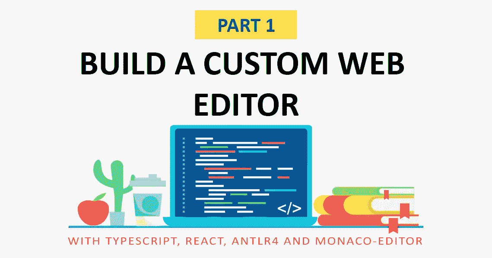
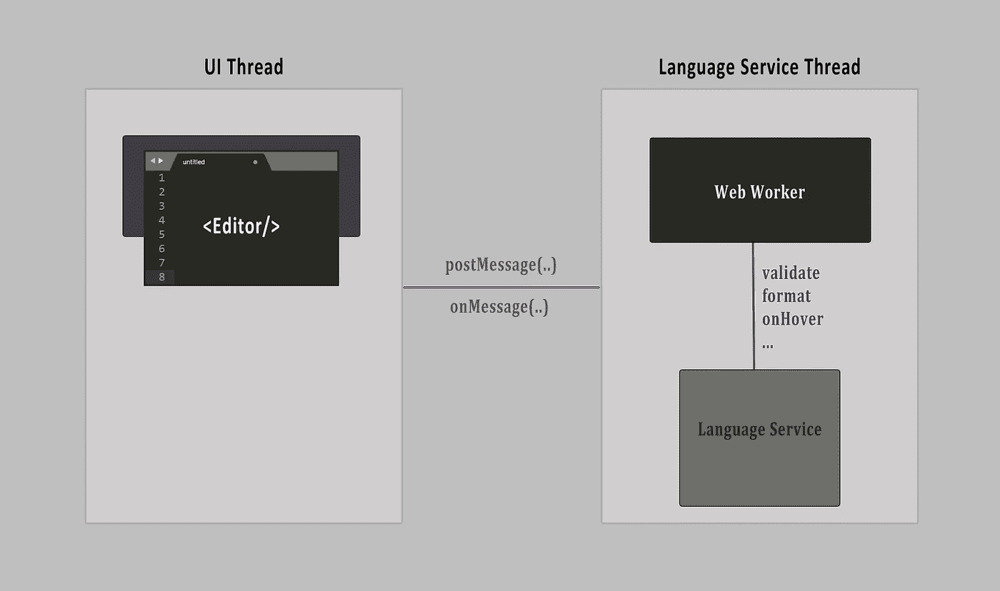
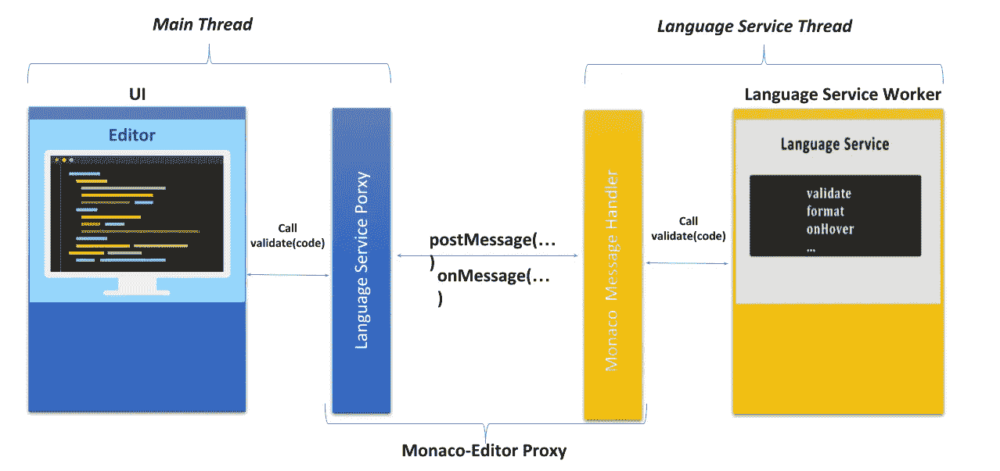
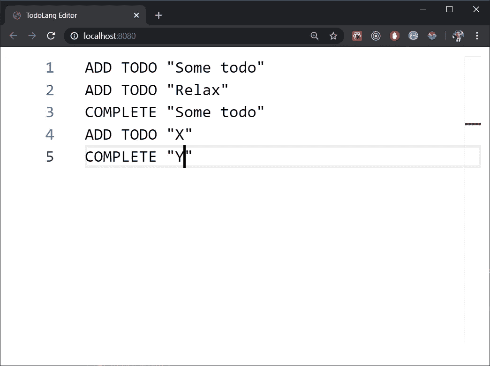
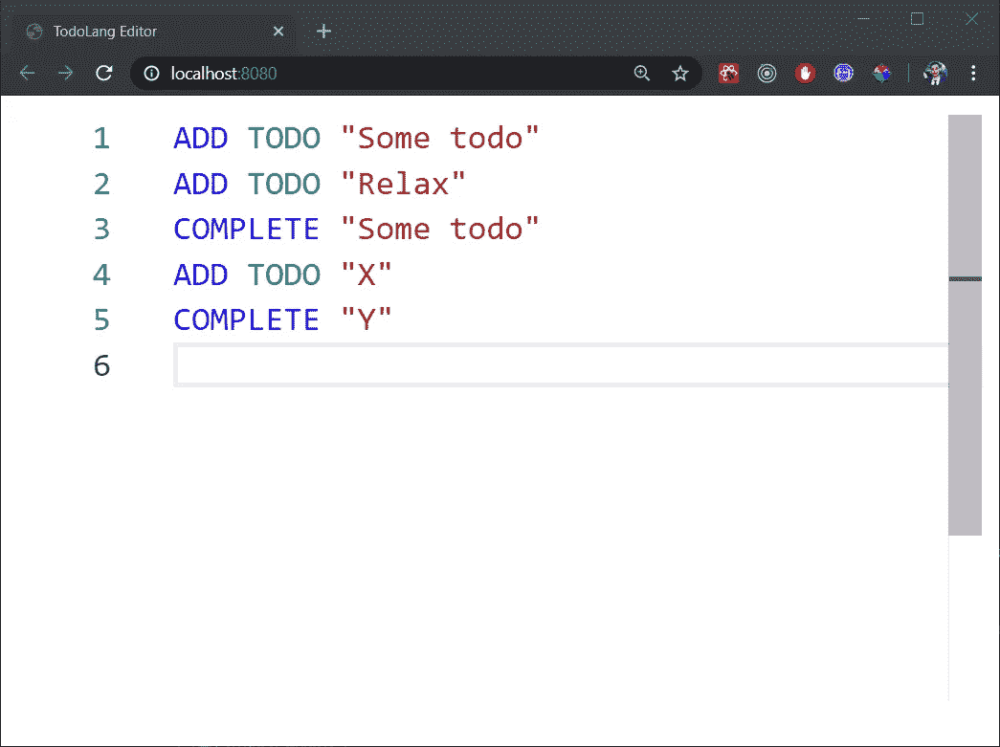

# 使用 TypeScript、React、ANTLR 和 Monaco 编辑器创建自定义 Web 编辑器

> 原文：<https://betterprogramming.pub/create-a-custom-web-editor-using-typescript-react-antlr-and-monaco-editor-part-1-2f710c69c18c>

## 第 1 部分:使用语法着色构建 web 编辑器



你有没有想过像 [Visual Studio(在线](https://visualstudio.microsoft.com/services/visual-studio-codespaces/))、 [CodeSandbox](https://codesandbox.io/) 或 [Snack](https://snack.expo.io/) 这样的网页编辑器是如何工作的？或者你想做一个自定义的网页或桌面编辑器，但不知道如何开始？

在这篇文章中，我将解释 web 编辑器是如何工作的，我们将为自定义语言创建一个。

我们将要为之构建编辑器的语言很简单。它声明了一个 TODOs 列表，然后对它们应用一些预定义的指令。我把这种语言叫做 *TodoLang* 。以下是这些说明的一些示例:

我们简单地添加一些 TODOs，如下所示:

```
ADD TODO "TODO_TEXT";
```

或者我们可以使用`COMPLETE TODO “todo_text”`来完成一个 TODO，这样解释这段代码的输出可以告诉我们剩余的 TODO 以及到目前为止我们已经完成的 TODO。这是我为本文发明的一种简单语言。它可能看起来没什么用，但是它包含了我需要在本文中介绍的所有内容。

我们将使编辑器支持以下功能:

*   自动格式化
*   自动完成
*   语法突出显示
*   语法和语义验证

注意:编辑器一次只支持一个代码或文件编辑。它不支持多个文件或代码编辑。

## TodoLang 语义规则

以下是我将用于 TodoLang 代码语义验证的一些语义:

*   如果 TODO 是使用`ADD TODO`指令定义的，我们可以重新添加它。
*   `COMPLETE`指令不应该应用在没有使用`ADD TODO`声明的 TODO 中。

我将在本文后面回到这些语义规则。

在我们深入研究代码之前，让我们先从 web 编辑器或任何一般编辑器的一般架构开始。



App 架构。图片来源:作者

从上面的模式可以看出，一般来说，任何编辑器都有两个线程。一个负责 UI 方面的工作，比如等待用户输入一些代码或者做一些动作。另一个线程接受用户所做的更改，并进行繁重的计算，包括代码解析和其他编译工作。

对于编辑器中的每次更改(可能是针对用户键入的每个字符，或者直到用户停止键入 2 秒)，将向语言服务工作人员发送一条消息以执行一些操作。工作者本身将用包含结果的消息来响应。例如，当用户键入一些代码并希望格式化代码(单击 Shift + Alt + F)时，工作人员将收到一条消息，其中包含“format”操作和要格式化的代码。这应该异步发生，以获得良好的用户体验。

另一方面，语言服务负责解析代码，生成[抽象语法树](https://en.wikipedia.org/wiki/Abstract_syntax_tree) (AST)，查找任何可能的语法或词汇错误，使用 AST 查找任何语义错误，格式化代码等。

我们可以通过使用 [LSP 协议](https://microsoft.github.io/language-server-protocol/)使用一种新的、先进的方式来处理语言服务，但是在这个例子中，语言服务和编辑器将在同一个进程中，也就是浏览器，没有任何后端处理。如果你想让你的语言在其他编辑器中得到支持，比如 [VS Code](https://code.visualstudio.com/) 、 [Sublime](https://www.sublimetext.com/) 或 [Eclipse](https://www.eclipse.org/community/eclipse_newsletter/2017/may/article3.php) ，而不需要重新发明轮子，最好将语言服务和工作器分开。实现 LSP 将允许你为其他编辑器制作插件来支持你的语言。请查看 LSP 页面了解更多信息。

编辑器提供了一个界面，允许用户键入代码并执行一些操作。当用户键入时，编辑器应该查询配置列表，以了解它应该如何突出显示代码标记(关键字、类型等)。).这可以由语言服务来完成，但是对于我们的例子，我们将在编辑器中完成。我们稍后将看到如何做到这一点。



与网络工作者交流。图片来源:作者

Monaco 提供了一个 API[Monaco . editor . create WebWorker](https://microsoft.github.io/monaco-editor/api/modules/monaco.editor.html#createwebworker)来创建一个使用内置 [ES6 代理](https://developer.mozilla.org/en-US/docs/Web/JavaScript/Reference/Global_Objects/Proxy)的代理 web worker。使用 [getProxy](https://microsoft.github.io/monaco-editor/api/interfaces/monaco.editor.monacowebworker.html#getproxy) 方法获取代理对象(语言服务)。要访问语言服务工作器中的任何服务，我们将使用这个代理对象来调用任何方法。所有方法都将返回一个 Promise 对象。

查看一下 [Comlink](https://github.com/GoogleChromeLabs/comlink) ，这是一个由 Google 开发的微型库，它使得使用 ES6 代理与 web 工作者一起工作变得愉快。

事不宜迟，让我们开始写一些代码。

# 我们要用什么？

对于这个项目，我将使用:

## 反应

对于 UI

## [ANTLR](https://www.antlr.org/)

正如其网站上所定义的，“ANTLR(另一种语言识别工具)是一种强大的解析器生成器，用于读取、处理、执行或翻译结构化文本或二进制文件。它被广泛用于构建语言、工具和框架。ANTLR 从语法中生成一个可以构建和遍历解析树的解析器。ANTLR 支持很多语言作为目标，这意味着它可以生成 Java、C#和其他语言的解析器。对于这个项目，我将使用 [ANTLR4TS](https://github.com/tunnelvisionlabs/antlr4ts) ，它是 ANTLR 的 Node.js 版本，可以在 TypeScript 中生成一个 lexer 和一个解析器。

ANTLR 使用一种特殊的语法来声明一种语言语法，这种语法通常放在一个`*.g4`文件中。它允许您在一个组合的语法文件中定义词法分析器和语法分析器规则。在这个[库](https://github.com/antlr/grammars-v4)中，你会找到很多知名语言的语法文件。

这种语法句法使用一种被称为[巴克斯范式(BNF)](https://en.wikipedia.org/wiki/Backus%E2%80%93Naur_form) 的符号来描述[语言](https://en.wikipedia.org/wiki/Formal_language#Programming_languages)的[句法](https://en.wikipedia.org/wiki/Syntax_(programming_languages))。

## 托多兰语法

这是我们 TodoLang 的简化语法。它为 TodoLang 声明了一个根规则，`todoExpressions`，它保存了表达式列表。TodoLang 中的表达式可以是一个`addExpression`或`completeExpression`。在正则表达式中，星号(*)表示表达式可能出现零次或多次。

每个表达式都以一个结束关键字( *add* 、 *todo* 或 *complete* )开始，并有一个标识 todo 的字符串(“…”)。

## [摩纳哥-编辑](https://microsoft.github.io/monaco-editor/)

Monaco 编辑器是为 [VS 代码](https://github.com/Microsoft/vscode)提供动力的代码编辑器。这是一个 JavaScript 库，提供了语法高亮、自动完成等 API。

## 开发工具

打字稿、 [webpack](https://webpack.js.org/) 、`[webpack-dev-server](https://webpack.js.org/configuration/dev-server/)`、 [webpack-cli](https://webpack.js.org/api/cli/) 、`[HtmlWebpackPlugin](https://github.com/jantimon/html-webpack-plugin)`和`[ts-loader](https://www.npmjs.com/package/ts-loader)`。

因此，让我们从启动项目开始。

# 启动新的 TypeScript 项目

为此，让我们开始我们的项目:

`npm init`

创建一个包含最少内容的`tsconfig.json`文件:

为 webpack 添加一个配置文件`webpack.config.js`:

为 React 和 TypeScript 添加依赖项:

```
npm add react react-domnpm add -D typescript [@types/react](http://twitter.com/types/react) [@types/react-dom](http://twitter.com/types/react-dom) ts-loader html-webpack-plugin webpack webpack-cli webpack-dev-server
```

用您的入口点`index.ts`和`index.html` 创建一个`src`目录，其中包含一个 id 为`container.`的 div

这里是这个[启动项目](https://github.com/amazzalel-habib/TodoLangEditor/tree/Starter)的源代码。

# 添加摩纳哥编辑器组件

如果您的目标是现有的语言，如 TypeScript、HTML 或 Java，您不必重新发明轮子。摩纳哥编辑器和[摩纳哥语言](https://github.com/Microsoft/monaco-languages)支持大多数语言。

对于我们的例子，我们将使用名为 [monaco-editor-core](https://www.npmjs.com/package/monaco-editor-core) 的 Monaco 编辑器的核心版本。

添加包:

```
npm add monaco-editor-core
```

我们还需要一些 CSS 加载器，因为摩纳哥内部使用它们:

```
npm  add -D style-loader css-loader
```

将这些规则添加到 webpack 配置中的模块属性:

```
{test: /\.css$/,use: ['style-loader', 'css-loader']}
```

最后，将 CSS 添加到已解析的扩展中:

```
extensions: ['.ts', '.tsx', '.js', '.jsx','.css']
```

现在我们已经准备好创建编辑器组件了。创建一个 React 组件(我们称之为编辑器)，并返回一个具有 ref 属性的元素，这样我们就可以引用它，让 Monaco API 在其中注入编辑器。

要创建一个摩纳哥编辑器，我们需要调用 [monaco.editor.create](https://microsoft.github.io/monaco-editor/api/modules/monaco.editor.html#create) 。它将 Monaco 将在其中注入编辑器的 DOM 元素以及一些语言 id、主题等选项作为参数。查看文档了解更多细节。

添加一个包含`src/todo-lang`中所有语言配置的文件:

在`src/components`中添加一个组件:

编辑器组件

我们基本上使用一个回调钩子来获取挂载时 div 的[引用](https://reactjs.org/docs/forwarding-refs.html)，所以我们可以把它传递给`create`函数。

现在，您可以将编辑器组件添加到您的应用程序中，并根据需要添加一些样式。

# 使用摩纳哥 API 注册我们的语言

为了让 Monaco 编辑器支持我们定义的语言(例如，当我们创建编辑器时，我们指定了语言 ID)，我们需要使用 API[Monaco . languages . register](https://microsoft.github.io/monaco-editor/api/modules/monaco.languages.html#register)注册它。让我们在`src/todo-lang`中创建一个名为`setup`的文件。我们还需要通过给它一个回调来实现`[monaco.languages](https://microsoft.github.io/monaco-editor/api/modules/monaco.languages.html#register).onLanguage`，这个回调将在语言配置就绪时被调用。(我们稍后将使用这个回调来注册我们的语言提供者，以便进行语法突出显示、自动完成、格式化等。):

现在从入口点调用设置函数。

# 为摩纳哥添加 Web Workers

到目前为止，如果您运行项目并在浏览器中打开它，您将得到一个关于 web worker 的错误:

```
Could not create web worker(s). Falling back to loading web worker code in main thread, which might cause UI freezes. Please see [https://github.com/Microsoft/monaco-editor#faq](https://github.com/Microsoft/monaco-editor#faq)
You must define a function MonacoEnvironment.getWorkerUrl or MonacoEnvironment.getWorker
```

语言服务创造了 web 工作者来计算 UI 线程之外的繁重工作。就资源开销而言，它们几乎没有任何成本，只要让它们正常工作，您就不应该太担心它们(参见上面的跨域案例)。([出处](https://github.com/Microsoft/monaco-editor))止也[此](https://github.com/Microsoft/monaco-editor/blob/master/docs/integrate-esm.md)。

摩纳哥编辑器使用一个 web worker 我认为它是用来突出显示和执行其他内置动作的。我们将创建另一个来处理我们的语言服务。

我们先告诉 webpack 捆绑 Monaco 的编辑器 web worker。将这一行添加到入口点:

```
entry: {app: './src/index.tsx',"editor.worker": 'monaco-editor-core/esm/vs/editor/editor.worker.js'},
```

更改输出，告诉 webpack 给 web worker 一个不带散列的特定名称，并按照 Monaco 的要求使用`‘self’`作为全局对象。以下是目前为止 webpack 配置文件的内容:

从上面的错误中我们可以看到，Monaco 从全局变量`MonacoEnvironment`调用了一个名为`getWorkerUrl`的方法。转到设置功能并添加以下内容:

这将告诉摩纳哥在哪里找到工人。我们将尽快添加我们的自定义语言服务人员。

运行应用程序，您应该会看到一个尚不支持任何功能的编辑器:



# 添加语法突出显示和语言配置

在这一节，我们将添加一些关键字荧光笔。

Monaco Editor 使用 [Monarch 库](https://microsoft.github.io/monaco-editor/monarch.html)，它允许我们使用 JSON 创建声明式语法高亮器。如果想了解更多关于这种语法的知识，可以看看他们的文档。

[这里有一个 Java 配置](https://github.com/microsoft/monaco-languages/blob/master/src/java/java.ts)的例子，用于语法高亮、代码折叠等。

在`src/todo-lang`中创建一个名为`config.ts`的文件。我们将使用 Monaco API:[Monaco . languages . setmonarch tokensprovider](https://microsoft.github.io/monaco-editor/api/modules/monaco.languages.html#setmonarchtokensprovider)配置 TodoLang 荧光笔和标记器。它有两个参数，语言 ID 和类型`[IMonarchLanguage](https://microsoft.github.io/monaco-editor/api/interfaces/monaco.languages.imonarchlanguage.html)` *的配置。*

以下是 TodoLang 的配置:

我们基本上为 TodoLang 中的每种类型的关键字指定 CSS 类或标记名。例如，对于关键字`COMPLETE` 和`ADD`，我们指示 Monaco 给它们一个类`keyword` ，对于类型关键字`TODO`给它们一个类`type`。我们还指示 Monaco 通过给字符串一个由 Monaco 预定义的`string`类型的 CSS 类来给字符串着色。请记住，您可以通过使用`[defineTheme](https://microsoft.github.io/monaco-editor/api/modules/monaco.editor.html#definetheme)` [API](https://microsoft.github.io/monaco-editor/api/modules/monaco.editor.html#definetheme) 覆盖主题并添加新的 CSS 类，并在创建编辑器或使用`[setTheme](https://microsoft.github.io/monaco-editor/api/modules/monaco.editor.html#settheme)`设置时指定它。

要让 Monaco 考虑这个配置，请转到设置函数，在`onLanguage`回调中，调用`[monaco.languages.setMonarchTokensProvider](https://microsoft.github.io/monaco-editor/api/modules/monaco.languages.html#setmonarchtokensprovider)`，并将其配置作为第二个参数:

运行应用程序。编辑器现在应该支持语法高亮显示。



下面是目前为止项目的源代码:[amazzalel-Habib/TodoLangEditor](https://github.com/amazzalel-habib/TodoLangEditor/tree/add-syntax-highlighter)。

在本文的下一部分 ( [查看这里](https://medium.com/better-programming/create-a-custom-web-editor-using-typescript-react-antlr-and-monaco-editor-bcfc7554e446))中，我将介绍语言服务。我将使用 ANTLR 生成 TodoLang lexer 和解析器，并使用解析器提供的 AST 实现编辑器的大多数特性。然后我们将看到如何创建一个 web worker 来提供自动完成的语言服务。