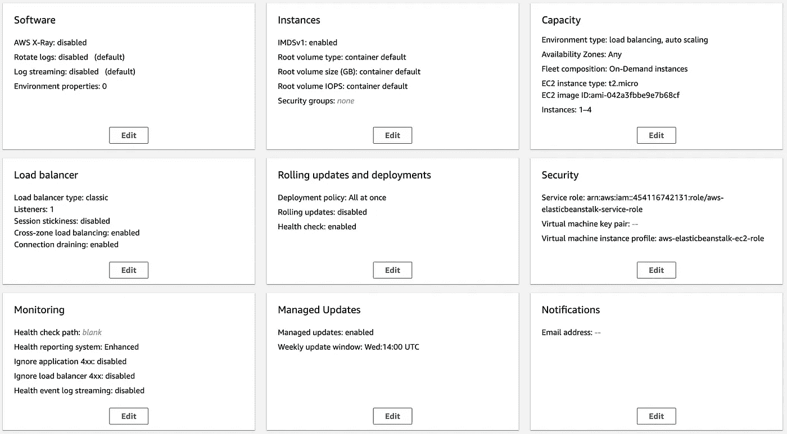

# 10 分钟内在 AWS 上创建一个部署设置

> 原文：<https://betterprogramming.pub/create-a-deployment-setup-on-aws-in-10-minutes-490d225e6446>

## 让您的应用更快上线


由[托马斯·詹森](https://unsplash.com/@thomasjsn?utm_source=unsplash&utm_medium=referral&utm_content=creditCopyText)在 [Unsplash](https://unsplash.com/s/photos/network?utm_source=unsplash&utm_medium=referral&utm_content=creditCopyText) 上拍摄的照片

在某些情况下，我们需要进行简单快速的部署，同时遵循最佳工程和安全实践，例如负载平衡、使用专用网络或自动扩展。AWS 的服务[弹力豆茎](https://aws.amazon.com/elasticbeanstalk/)来到现场。

> “AWS Elastic Beanstalk 是一种易于使用的服务，用于部署和扩展用 Java 开发的 web 应用程序和服务。NET、PHP、Node.js、Python、Ruby、Go、Docker 在 Apache、Nginx、Passenger、IIS 等熟悉的服务器上。”— [AWS 弹性豆茎](https://aws.amazon.com/elasticbeanstalk/)

换句话说，Elastic Beanstalk 是一个平台，其主要目的是简化 web 应用程序的部署。它支持许多不同的现代平台和语言。如果它已经引起了你的注意，让我们更深入地探索它。

# 如何使用它

Elastic Beanstalk 提供了两个上传部署的选项:通过 web 控制台或通过 CLI。

使用 web 界面，我们需要上传该项目的 zip 存档，要么直接上传，要么上传到 S3 桶。然后，我们将看到所有可用的部署配置。根据我们应用的需要，我们可以改变它们。Elastic Beanstalk 提供设置自动伸缩组、负载平衡器、监控工具和许多其他选项。



弹性 Beanstalk 部署配置的 web 界面

通过 CLI 配置部署看起来也很简单，但是我们需要提前[安装 Elastic Beanstalk CLI](https://docs.aws.amazon.com/elasticbeanstalk/latest/dg/eb-cli3-install.html) 。为了定义部署配置，我们必须将配置文件放在项目中的路径`.ebextensions/`下。例如，要使用应用程序负载平衡器，我们需要在`.ebextensions/custom.config`中创建以下配置。

```
option_settings:
  aws:elasticbeanstalk:environment:
    LoadBalancerType: application
```

配置文件使部署定制更加灵活。支持的配置选项的完整列表可在[文档](https://docs.aws.amazon.com/elasticbeanstalk/latest/dg/command-options.html)页面上找到。

# 部署 Docker 容器

我的应用程序是用[烧瓶](https://flask.palletsprojects.com/en/1.1.x/)微框架实现的。尽管有弹性豆茎支持，我还是决定把它放在 [Docker](https://www.docker.com/) 容器中。最后，如果 AWS 在 Docker 容器中，你不需要担心它是否支持你的平台。

首先，我们必须通过创建 docker 文件来封装我们的应用程序。每个平台都需要不同的设置，我们将在本文件中进行描述。我们既可以保存一个本地 Docker 文件，也可以将图像上传到 Docker hub 并引用它。在这种情况下，我们需要创建`docker-compose.yml`文件来引用远程图像。

接下来，我们必须用下面的命令初始化用于弹性 Beanstack 部署的项目。

```
eb init -p docker <application name>
```

之后，我们准备通过运行以下命令开始部署。

```
eb create <environment name>
```

一旦流程完成，我们的应用程序就开始运行。这是它，只有几个命令，每个人都会看到你的应用程序。

# 我有微服务怎么办？

这通常是接下来弹出的问题。除非您必须扩展您的解决方案，否则整体式方法是不错的。微服务架构目前得到了积极利用，实现了更好的可扩展性和性能。

AWS 为编排提供了一个容器服务 ECS。但是，Elastic Beanstalk 可以执行多容器部署吗？是的，[它能](https://docs.amazonaws.cn/en_us/elasticbeanstalk/latest/dg/create_deploy_docker_ecs.html)！

Elastic Beanstalk 为多容器部署提供了两种选择:

*   Amazon Linux AMI 上的多容器 Docker 平台
*   带有 Docker Compose 的 Amazon Linux 2 上的 Docker 平台

对于第一个选项，我们需要在项目根路径中创建一个文件`Dockerrun.aws.json`。在这个文件中，我们以 JSON 格式定义了容器和它们之间的依赖关系。

在第二个选项中，我们可以使用 Docker Compose 直接处理常用文件`docker-compose.yml`。这两个选项的区别在于使用的操作系统。小心，因为不能保证向后兼容。

如果您想尝试一个或另一个部署选项，您将需要不同的文件格式。幸运的是，有一个可用的解决方法。一个开源项目[容器转换](https://github.com/micahhausler/container-transform)提供文件转换。它会将文件从一种格式转换成另一种格式。

# 结论

Elastic Beanstalk 是在 AWS 上快速方便地部署应用程序的单一入口点。丰富的配置和简单的使用使这项服务成为许多工程师的最爱。