# 为 Node.js 应用程序创建火焰图

> 原文：<https://betterprogramming.pub/create-a-flame-graph-for-your-node-app-profiling-nodejs-app-e0a91e5ed585>

## 描绘和绘制您的应用程序


拉尔夫·罗德里格斯在 [Unsplash](https://unsplash.com/?utm_source=unsplash&utm_medium=referral&utm_content=creditCopyText) 上的照片

创建 Node.js 应用程序的火焰图非常简单，也很容易学习。
我们来学习一下火焰图。

# 什么是火焰图？

火焰图是代码路径的一种可视化形式，需要快速识别并且应该准确。它可以通过使用任何分析工具来生成。有许多类型的火焰图，像 CPU，内存，非 CPU 等。在这里，我们将了解 CPU 火焰图。


火焰图示例图像

# 如何创建火焰图？

要创建火焰图，我们需要遵循以下步骤:

## 步骤 1:创建一个小节点应用程序

要创建这个小应用程序，在同一个目录下创建两个文件，分别名为`app.js`和`package.json`，并将特定文件中的代码粘贴为`package.json` **:**

`app.js`:

## 步骤 2:转到项目位置并运行下面的命令

```
npm install
```

再次运行以下命令来测试应用程序:

```
node app.js
```

如果您可以看到消息“转到 [http://localhost:8080/](http://localhost:8080/) 生成流量”，这意味着您的应用程序正在运行，并准备好进入下一步。

## **步骤 3:使用下面的命令**全局安装火焰稳定器

```
npm install -g flamebearer
```

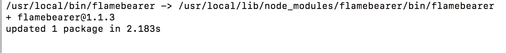

安装火焰喷射器的快照

或者

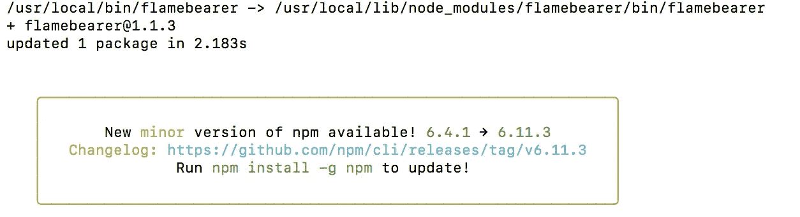

安装火焰使者 2 的快照

## **步骤 4:转到应用程序位置并运行以下命令来分析您的应用程序**

```
node --prof app.js
```

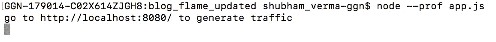

命令节点快照— prof app.js

## 第五步:打开浏览器，进入 http://localhost:8080/

现在，您需要打开一个浏览器，点击给定的 URL，将一些 API 发送到您的服务器。打开 [http://localhost:8080/](http://localhost:8080/) 之后你可以看到你的服务器有这么多的点击率:

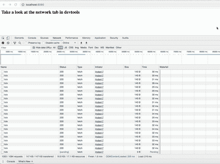

你的服务器连续点击的 Gif

## **第六步:在你的 app 目录下查看你的日志文件**

运行`node — prof app.js`命令后，可以看到会创建一个名为`isolate-XXXXXXX.log`(这里是`isolate-0x102804400-v8.log`)的日志文件。

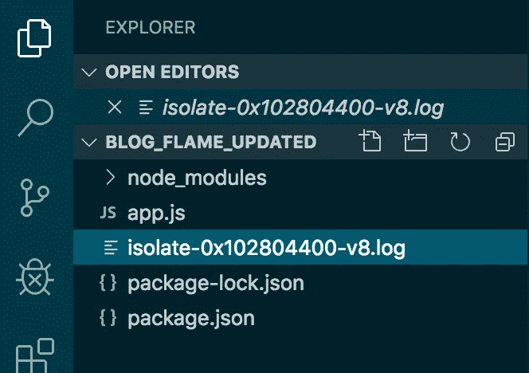

应用程序目录快照

而且这个`isolate-XXXXXXX.log`文件应该有代码。

这个文件的创建及其代码表明您的方向是正确的。

## 步骤 6:使用下面的命令从 V8 日志生成 flamegraph.html

打开一个新的终端，转到应用程序位置，点击下面的命令(记住你运行命令`node — prof app.js`的另一个终端将仍然在运行)。

```
node --prof-process --preprocess -j isolate*.log | flamebearer
```

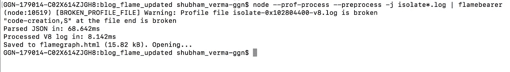

步骤 6 的快照

在运行命令`node- -prof-process — preprocess -j isolate*.log | flamebearer`之后，它应该生成名为 flamegraph.html 的 HTML 文件。您可以在项目目录中看到该文件，如下所示:

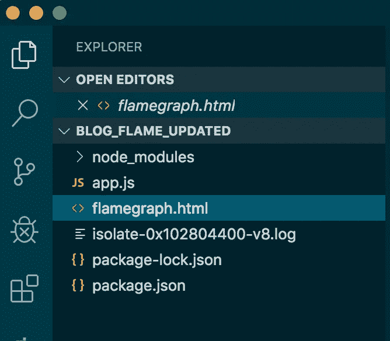

**目录中 flamegraph.html 文件的快照**

这个 flamegraph.html 应该包含 HTML 代码。

如果它没有自动打开，请手动打开它(当您运行上述命令时，将创建文件 flamegraph.html，并将在任何浏览器中打开)。

## 第七步:魔法！火焰图已创建

现在我们的火焰图已经创建完毕，是时候进行分析了:

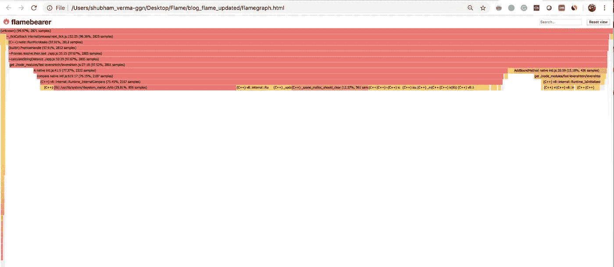

此应用程序的火焰图

你可以看到我们的函数`calculateStringDistance`正在显示它的基于采样数的文件名概要。

让我们仔细了解这个图表:

*   上图中的每个方框代表堆栈中的一个函数(一个堆栈帧)。
*   y 轴(水平框)表示堆栈深度(堆栈上的帧数)。顶部的方框显示了 CPU 上的功能。
*   x 轴(垂直)横跨样本总体。
*   每个框的宽度显示它在 CPU 上的总时间或在 CPU 上的部分祖先(基于样本计数)。这意味着使用宽盒子的函数可能比使用窄盒子的函数每次执行消耗更多的 CPU，或者可能只是被更频繁地调用。

这种可视化被称为火焰图，因为它首先用于显示 CPU 上的热点，它看起来像火焰。

点击特定方框了解详情:

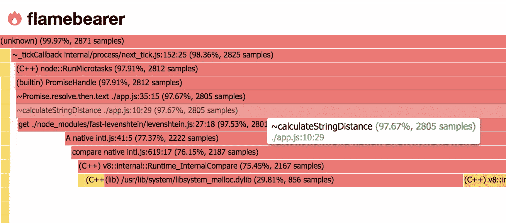

显示计算字符串距离函数

点击后:

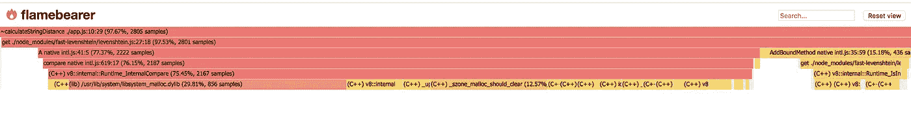

函数的单击视图

搜索功能并点击它:

在该火焰图中，您可以搜索(在右上角)一个函数，然后单击查看该特定函数的详细信息图表，如下所示:

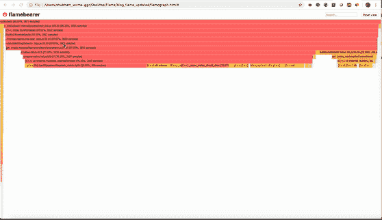

火焰图视图

现在使用这个火焰图，你可以看到 CPU 时间在你的应用程序/代码/函数上的统计花费，你可以优化代码。

恭喜你！你正在成为 node.js 的专家。

感谢阅读。继续阅读——继续获取。