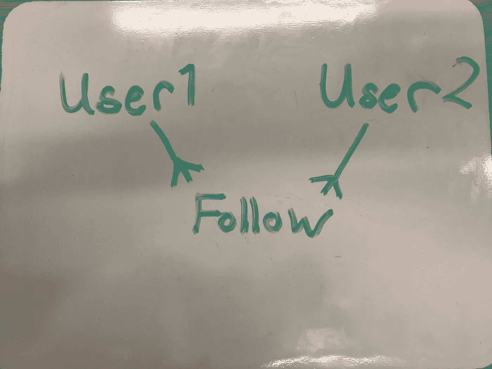
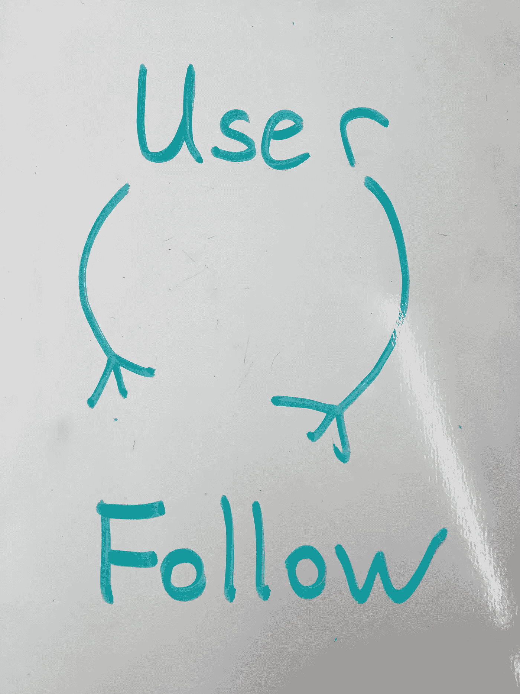
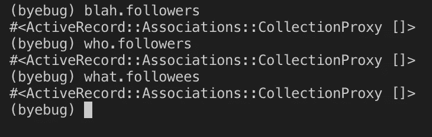
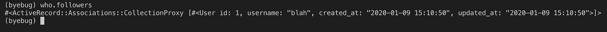
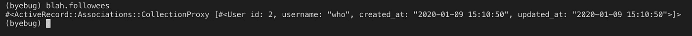
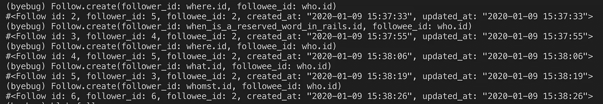
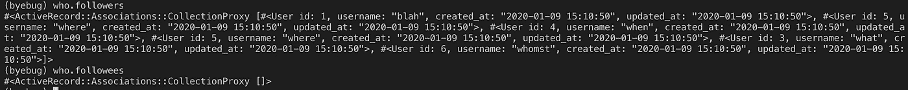
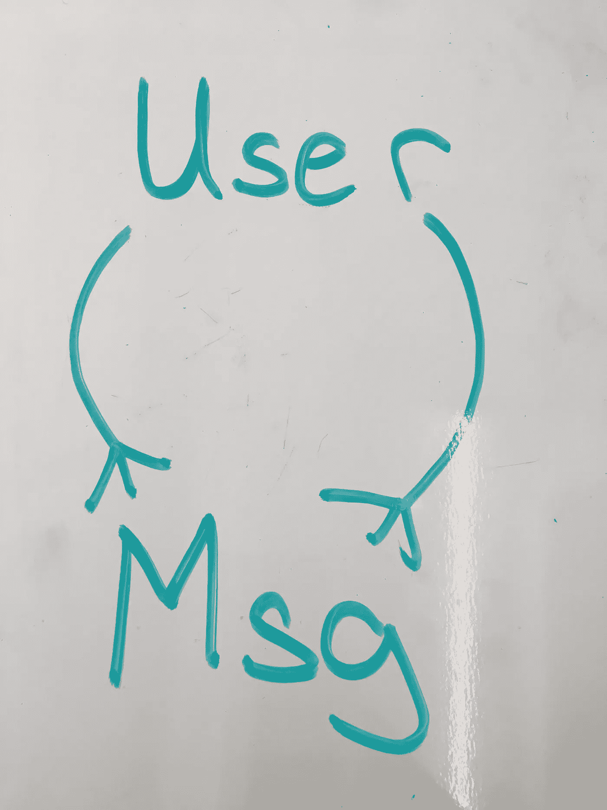
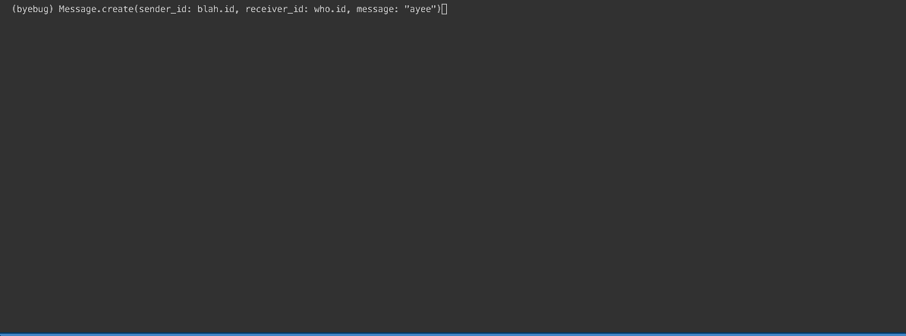

# 在 Rails 中创建跟随/跟随图形

> 原文：<https://betterprogramming.pub/create-a-follow-following-graph-in-rails-a6ec77139dff>

## 构建一个样本社交图，这样用户就可以互相关注


照片由[本杰明·史密斯](https://unsplash.com/@ifbdesign?utm_source=unsplash&utm_medium=referral&utm_content=creditCopyText)在 [Unsplash](https://unsplash.com/s/photos/graph?utm_source=unsplash&utm_medium=referral&utm_content=creditCopyText) 上拍摄

在很长一段时间里，我避免在我的项目中实现自我关系。

我一直都知道这个概念，也知道它的应用(最著名的是，一个用户可以跟踪某个用户，但是那个用户不一定需要跟踪那个用户)，但是尽管我读了很多博客，我从来没有完全理解或者想象它是如何工作的。

最大的障碍是我从来没有真正编码过它…直到现在。

# 模型

我们将使用下面的模型，一个`User`和一个`Follow`模型，作为例子。

自引用关系的设置涉及两个表，一个是用户表，另一个是 joiner (follow)表，该表将自引用关系连接回用户表。听起来很困惑？别担心，这是给你的一个小视频。



用户关注其他用户

有了这种关系，我们就可以说一个用户可以通过`Follow`模型“追随”许多用户，同时，一个用户也可以通过`Follow`模型被许多用户“追随”。

理想情况下，有一个`User`模型而不是两个被拉长的模型是有意义的。简单来说，我们真正拥有的是，



这是一种多对多的关系，但设置会略有不同。

# 设置

但是首先，让我们用我们的模型创建一个快速 Rails 应用程序。

```
rails new self_ref_practice
```

让我们也生成一个带有`username`属性的`User`模型。

```
rails g model User username
```

最后，让我们生成一个`Follow`模型来跟踪谁是追随者，谁是被追随者。我们来提供以下属性，`follower_id`和`followee_id`。

```
rails g model Follow follower_id:integer followee_id:integer
```

在`Follow`模型中，我们将创建关联:

```
class Follow < ApplicationRecord belongs_to :follower, class_name: “User” belongs_to :followee, class_name: “User”end
```

据说`Follow`的一个实例将属于两个实例，一个追随者和一个被追随者。

然而，这两个实例都来自于`User`模型。换句话说，即使我们期待一个`follower_id`和`followee_id`，我们实际上在寻找一个`user_id`。

设置好`Follow`之后，现在让我们来设置`User`模型。

乍一看，理解这种措辞可能有点棘手。但是让我们来分解一下。

## 您关注的用户

让我们从`has_many :followed_users`开始。简单来说，`followed_users`就是你关注的*的用户。*

关于`Follow`模型，哪个属性决定了是否有人在追随？`follower_id`！

现在，第一行`has_many :followed_users`只返回`Follow`的实例。我们真的想要我们正在跟随的用户的实例。由此，我们定义`has_many :followees`。

## 关注您的用户

相反，使用`has_many :following_users`，意味着这些用户关注*你*。

关于`Follow`模型，决定某人是否被跟踪的属性是`followee_id`。同样，我们想要的是`User`的实例，而不是 follow。

于是，我们成立了这个协会，`has_many :followers`。

## 混叠的替代方法

我们可以采用另一种方法来创建`User`和`Follow`之间的关联，这涉及到别名，我们在`Follow`模型中提供外键。

让我们将第一个宏定义为`belongs_to :person_doing_the_following`，带有`follower_id`的`foreign_key`。

换句话说，执行以下操作的人必须是`Follow`实例上的`follower_id`。反之，`person_being_followed`必须是`followee_id`。

在`User`型号中，

与前面类似，`has_many :followed_users`将返回`Follow`的实例。分解一下，`Follow`实例指向两个用户，一个执行下面的操作，另一个被跟随。

通过`has_many :followees`的关联，我们只想要`followee_id`的`User`实例。

因此，我们设置源指向`:person_being_followed` ( `foreign_key: followee_id`)，这是在`Follow`模型中定义的。

反之，`has_many :following_users`也会返回`Follow`实例。为了确定跟随者的`User`实例，源被设置为`:person_doing_the_following` ( `foreign_key: follower_id`)。

## 为数据库植入用户

在设置中要做的最后一件事是，为数据库植入一些用户。在`db/seeds.rb`中:

`seeds.rb`中的`byebug`的目的是在终端中创建`Follows`。

最后一件事，快跑:

```
rails db:migrate
```

最后，运行:

```
rails db:seed
```

# 创建关注并检查用户关注者/关注

现在，在`seeds.rb`文件的`byebug`中，我们可以访问已经创建的用户实例。目标是创造追随者，但确定谁在追随谁。



seeds.rb 的 byebug 内

为了检查关联是否有效，我们在不同的用户实例上调用 followers 和 follower ees 方法。正如所料，它应该是一个空数组，因为我们还没有创建 follows。

让我们实际创建一些`Follow`实例。但是，让我们小心地定义谁是追随者，谁是被追随者，以避免任何混淆。

我希望`blah`到*的实例跟随*到`who`到*的实例。*从 follow 实例的角度来看，跟随者是`blah`，被跟随者是`who`。让我们创建`Follow`实例。

```
Follow.create(follower_id: blah.id, followee_id: who.id)
```

创建了`Follow`的实例。同样，我们不需要知道下面的实例。我们使用实例来确定用户实例。

让我们从用户实例`who`开始。这个实例应该有一个追随者。我们跑吧:

```
who.followers
```

我们应该回去:



谁.关注者

我们走吧！`who`的实例有一个`blah`的跟随者。相反，让我们运行:

```
blah.followees
```

我们应该得到一个`blah`正在跟踪的数组:



废话追随者

我们在`User`和`Follow`之间建立了自指关系。让我们再创建几个`Follow`的实例，其中其他用户实例跟随`who` *。*



跟随实例

现在，让我们检查一下`who` *的追随者和追随者。*



世卫组织的追随者和追随者

正如我们所见，`who`有许多追随者，但没有追随任何人(流行实例)。既然你在这里，我们来发奖金吧。

# 向其他用户发送消息

首先，让我们做一个快速设置。让我们生成一个`Message`模型。

```
rails generate model Message sender_id:integer receiver_id:integer message
```

然后运行:

```
rails db:migrate
```

我们在`User` 和`Message` 之间的关联将类似于`User`和`Follow`型号之间的关系。



在`Message` 模型中，我们来添加以下关联:

```
class Message < ApplicationRecord belongs_to :sender, class_name: "User" belongs_to :receiver, class_name: "User"end
```

现在在`User`模型中，让我们添加一些方法。

语言没有`Follow`那么混乱。用户`has_many :sent_messages`由`Message`模型的`sender_id`属性决定，它将返回一个消息数组。

类似地，设置`has_many :receivers`将返回您发送消息(即从您那里接收消息)的`User`实例的数组。

反之，一个`User` `has_many :received_messages`，由`Message`模型的`receiver_id`属性决定。

使用`has_many :senders`，返回一个向您发送消息的`User`实例数组(即您收到的消息)。

## 混叠的替代方法

类似于`User`和`Follow`之间的替代方法，让我们在消息模型中定义以下内容:

```
class Message < ApplicationRecord belongs_to :person_sending_the_message, class_name: "User", 
    foreign_key: "sender_id" belongs_to :person_receving_the_message, class_name: "User", 
    foreign_key: "receiver_id"end
```

在`User`模型中，让我们定义:

## 测试用户消息关联

现在让我们通过在`seeds.rb`中创建一些`Message`实例来测试这种关联。这将通过`byebug`完成。



消息创建

您现在可能会问:“哦，好吧，但是我怎样才能显示消息和与之相关的用户呢？”这是你必须应对的挑战！

# 结束语

就这样，自我参照关系！让我难以接受这些概念的是措辞。这(令人尴尬)让我很困惑，我仍然需要一些时间来思考。

此外，我仍然很难完全想象它是如何工作的。但是画出模型并在控制台上测试确实有助于提高我的理解。感谢您的阅读。

# 资源

*   请参考我的 [GitHub 回购实例](https://github.com/reireynoso/self_ref_practice)。
*   也要感谢[这篇文章](https://medium.com/@TheDickWard/self-referential-relationships-aka-self-joins-in-rails-64f8f36ac311)对我的帮助。