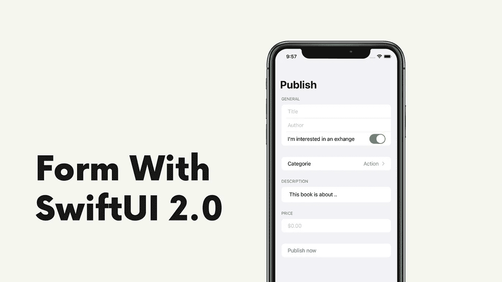
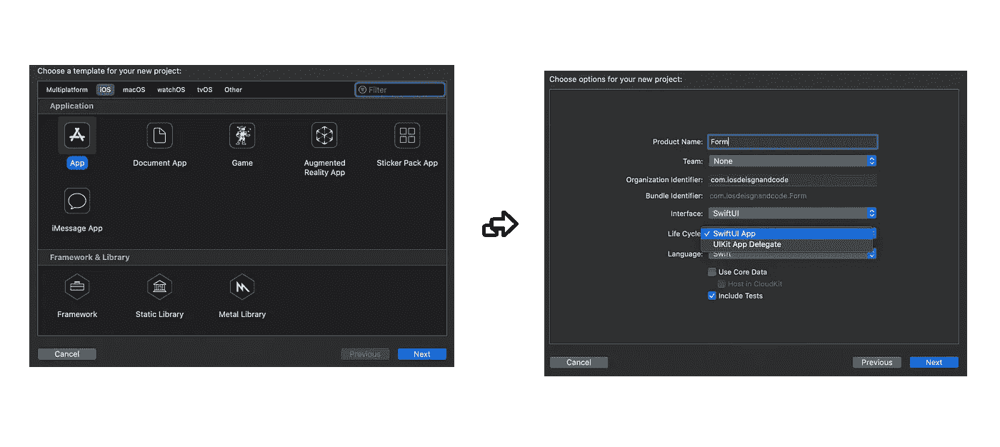

# 在 SwiftUI 2.0 中创建表单

> 原文：<https://betterprogramming.pub/create-a-form-in-swiftui-2-0-3a7f26303fd2>

## 了解如何创建包含文本字段、文本编辑器、选择器和开关的多节表单

作者照片。

我们将复制一个图书市场提交表单，包含标题、作者姓名、类别、描述，以及打开/关闭“我对交换感兴趣”的选项。它由五个部分组成，包括一个发布按钮。

# 让我们创建一个新项目！

打开 Xcode >新建项目>选择 SwiftUI 接口，调用*表单*:

Xcode 截图

现在打开`ContentView.Swift` 文件，在`body`变量上方和`struct`下方添加以下代码:

我们将在`[textfield](https://developer.apple.com/documentation/swiftui/textfield)`和 picker 中使用这些不同的[状态](https://developer.apple.com/documentation/swiftui/state)来修改值。

同样，用以下内容替换当前的`body`变量:

现在我们已经将表单嵌入到了一个`NavigationView`中，我们可以开始添加不同的部分了！

# **1。文本字段和切换**

*注意:将以下代码复制粘贴到表单图形中。总是一节接一节地添加，并注意图表。*

现在，我们已经在[表单](https://developer.apple.com/documentation/swiftui/form)中创建了第一个包含三个条目(`title`、`author`和`I’m interested in an exchange`作为布尔值)的部分，让我们继续创建第二个部分。

# **2。拾取器**

此部分由一个拾取器组成。当你点击它时，它会推出另一个视图，你可以从中选择一个我们添加的选项(`string`)。让我们做第三部分。

# 3.文本编辑器

这个更具体:是一个`[TextEditor](https://developer.apple.com/documentation/swiftui/texteditor)` *。*在 iOS 14 中引入，类似于 UIKit *中的`UITextView`。它是用来写大型文本条目的。*

# 4.带有数字的文本字段

在第四部分，我们将添加一个普通的`TextField`，只是我们只允许使用`decimalPad`键盘。这样，用户只能键入数字:

# 5.按钮

最后一部分将创建按钮。将下面的代码复制粘贴到前面的部分之后:

就是这样！由于 SwiftUI 2.0，我们在几行代码中集成了一个提交表单。幸运的是，这很简单。使用 UIKit 会复杂得多。

下一步:给按钮一个动作，并尝试将数据传递到您的数据库！

# 结论

感谢阅读！如有疑问，留言评论。如果你有点困惑，你可以在这里找到完整的`ContentView`代码: