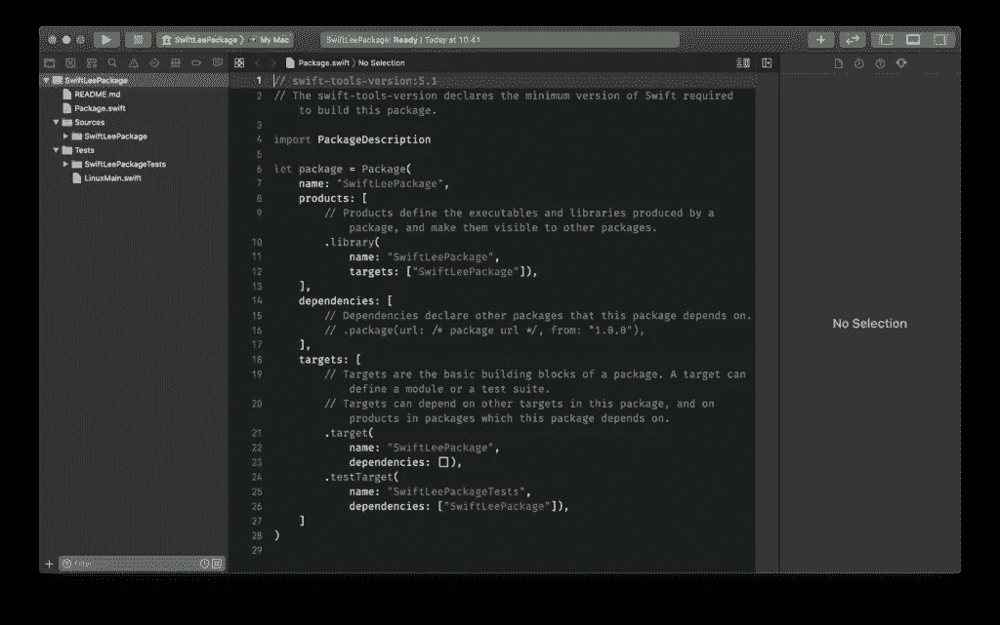

# 用 Xcode 中的 Swift 包框架创建框架

> 原文：<https://betterprogramming.pub/create-a-framework-with-swift-package-framework-in-xcode-1af8296fb7b8>

## 创建框架，设置文件配置选项，并为开发人员发布您的包


由[克里斯多夫·伯恩斯](https://unsplash.com/@christopher__burns?utm_source=unsplash&utm_medium=referral&utm_content=creditCopyText)在 [Unsplash](https://unsplash.com/s/photos/pattern?utm_source=unsplash&utm_medium=referral&utm_content=creditCopyText) 上拍摄的照片

Swift 包管理器是苹果管理依赖性的解决方案。我们都熟悉 CocoaPods 和 Carthage 等工具，但我们可能很快都会使用 Swift package manager。

通过切换到 Swift Package Manager (SPM ),我们还需要知道如何在 SPM 支持下创建我们自己的框架或库。让我们来看看如何创建自己的包吧！

# 什么是 Swift 包管理器？

Swift 包管理器是在 Swift 3.0 中引入的，它使我们能够管理 Swift 依赖性。您可以将其与 CocoaPods 和 Carthage 等工具进行比较，这些工具也允许您向项目添加依赖项。

Xcode 11 增加了从 Xcode 本身管理您的 Swift 包的集成支持。软件包管理器与 Swift 构建系统相集成，可自动完成下载、编译和链接依赖项的过程。这种自动化使得在您的 Swift 项目中添加和使用外部依赖项变得非常容易。

## 我们是否已经完全转换到 Swift package manager 了？

尽管在过去几年中它确实有了很大的改进，但是它还没有涵盖所有的用例。在 WeTransfer，我们经常遇到的缺失功能是向包中添加资源。例如，这阻止了我们向包含`.strings`和`png`文件的 [WeScan 框架](https://github.com/WeTransfer/WeScan)添加 SPM 支持。

除此之外，它已经可以使用了。您最终可以在另一个依赖项管理器旁边使用它。然而，等待有望引入资源支持的 WWDC 2020 可能更容易——该提议在 [SE-271](https://github.com/apple/swift-evolution/blob/master/proposals/0271-package-manager-resources.md) 中被接受。

# 生成您自己的 Swift 包

您可以在终端和 Xcode 中创建自己的 Swift 包，具体取决于您最喜欢的内容。

## 从终端创建 Swift 包

要从终端创建包，您可以使用以下命令:

```
$ mkdir SwiftLeePackage
$ cd SwiftleePackage
$ swift package init 
```

在这个例子中，我们创建了一个名为`SwiftLeePackage`的包。运行`init`命令后，我们将看到在终端中打印出创建库的步骤:

```
Creating library package: SwiftLeePackage
Creating Package.swift
Creating README.md
Creating .gitignore
Creating Sources/
Creating Sources/SwiftLeePackage/SwiftLeePackage.swift
Creating Tests/
Creating Tests/LinuxMain.swift
Creating Tests/SwiftLeePackageTests/
Creating Tests/SwiftLeePackageTests/SwiftLeePackageTests.swift
Creating Tests/SwiftLeePackageTests/XCTestManifests.swift
```

如您所见，它创建了我们自己的包所需的所有基本文件，包括测试。您可以通过打开将在 Xcode 中打开您的包的`Package.swift`来探索您的包并运行测试。

您也可以通过执行以下命令直接在终端中执行相同的操作:

```
$ swift build
$ swift test
```

## 在 Xcode 中创建 Swift 包

通过导航到`File ➞ New ➞ Swift Package...`，可以在 Xcode 中轻松复制上述步骤。给你的包起一个它需要的名字，保存它，Xcode 会直接打开你的包让你直接开始使用它。



创建的 Swift 包在 Xcode 中打开

从这里，您可以开始构建和测试您的包，就像您正在处理一个普通的 Xcode 项目一样。

# 增强默认生成的包。swift

创建你的包后，你会看到默认生成的`Package.swift`文件。这包括您的包的名称、它的产品、依赖项和目标。这些都是创建一个包所需要的基础，但是你可以添加更多来更好地描述你的包。

但是在我们讨论这些选项之前，最好知道程序包文件中的第一行需要保留。

```
// swift-tools-version:5.1
```

它指出构建软件包需要哪个最低版本的 Swift。省略这个特殊注释的包将默认为工具版本 3.1.0，这可能不是您想要的。

## 向 Swift 包文件添加支持的平台

默认情况下，Swift 包管理器为每个支持的平台分配一个预定义的最低部署版本。如果您的包只支持特定的平台或平台的特定版本，您可以使用`platforms`属性将该配置添加到您的包文件中。

在以下示例中，我们添加了对 macOS、watchOS、tvOS 和 iOS 的支持:

```
// swift-tools-version:5.1
// The swift-tools-version declares the minimum version of Swift required to build this package.

import PackageDescription

let package = Package(
    name: "SwiftLeePackage",
    platforms: [
        // Add support for all platforms starting from a specific version.
        .macOS(.v10_15),
        .iOS(.v11),
        .watchOS(.v5),
        .tvOS(.v11)
    ],
    products: [
        .library(name: "SwiftLeePackage", targets: ["SwiftLeePackage"])
    ],
    targets: [
        .target(name: "SwiftLeePackage", dependencies: []),
        .testTarget(name: "SwiftLeePackageTests", dependencies: ["SwiftLeePackage"])
    ]
)
```

如果您只想添加对 iOS 11 及更高版本的支持，您可以按如下方式更改`platforms`属性:

```
platforms: [
    // Only add support for iOS 11 and up.
    .iOS(.v11)
]
```

这将向实现者表明，该包不支持所有其他平台。

## 向包中添加依赖项

您可能希望将外部依赖项添加到您的 Swift 软件包中。您可以通过利用包的`dependencies`属性并在您想要访问它的目标中引用依赖项来做到这一点。

例如，我们可以添加 [Mocker 框架](https://github.com/WeTransfer/Mocker)作为测试目标的依赖项:

```
// swift-tools-version:5.1
// The swift-tools-version declares the minimum version of Swift required to build this package.

import PackageDescription

let package = Package(
    name: "SwiftLeePackage",
    platforms: [
        // Only add support for iOS 11 and up.
        .iOS(.v11)
    ],
    products: [
        .library(name: "SwiftLeePackage", targets: ["SwiftLeePackage"])
    ],
    dependencies: [
        /// Define the Mocker dependency:
        .package(url: "https://github.com/WeTransfer/Mocker.git", from: "2.0.0")
    ],
    targets: [
        .target(name: "SwiftLeePackage", dependencies: []),
        /// Add it to your test target in the dependencies array:
        .testTarget(name: "SwiftLeePackageTests", dependencies: ["SwiftLeePackage", "Mocker"])
    ]
)
```

在这个例子中，我们添加了 Mocker 框架，并告诉包管理器自动获取从`2.0.0`开始的版本。这允许它获取像`2.0.1`或`2.1.0`这样的版本，但不能获取`3.0.0`，因为那是下一个可能包含重大变化的主要版本。

这里有很多选项可以为您的依赖项添加特定的要求，比如使用范围或精确版本:

```
.package(url: "https://github.com/WeTransfer/Mocker.git", from: "2.0.0"),
.package(url: "https://github.com/WeTransfer/Mocker.git", "2.0.0"..<"2.5.0"),
.package(url: "https://github.com/WeTransfer/Mocker.git", .exact("2.0.0")),
.package(url: "https://github.com/WeTransfer/Mocker.git", .upToNextMajor(from: "2.0.0")),
.package(url: "https://github.com/WeTransfer/Mocker.git", .upToNextMinor(from: "2.0.0"))
```

## 使用特定的分支或修订添加依赖项

如果您想要获取当前正在开发或尚未发布的依赖项，您还可以添加特定的分支或修订:

```
.package(url: "https://github.com/WeTransfer/Mocker.git", .branch("development")),
.package(url: "https://github.com/WeTransfer/Mocker.git", .revision("e74b07278b926c9ec6f9643455ea00d1ce04a021"))
```

## 使用本地开发路径添加依赖项

另一个常见的用例是在开发过程中添加一个本地包，以便于迭代和测试。您可以通过指定包的路径来实现这一点:

```
.package(path: "/your/local/package/path")
```

# 使用自动测试发现删除所有测试

浏览默认生成的包，您会看到一个包含以下代码的`XCTestManifests.swift`文件:

```
import XCTest

#if !canImport(ObjectiveC)
public func allTests() -> [XCTestCaseEntry] {
    return [
        testCase(SwiftLeePackageTests.allTests),
    ]
}
#endif
```

此外，在默认生成的测试类中，您可以找到一个包含所有当前添加的测试的静态数组:

```
static var allTests = [
    ("testExample", testExample),
]
```

这是为了允许我们在 Linux 上运行测试而添加的，并要求我们与新添加的测试保持手动同步。这是相当痛苦的维护，但幸运的是，这是不再需要的！

Swift 5.1 为 Linux 引入了[自动测试发现](https://forums.swift.org/t/test-discovery-on-linux/26203)，现在允许我们在 Linux 上运行测试，如下所示:

```
swift test --enable-test-discovery
```

它还允许我们去掉`allTests`属性和`XCTestManifests.swift`文件。删除这些之后，我们需要更新`LinuxMain.swift`文件来删除所有对`allTests`的引用。该类本身仍然是必需的，否则在 Linux 上的构建将会失败。为了帮助调试，在`LinuxMain.swift`文件中添加一个`fatalError`可能是好的，它建议使用`--enable-test-discovery`参数运行测试:

```
fatalError("Running tests like this is unsupported. Run the tests again by using `swift test --enable-test-discovery`")
```

# 发布您的 Swift 包裹

要发布您的 Swift 包，您只需在您的 Git 存储库上创建一个新标签。正如您之前在依赖关系部分看到的，您可以使用 Git URLs 添加对依赖关系的引用。

为了让开发者更容易地探索软件包，[戴夫·弗维尔](https://twitter.com/daveverwer)引入了 [SwiftPM 库](https://swiftpm.co/)。将你的包添加到库中就像提交一个拉取请求一样简单，如这里的[所解释的](https://github.com/daveverwer/SwiftPMLibrary#how-do-you-add-a-package)。

# 结论

就是这样！我们已经在终端和 Xcode 中创建了自己的 Swift 包。我们以多种不同的方式添加了特定的平台需求和依赖性。利用自动测试发现允许我们轻松地维护 Linux 的测试。

如果您想进一步提高您的 Swift 知识，请查看 [Swift 类别页面](https://www.avanderlee.com/category/swift/)。

谢谢！