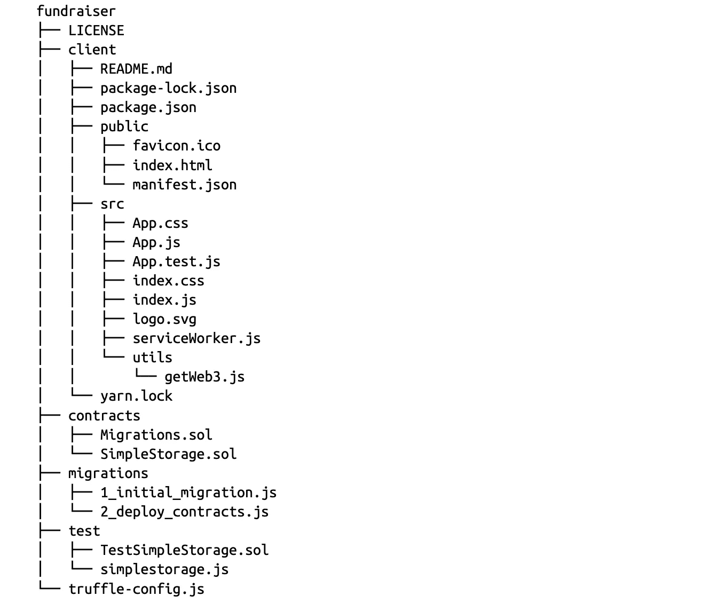
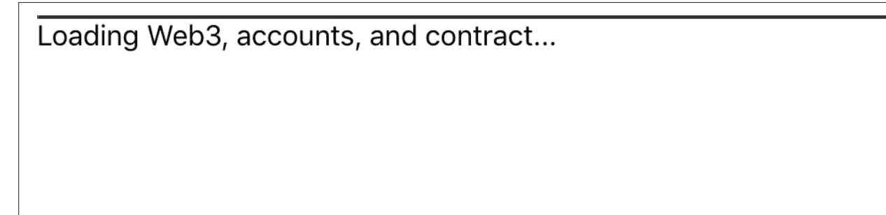
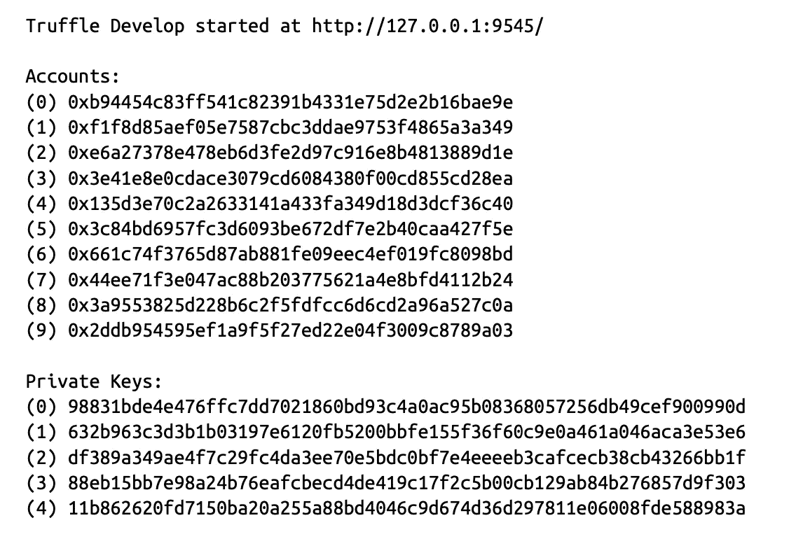
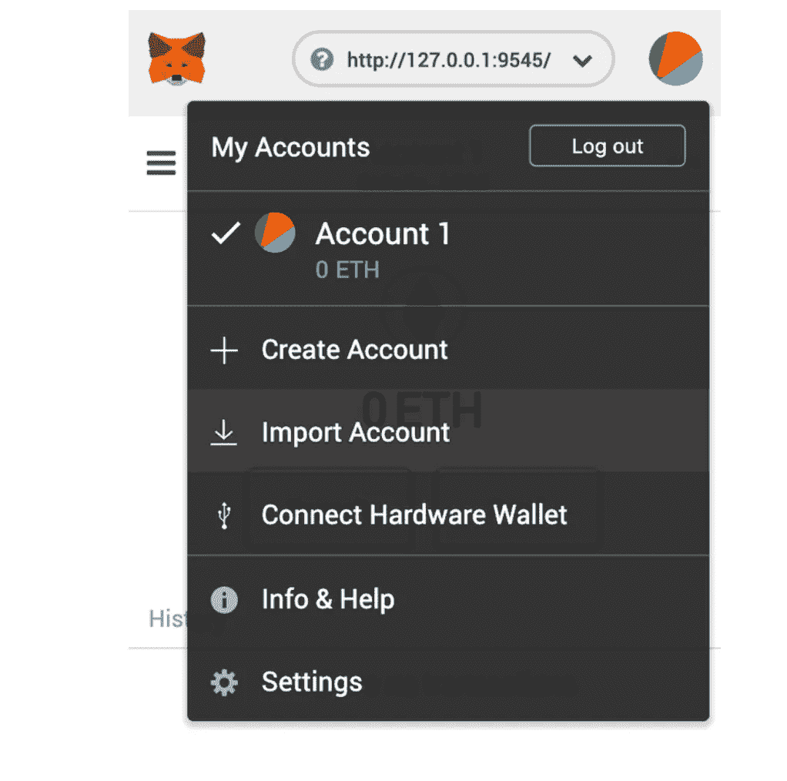
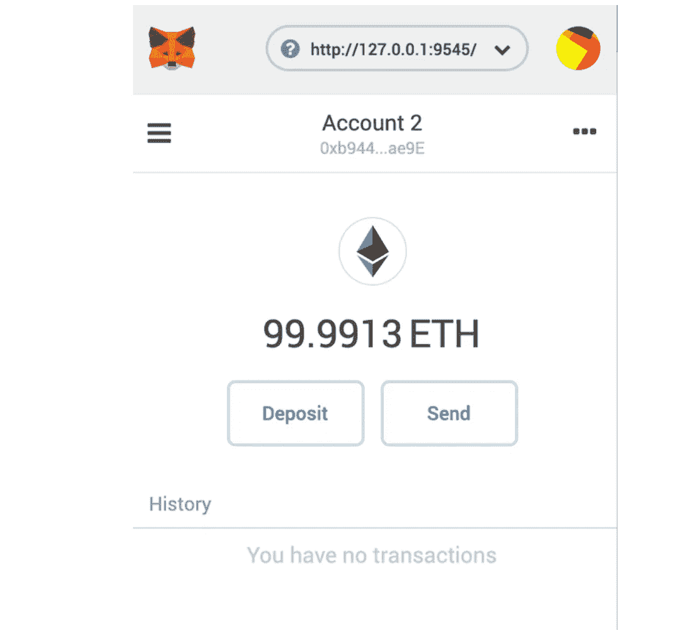
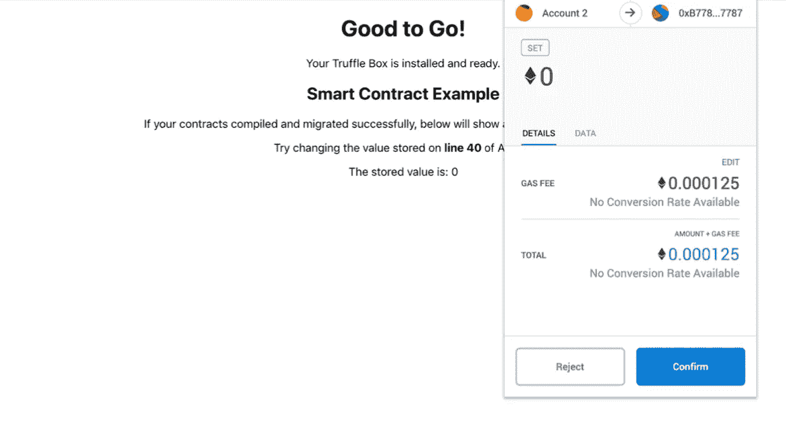
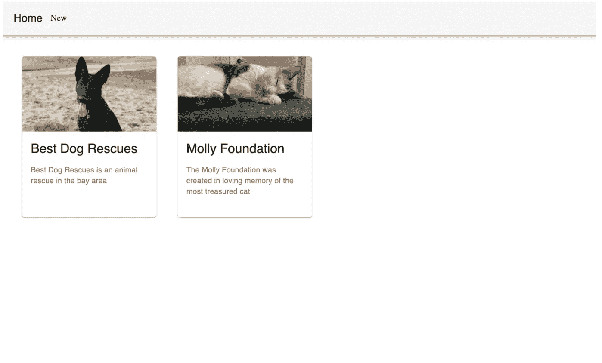
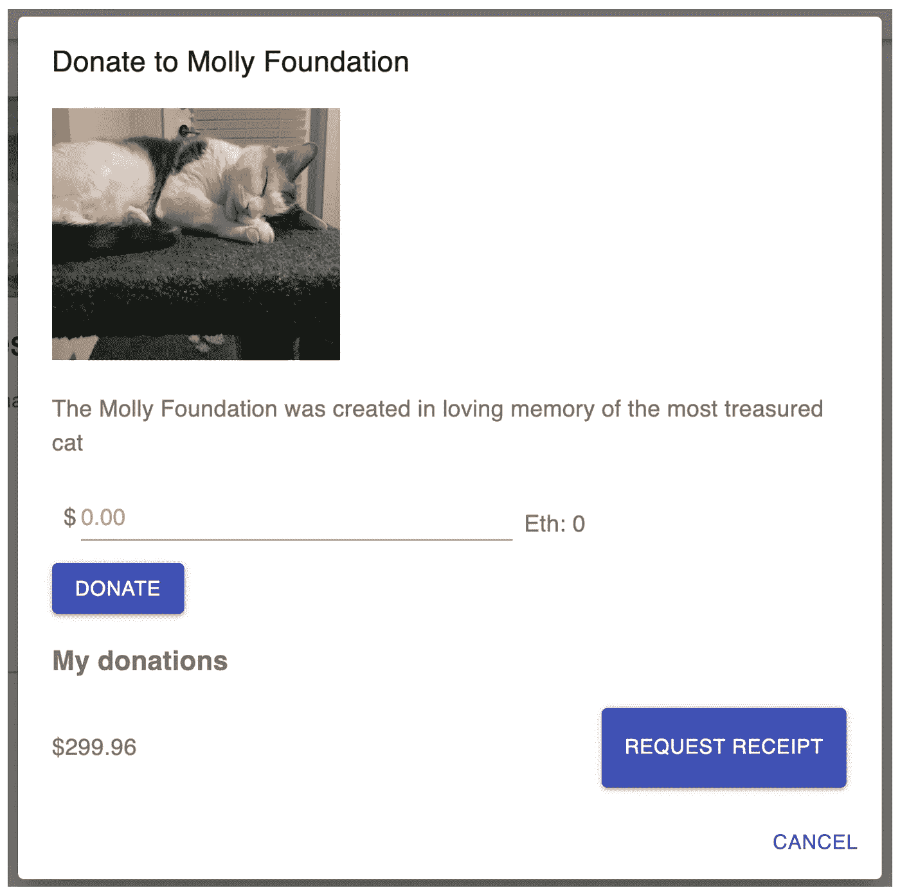

# 使用 Truffle、Solidity、React、Material UI 和 Web3 创建一个筹款 Dapp

> 原文：<https://betterprogramming.pub/create-a-full-stack-fundraiser-dapp-using-truffle-solidity-react-material-ui-and-web3-222638147c7a>

## 发起筹款活动，捐赠 ETH，生成收据，并提取金额


图片来自 Unsplash

我们将使用 React Truffle Box 为我们的 Web3 应用程序生成前端代码，以使它快速运行并与 Web3 交互。让我们首先为我们的筹款应用程序创建一个新目录，并在其中创建一个新的 Truffle React Box 应用程序。

我们需要做的第一件事是为筹款应用程序创建一个新的空存储库。接下来，我们将切换到该目录并打开 React Truffle 框:

```
mdkir fundraiser
cd fundraiser
truffle unbox react
```

除去`node_modules` 目录，我们的目录结构现在应该如下所示:



移除`contracts/SimpleStorage.sol`、`migrations/2_deploy_contracts.js`并清空`test`文件夹:

```
rm contracts/SimpleStorage.sol **\** migrations/2_deploy_contracts.js \ test/*
```

接下来，您需要为我们的合同和迁移创建新文件。首先，为我们的合同和迁移创建所有的空文件:

```
touch contracts/FundraiserFactory.sol
touch contracts/Fundraiser.sol
touch migrations/2_factory_contract_migrations.js
```

我们还需要安装`OpenZeppelin`,因为我们正在使用 Ownable contract:

```
npm install @openzeppelin/contracts
```

并且在`Fundraiser.sol` 文件中，将 import 语句改为使用我们刚刚从 OpenZeppelin 安装的 node_module:

```
import '../client/node_modules/@openzeppelin/contracts/ownership/Ownable.sol';
```

`Fundraiser.sol`的代码如下所示:

`FundraiserFactory.sol`的代码如下所示:

添加完合同后，让我们再次启动并运行我们的块菌开发环境。

在资金筹集者存储库中，让我们运行命令来编译和迁移我们的资金筹集者合同，以便我们可以从我们的前端应用程序与它们进行交互:

```
truffle develop
```

该命令运行完毕后，我们将在同一个终端窗口中运行编译和迁移:

```
compile
migrate
```

> 如果您曾经遇到过迁移问题，并且在解决方案上停滞不前，请尝试运行 **migrate — reset** 。

如果您的合同已成功迁移，它们应该类似于以下输出:

```
Starting migrations...
======================
> Network name:    'develop'
> Network id:      5777
> Block gas limit: 0x6691b71_initial_migration.js
======================Replacing 'Migrations'
----------------------
> transaction hash: 0xf04ee2a0c62330e7a051148d4660de...
> Blocks: 0        Seconds: 0
> contract address: 0x6Af651D4c6E9f32a627381B...
> block number: 1
> block timestamp: 1566526994
> account: 0xb94454C83ff541c82391b...
> balance: 99.99477342
> gas used: 261329
> gas price: 20 gwei
> value sent: 0 ETH
> total cost: 0.00522658 ETH> Saving migration to chain.
> Saving artifacts
-------------------------------------
> Total cost:          0.00522658 ETH2_factory_contract_migrations.js
================================Replacing 'Factory'
-------------------
> transaction hash: 0xebc5a26bbe12f52b809d9144...
> Blocks: 0    Seconds: 0
> contract address: 0xB7780C9AD3ef38bb4C8B48fab37...
> block number: 3
> block timestamp: 1566526995
> account: 0xb94454C83ff541c82391b4...
> balance: 99.95063086
> gas used: 2165105
> gas price: 20 gwei
> value sent: 0 ETH
> total cost: 0.0433021 ETH> Saving migration to chain.
> Saving artifacts
-------------------------------------
> Total cost:           0.0433021 ETH Summary
=======> Total deployments:   2
> Final cost:          0.04852868 ETH
```

## 筹款设置

让我们开始运行 React Truffle Box，这样我们就可以与应用程序进行交互了。

我们首先需要 cd 到 React 应用程序的`src` 文件中，并安装 React Truffle Box 为我们提供的所有依赖项。

之后，我们需要启动应用程序的前端，就像我们在上一章所做的那样:

```
cd client
npm i
```

模块安装完成后，启动服务器:

```
npm start
```

如果一切都已正确安装并成功启动，我们现在可以导航到 localhost:3000 来查看我们的 Web3 应用程序。看见



哎呀！我们忘了切换网络以匹配新的应用程序。我们需要在同一个网络上，这样我们的应用程序才能正常运行。

让我们首先进入 MetaMask，将顶部的网络切换为 Localhost 8545。

Localhost 8545 应该在默认列表中。如果没有，可以参考上一章再补充。

当我们运行块菌开发时，我们看到了这个:*块菌开发开始于*[*http://127 . 0 . 0 . 1:9545/*](http://127.0.0.1:9545/)



将 [http://127.0.0.1:9545/](http://127.0.0.1:9545/) 复制到您的剪贴板。接下来，我们需要打开 MetaMask 并导入该网络。打开 MetaMask 扩展并选择主以太网。我们需要选择 Custom RPC 并输入 [http://127.0.0.1:9545](http://127.0.0.1:9545) ，这里显示新的 RPC URL。"


元掩码

转到我的帐户>导入帐户



将*块菌发育*后生成的私钥粘贴到元掩码导入中，并选择导入。



现在，刷新屏幕，您应该会看到我们之前看到的简单存储 UI。验证您的页面看起来像



随着我们的应用程序的运行，让我们从我们的 [App.js](https://github.com/ac12644/fundraiser_dapp/blob/master/client/src/App.js) 文件开始，取出一些样板代码来准备我们的前端与募捐者进行交互。

首先，导航到`[client/src](https://github.com/ac12644/fundraiser_dapp/tree/master/client/src)` 目录，打开`App.js` 文件。我们需要删除旧的 React 代码，并用我们自己的 React 代码替换它:

## 反应路由

我们需要在 React 应用程序中设置路线。我们将使用 react-router-dom 让用户看到不同的页面，这取决于他们从 navbar 中选择了什么。

我们将从安装`react-router-dom`的 npm 包开始:

```
npm install — save react-router-dom
```

安装 npm 包并重启前端服务器后，从 react-router-dom 中导入所需的文件到`App.js` 文件中，如下所示:

```
import { BrowserRouter as Router, Route, NavLink } from "react-router-dom"
```

我们还需要为主页和新的筹款活动导入两个新组件，以便在我们的路线中使用:

```
import NewFundraiser from './NewFundraiser'
import Home from './Home'
```

接下来，让我们用下面的代码替换 render 函数。这将使我们能够使用 Material UI 提供的导航条导航到整个应用程序的不同页面:

新建两个文件:`Home.js` 和`NewFundraiser.js`。

我们将使用主页组件作为应用程序的主登录页面，并使用新的资金筹集者页面在应用程序中创建新的资金筹集者:

```
touch Home.js
touch NewFundraiser.js
```

让我们开始创建`Home`视图。在您的`[Home.js](https://github.com/ac12644/fundraiser_dapp/blob/master/client/src/Home.js)` 文件中，使用以下占位符代码并保存该文件:

同样，在`NewFundraiser.js` 文件中，添加这段代码:

我们需要做的是修改我们的`index.js` 文件中的代码，这样我们就可以正确地渲染路线。

我们将使用`react-router-dom`中的`BrowserRouter`将我们的应用程序包装在路由器中:

## 反应和材质用户界面

让我们从将材质 UI 安装到我们的应用程序开始。

在您的`client` 目录中运行 install 命令，在我们的筹款应用程序中安装 react-bootstrap，如下所示:

```
npm install @material-ui/core --save
```

从材料 UI 站点，让我们来看看这里的应用程序栏页面。
先说简单的 app 吧。

首先，我们需要将所有的导入添加到我们的`App.js` 文件的顶部。这将允许我们使用我们需要的材料 UI 组件:

```
import { makeStyles } from '@material-ui/core/styles';
import AppBar from '@material-ui/core/AppBar';
import Toolbar from '@material-ui/core/Toolbar';
import Typography from '@material-ui/core/Typography';
```

现在我们有了导入，我们需要添加样式，这样我们的筹款应用程序看起来就不错了。

您需要在`useEffect`函数后添加这些样式:

```
const useStyles = makeStyles({
      root: {
        flexGrow: 1,
      },
});
const classes = useStyles();
```

导入正确的文件并添加样式代码后，让我们替换实际的渲染代码，这样我们就可以看到新的导航栏了:

让我们快速地给`NavLink`组件添加一点样式，让它看起来更专业。

在您的[*app . CSS*](https://github.com/ac12644/fundraiser_dapp/blob/master/client/src/App.css)*文件中，将这些添加到文件中:*

## *创建我们新的筹款页面视图*

*我们将从使用材质 UI 的文本字段组件开始。在您的`NewFundraiser.js` 文件中，在您最近的导入语句之后添加一条导入语句。现在，让我们继续获取 Web3，以便访问我们的工厂合同*【第 42 行】*。*

*在我们的`NewFundraiser.js` 文件中，更新`useEffect`函数以使用 Web3 代码。下面的代码将创建我们的合同的一个新实例，并设置 Web3、我们的合同和我们的当前帐户的状态。*

*接下来，我们需要导入我们的契约，并指向我们的`NewFundraiser.js` 文件*【第 6–7 行】*中已经本地部署的契约。*

*现在我们已经从合同中收到了数据，我们将在前端工作，向用户显示每张筹款卡。*

*我们需要做的第一件事是创建一个新组件，用于显示我们的卡组件。新建一个文件`FundraiserCard.js` ***。****

*如果您导航到 localhost:3000，您会看到它现在是空白的。让我们创建一个渲染函数来遍历每一个募捐者，并在卡片上显示它们。*

*现在，切换到`[Home.js](https://github.com/ac12644/fundraiser_dapp/blob/master/client/src/Home.js)` [](https://github.com/ac12644/fundraiser_dapp/blob/master/client/src/Home.js)文件，我们将遍历筹款人列表并显示每个筹款人的卡组件:*

```
*const displayFundraisers = () => {
      return funds.map((fundraiser) => { 
        return (
          <FundraiserCard fundraiser={fundraiser} />
       ) })
}*
```

**

*资金筹集活动*

# *收尾工作*

## *添加每个募捐者的详细信息*

*我们议程上的下一个项目是向我们的用户显示更多关于每个募捐者的信息。复制以下代码并将其添加到`FundraiserCard.js`:*

*`App.js`的代码如下所示:*

*`Receipts.js`的代码如下所示:*

**

*收据*

# *资源和参考资料*

*   *GitHub:[https://github.com/ac12644/fundraiser_dapp.git](https://github.com/ac12644/fundraiser_dapp.git)*
*   *新版本:[https://github.com/ac12644/Fundraising-Dapp.git](https://github.com/ac12644/Fundraising-Dapp.git)*
*   *书籍:[使用 Solidity 和以太坊进行实际智能合约开发](https://www.google.it/books/edition/Hands_On_Smart_Contract_Development_with/tBbADwAAQBAJ?hl=en&gbpv=0)*