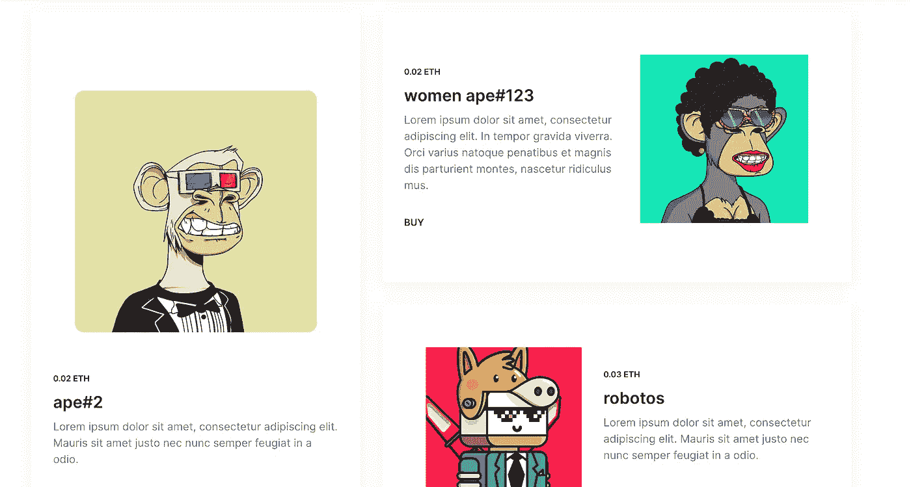

# 在多边形网络上创建全栈 NFT 市场

> 原文：<https://betterprogramming.pub/create-a-full-stack-nft-marketplace-on-the-polygon-network-20176b3a9e33>

## 了解如何使用安全帽、IPFS 和 Next js 创建 NFT 市场


信用: [robotos nft](https://market.robotos.art/token/ETHEREUM:0x4e962d488412a14aa37eacadcb83f18c7e2271a7:8724)

## 功能

1.  使用 meta mask/wallet connect/coin base 的 Web3 身份验证
2.  创建并列出待售令牌
3.  使用 IPFS 上传文件
4.  市场所有者可以设置平台费用
5.  买家可以购买代币，并再次出售
6.  合同部署在 Matic mumbai testnet 上([https://Mumbai . polygonscan . com/address/0x 0 E1 ee 61 D5 c 435 c 1320 E3 FB 766328 f 35263 e 41 BFF](https://mumbai.polygonscan.com/address/0x0E1Ee61D5C435C1320E3fb766328F35263E41Bff))

## 多边形是如何工作的？

Polygon 是一个多级平台，其目标是扩展以太坊，这要归功于大量的侧链，所有侧链都旨在以有效且经济高效的方式疏通主平台。

Polygon 的主链是一个利益证明(PoS)侧链，网络参与者可以在其中使用自动令牌来验证交易和投票表决网络升级。

## 健身游乐场

1.  创建下一个 js 应用程序

```
git clone [https://github.com/ac12644/NFT-Marketplace.git](https://github.com/ac12644/NFT-Marketplace.git)
```

2.安装软件包

```
yarn
```

## 后端

通过以下代码启动 hardhat

```
npx hardhat
```

> 如果 README.md 文件出现错误，请将其删除并重试

3.按照给定方式配置`hardhat.config.js`文件:

4.我们现在将创建`Marketplace.sol`契约。该合同将用于存储待售商品的列表，以及跟踪出价和购买情况。该合同还将包括向市场添加新项目的功能。`listingPrice`将用于定义平台挂牌费用。以后可以更改，卖家的地址也会被保存。

5.创建一个`deploy.js`脚本以在脚本文件夹中部署智能合同:

部署 nft

6.现在，我们在 Polygon Mumbai Testnet 上部署智能合同

```
npx hardhat run scripts/deploy.js --network mumbai
```

部署智能合同后，您可以看到您的市场地址复制它并创建一个新文件 Address.js 将其另存为:

```
export const marketAddress = '0x0E1Ee61D5C435C1320E3fb766328F35263E41Bff';
```

> *为了成功部署合同，如果您在此处没有请求，您的钱包中必须有 test Matic*[*https://faucet.polygon.technology/*](https://faucet.polygon.technology/)

## 前端

本节说明如何将 DApp 的前端与智能合约连接起来。这将允许您的 DApp 与您在以太坊区块链上的智能合约进行交互。模板遵循 [github](https://github.com/ac12644/NFT-Marketplace) 。

1.  欢迎来到我们的 NFT 创作表单！有了这个表单，你就可以创建自己的 NFT 并出售。首先，你需要从 [Infura](https://infura.io/) 获得 IPFS 项目 id、密钥和专用网关子域。

6.Home.js 获取平台上所有挂牌出售的 NFT:

7.Assets.js 获取您拥有的 NFT:

8.js 获取平台上列出的所有 NFT。

## 运行应用程序

现在我们可以测试应用程序了！

要启动该应用程序，请运行以下命令:

```
yarn run dev
```



nft 市场

## 贮藏室ˌ仓库

沿着[链接](https://github.com/ac12644/NFT-Marketplace)到 GitHub。