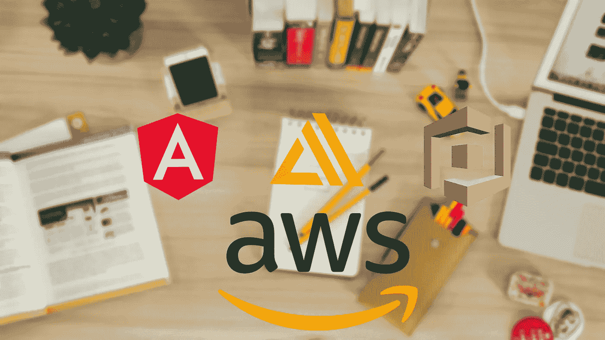
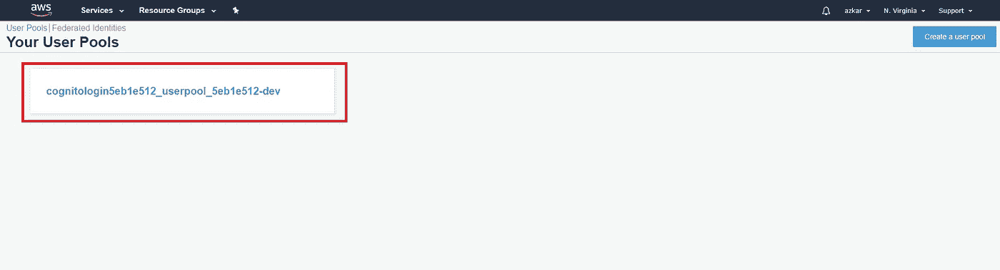
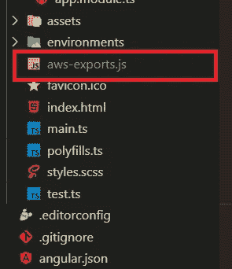
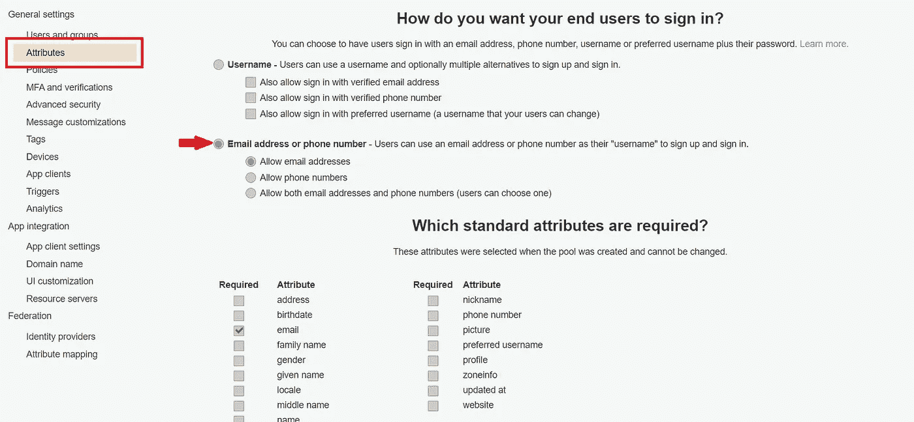

# 使用 AWS Cognito 创建全功能的无服务器用户身份验证，并使用 Angular 进行扩展

> 原文：<https://betterprogramming.pub/create-a-fully-functioning-user-authentication-with-aws-cognito-and-amplify-with-angular-complete-a3ce58df1b74>

## 完全指南



在这篇文章中，我们将着眼于使用带有 Angular 8 应用程序的 [AWS Amplify](https://aws.amazon.com/amplify/) 库实现一个无服务器解决方案。

我们将创建一个全功能的用户身份验证，包括用户注册、验证电子邮件、登录和注销。为了让所有这些事情发生，我们将使用由 AWS 提供的便捷服务 [AWS Cognito](https://aws.amazon.com/cognito/) 。

首先，需要一个 AWS 帐户，如果你没有帐户，你可以在 [AWS](https://aws.amazon.com/) 创建一个免费帐户。如果你已经有了一个帐户，你就可以开始了。

TL；速度三角形定位法(dead reckoning)

# 什么是放大？

[Amplify](https://aws-amplify.github.io/) 是一个开源库，帮助您轻松构建一个灵活、可靠、可伸缩的无服务器后端，并将其与您的前端集成。这是 11 月份在 [AWS re:Invent 2017](https://reinvent.awsevents.com/) 上首次推出的。

> “一个自以为是的、基于类别的客户端框架，用于构建可扩展的移动和 web 应用程序”——[AWS](https://aws.amazon.com/getting-started/use-cases/mobile/)

Amplify 框架包含三个关键特性:

*   库:自带一套与云服务相关的 JavaScript、Android 和 iOS 的综合库，如分析、认证、存储、通知、REST 和[graph QL](https://graphql.org/)API、AR/VR。
*   Amplify CLI:用于在 AWS 上配置和管理无服务器基础设施的命令行工具。
*   UI 组件:一组特定于框架的很酷的 UI 组件，包括 React、React Native、Angular、 [Ionic](https://ionicframework.com/) 和 [Vue](https://vuejs.org/) 用于身份验证、照片拾取器等。使您的开发变得容易。

这些 UI 组件带有非常方便的主题，但是在本教程中，我们将开发我们自己的 UI 组件。

# 让我们开始吧

首先，我们需要在本地机器上安装和配置 AWS Amplify CLI。我们将使用 [npm](https://www.npmjs.com/) 来安装 CLI，这需要在您的机器上安装 Node.js 和 npm

确保您的节点版本至少是 8.x.x 或更高版本，并且您的 npm 版本是 5.x.x 或更高版本。如果没有，您需要升级您的节点和 npm，以至少满足最低要求。

要在您的终端中安装 Amplify CLI，只需运行以下命令，这将在您的本地计算机上全局安装 CLI:

```
npm install -g @aws-amplify/cli
```

一旦安装了 CLI，就需要通过创建 IAM 用户来创建和管理 AWS 资源，从而对其进行配置。为此，只需运行:

```
amplify configure
```

这个过程将带你通过几个步骤。

*   这将在您的浏览器中打开 AWS 控制台，您需要登录您的帐户，完成后，您需要在终端中按 enter 键继续该过程。
*   接下来，它将要求您指定 AWS 区域: *us-east-1* (我选择 us-east-1，North Virginia 作为我的区域，这可能会因您所在的区域而异)。
*   接下来，它将要求您指定新 IAM 用户的用户名:`angular-amplify-demo`(您可以根据自己的喜好使用任何名称)
*   当您按下回车键时，它会将您重定向到 IAM 管理控制台。您可以单击下一步的*来完成创建用户，我们将保留默认设置和权限。您可以前往终端并点击*进入*继续。*

接下来，它会问:

*   `accessKeyId`:您的访问密钥 ID
*   `secretAccessKey`:你的 _ 秘密 _ 访问 _ 密钥

(您可以从您的 IAM 用户那里获取这些密钥。)

接下来，它将要求一个配置文件名:(default)我将把它保留为默认值，但是您可以为此指定一个配置文件名。

这将在您的本地机器上创建/更新与上述`accessKeyId`和`secretAccessKey`相关联的 AWS 概要文件。至此，您已经成功设置了新用户。

或者，你可以看一个关于配置过程的[视频教程](https://www.youtube.com/watch?v=fWbM5DLh25U)。

下一步…

恭喜你！

至此，您已经成功地在本地机器上安装并配置了 AWS Amplify。

# **创建角度项目**

接下来，我们需要创建我们的角度项目。我将使用 Angular CLI 来生成一个新的 Angular 应用程序，为此，您需要在您的计算机上安装 Angular CLI。

如果没有，只需运行以下命令来全局安装 Angular CLI:

```
npm install -g @angular/cli
```

要创建和运行新的应用程序，只需运行:

```
ng new aws-amplify-cognito-authentication
cd aws-amplify-cognito-authentication
ng serve
```

这将启动您的应用程序，您可以从浏览器导航到 localhost:4200 来打开应用程序。

# **安装放大库**

为了开始使用 Amplify，我们需要安装`aws-amplify`和`aws-amplify-angular`库作为 Angular 应用程序的依赖项。

`aws-amplify-angular`包是一组角度组件和角度提供器，有助于将您的应用与 AWS Amplify 库集成。它支持 Angular 5.0 或以上。

# 配置后端

现在，我们需要为项目配置我们的后端，并启用 Amazon Cognito 用户池的身份验证。要初始化后端项目，只需运行:

```
amplify init
```

这将带您完成设置我们的后端所需的一系列问题。

*   选择你的默认编辑器: [Visual Studio 代码](https://code.visualstudio.com/)。(您可以选择正在使用的代码编辑器。)
*   选择您正在使用的应用类型:JavaScript。
*   你用的是哪个 JavaScript 框架:Angular。
*   源目录路径:`src`。(您需要指定您的项目的源目录路径，我将通过点击 enter 接受默认为`src`是我们的源目录。)
*   目的目录路径:`dist/aws-amplify-cognito-authentication`。(默认情况下，Angular 将创建一个同名的子文件夹，因此，确保将子文件夹指定为目标目录路径。)
*   构建命令:`npm run-script build`
*   开始命令:`ng serve`
*   是否要使用 AWS 配置文件？是的。
*   请选择您想要使用的配置文件:默认。(如果您在放大器配置过程中为您的配置文件命名，请确保选择该名称作为您的配置文件。)

这样，需要一些时间来初始化云中的项目，一旦完成，您将在您的终端上看到一个成功的消息和一堆其他信息。

现在我们已经成功地配置了我们的后端。

然后，我们需要通过创建 Amazon Cognito 用户池来配置 AWS Cognito，这是一个全功能的用户目录服务，可以帮助我们处理用户注册和身份验证。

首先，只需运行以下命令:

```
amplify auth add
```

同样，这将带您了解设置我们的用户池所需的一系列问题。

*   是否要使用默认身份验证和安全配置:是，使用默认配置。

但是我将选择默认配置，以便它立即在本地配置 Cognito。现在我们需要将我们的配置发布到云中，这样我们就可以开始使用这项服务了。

为此，只需运行:

```
amplify publish
```

这将在表格视图中显示您的配置摘要，您可以通过说“Yes”来确认。

这个过程需要一些时间来创建我们的 Cognito 用户池和 Congito 身份池，一旦完成，它将在您的终端上显示一条成功消息。

您可以访问 AWS 控制台，检查用户池是否已成功创建(确保您选择了正确的区域)。



# **接下来是什么？**

既然我们已经设置好了后端，我们需要为身份验证过程配置前端应用程序。

现在，如果你已经注意到，一个名为`aws-exports.js` 的新文件已经在你的 Angular 应用程序中创建，它保存了所有与 AWS Cognito 相关的配置。



下一步，我们需要将这些配置导入到我们的应用程序中。在您的`main.ts`文件中，您需要添加以下导入:

在 Angular 6+中，Angular 团队决定在浏览器中删除对“全局”和“过程”变量的支持，因此，所有 Angular 6+应用程序都不包括这方面的垫片。

要添加支持，您需要在您的`polyfills.ts`文件中添加以下代码:

接下来，我们需要将应该包含在`types`编译器选项中的`“node”`包包含在您的`src/tsconfig.app.json`文件中，以便使用`aws-js-sdk`。

```
"compilerOptions": {
    "types" : ["node"]
}
```

一切就绪，让我们在 AWS Cognito 池中注册我们的第一个用户。

# 签约雇用

要将我们的用户对象发送到 Cognito，您需要将`aws-amplify`库导入到您的组件中。

```
import { Auth } from 'aws-amplify';
```

要在用户池中创建新用户，请执行以下操作:

`Auth.signUp()`方法将用户对象作为参数，带有用户注册的必需字段，在我们的例子中是这样的:

```
*const* user = {
   username,
   password,
   attributes: {
        email,
        phone_number // other custom attributes
      }
}
```

现在，当您通过`username`时，您必须确保您已经在您的 Cognito 用户池中将用户名设置为登录方法。

如果您选择了电子邮件作为您的登录方法，您需要发送用户电子邮件作为用户对象中的用户名属性。

您可以通过访问 Cognito 用户池中`General settings`下的`Attributes`选项卡来检查您在 Cognito 用户池中将哪个属性设置为登录方法。



在本例中，我将`Email address or phone number`设置为我的登录选项。

这个`Auth.signUp()`承诺返回一个数据对象，这是一种类型的`CognitoUser`，如果您成功注册，您将获得一个发送到您的电子邮件的六位验证码，以验证您的电子邮件地址。

# **验证电子邮件**

要验证您的电子邮件地址:

承诺有两个参数:

*   `userName`:我们选择的登录用户的用户名或邮箱地址。(在我们的例子中，它是电子邮件地址。)
*   `verifyCode`:发送到你邮箱的六位验证码。

# 签到

要登录新创建的用户:

`Auth.signIn(user)` promise 接受一个包含用户名和密码的参数:

```
*const* user = {
      username,
      password
   }
```

这将返回包含`challengeName`和`challengeParam`属性的`user`对象，您可以使用这些属性来检查用户是否启用了双因素身份验证等。

# 签名登记离开

要从当前会话中注销用户:

这将通过撤销身份验证令牌来清除当前用户会话。

如果您想让用户从所有设备上注销，您需要向您的注销方法传递一个附加配置，如下所示:

```
Auth.signOut({ global: true })
    .then(data => console.log(data))
    .catch(err => console.log(err));
```

如果用户从多个设备登录，这将确保用户从所有设备注销。

# 结论

恭喜您，您已经能够通过以下方式使用 AWS Amplify 和 AWS Cognito with Angular 成功创建全功能用户身份验证:

*   在我们的本地机器上安装 AWS Amplify CLI，并使用我们的 AWS 帐户进行配置。
*   借助 Amplify CLI 和 AWS Cognito 云服务配置无服务器后端以进行用户身份验证。
*   使用 Angular CLI 创建 Angular 8 项目。
*   使用 aws-amplify 库注册、确认密码、登录和注销用户。

虽然这篇文章有点长，但我们仍然只涉及了 aws-amplify 库提供的非常基本的特性。

您可以探索更多功能，如更改密码、忘记密码、验证电话号码等。参考官方 [Amplify 文档](https://aws-amplify.github.io/docs/js/authentication)进行用户注册。

此外，这是完整的 [GitHub 项目](https://github.com/azkarmoulana/aws-amplify-cognito-authentication)。

感谢阅读！