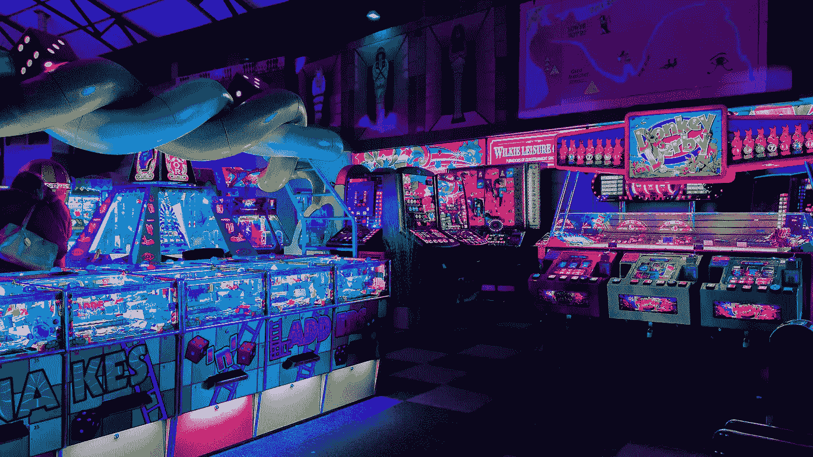
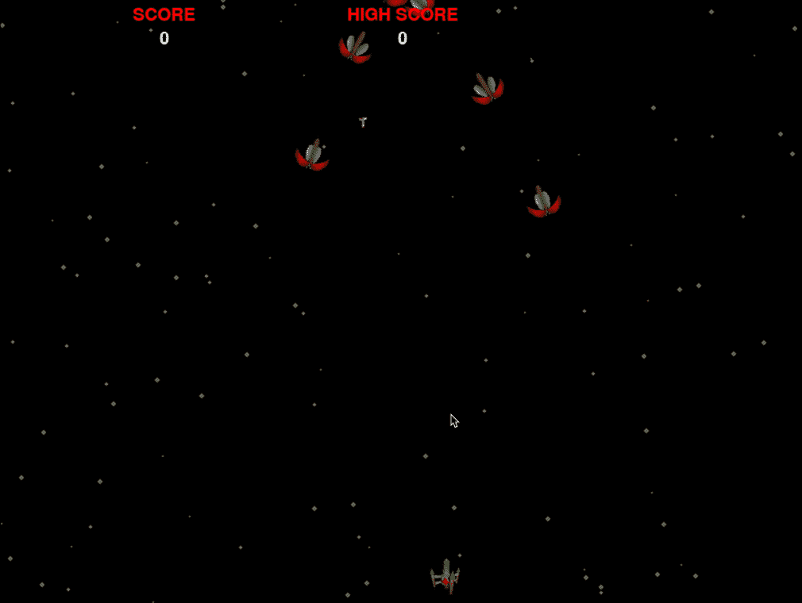
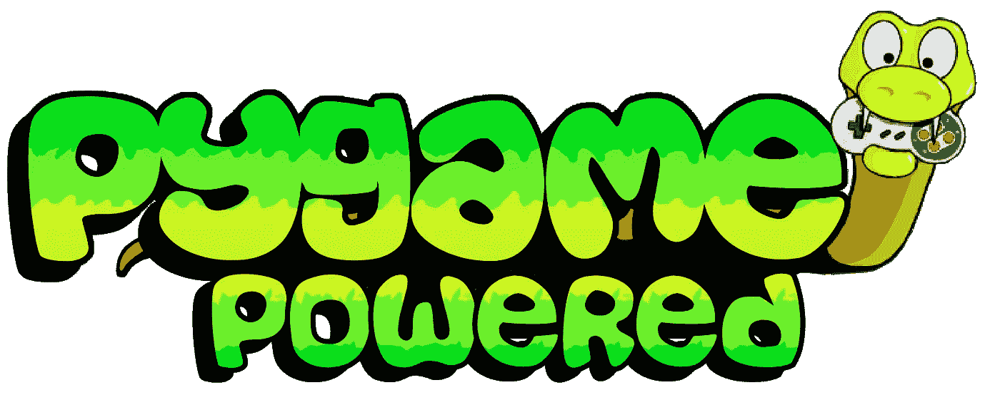
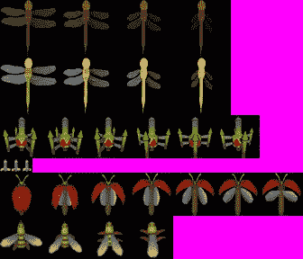
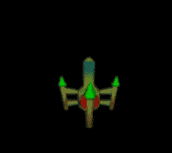
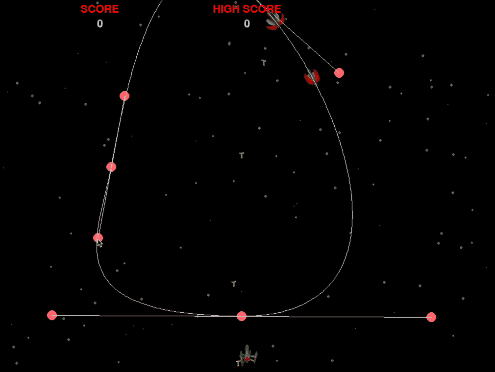
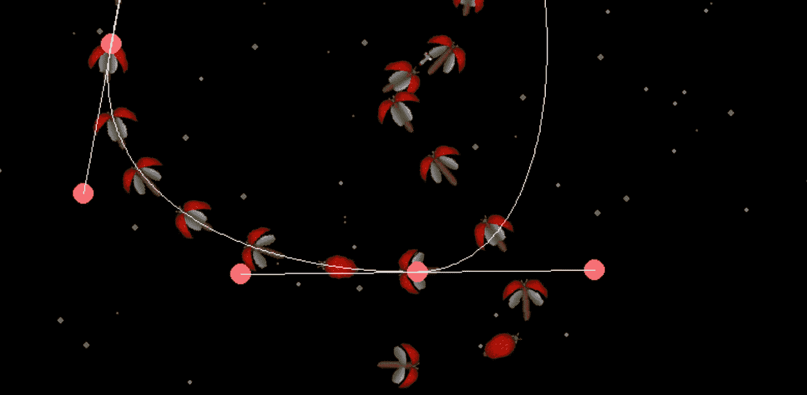
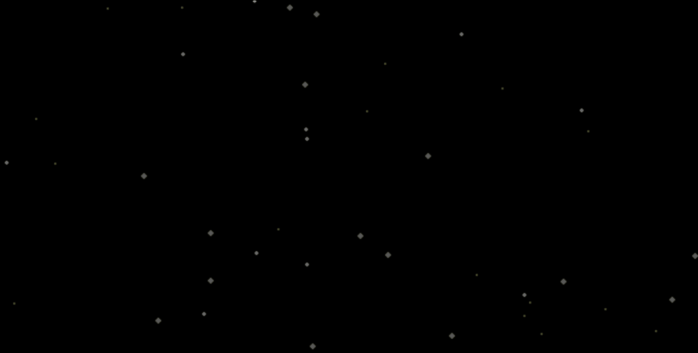

# 使用 Pygame 创建一个 Galaga 克隆体

> 原文：<https://betterprogramming.pub/create-a-galaga-clone-using-pygame-57d32567699e>

## 我的游戏编程梦想是如何让我重现街机经典的



卡尔·劳在 [Unsplash](https://unsplash.com/s/photos/arcade-game?utm_source=unsplash&utm_medium=referral&utm_content=creditCopyText) 上拍摄的照片。

我有一个坦白:自从我能够在 Commodore 64 的屏幕上反弹精灵，我就想成为一名游戏程序员。

不要误解我。我热爱我的工作，并为我完成的项目感到自豪。但是创造一个视频游戏并让东西在屏幕上移动是有魔力的。

有时候会心痒痒，尝试开发一个小游戏。这次尝试以 [*Galaga*](https://en.wikipedia.org/wiki/Galaga) 为原型打造一款太空射击游戏。Galaga 是一款经典的街机游戏，由 Namco 开发，我十几岁的时候经常在当地的自助餐厅玩。

最初游戏中最令人愉快的部分是具有挑战性的阶段。你必须射击垂直向你飞来的各种敌人。我以此为灵感创作了一款游戏。

下面，你可以看到结果。它的特点是一波一波的敌人沿着贝塞尔曲线向你移动，动画精灵，碰撞检测，得分和不同的游戏状态。我甚至加入了一些原版游戏的声音。



一个用 Pygame 用 Python 写的 Galaga 克隆体。

在这篇文章中，我将通过解释游戏的各个部分向你展示我是如何创建它的。你可以在 GitHub 库中找到游戏的源代码。



来源: [Pygame](https://www.pygame.org/news)

如果你开始开发一个游戏，你应该看看各种游戏引擎和框架。使用现有的游戏引擎可以节省你大量的工作。

有很多游戏引擎和框架可用。根据您使用的编程语言，您可能有更多或更少的选择。Unity 和 Unreal Engine 是众所周知的跨平台框架。以前有一款手游我用过[一夫一妻制](https://www.monogame.net/)。

对于这个项目，我决定使用 Pygame，因为我计划使用 Python。Pygame 是一个构建在 SDL 库之上的开源框架。简单的 DirectMedia 层(SDL)是一个跨平台的库。这意味着你用 Pygame 开发的游戏可以在 Windows、Linux 和 macOS 上运行。

# 游戏状态

我在开发视频游戏时学到的一件事是，你的游戏需要一个状态机。一个游戏可以有几种状态。例如，它有*玩*状态，也有*开始*和*游戏超过*状态。

您可以使用`if-else`构造来创建这个逻辑。但是请相信我，如果您使用状态机，您的代码将更容易构建和维护。

我使用 Python 类对状态机建模。每个州都是一个类。所以我创建了类型`Splash`、`Menu`、`Gameplay`和`GameOver`。我从一个名为`BaseState`的基类中派生出这些类。

状态机的每个状态的 BaseState 基类。

在我们深入游戏状态之前，我们必须先谈谈游戏的主要循环。有一个名为`Game`的类负责实际的游戏循环。在这个类中，有一个方法调用`run`，您可以在下面看到。

游戏类中的主游戏循环。

`event_loop`、`update`和`draw`是在当前状态下调用相同方法的函数。`event_loop`负责处理定时器和按键等事件。`update`方法用于控制游戏逻辑，如敌人移动。最后一个函数，`draw`，负责在屏幕上绘制游戏的各个部分。

现在我们来看第一种状态，也就是*飞溅*状态。这个状态显示游戏的闪屏。它等待几秒钟，并通过将`done`标志设置为`True`进入下一个状态。

显示闪屏的闪屏状态。

Splash 状态使用 font 类在屏幕上呈现文本。如果闪屏处于活动状态超过三秒钟，它将切换到下一个状态。下一个状态是*菜单*状态，显示一个菜单。每个状态通过设置`next_state`成员来指示下一个状态，如您在第 6 行所见。

将`done`字段设置为`True`向游戏循环指示它应该翻转到下一个状态。

最广泛的状态是*游戏性*状态。所有的游戏逻辑都在这种状态下处理。

# 精灵

精灵是在屏幕上移动的东西。Pygame 有一个专门为精灵设计的内置类。这个名为`Sprite`的类有几个方法使得移动东西变得更容易。

通常，精灵和它们的动画是在精灵表中定义的。精灵表是包含游戏图形资源的图像，包括动画精灵的变化。

下面，你可以看到我在这个游戏中使用的精灵表。现在我不是图形艺术家，所以我从 OpenGameArt.org 下载了这张纸。



[Sprite sheet](www.scriptefun.com/transcript-2-using) 由 [Cuzco](https://opengameart.org/users/cuzco) 创建并捐赠给公共领域 CC0。

要使用 sprite 工作表，您必须知道每个 sprite 的确切大小和帧数。我们先来看看玩家的飞船。当我们组合第三行的六个图像时，我们得到了一个很好的玩家船的动画。



制作玩家飞船的动画。

为了加载 sprite 工作表，我们使用了`SpriteSheet`辅助类。这个类包含一个方法来加载 sprite 表并返回组成动画的各个图像的数组。

我们通过创建一个`SpriteSheet`类的实例来加载 sprite 工作表，并给它 sprite 工作表图像的位置。下面的代码显示了`Player`类。我们将六艘不同的飞船放入第 7 行的`images`阵列中。

动画发生在`get_surf`方法中。根据计时器，它返回动画的一个图像。我使用`self.interval`字段来延迟动画。

从 Pygame Sprite 类派生的 Player 类。

其他精灵是使用不同的类实现的。有一个`Enemy`类、一个`Rocket`类和一个`Explosion`类。

# 射击

玩家可以使用空格键发射火箭。我们在玩家的位置创建了一个火箭精灵。我们将同时发射的火箭数量限制在两枚。

下面是创建`Rocket`的`shoot_rocket`函数。第 2 行的第一个参数是 sprite 表。第二个和第三个参数表示水平和垂直速度。我们将垂直速度设为`-15`，这意味着火箭直线上升。火箭也是一个动画精灵。

向敌人发射火箭的功能。

敌人的宇宙飞船也向玩家发射火箭。这些火箭向玩家移动。我们用一个 Pygame 定时器让敌人的飞船每秒射击一次。当定时器被触发时，它调用`enemy_shoots`函数。

在函数中，我们首先随机选择一艘敌方飞船。然后我们计算出正确的速度，让火箭从敌人手中直线射向玩家。

我们检查火箭是不是低于 400 像素才释放。否则，火箭几乎总是会击中球员。你可以用这个值和火箭的速度来玩(例如，当改变到下一个难度级别时)。

从随机选择的敌人那里发射火箭的功能。

# 冲突检出

Pygame 让碰撞检测变得轻而易举。它有一个`SpriteGroup`类，作为 sprite 对象的容器。Pygame 中的辅助方法可以检测一个精灵组中的精灵是否与另一个精灵组中的精灵冲突。

当我们发射火箭时，我们将`Rocket`添加到`all_rockets`精灵组中。我们在进入屏幕时将每个敌人添加到`all_enemies`精灵组中。然后我们可以通过`groupcollide`功能确定火箭和敌人是否相撞。

使用 groupcollide 函数检测碰撞。

第 1 行的`groupcollide`函数获取两个 sprite 组作为参数和两个附加的布尔值。这些布尔参数表示当精灵发生碰撞时，是否应该自动从精灵组中移除。

我们还使用精灵组在屏幕上绘制精灵。当它们发生冲突时，它们会自动从组中移除，从而从屏幕上移除。

`groupcollide`方法返回一个包含所有碰撞的精灵的字典。我们迭代所有的键，并在碰撞的位置添加一个爆炸精灵。

# 敌人精灵运动

敌人的宇宙飞船沿着一条使用多条贝塞尔曲线构建的路径飞行。有一个游戏模式显示贝塞尔曲线和控制点。通过移动控制点，您可以实时更改路径。当你退出游戏时，每个控制点的位置被写入一个文件，这样你就可以在游戏中使用它。

您可以通过按 S 键来切换显示曲线和控制点的模式。



实时改变敌人的移动方式。

## 贝塞尔曲线

我们使用一种特殊类型的曲线，称为[三次贝塞尔](https://en.wikipedia.org/wiki/B%C3%A9zier_curve)曲线。每条曲线都是使用四个点创建的。使用以下公式计算曲线:

```
P(t) = (1-t)³P0 + 3(1-t)²tP1 + 3(1-t)t²P2 + t³P3
```

时间( *t* )从零到一。在 *t=0* 时，路径在 *P0* 处。在 *t=1* 时，路径在 *P3* 。我们通过使后续段的 *p0* 等于前一段的 *p3* 来连接多条曲线。

在控制模式的演示中可以看到，游戏使用了三条相连的贝塞尔曲线。这些曲线的点是由`ControlPointCollectionFactory`类创建的。

第一个点被移到了屏幕之外，这样看起来好像敌人是从顶部潜入的。

这些控制点的有趣之处在于，第 11 行上的最后一个点的位置与第 14 行上的下一个线段的第一个点的位置相同。此外，第 23 行最后一段的最后一点与第 8 行的第一点相同。这确保了每条曲线都连接到下一条曲线。

负责创建贝塞尔曲线点的类。

## 计算贝塞尔曲线

我们创建了一个名为`PathPointCalculator`的类，负责计算曲线。该类型有一个名为`calculate_path_point`的函数，它接受两个参数。第一个参数`control_point_quartet`是一个包含贝塞尔曲线的四个点的结构。第二个，`time_to_calculate`，是公式中的时间( *t* )。

负责计算贝塞尔曲线的类。

如果我们想要组合多条曲线，我们使用第一组点，并让时间从零到一。然后我们使用第二组数据，再次让时间从 0 到 1 运行——第三组数据也是如此。

## 旋转

如果你注意的话，你可能会看到精灵在沿着曲线移动的时候向他们的方向旋转。我们实时计算旋转，并让 Pygame 在给定旋转情况下转换精灵。

旋转通过`calculate_rotation`计算，T5 是`Enemy`类的一部分。它使用先前和当前的 *x* 和 *y* 坐标来计算它们之间的角度。

计算敌人飞船的旋转。

## 实时改变控制点

在演示中，你看到了我实时改变贝塞尔曲线的点。为了移动这些点，同时保持平滑的曲线，我们必须应用一些简单的规则。

但首先，我们必须区分构成单个线段的三个点。我们将中间的点称为*路径点*，将两个外部点称为*控制点*。



每条曲线由一个路径点和两个控制点组成。

以下是如何在拖移路径点或控制点时保持曲线平滑:

*   如果我们移动路径点，我们必须以相同的增量移动左右控制点。
*   如果我们移动左控制点，我们必须向相反的方向移动右控制点。
*   如果我们移动右边的控制点，我们必须向相反的方向移动左边的控制点。

我们还必须记住，一些控制点是粘在一起的两个点(例如，前一段的最后一个点和下一段的第一个点)。我们必须同时移动它们。

这个行为是在`ControlHandlerMover`类中实现的，您可以在下面看到。

该类的`__init__`构造函数有两个参数。第一个是所有线段所有点的集合。第二个是辅助对象，确定一个点是路径点还是控制点。

`move_control_handler`功能移动路径或控制点。它接收该点的标识和新的 *x* 和 *y* 坐标。然后它改变相关的点。

负责移动贝塞尔曲线相关点的类。

# 背景星空

没有星域，太空射手就无法存在。所以，我添加了三层星星:小，中，大。每一层都以不同的速度移动，并有不同大小的恒星。这就造成了前进的错觉。



背景星域

我在一个名为`StarField`的类中实现了 starfield，你可以在下面看到。我们有三个数组，每个数组都有一组我们在构造函数中随机生成的星星。

`render_stars`功能渲染一层的星星。你用星星集合来喂养它——星星的速度、大小和颜色。

您可以更改参数来添加更多的星星或添加额外的层，以使视差效果更加显著。

starfield 类负责创建和动画 StarField。

# 结论

我在开发这个游戏的时候玩得很开心。这让我回想起在当地自助餐厅玩最初的 Galaga 游戏的童年时光。游戏还远未完成，但还可以玩。它会给一个初学游戏的程序员一个好的开始。

我喜欢 Pygame 图书馆。它使得碰撞检测和渲染变得简单。如果你想用 Python 开发游戏，我邀请你去看看。

我没有谈论分辨率、每秒帧数、游戏循环、音乐、播放声音或得分。对于这些主题，我使用了 Pygame 提供的标准工具。

但是你可以在这个 GitHub 库的源代码中找到它。

感谢您的阅读。