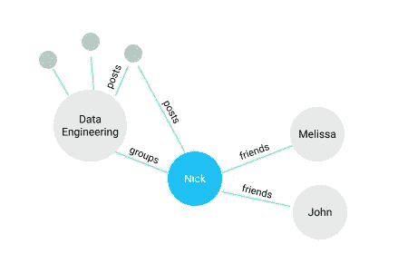
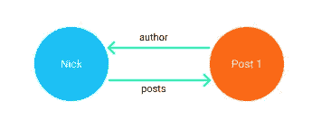

# 用 PostgreSQL 和 Node.js 创建一个图形数据库和 API

> 原文：<https://betterprogramming.pub/create-a-graph-database-and-api-with-postgresql-and-node-js-d7bddcc00bbb>

## 利用 PostgreSQL 中 JSON 和表分区的强大功能


照片由 [Alina Grubnyak](https://unsplash.com/@alinnnaaaa?utm_source=unsplash&utm_medium=referral&utm_content=creditCopyText) 在 [Unsplash](https://unsplash.com/s/photos/data?utm_source=unsplash&utm_medium=referral&utm_content=creditCopyText) 拍摄

是的，你没看错，每当我们听到“SQL”时，我们脑海中出现的第一个概念是关系数据库、外键、表管理，我们在早期计算机科学时代学到的一切……我们可能是对的，因为 [SQL 是为管理关系数据库而设计的](https://searchdatamanagement.techtarget.com/definition/SQL)，其中每个数据抽象都将由表来表示，这些表之间的关系将由外键约束来强制实施，例如一对一、一对多或多对多。

虽然这种结构已经过时间的检验，但对于某些项目或应用程序来说，它并不是很好。假设我们正在做一个社交媒体项目。我们如何在关系范式中对其建模？

```
Person (id, name, email, ...) /* Table for a Person */PersonFriends (id_1, id_2) /* N-N relation for Friends */
```

每次一个`Person`添加一个`friend`，这个关系就会被添加到`PersonFriends`表中两次，因为这个关系是双向的。假设我们的数据库中有两个人，`Nick`和`Melissa`，他们的 id 分别是`1`和`2`，为了在他们之间创建一个关系，我们必须运行以下 SQL 语句:

```
INSERT INTO PersonFriends VALUES ('1', '2'), ('2', '1');
```

我们只对一个关系使用两行，为什么要这样做？如果我们想得到尼克的朋友，我们会:

```
SELECT person2_id FROM PersonFriends WHERE person1_id = 1;
-- Or use '2' in the WHERE clause to find Melissa's friends
```

我们可以用一行来表示这种关系，但是这会导致复杂和低效的查询，所以我们牺牲一些空间来节省时间；)

现在让我们给我们的例子增加一点复杂性，一个新的表:

```
Group (id, name)
```

人们可以加入的组，在这种情况下，这是多对多关系(或 N-N)——一个组可以有多个人，但每个`Person`也可以是多个组的成员。

解决方案是实施与`PersonFriends`相同的策略，因此我们需要另一个表来实现它…

对于我们的模型设计来说，一切都很顺利，直到我们被要求一个新的特性；如果`Person`是`Group`的成员，则创建`Posts`的功能。在这种情况下，我们将需要创建另一个关系表来列出属于一个组的文章，但也使用作者的外键，作者是一个人。

你知道这是怎么回事吗？模型的水平缩放给我们带来了很多麻烦，我们可能只想切换到 NoSQL 数据库，在那里这些问题可以得到解决，或者使用像 Neo4j 或 Dgraph 这样的原生图形数据库。

但是我们热爱 SQL，我们热爱它是因为它是一个经典，而且它已经成为一个标准很多年了，它将继续保持下去，因为我们可以用 SQL 做一些非常酷的事情，甚至一些新的 DBMS 都做不到。让我们只是用不同的方式…

# 图论

一个图通常是由点和线组成的，是的，就是这么简单，一个点被称为顶点，线是链接或边，在我们的应用程序中，我们可以认为顶点是对象，链接是它们之间的关系。

让我们以我们的社交网络为例，创建一个简单的图形模型:



社交网络示例的图形模型

在图中，我们可以看到 3 种类型的对象，`Person`、`Group`和`Post`。在这种情况下，这些对象的每个实例都是图中所示的顶点。

我们有 3 个人，`Nick`是一个群的成员，有两个朋友，而这个群有多个帖子，其中一个是`Nick`。

看起来很简单，但是我们如何在数据库管理系统中实现它呢？更具体地说，使用 PostgreSQL？

让我们从写下基础开始，图由两个主要部分组成，顶点和链接。

# 头顶

```
CREATE TABLE Vertices (
   id UUID NOT NULL PRIMARY KEY DEFAULT gen_random_uuid(),
   fields JSONB NOT NULL,
   type VARCHAR(255) NOT NULL,
   created_at TIMESTAMPTZ NOT NULL DEFAULT NOW(),
   updated_at TIMESTAMPTZ NOT NULL DEFAULT NOW()
)
```

折点表字段:

*   `id`将是 UUID 类型([官方文件](https://www.postgresql.org/docs/current/functions-uuid.html))，如果你想要自动增加，你可以使用`serial`类型
*   `fields`将包含当前顶点的数据，因为我们将有多个具有不同值的对象，我们使用 Postgres 支持的`JSONB`类型，漂亮。
*   `type` —此`Vertex`的类型，如果在我们的示例中是`Person`、`Group`或`Post`。
*   `created_at`和`updated_at`只是所有对象都会有的一些助手时间戳。

请记住，这是我们数据库中所有节点或对象的通用结构，不要添加任何只在单一节点类型上可用的字段。

先不要运行查询，我们需要决定这个表的分区。原因是，数据库中的所有对象都将存在于`Vertices`表中，所以随着时间的推移，它会变得非常大，所以我们需要通过`Vertex`持有的对象的`type`对表进行分区。

这就是它变得有趣的地方，我们现在可能知道我们需要哪些类型，目前，我们有三个:`Person`、`Group`和`Post`，但在未来，我们将添加更多类型，这不会干扰我们的结构，并且它将保证水平可伸缩性，因为我们只需要从`Vertices`表为我们将拥有的每种类型创建一个分区，让我们将它添加到我们的 create table 语句并修改我们的主键:

```
CREATE TABLE Vertices (
   id UUID NOT NULL DEFAULT gen_random_uuid(),
   fields JSON NOT NULL,
   type VARCHAR(255) NOT NULL,
   created_at TIMESTAMPTZ NOT NULL DEFAULT NOW(),
   updated_at TIMESTAMPTZ NOT NULL DEFAULT NOW(),
   CONSTRAINT pkey_vertices PRIMARY KEY (id, type)
) PARTITION BY LIST(type);
```

我们的主键需要由`id` 和`type`组成。这是因为分区表的唯一约束必须包括所有分区键列，如果我们不这样做，将会导致错误。

运行该查询，我们已经成功地创建了顶点定义，现在让我们尝试插入一些值(剧透:它不会工作)。

```
INSERT INTO Vertices (type, fields)
VALUES ('person', '{"name": "Nick"}');
```

我们得到以下有趣的错误:

```
ERROR: no partition of relation "vertices" found for row
DETAIL: Partition key of the failing row contains (type) = (person).
```

这告诉我们，我们没有为`person`类型创建分区，因为我们已经定义了这个表由一个列表`types`进行分区。因此，让我们创建该分区:

```
CREATE TABLE Vertices_person PARTITION OF Vertices FOR VALUES IN ('person');
```

并尝试再次运行插入查询:

```
INSERT INTO Vertices (type, fields) VALUES ('person', '{"name": "Nick"}');INSERT 0 1
```

对于分区的名字，我喜欢使用惯例`Vertices_<type>`

也可以创建多级分区，如果你想分割你的`Vertices_person`表，查看[这篇文章](https://www.enterprisedb.com/postgres-tutorials/how-use-table-partitioning-scale-postgresql)。

很好，现在让我们看看扩展这个模型有多容易，让我们为`Post`类型添加一个新分区:

```
CREATE TABLE Vertices_post PARTITION OF Vertices FOR VALUES IN ('post');
```

让我们插入一个帖子

```
INSERT INTO Vertices (type, fields) VALUES ('post', '{"title": "My First Post", "content": "This is my first post"}');
```

我们可以通过运行以下命令来检查关于`Vertices`表的详细信息:

```
\d+ Vertices;
```

在底部，我们将看到有关分区的信息:

```
...
Partition key: LIST (type)
Indexes:
    "pkey_vertices" PRIMARY KEY, btree (id, type)
Partitions: vertices_person FOR VALUES IN ('person'),
            vertices_post FOR VALUES IN ('post')
```

我们实际上可以像查询普通表一样查询这些表:

```
SELECT id FROM vertices_person; id
--------------------------------------
 4630ee69-32de-4127-b354-4216f2e25f9a
(1 row)
```

或者我们可以查询所有的`Vertices`表并找到这些行属于哪个分区:

```
SELECT tableoid::regclass, id FROM vertices; tableoid     |                  id
-----------------+--------------------------------------
 vertices_person | 4630ee69-32de-4127-b354-4216f2e25f9a
 vertices_post   | ccf24086-c9a1-44b1-b3e6-42575b7bcd69
(2 rows)
```

我们可以说我们已经完成了顶点的实现，是时候移动到链接了。

# 链接

让我们稍微回顾一下图论，我们知道链接是连接两个顶点的线，这个链接可以是单向的，也可以是双向的。例如，如果我们想要获得由一个`Person`写的`Posts`，我们将需要一个从`Person`到他拥有的每一个`Posts`的连接，如果我们需要获得单个帖子的作者，我们需要另一个从`Post`到`Person`的连接，所以这将是一个双向链接。



人与岗位关系示意图

让我们确定一个链接的主要组成部分:

*   来源或起点(id 和类型)
*   目的地点或终点(id 和类型)
*   姓名(作者、文章)

当然，我们可以添加更多信息，如体重，这将用于机器学习相关的解决方案，但在这种情况下，我们试图保持简单。

下面是我们的`Links`表的 SQL 定义:

```
CREATE TABLE Links (
   source UUID NOT NULL,
   dest UUID NOT NULL,
   name VARCHAR(255) NOT NULL,
   CONSTRAINT pkey_link PRIMARY KEY (source, dest, name)
);
```

我们的主键由源、目的地和名称组成，所以我们不能拥有同一个链接多次。我们没有包括任何类型的分区，因为我们将一直通过它们的主键访问值，这将是快速的。

让我们尝试将我们的`Person`连接到我们创建的`Post`:

```
INSERT INTO Links VALUES (
   '4630ee69-32de-4127-b354-4216f2e25f9a', -- Source id
   'ccf24086-c9a1-44b1-b3e6-42575b7bcd69', -- Destination id
   'posts'                                 -- Link name
);
```

我们现在有了连接的第一部分，这就是我们如何从`Person`中获得`Posts`id:

```
SELECT dest FROM Link WHERE source = '4630ee69-32de-4127-b354-4216f2e25f9a' AND name = 'posts'; dest
--------------------------------------
 ccf24086-c9a1-44b1-b3e6-42575b7bcd69
```

我们可以用它作为子查询来查找我们要找的顶点:

```
SELECT * FROM Vertices WHERE type = 'post' AND id IN
(SELECT dest FROM Link WHERE source = '4630ee69-32de-4127-b354-4216f2e25f9a' AND name = 'posts');
```

让我们实际上`EXPLAIN`这个查询看看发生了什么:

```
EXPLAIN SELECT * FROM Vertices WHERE type = 'post' AND id IN
(SELECT dest FROM Link WHERE source = '4630ee69-32de-4127-b354-4216f2e25f9a' AND name = 'posts');

Nested Loop  (cost=0.29..16.34 rows=1 width=580)
   ->  Index Scan using pkey_link on link  (cost=0.14..8.16 rows=1 width=16)
         Index Cond: (source = '4630ee69-32de-4127-b354-4216f2e25f9a'::uuid)
         Filter: ((name)::text = 'posts'::text)
   ->  Index Scan using vertices_post_pkey on vertices_post vertices  (cost=0.14..8.16 rows=1 width=580)
         Index Cond: ((id = link.dest) AND ((type)::text = 'post'::text))
```

看看表分区如何识别我们正在访问的类型，这是因为我们在查询中使用了`WHERE type = 'post'`，索引也帮助我们实现了这个结果，非常好。这只是为了展示我们如何在 Postgres 本身中做到这一点，稍后当我们集成 Node.js 时，这将容易得多。

现在让我们添加反向连接，从帖子到人，一个叫做`author`的链接

```
INSERT INTO Links VALUES ('ccf24086-c9a1-44b1-b3e6-42575b7bcd69', '4630ee69-32de-4127-b354-4216f2e25f9a', 'author');
```

现在我们在`Person`和`Post`之间有了一个双向连接。

# API


克林特·王茂林在 [Unsplash](https://unsplash.com/s/photos/connection?utm_source=unsplash&utm_medium=referral&utm_content=creditCopyText) 上拍摄的照片

对于这些类型的应用程序，我们需要一个 API，它将确保:

*   读取、创建、更新和删除顶点的能力。
*   创建和删除链接。
*   验证`fields`对某些顶点类型有效。
*   为数据操作提供端点。

我们将在 Express framework 中使用 Node.js，因为用它创建 API 非常快，而且因为我们使用 JSON 字段，JavaScript 将对我们有很大帮助。

让我们创建一个新文件夹，我将其命名为`graph-api`，然后我们将初始化一个 Node.js 项目并安装所需的依赖项:

```
mkdir graph-api
cd graph-api
yarn init...
success Saved package.json
yarn add express pg
```

将这段代码添加到一个新的`index.js`项目的根目录上:

```
const express = require('express');
const { Pool } = require('pg');
const app = express();// Adjust your connection depending on your configurationconst pool = new Pool({
   user: 'postgres',
   host: 'localhost',
   database: 'postgres',
   password: 'mysecretpassword',
   port: 49153
});app.listen('4000', async () => {
   const { rows } = await pool.query('SELECT * FROM Vertices');
   console.log(rows);
});
```

当我们运行`node index.js`时，应该会得到以下结果:

```
[
  {
    id: '64b99562-5c03-461f-971e-915995845cab',
    fields: { name: 'Nick' },
    type: 'person',
    created_at: 2021-09-30T21:15:34.986Z,
    updated_at: 2021-09-30T21:15:34.986Z
  },
  {
    id: 'f6bfca20-ecb2-4a05-9e67-072252307f85',
    fields: { title: 'My First Post', content: 'This is my first post' },
    type: 'post',
    created_at: 2021-09-30T21:15:47.081Z,
    updated_at: 2021-09-30T21:15:47.081Z
  }
]
```

让我们创建一个新文件，叫它`vertices.js`，我们将在那里定义所有与顶点相关的函数:

如您所见，我们还包含了一个名为`parseVertex`的函数，它只接受一个普通的 SQL 行，并返回一个带有所需属性的 JSON 对象。

我们还需要函数来处理顶点之间的链接:

以下是我们的 API 的一些示例:

```
app.get('/:id', async (*req*, *res*) => {
   const vertex = await vertices.getVertex(*req*.params.id)
   *res*.json(vertex);
})app.get('/:id/:link', async (*req*, *res*) => {
   const resp = await links.getLinks(*req*.params.id, *req*.params.link)
   *res*.json(resp);
})app.get('/:id/:link/:linkid', async (*req*, *res*) => {
   const resp = await links.getLink(*req*.params.id, *req*.params.link, -*req*.params.linkid)
   *res*.json(resp);
})...
```

…你明白了。

# 结论

恭喜你！你做到了！一种完全不同的使用顶点和链接来存储数据的方式，您现在有了一个可伸缩的数据库模型！嗯……差不多，你仍然需要实现双向链接，而且无论何时你删除一个`Vertex`都需要创建一个触发器来删除链接(这样你就不会有数据泄露)，但是你已经理解了这种方法的主要目的。

我希望你对 Postgres 中的图形数据库系统有所了解，如果你有任何问题，欢迎在评论中提出，以及任何建设性的批评，也许我错过了什么，或者你知道更好的存储数据的方法…有这么多的想法，我很想听听。