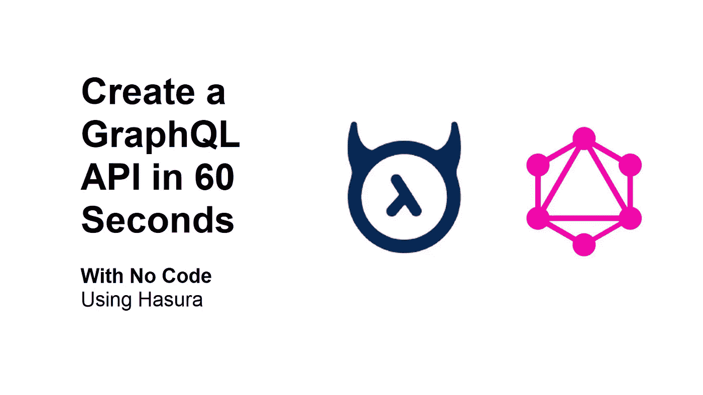
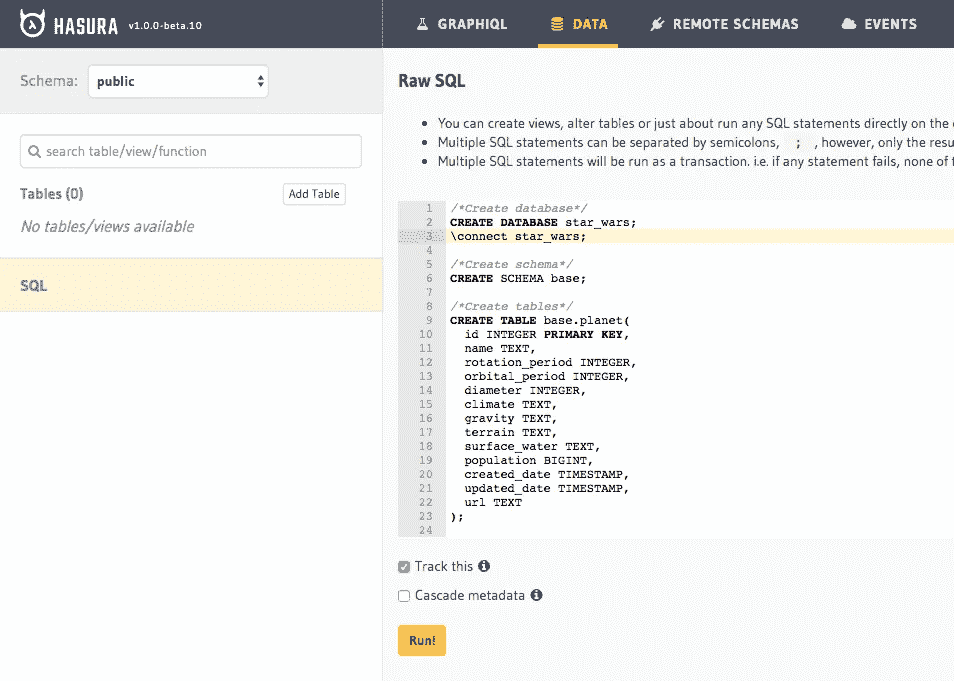
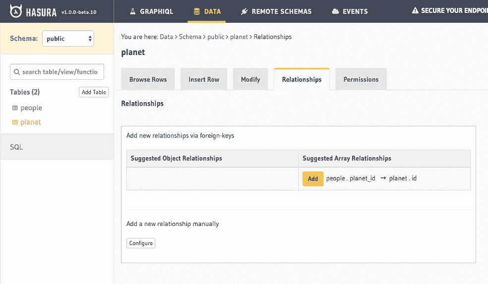
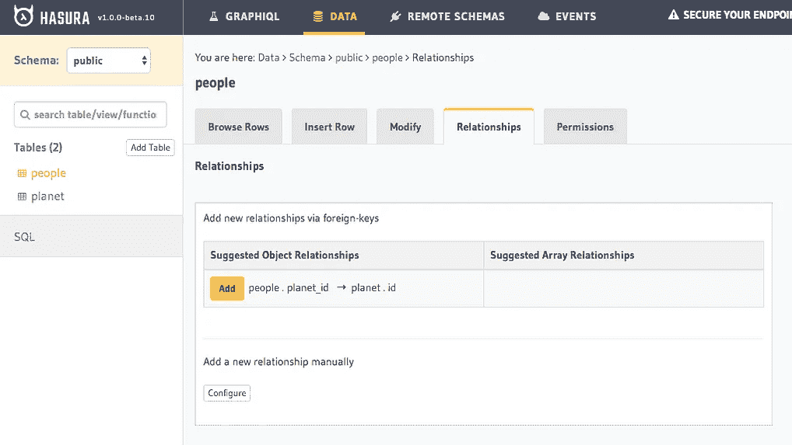
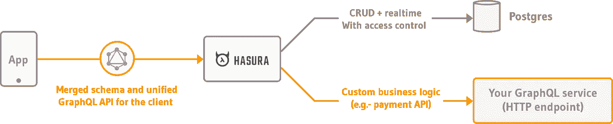
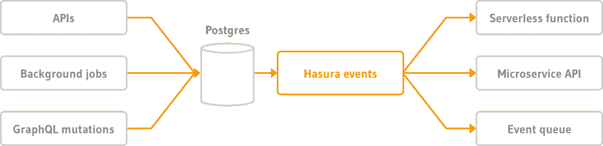

# 使用 Hasura 在 60 秒内创建一个 GraphQL API 无需任何代码

> 原文：<https://betterprogramming.pub/create-a-graphql-api-in-60-seconds-with-no-code-using-hasura-fba06c8159c0>

## 无需编写任何代码，即可获得几乎即时的 GraphQL 引擎

# 哈苏拉是什么？

Hasura 是一个[开源](https://github.com/hasura/graphql-engine)项目，它连接你的数据库和微服务，并立即给你一个生产就绪的 GraphQL API。

通过在几秒钟内从 PostgreSQL 数据库为您的团队提供强大的实时 GraphQL API，缩短您的上线时间。

# 为什么是哈苏拉？

该项目在 GitHub 上完全[开源，每周都有新的改进。](https://github.com/hasura/graphql-engine)

使用 50MB RAM，您可以获得每秒 1，000 次以上的查询——仅使用免费 Heroku dyno 上的一个容器。

您可以与微服务集成和交互，通过基于数据库事件的 webhooks 连接它们，或者合并多个 GraphQL 外部端点。

你得到了一个全功能的 JWT 或 webhook 用户管理系统，可以连接到其他认证提供商，如 [Firebase](https://blog.hasura.io/authentication-and-authorization-using-hasura-and-firebase/) 或 [Auth0](https://docs.hasura.io/1.0/graphql/manual/guides/integrations/auth0-jwt.html) 。

您可以获得完全兼容的订阅，这意味着由于 WebSocket，您可以从后端到前端获得数据的即时更新，而除了编写 GraphQL 查询来获取数据之外，无需处理任何事情。

您可以在不到一分钟或 60 秒的时间内完成所有这些工作。

# 我们开始吧！

[https://heroku.com/deploy?template = https://github . com/hasura/graph QL-engine-heroku](https://heroku.com/deploy?template=https://github.com/hasura/graphql-engine-heroku)

只要按下[“部署到 Heroku。”](https://heroku.com/deploy?template=https://github.com/hasura/graphql-engine-heroku)这将自动向您的帐户添加一个新应用程序，并为您配置一个免费的 PostgreSQL 数据库。

如果您没有 Heroku 帐户，您需要注册一个。你不需要信用卡，一旦你注册，你将被自动重定向到你的 Heroku 应用程序创建页面。

Heroku 上的所有这些步骤大约需要 30 秒，所以我们还有 30 秒来准备 Hasura。

# 让我们给你的数据库添加一些信息

1.  **添加星球大战 SQL:** 转到数据选项卡，您将从那里添加 [SQL](https://gist.github.com/Giorat/da73805f337435b40bb41877af4d4980) 。

**记住**:勾选“跟踪这个”复选框，自动将这些表格添加到 Hasura 处理的表格中，而不需要手动添加。

2. **Relationships:** 添加完表之后，您还需要做最后一件事:将关系添加到每个表中，这样您就能够查询嵌套在一起的表以及基于外键的数据。

3.**我们来做一个查询:**进入 GraphQL 页面，插入这个查询，按 play 按钮，显示这两个表合并在一起的结果。

# 让我们从您的前端进行一个 GraphQL 查询

让我们展示一下您前端的数据。在本教程中，我将使用一个简单的 React 应用程序的修改版本和 Apollo 客户端。

记得用 Heroku 应用程序的 URL 替换 GraphQL 服务器的 URL ，在我的例子中是`starwars-hasura.herokuapp.com`。

[https://codesandbox.io/s/star-wars-hasura-x7bt9](https://codesandbox.io/s/star-wars-hasura-x7bt9)

## **用来自 Hasura 的数据完成代码 sanbox:**

[https://codesandbox.io/s/star-wars-hasura-x7bt9](https://codesandbox.io/s/star-wars-hasura-x7bt9)

# 现在呢？

[保护您的 Hasura 终点](https://docs.hasura.io/1.0/graphql/manual/deployment/securing-graphql-endpoint.html)就像 Hasura 右上角的警告信息提醒您那样做。

您可以添加用户验证。我建议你使用 Firebase，因为他们对你的应用程序中可以拥有的用户数量没有任何硬性限制。

然后，您还可以转到 Remote Schemas 选项卡，尝试向您的 Hasura 实例添加一个外部端点。

之后，您可以通过调用微服务将每个更新链接到表中的一行，以检查用户输入是否包含垃圾邮件或钓鱼文字。

# 我不想用哈苏拉

当然，您也可以对其他软件包做类似的事情，比如:

*   如果你使用 PostgreSQL 并且想要比 Hasura 更简单的东西，那么
    可以随意使用[PostgreSQL](https://www.graphile.org/postgraphile/)。
*   [另一个更简单的版本像 Hasura](https://supergraph.dev/) 。
*   [如果想用 MongoDB 得到一个即时 API](https://github.com/remorses/mongoke) 。

# 资源和参考资料:

*   [https://hasura.io/](https://hasura.io/)
*   [https://medium . com/better-programming/use-graph QL-query-hooks-with-react-d 440 c 6 dcb 57d？source = friends _ link&sk = e 88407 b 33 a 8747d 34 fc 7d 931 b 2354843](https://medium.com/better-programming/use-graphql-query-hooks-with-react-d440c6dcb57d?source=friends_link&sk=e88407b33a8747d34fc7d931b2354843)
*   [https://docs . hasura . io/1.0/graph QL/manual/getting-started/heroku-simple . html](https://docs.hasura.io/1.0/graphql/manual/getting-started/heroku-simple.html)
*   [https://docs . hasura . io/1.0/graph QL/manual/deployment/securing-graph QL-endpoint . html](https://docs.hasura.io/1.0/graphql/manual/deployment/securing-graphql-endpoint.html)
*   [https://gist . github . com/Giorat/da 73805 f 337435 b 40 bb 41877 af4d 4980](https://gist.github.com/Giorat/da73805f337435b40bb41877af4d4980)