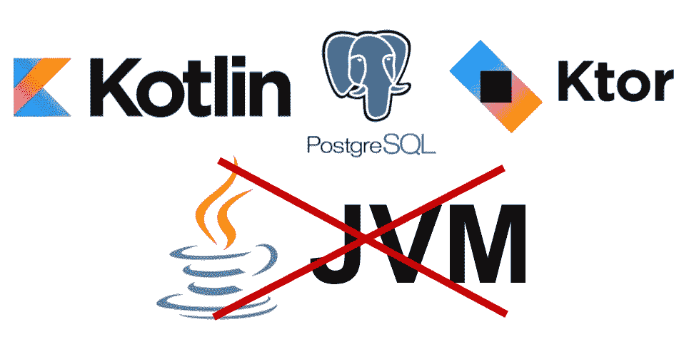

# 用 Ktor 和 SQLDelight PostgresSQL 创建一个 Kotlin/Native Web 服务器

> 原文：<https://betterprogramming.pub/create-a-kotlin-native-web-server-with-ktor-and-sqldelight-postgressql-44485267c340>

## Kotlin 服务器端——但是没有 JVM



显示 Kotlin、PostgreSQL、Ktor 和 Java/JVM 徽标的图片。后者被划掉了。

当阅读 [Kotlin](https://kotlinlang.org/) 时，你可能会想到 Android 开发或运行在 [JVM](https://de.wikipedia.org/wiki/Java_Virtual_Machine) (Java 虚拟机)上的 Java 的替代编程语言。但实际上，生态系统比这大得多。随着越来越多的人喜欢用 Kotlin 编写商业应用，JetBrains(创建 Kotlin 的公司)开始开发除 Android/JVM 之外的其他目标。这包括[kot Lin/JS](https://kotlinlang.org/docs/js-overview.html)(JavaScript)[kot Lin/Native](https://kotlinlang.org/docs/native-overview.html)，以及即将发布的 [Kotlin/Wasm](https://blog.jetbrains.com/kotlin/2021/11/k2-compiler-kotlin-wasm-and-tooling-announcements-at-the-2021-kotlin-event/) 。

Kotlin/Native 使我们能够直接针对不同的操作系统(Linux、Windows、macOS、iOS、Android)编写程序，而不需要 JVM。它还可以从 Kotlin 代码库中调用 C 库。但是没有 JVM，我们也不能使用 Java 生态系统中的任何库。

# 设置

在本文中，我想展示 Kotlin/Native 在服务器端已经实现的功能。为此，我们将实现一个 web 服务器应用程序，该应用程序可以与一个 [PostgreSQL](https://www.postgresql.org/) 数据库进行交互，以便持久地服务于一个返回 JSON 的 REST API。

作为 web 框架，我们将使用 [Ktor](https://ktor.io/) ，它是其他常见框架如 [Spring Boot](https://spring.io/projects/spring-boot) 或 [Quarkus](https://quarkus.io/) 的模块化替代。 [Ktor](https://ktor.io/) 直接由 JetBrains 开发，100%用 Kotlin 编写。他们最近刚刚增加了对 Kotlin/Native 目标的支持(尚不支持 Windows)。这使得它非常适合我们的用例。

大多数服务都需要一些持久层。最常见的方法是数据库。这里，我们遇到了一个早期采用者的问题。因为我们不是在 JVM 上运行，所以我们不能利用它的 JDBC 驱动程序。此外，Kotlin/Native 相当新，以前不支持 web 框架。因此，大多数数据库驱动程序实现都是针对 Android 使用的，提供 SQLite 兼容性。

幸运的是，社区已经实现了自己的解决方案，直到更大的 Kotlin ORM 框架，如 [Exposed](https://github.com/JetBrains/Exposed/blob/master/docs/ROADMAP.md) 开始支持 Kotlin/Native。我们将使用来自 [Philip Wedemann](https://github.com/hfhbd) 的 [SQLDelight PostgreSQL 驱动程序](https://github.com/hfhbd/postgres-native-sqldelight)。在撰写本文时，这似乎是第一个也是唯一一个从 Kotlin/Native 连接到服务器数据库的实现。您可能已经猜到了，这是一个为[SQL light](https://github.com/cashapp/sqldelight)定制的驱动程序实现，它是一个 ORM 框架，在 Kotlin 中运行类型安全的 SQL 查询。

# 项目配置

作为我们项目的构建工具，我们将使用 [Gradle](https://gradle.org/) 和 [Gradle Kotlin DSL](https://docs.gradle.org/current/userguide/kotlin_dsl.html) 将我们的 Gradle 配置写成 Kotlin 代码(见下文)。

我们需要为我们的服务器安装多个插件。5–9)，第一个是 [Kotlin 多平台插件](https://kotlinlang.org/docs/multiplatform-dsl-reference.html)，使我们能够配置不同的目标平台(L1。27–35).为了简单起见，我们将所有代码放入`commonMain`模块。

为了使我们的 Ktor 服务器能够编码和解码 JSON，我们需要 [KotlinX 序列化插件](https://github.com/Kotlin/kotlinx.serialization)，一个由 Kotlin 团队提供的序列化解决方案(例如，Java 中的 [Jackson](https://github.com/FasterXML/jackson) 的替代方案)。

我们必须为数据库访问添加 SQLDeligth 插件，这使我们能够配置我们的数据库方言和驱动程序(ll。18–24).它还将代码生成任务添加到生成管道中，为类型安全的数据库访问创建代码。

由于 Ktor [支持多个服务器引擎，](https://ktor.io/docs/http-client-engines.html)我们必须在 ktor-core 依赖项旁边添加 [ktor-cio](https://api.ktor.io/ktor-client/ktor-client-cio/io.ktor.client.engine.cio/-c-i-o/index.html) 。CIO 是目前唯一支持 Kotlin/Native 的引擎，100%用 Kotlin 编写，重点是[协程](https://kotlinlang.org/docs/coroutines-overview.html)。为了配置我们的 PostgreSQL 访问，我们还需要 SQL Delight Postgres 本地驱动程序作为依赖项。

由于 KotlinX 序列化核心和 JSON 版本化的一个 [bug](https://github.com/Kotlin/kotlinx.serialization/issues/2024) ，有必要强制一个特定的库版本(否则，我们就不必在配置中显式添加这些依赖项)，ll。55–62.

要使用 PostgreSQL 驱动程序，首先必须在本地机器或 docker 容器上安装`libpq`(它将来可能会过时)。

```
# MacOS
brew install libpq
# Linux
apt-get install libpq-dev
```

SQLDelight 框架要求我们设置特殊的 sq 文件(例如`users.sq`而不是`.sql`)，这些文件定义了我们希望以类型安全的方式执行的表和 SQL 查询。这个文件必须在`/src/commonMain/sqldelight/com/nativeserver/`中，正如我们在 SQLDelight 插件的 Gradle 配置中定义的那样(ll。21).

> SQLDelight 文件必须总是在`*commonMain*`模块中，否则插件将找不到它们。所有其他代码可以位于您喜欢的模块中，例如`*nativeMain*`。

文件的第一部分包含创建示例表`users`的代码。第二部分定义了一个自定义函数`*selectById*`，这个函数在 Kotlin 代码中是可访问的类型安全的。

要生成 SQLDelight Kotlin 代码，我们必须运行以下 Gradle 任务:

```
gradle :generateCommonMainNativePostgresInterface
```

# 服务器代码

位于`/src/commonMain/kotlin/com/nativeserver/main.kt`下的实际服务器代码(见下文)看起来与任何其他 Ktor 服务器几乎完全一样，都是用 Kotlin/JVM 编写的。一个区别是用于连接数据库(ll)的特殊`PostgresNativeDriver`。16–25).

为了保持示例简短，它在`/users/:user_id:`下只包含一个 GET 端点，该端点返回保存在数据库中的用户(如果存在的话)( L1。33–39).

因为我们不在 JVM 上，所以我们不能仅仅使用`System.getenv("...")`来读取环境变量，这可能是配置我们的服务器所需要的。对于这个用例，Kotlin/Native 提供了一个 [POSIX](https://en.wikipedia.org/wiki/POSIX) API 来访问系统资源。读取环境变量的示例如下所示:

# 构建和运行

为了构建我们的 Kotlin/Native 应用程序，我们可以利用来自 [Kotlin 多平台插件](https://kotlinlang.org/docs/multiplatform-dsl-reference.html)的以下特殊 Gradle 任务:

```
# Buid
gradle :compileKotlinCommon
# Run Debug
gradle :runDebugExecutableCommon
# Run Release
gradle :runReleaseExecutableCommon
```

```
# Run test
gradle :commonTest
# Or always all test
gradle :allTests
```

构建可执行文件可以在`/build/bin/common/releaseExecutable/<PROJECT_NAME>.kexe`下找到。

> 如果你的代码在另一个模块中，例如`*nativeMain*`在命令中用本地替换通用

# GitHub 回购

更复杂的示例服务器应用程序(包括测试)可以在以下存储库中找到:

[](https://github.com/jonas-tm/ktor-native-server-example) [## GitHub-Jonas-TM/ktor-native-server-example

### 这个存储库包含一个示例 Ktor 2.0 服务器程序，它只能在 Kotlin/Native 上运行。该服务器包括…

github.com](https://github.com/jonas-tm/ktor-native-server-example) 

# 结论

如本文所示，在 Kotlin/Native 中创建一个简单的 web 服务器，并满足数据库连接等基本要求已经是可能的了。然而，该项目仍处于非常早期的阶段。这意味着与在 JVM 上运行 Ktor 的类似应用程序相比，性能要差得多。

开发体验也很糟糕，因为在 IntelliJ 中无法进行调试，编译时间也非常慢，即使对于小项目也是如此。JetBrains 意识到了这些问题，并在每一个 Kotlin 版本中进行了改进。

最后但并非最不重要的一点是，我们必须考虑目前围绕服务器端 Kotlin/Native 不存在的工具生态系统。例如，除了 SQLite 和 PostgreSQL 之外，没有可用于观察性或数据库访问的库。在 JVM 生态系统中，这些事情我们很容易认为是理所当然的，但是必须为本机目标重新实现。

我仍然期待着未来的 Kotlin/Native，我相信 JetBrains 团队将在未来几年推出[令人敬畏的东西。](http://I also highly encourage you to keep an eye on the JetBrains Roadmap)

如果你喜欢阅读这篇文章，请继续关注更多关于 Kotlin、Java、Go 和云的内容。

# 资源

*   [https://kotlinlang.org/docs/native-overview.html](https://kotlinlang.org/docs/native-overview.html)
*   [https://ktor.io/docs/native-server.html](https://ktor.io/docs/native-server.html)
*   [https://github.com/hfhbd/postgres-native-sqldelight](https://github.com/hfhbd/postgres-native-sqldelight)
*   https://github.com/cashapp/sqldelight
*   【https://github.com/jonas-tm/ktor-native-server-example 