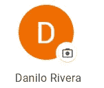
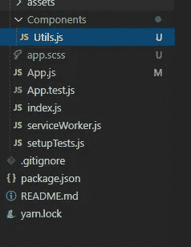
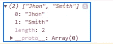
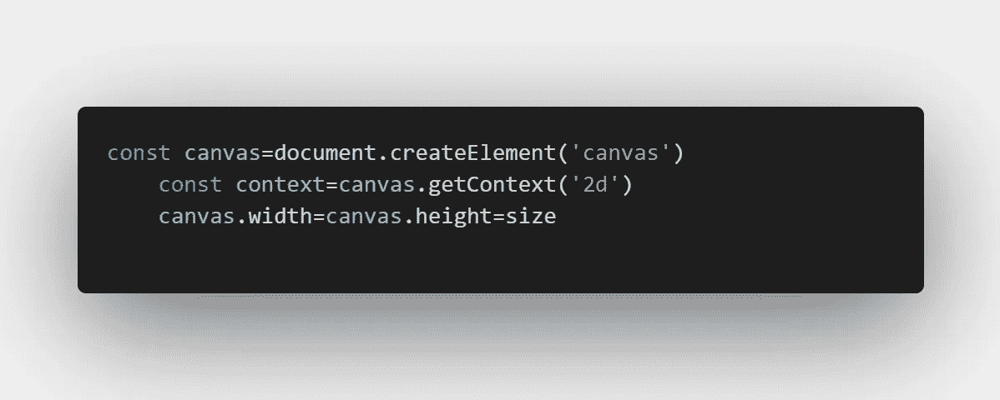
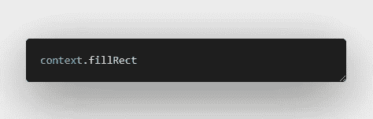
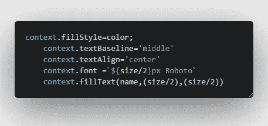
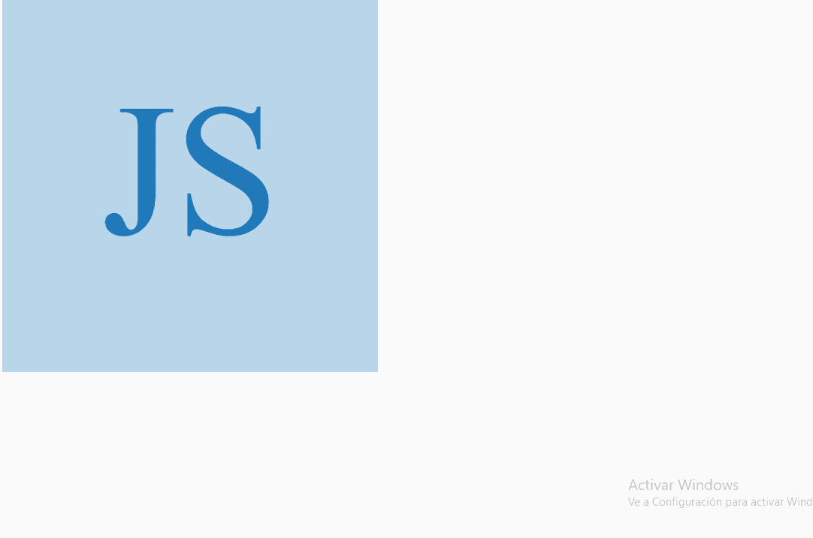
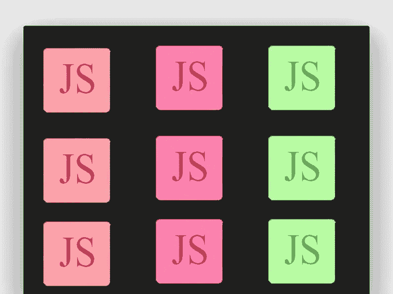

# 创建一个字母图片，就像谷歌用 React 做的那样

> 原文：<https://betterprogramming.pub/create-a-letter-picture-like-google-with-react-ae12a7a4390e>

## 为没有个人资料图片的用户添加一个漂亮的默认图像

Photo by [翔音](https://unsplash.com/@faultycamera?utm_source=medium&utm_medium=referral) on [Unsplash](https://unsplash.com?utm_source=medium&utm_medium=referral).

假设您的下一个请求是执行这个功能:如果用户没有个人资料图像，系统必须采用他们的名字，并以最纯粹的 Google 风格从他们的姓名首字母创建一个图像。

你说这是可能的，但你仍然不知道怎么做。所以你来到了这里…

# **什么是字母图？**

Gmail 信函图片

当谷歌服务找不到你的个人资料的照片时，它会提取你的姓名首字母，并创建一个你的个人资料的小型代表图像。对于用户体验来说，这是一个非常愉快的实践。

# **让我们开始**

项目结构

我们将致力于应用组件。我们将创建一个名为`utilities`的组件，它将包含创建图像所需的所有函数。

App.js

我们的应用程序将非常简单，因为我们将导出我们需要的两个函数。您的`src`所在的图像将有一个条件。如果`src`字段为空，我们将调用我们的函数来生成一个带有首字母的图像。否则，`src`将是我们从数据库中得到的图像。

我们的函数将接收三个参数:图像大小、用户名和颜色。
为了使最后一个值更加个性化，我们将发送一个函数，该函数将在每次页面重新加载时生成一个随机颜色。

你可以忽略这个函数，传递一个十六进制的颜色。

我们将开始处理`utils`的文件。首先，我们将创建随机生成颜色的函数:

函数生成随机颜色

现在，我们将详细了解获取用户名首字母的函数:

如果我们的名字是空的，我们将立即返回，因为我们将不能做任何事情。否则，我们用`split`将字符串转换成数组。
正如 [W3Schools](https://www.w3schools.com/jsref/jsref_split.asp) 所指出的那样，“`split()`方法用于将一个字符串拆分成一个数组。”

拆分方法

一旦我们有了这个数组，我们就会知道名字在位置`[0]`上，姓氏在位置`[1]`上。我们继续使用`subString`。
根据[W3Schools](https://www.w3schools.com/jsref/jsref_substring.asp),`substring()`方法从字符串中提取两个指定索引之间的字符。在这种情况下，由于我们只想使用第一个字母，我们的索引将是`0`和`1`。最后，我们连接结果并返回新字符串:

最重要的功能，创建图像功能

下面是创建我们的图像的函数:

创建画布

`canvas` 元素本身没有绘制能力。它只是一个图形容器。

正如在 [*JavaScript 和 jQuery make Easy*](https://books.google.ca/books?id=ib7cDwAAQBAJ&pg=PA121&lpg=PA121&dq=#v=onepage&q&f=false)中所写的那样，`getContext()`方法“返回一个对象，该对象为在画布上进行绘制提供方法和属性。”

`canvas.width=canvas.height`用于为画布创建一个正方形。

填满画布

方法绘制一个“填充”的矩形。根据我们传递的大小，我们填充一个正方形。

管理文本

最后，我们将管理`text`属性，使我们的首字母位于正方形的中心。记得指定字体。否则，默认文本会显得很小，忽略大小。

我们的最终结果是这样的:

最终方案

完整代码:

 [## Danilo 95/letter-picture-like-Google-with-React

### 这个项目是用 Create React App 引导的。在项目目录中，您可以运行:在…中运行应用程序

github.com](https://github.com/danilo95/letter-picture-like-Google-with-React) 

我希望这个教程是有用的。感谢阅读！

