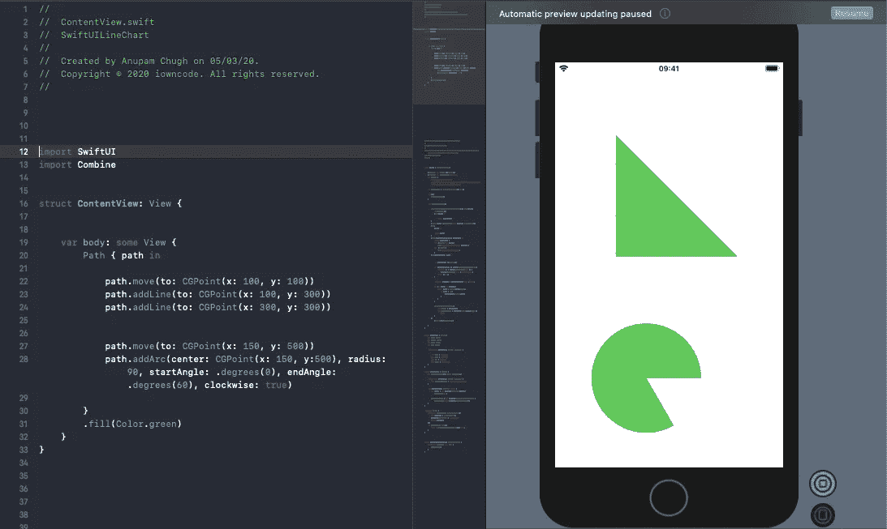
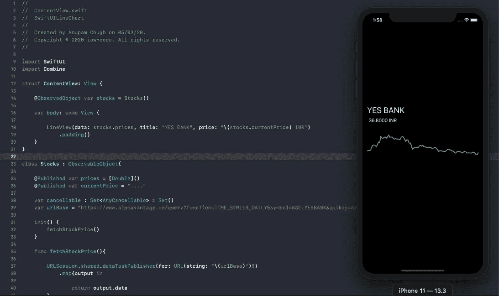

# 使用路径在 SwiftUI 中创建折线图

> 原文：<https://betterprogramming.pub/create-a-line-chart-in-swiftui-using-paths-183d0ddd4578>

## SWIFTUI 实施

## 在你的 iOS 应用程序中创建漂亮的股票图表

克里斯·利维拉尼在 [Unsplash](https://unsplash.com?utm_source=medium&utm_medium=referral) 上拍摄的照片。

SwiftUI 框架在 WWDC 2019 上推出，让 iOS 社区欢呼雀跃。用 Swift 编写的易于使用的声明式 API 让开发人员可以快速构建 UI 原型。

虽然我们可以利用 Shapes 协议从头开始构建[条形图](https://medium.com/better-programming/swiftui-bar-charts-274e9fbc8030)，但对于折线图却不能这么说。谢天谢地，我们有`Paths`结构来帮助我们。

使用 SwiftUI 路径，它类似于核心图形框架中的`CGPaths`，我们可以组合线条和曲线来构建漂亮的徽标和形状。

按照编写 UI 的声明方式，SwiftUI 路径是用一组指令构建的。在接下来的几节中，我们将讨论这意味着什么。

# 我们的目标

*   探索 SwiftUI 的路径 API 并从中创建简单的形状。
*   使用 Combine 和 URLSession 获取历史股票数据。我们将使用 [Alpha Vantage](https://www.alphavantage.co/) 的 API 来检索股票信息。
*   在 SwiftUI 中创建一个折线图，显示一段时间内的股票价格。

在本文结束时，您应该能够创建一个类似于下面的 iOS 应用程序:

一个印度 NSE 和两个美国股票图表。

# 创建一个简单的 SwiftUI 路径

以下是在 SwiftUI 中使用路径创建直角三角形的示例:

Path API 由一系列函数组成。`move`负责设置路径的起点。`addLine`负责画一条直线到指定的目的地点。

`addArc`、`addCurve`、`addQuadCurve`、`addRect`和`addEllipse`只是一些其他的方法，它们让我们在许多其他带有路径的事物中创建圆弧或贝塞尔曲线。

使用`addPath`可以添加两个或多个路径。

下图显示了一个三角形后面跟着一个圆形饼图:

现在我们已经了解了如何在 SwiftUI 中创建路径，让我们跳到 SwiftUI 中的折线图。

# SwiftUI 折线图

下面给出了解码来自 API 的 JSON 响应的模型:

让我们创建一个`ObservableObject`类。我们将使用 URLSession 的合并发布器执行 API 请求，并使用合并操作符转换结果。

API 结果由嵌套的 JSON 组成，关键字是日期。这些在字典中是无序的，我们需要对它们进行排序。为此，我们声明了一个扩展，将字符串转换为日期，并在`sort`函数中进行比较。

既然我们已经在`Published`属性中获得了价格和股票数据，我们需要将它们传递给`LineView`——一个自定义 SwiftUI 视图，我们接下来将看到:

上面的视图是从我们的 SwiftUI ContentView 调用的，其中传递了名称、价格和一组价格历史。使用 GeometryReader，我们将把框架的宽度和高度传递给`Line`结构，在那里我们将最终使用 SwiftUI 路径连接这些点:

`stepWidth`和`stepHeight`被计算用于将图表约束在给定的框架宽度和高度内。然后将它们传递给`Path`结构的扩展函数，以创建折线图:

最后，显示股票图表的 SwiftUI 应用程序准备就绪。下图展示了:

# 结论

在本文中，我们设法再次将 SwiftUI 和 Combine 结合在一起——这一次是为了获取股票价格并在折线图中显示它们。了解 SwiftUI 路径的复杂性是使用 SwiftUI 形状的良好起点，这需要您实现`path`功能。

您可以通过使用手势突出显示点及其各自的值，将 SwiftUI 折线图向前推进一步。要了解如何做到这一点以及更多，请参考这个库[。](https://github.com/AppPear/ChartView)

上述应用程序的完整源代码可以在 [GitHub 资源库](https://github.com/anupamchugh/iowncode/tree/master/SwiftUILineChart)中找到。

这一次到此为止。感谢阅读。