# 使用再搜索创建一个歌词搜索引擎

> 原文：<https://betterprogramming.pub/create-a-lyrics-search-engine-using-redisearch-9261ebe5d76>

## *构建一个开源项目*

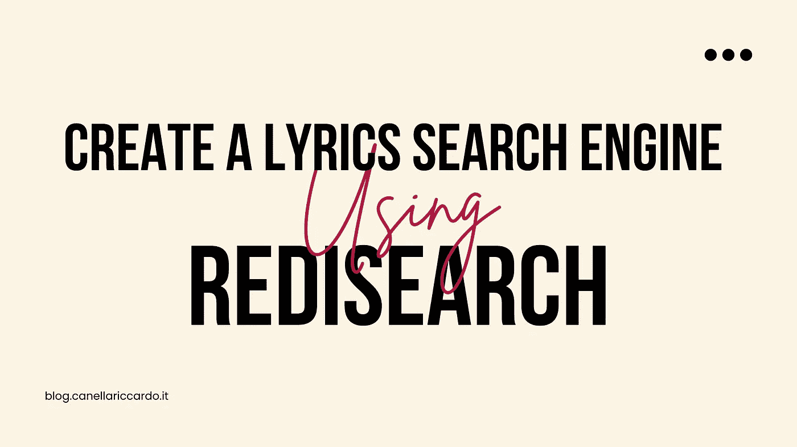

*你有多少次想知道“谷歌怎么只用歌词的一小部分就能找出我在找哪首歌？”老实说，我从未问过自己这个问题，除了昨天，我决定尝试复制类似的东西。*

*为了做到这一切，我需要:*

*   *大量的音乐歌词*
*   *一个存储器*
*   *一种类似“全文搜索”的方法*

我正要放弃这个想法，这时一个朋友问我“你为什么不为金属歌曲做这件事？”我内心的金属头按捺不住，在谷歌上搜索了“有史以来最好的 1000 首金属歌曲”

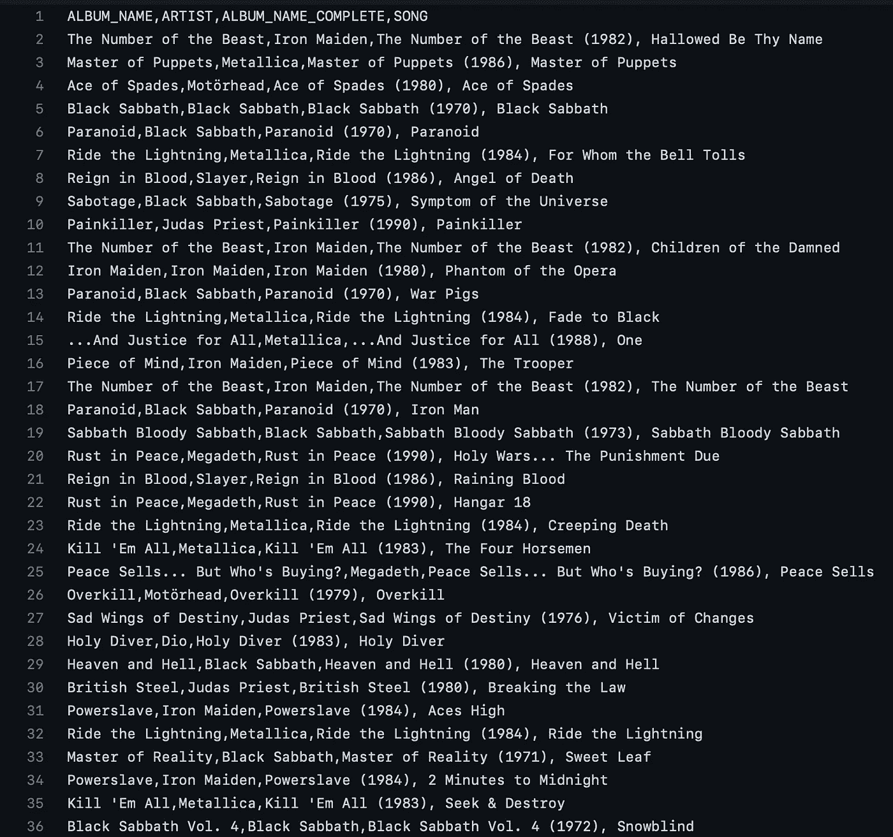

## *第一步:下载所有歌词*

*这个步骤的标题比代码复杂。*

*感谢*[*Spotify Labs*](https://medium.com/u/38cbcf08d447?source=post_page-----51b1f83acd--------------------------------)*你有机会找到关于一首歌的所有信息，只需搜索歌名和艺术家名字* [*(你可以在这里找到代码)*](https://github.com/thecreazy/metal-song-search/blob/main/scripts/downloadSongInformation.js) *接下来，使用另一个 Spotify 端点，你可以检索每首歌的所有歌词！* [*(这么简单这么快还有很多数据)*](https://github.com/thecreazy/metal-song-search/tree/main/files/tracks)

## *第二步:将所有内容上传到存储器*

*为了存储我所有的数据，我在寻找一个数据库:*

*   *轻巧超快*
*   *给我本地使用 Docker 的可能性*
*   *拥有托管在线版本*
*   *给我将信息存储为 JSON 的可能性*
*   *给我执行全文搜索的可能性*

*最后我选择*[*Redis*](https://redis.io/)*。是的，Redis 不仅是一个简单的“内存中的数据存储”而且有很多很酷的特性。第一个我用过(也很喜欢)的是****redis son***

> *RedisJSON 是 Redis 中提供 JSON 支持的 Redis 模块。RedisJSON 允许您在 Redis 中存储、更新和检索 JSON 值，就像处理任何其他 Redis 数据类型一样。*

*在 NodeJS 中使用 RedisJSON 轻而易举。Redis 给了我们一个做得很好的库* `[***@node-redis/json***](https://www.npmjs.com/package/@node-redis/json)` *，它允许我们在 Redis 服务器(安装了 RedisJSON 模块)上存储一个 javascript 对象，实际上是这样做的:*

*我们可以很容易地在* `*metalmusic:jsondata:{id}*` *键下保存一个真正的 JSON 对象，并使用内部数据结构执行查询！(选择密钥的格式是有原因的，但我们接下来会看到原因)*

例如，我们可以使用命令`JSON.GET {ID}`通过关键字查询对象

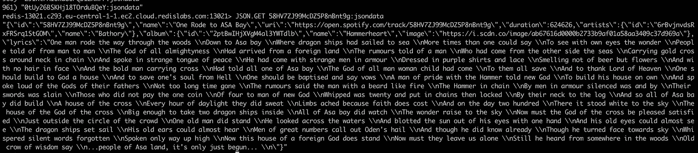

或者使用命令`JSON.GET {ID} id`仅获得对象的一个键，以仅获得对象的`id`，或者使用命令`JSON.GET {ID} ..image`获得存储对象的所有键图像

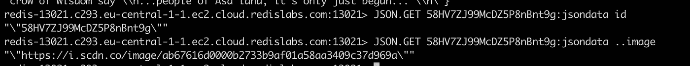

当然，我们也可以使用 NodeJS 包完成所有这些工作，如下所示:

```
const results = await client.json.get(`metalmusic:jsondata:${id}`, {
  path: [
    'id',
    '..image'
  ]
});
```

## 奖励步骤

使用 RedisJSON 的一个坏消息是 DB UI 工具的主要部分在显示信息方面有问题，例如，使用`TablePlus`您将看到值`NULL`，这并不酷！当然你可以使用终端和`redis-cli`但是 Redis 也给了我们一个 UI 工具(thx！)称为[](https://redis.com/redis-enterprise/redis-insight/)

**这个工具不仅帮助我们显示正确的值(并且让我们有可能编辑和删除 JSON 的每个键)**

**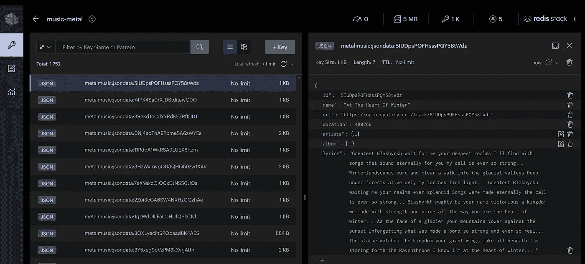**

**但是也给了我们一些很酷的东西，比如可以通过前缀对键进行分组(在键中使用`:`字符)**

**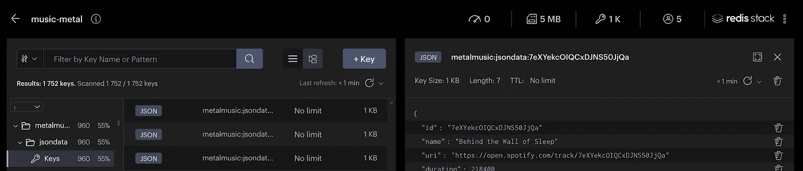**

## **第三步:执行搜索**

**使用 RedisJSON 最有趣的一个特点是，它与 [RediSearch](https://www.google.com/search?client=safari&rls=en&q=RediSearch&ie=UTF-8&oe=UTF-8&safari_group=9) 完全兼容和集成**

> **RediSearch 为 Redis 提供了二级索引、全文搜索和一种查询语言。这些功能支持多字段查询、聚合、精确短语匹配和文本查询的数字过滤。**

**同样在这种情况下，Redis 给了我们一个兼容`JS`和`TS`的库`[@node-redis/search](https://www.npmjs.com/package/@node-redis/search)`，允许我们在两个非常简单的段落中执行搜索和聚合(以及许多其他事情)**

****创建索引
首先要做的是创建一个索引:****

**如何使用 NodeJS 模块创建索引非常简单。我们只要通过:**

1.  **索引名称**
2.  **我们要用来执行搜索或聚合的字段**
3.  **`ON` conf 参数向 Redis 提供了将在 JSON 上执行搜索的信息**
4.  **通知 Redis 只索引以某个前缀开始的键的`PREFIX` (在我们的例子中是 `metalmusic:jsondata`)**

****执行搜索** 创建索引后，执行搜索真的是两行代码！**

**结果是完美的，例如，作为查询`blood` *(抱歉这是一个模式)*，我们可以看到有 191 首不同的歌曲包含单词`blood`(并查看 191 首歌曲中的每一首)**

**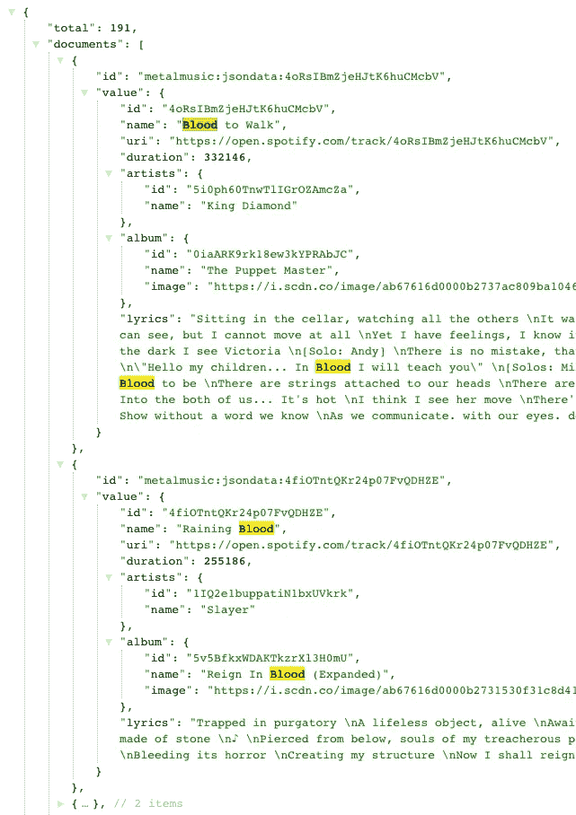**

**那真的很酷！但是如果我们试图搜索一个艺术家的名字会发生什么呢？比如`metallica`？**

**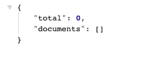**

**没有返回结果，因为我们没有将艺术家的名字添加到索引中！如果我们将这个属性添加到索引中，紧接着，我们将会遇到这样的情况:**

**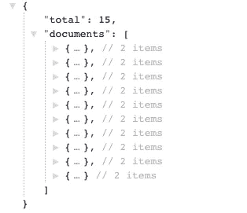**

**为了更新我们的索引，我们必须做这样的事情，这真的很简单，对吗？**

## **第四步:统计！**

**RediSearch 的另一个很酷的功能是`aggregation`。对于聚合，我们可以执行许多很酷的查询(也可以组合在一起),并从我们的数据中检索许多很酷的信息。例如，让我们创建一个简单的聚合，它将返回:**

1.  **我们收藏的不同艺术家的数量**
2.  **我们收藏的不同专辑的数量**
3.  **我们收藏的歌曲的平均持续时间**

**让我们用一个独特的查询来实现这一点！**

**如你所见，代码有点复杂，但非常清晰，真正酷的是`STEPS`和`REDUCE`键是数组！似乎在一个单独的查询中，您可以执行大量的插值，组合不同的步骤和不同的归约器，并在未来的步骤中使用在之前的步骤中创建的键。**

## **第四步:使用管理数据库**

**为了让您有可能测试这个项目，有两种可能性:**

1.  **创建一个带有 Redis 服务器的服务器，一个 NodeJS-express 应用程序和一个简单的前端应用程序**
2.  **使用 Github 页面托管前端，使用 Vercel 托管 NodeJS-express 应用程序，使用 RedisCloud 托管我们的数据库**

**出于显而易见的原因，我决定使用第二个选项！**

> **Redis 企业云是 Redis 提供的完全托管的云服务。专为现代分布式应用而构建，使您能够以亚毫秒级性能在几乎无限的规模上运行任何简单或复杂的查询，而无需担心操作复杂性或服务可用性**

**并为您提供执行高级搜索所需的所有模块！**

**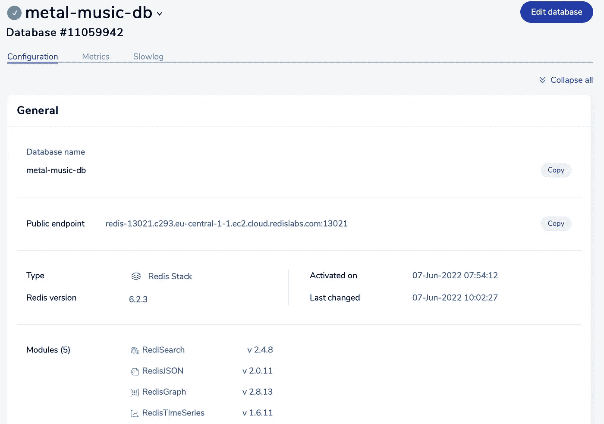**

**我使用的是免费计划，如果你愿意，你可以使用这个链接免费测试它[，它给你一个 30MB 的**小数据库。**是的，这是真的，似乎很少，但让我们试着做一些测试:](https://redis.info/3NBGJRT)**

**我尝试使用 Postman(欧洲到欧洲请求)执行 224 次不同的搜索，结果如下:**

**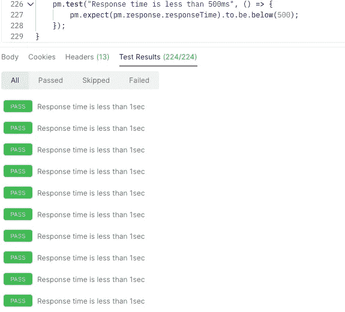**

**224 个不同的请求，在不到`500ms`的时间内全部返回信息！对于一个`30MB`服务器和一个免费计划来说还不错！**

## **第五步:创建一个简单的 web 界面**

**这更像是一个奇特的步骤。为了给你测试整个系统的所有可能性，我用 Github pages 和 Vercel(所以是最差的环境)把所有东西都放到了网上。通过这种方式，你可以看到仅仅使用 30MB 的服务器该机制有多快！**

**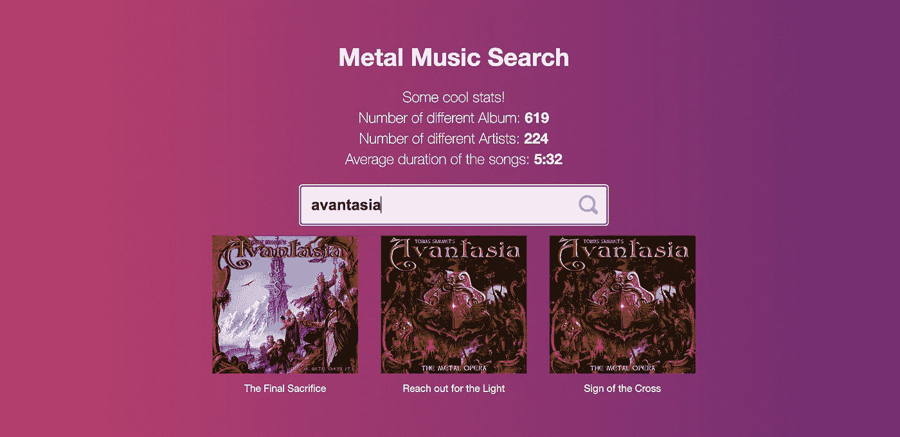**

**[你可以在这里找到这个项目](https://thecreazy.github.io/metal-song-search/)**

**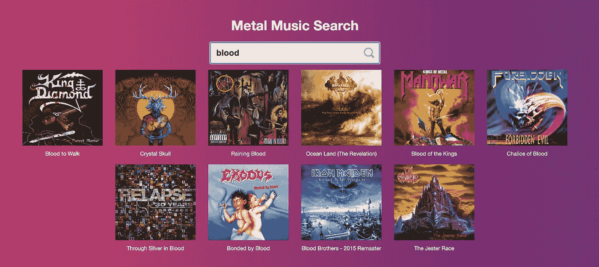**

**这个项目的代码是开源的，你可以在这里找到它:**

**[](https://github.com/thecreazy/metal-song-search) [## GitHub-the creazy/Metal-song-search:使用 RedisJSON 和 RedisSearch 进行金属歌曲搜索

### 此时您不能执行该操作。您已使用另一个标签页或窗口登录。您已在另一个选项卡中注销，或者…

github.com](https://github.com/thecreazy/metal-song-search) 

## 一些很酷的参考

*   [免费试用 Redis Cloud】](https://redis.info/3NBGJRT)
*   [观看此视频，了解 Redis 云相对于其他 Redis 提供商的优势](https://redis.info/3Ga9YII)
*   [Redis 开发者中心——关于 Redis 的工具、指南和教程](https://redis.info/3LC4GqB)
*   [RedisInsight 桌面图形用户界面](https://redis.info/3wMR7PR)

> 这篇文章是与 Redis 合作的。**