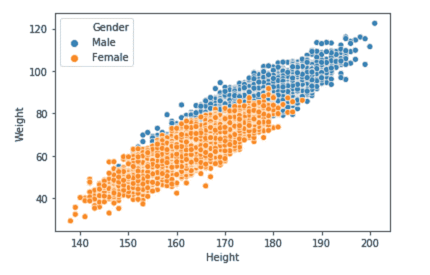
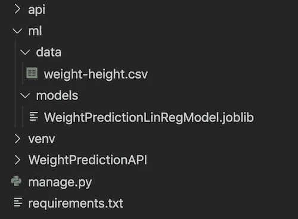
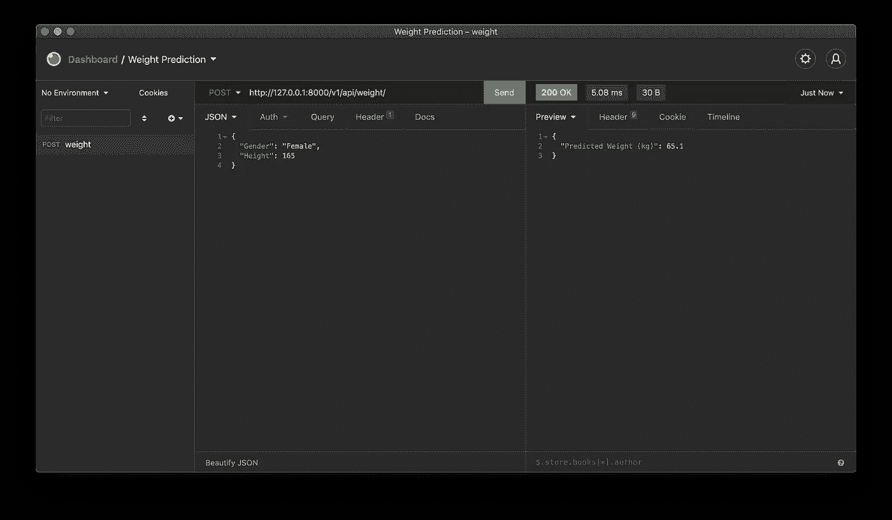
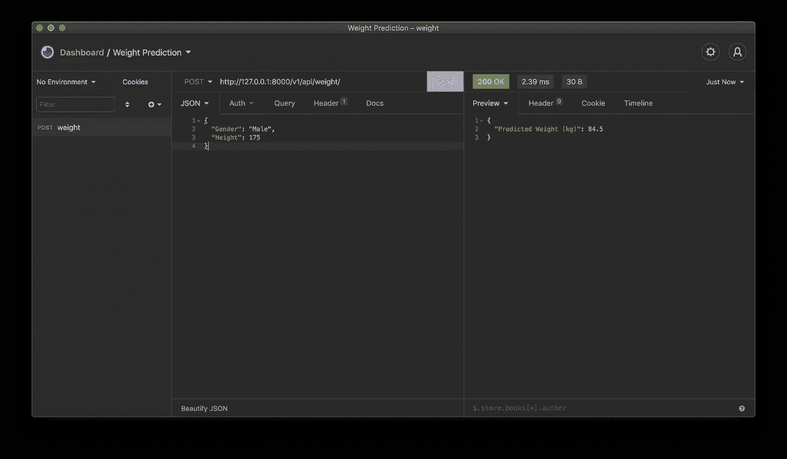

# 用 Django Rest 框架创建机器学习 API

> 原文：<https://betterprogramming.pub/create-a-machine-learning-api-with-django-rest-framework-967571640c46>

## 了解如何用 Django 创建机器学习 API


詹姆斯·哈里逊在 [Unsplash](https://unsplash.com?utm_source=medium&utm_medium=referral) 上拍摄的照片

本教程将分为两部分。

*   在**第 1 部分**中，我们将训练一个简单的机器学习模型，并用 [Django Rest 框架](https://www.django-rest-framework.org/)创建一个 API。
*   在第 2 部分**中，我们将使用一个流行的云服务来部署我们的项目。
    (我将向您展示如何通过 AWS 和 GCP 部署您的项目，您可以选择任何您想要的。)**

现在你正在阅读第一部分，它由三个子部分组成:

*   建立一个模型，在给定身高和性别的情况下预测一个人的体重。
*   用 Django 创建一个 API 来处理到来的请求。
*   用失眠测试 API。

在进入文章之前，我不得不说，这篇文章既不是 Django 教程，也不是展示如何解决机器学习问题。事实上，本文的目的是将机器学习模型与 Django 项目结合起来，并将您的模型产品化为机器学习 API。

# 建立一个模型

在本节中，我们将训练一个机器学习模型，该模型稍后将用于预测 API。

## 资料组

为了简单起见，我将使用在 [Kaggle](https://www.kaggle.com/mustafaali96/weight-height) 和我的 [Git repo](https://github.com/gorkemarslan/WeightPredictionAPI/tree/main/ml/data) 上可用的一个小数据集。利用这个数据集，我们将建立一个模型，在给定身高和性别的情况下预测一个人的体重。该数据集包含 10，000 条记录，包括人类性别、身高和体重。

让我们开始探索数据集。

应该做的第一件事是导入依赖项。

接下来，我们加载数据集:

不幸的是，身高数据以英寸为单位，体重数据以磅为单位。我希望它们的单位分别是厘米和千克。所以我将做一个单位转换和四舍五入的数据，因为身高和体重不能用这些精度来衡量。

(如果这些单元对你来说没问题，那么你可以跳过这一部分。)

让我们看看我们得到了什么:

现在看起来好多了。

让我们检查数据集是否平衡。

**输出:**

```
Female    5000
Male      5000
Name: Gender, dtype: int64
```

数据集具有相同数量的女性和男性记录，因此数据集是平衡的。

现在我们来看看基于性别的分布。



男女分布(图片由作者提供)

此外，很明显，男女的体重和身高之间存在正相关关系。

在训练模型之前，我们需要完成最后一步。数据集中的性别列由分类数据组成，即`female`和`male`。但是它们必须是数字，所以我们需要将它们转换成数字数据。为此，我们将用`0`替换`Male`，用`1`替换`Female`。

现在我们可以训练一个模型。

## 训练模型

我们将数据集分成 80%的训练数据和 20%的测试数据进行训练。

为了简单起见，我对训练集应用线性回归。你可以选择更好的方法。让我们训练模型:

并测量模型的准确性:

**输出:**

```
0.904889435019112
```

现在我们希望我们的模型预测一个 180 厘米的男性的体重。

**输出:**

```
89.8
```

我对结果进行了四舍五入，以便我们的 API 用户能够读懂。

结果可以进一步改进，但这足以创建一个 Django 项目。在结束本节之前，我们将保存模型，以便稍后在 API 中使用。

现在我们可以开始姜戈部分了。

# 用 Django 创建 API

在本节中，我们将从创建 Django 项目开始。然后我们将能够创建一个 API。

## **虚拟环境和安装依赖关系**

让我们开始为 Django 项目创建一个新目录。我在桌面上有一个名为`code`的目录来存储我的项目。我建议你也这样做。

打开命令提示符，写下以下几行:

```
$ cd Desktop/code
$ mkdir WeightPredictionAPI
```

然后导航到此目录:

```
$ cd WeightPredictionAPI
```

最佳实践是将 Python 项目所需的包隔离到虚拟环境中。因此，我们将首先创建一个虚拟环境。接下来我们将激活它。在控制台上，编写这些 shell 命令来创建和激活虚拟环境。

```
$ python -m venv venv
$ source venv/bin/activate
```

一旦虚拟环境被激活，我们就可以安装 Django 项目所需的所有依赖项了。为此，我们将创建`requirements.txt`文件来添加将在我们的项目中使用的包。

```
(venv)$ touch requirements.txt
```

让我们打开`requirements.txt`文件，指定运行项目所需的包及其版本。

```
Django==3.1
djangorestframework==3.11.1
numpy==1.18.4
scikit-learn==0.24.2
joblib==0.16.0
```

下面的命令可用于安装写在`requirements.txt`文件中的包。

```
(venv)$ pip install -r requirements.txt
```

安装好所有东西后，我们需要创建一个 Django 项目。

## 创建 Django 项目

```
(venv)$ django-admin startproject WeightPredictionAPI .
```

现在我们将创建一个负责 API 管理的新应用程序。运行以下命令创建一个新的 Django 应用程序。

```
(venv)$ python manage.py startapp api
```

让我们创建另一个目录来存储我们的机器学习模型。我还会将数据集添加到项目中，以便那些想要实现整个数据集的人使用。(创建数据文件夹不是强制性的。)

```
(venv)$ mkdir ml
(venv)$ mkdir ml/models
(venv)$ mkdir ml/data
```

并将文件移动到相关目录。

您的项目文件夹和文件最终应该是这样的:



项目结构(图片由作者提供)

## **更新 settings.py**

首先，我们需要将创建的应用程序添加到`INSTALLED_APPS`中。否则，Django 无法运行不是用`INSTALLED_APPS`编写的应用程序。暂时我们只使用`rest_framework` (Django rest 框架)和`api`。

我们还需要告诉 Django 我们的机器学习模型所在的位置。将这几行添加到`settings.py`文件中:

## 迁移

现在，我们能够在运行项目之前迁移一切。

```
(venv)$ python manage.py makemigrations
(venv)$ python manage.py migrate
```

您可能会在终端上看到这些消息。

```
Operations to perform:
  Apply all migrations: admin, auth, contenttypes, sessions
Running migrations:
  Applying contenttypes.0001_initial... OK
  Applying auth.0001_initial... OK
  Applying admin.0001_initial... OK
  Applying admin.0002_logentry_remove_auto_add... OK
  Applying admin.0003_logentry_add_action_flag_choices... OK
  Applying contenttypes.0002_remove_content_type_name... OK
  Applying auth.0002_alter_permission_name_max_length... OK
  Applying auth.0003_alter_user_email_max_length... OK
  Applying auth.0004_alter_user_username_opts... OK
  Applying auth.0005_alter_user_last_login_null... OK
  Applying auth.0006_require_contenttypes_0002... OK
  Applying auth.0007_alter_validators_add_error_messages... OK
  Applying auth.0008_alter_user_username_max_length... OK
  Applying auth.0009_alter_user_last_name_max_length... OK
  Applying auth.0010_alter_group_name_max_length... OK
  Applying auth.0011_update_proxy_permissions... OK
  Applying auth.0012_alter_user_first_name_max_length... OK
  Applying sessions.0001_initial... OK
```

让我们运行项目，看看是否一切顺利。如果是这样，这意味着我们的 Django 后端设置正确，运行没有问题。

```
(venv)$ python manage.py runserver
```

现在打开你的浏览器，进入 [https:127.0.0.1:8000](http://127.0.0.1:8000/)


Django 欢迎页面(图片由作者提供)

如果你看到这个页面，那就意味着到目前为止你没有任何问题。恭喜你！

## 应用程序接口

让我们创建我们的 API。

第一步是将路线添加到`urls.py`。

我们需要为 API 应用程序生成`urls.py`文件。在控制台上写下这一行:

```
(venv)$ touch api/urls.py
```

更新文件。

## 更新 apps.py

我强烈建议你在`apps.py`中加载你的机器学习模型。在这里，当应用程序启动时，训练好的模型只被加载一次。否则，每次调用端点时都会加载训练好的模型，这样响应时间会变慢。

让我们更新`apps.py`，以便我们的应用程序更快地处理传入的请求。

## **编辑 views.py**

最后一步是更新`views.py`。视图将主要负责两项任务:

1.  处理传入的`POST`请求。
2.  使用输入数据进行预测，并将结果作为`Response`给出。

# 测试 API

为了测试我们的 API，我将使用一个名为[失眠症](https://insomnia.rest/)的应用程序。你也可以使用[邮递员](https://www.postman.com/)。我喜欢用失眠，因为它对于小任务来说很简单。

因为我们有一个端点，即`weight/`，我们将只测试这个端点。

让我们发送一个`POST`请求到[http://127 . 0 . 0 . 1:8000/v1/API/weight/](http://127.0.0.1:8000/v1/api/weight/)。

请求的主体必须包含`Gender`和`Height`字段。

让我们来预测一个身高 165 cm 的女性的体重:

```
{
 "Gender": "Female",
 "Height": 165
}
```



用失眠测试 API(图片由作者提供)

现在试着预测一下:

```
{
 "Gender": "Male",
 "Height": 175
}
```



用失眠测试 API(图片由作者提供)

我们的应用程序有效！

如你所见，用 Django 做一个机器学习 API 没什么大不了的。

源代码可以在 [GitHub](https://github.com/gorkemarslan/WeightPredictionAPI) 上找到。

# 结论

在本教程中，我们学习如何将我们的机器学习模型与 Django rest 框架相结合。在第 2 部分中，我们将学习如何用 Google 云平台和 Amazon Web Services 部署这个项目。

希望你喜欢这篇文章。

如果您想提高 Python 技能，可以访问:

[](https://python.plainenglish.io/11-python-tricks-to-boost-your-python-skills-significantly-1a5221dfa5c7) [## 显著提升你的 Python 技能的 11 个 Python 技巧

### 你不会相信有了这些技巧，Python 中的事情会变得多么简单！

python .平原英语. io](https://python.plainenglish.io/11-python-tricks-to-boost-your-python-skills-significantly-1a5221dfa5c7)