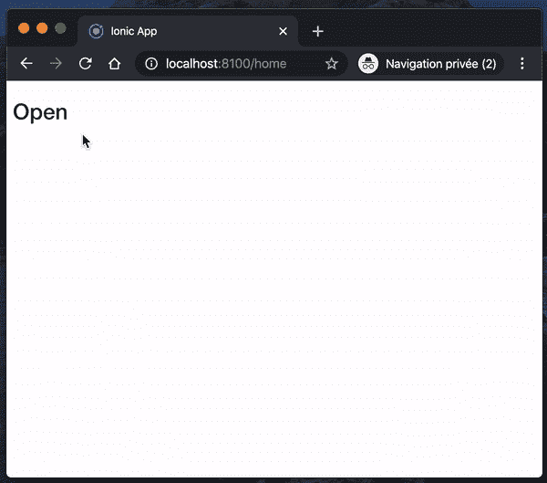

# 如何在不使用库的情况下为 Angular 应用程序创建一个模型

> 原文：<https://betterprogramming.pub/create-a-modal-for-your-angular-app-without-libs-671bd7280867>

## 没有依赖关系的情态动词


罗杰·布尔夏德在 [Unsplash](https://unsplash.com/s/photos/free?utm_source=unsplash&utm_medium=referral&utm_content=creditCopyText) 上拍摄的照片

我每天分享[一个小技巧](https://medium.com/@david.dalbusco/one-trick-a-day-d-34-469a0336a07e)直到 2020 年 4 月 19 日新冠肺炎隔离期结束。还有二十天，直到希望更好的日子！

前几天，我和我客户的一个队友在 [Angular](https://angular.io) ( < v13)中构建一个快速的概念验证，为此我们必须在一个模态中显示一些东西。我认为，与其安装和使用设计库来解决这个需求，不如花几乎同样的努力来快速创建一个。事实证明我没有错。

昨天，我[分享了另一个解决方案](https://medium.com/swlh/create-a-menu-for-your-gatsby-website-without-libs-b7eb3a563fd2)为一个 [Gatsby](https://www.gatsbyjs.org) 网站创建一个没有任何依赖的自定义菜单，这让我有了分享这个教程的想法。



# 服务

模态有两种状态:`open`和`close`。这就是为什么在做任何事情之前，我们使用 Angular CLI 创建一个`service`(命令:`ng g service modal`)。我们将在整个应用程序中使用它来触发打开或关闭它。

注意:如果你愿意，你可以使用`boolean`或`enum`，或者用`Subject`代替`BehaviorSubject`——重要的是你能够保持模态的两种状态。

# 情态的

我们使用 Angular CLI ( `ng c component modal`)为我们的模型创建一个新组件。

# 密码

组件代码包含一个变量，一个我们用来监视模态状态的`Observable`,并公开一个我们可以用来关闭模态的函数。

# 模板

在容器中，我们定义了一个`section`来在模态打开时覆盖整个屏幕，我们定义了一个子节点`div`，来将我们的模态约束到某个大小。

请注意，我停止了容器上的事件传播。这是为了防止我们想要在模式中添加一些动作，例如，一个带有提交按钮的表单。

# 风格

为了使模态平滑地出现，我们在属性`opacity`上使用了一个简短的`transition`。我们还为背景定义了一些`box-shadow`和`background`，只是为了让事情更有风格。

# 申报

为了简单起见，我没有创建一个模块来加载模型。然而，我建议你这样做，如果你是按照本教程的实际应用程序。

同时，在本文中，我们将组件添加到主模块`app.module.ts`的`declarations`中:

```
@NgModule({
  declarations: [AppComponent, ModalComponent],
  ...
})
export class AppModule {}
```

对于整个应用程序，我们只在模板中使用一次我们的组件，因为我们只管理单个实例和状态，例如在`app.component.html`中。

```
<router-outlet></router-outlet><app-modal></app-modal>
```

# 使用

我们准备好了。一切都在发展，我们现在只需要有效地测试它。所以我们在应用程序中添加了一个`button`来触发模态打开。

例如，我们可以在我们想要触发模态打开的组件中声明一个新函数`open()`。

```
import {Component} from '@angular/core';

import {ModalService} from '../modal.service';

@Component({
  selector: 'app-home',
  templateUrl: 'home.page.html',
  styleUrls: ['home.page.scss'],
})
export class HomePage {

  constructor(
      private modalService: ModalService
  ) {}

  open() {
    this.modalService.open();
  }

}
```

然后链接相关模板中的方法。

```
<button (click)="open()">
  <h2>Open</h2>
</button>
```

就是这样——不多也不少。我们已经为我们的应用程序开发了一个没有任何 JavaScript 依赖的定制模型。

# 摘要

当然，开箱即用、快速定制的莫代尔并不是你见过的最漂亮的东西。但对我来说，重要的是我们不必总是依赖依赖。这条路可能是彼得·奎尔的——两者都有一点。

呆在家里，注意安全！

大卫