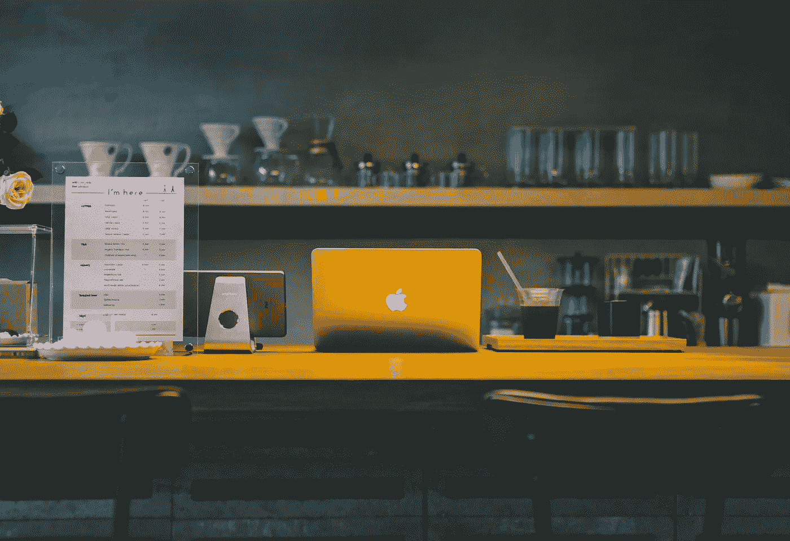
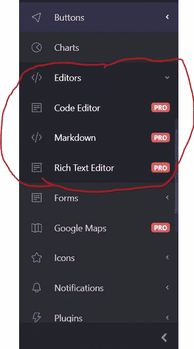
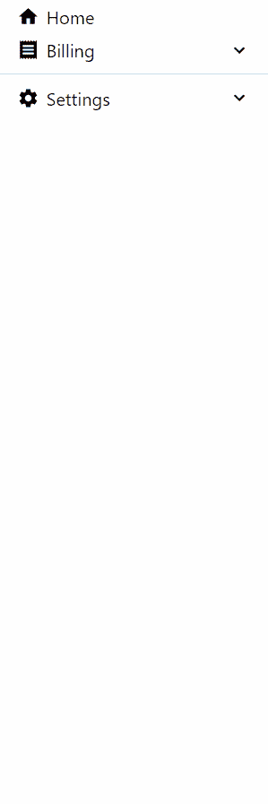
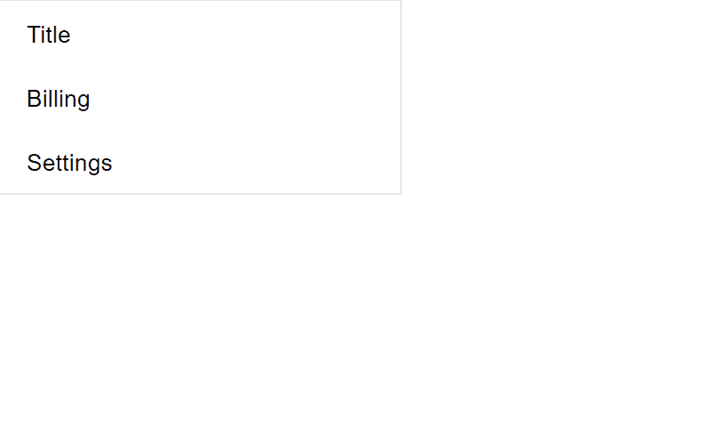
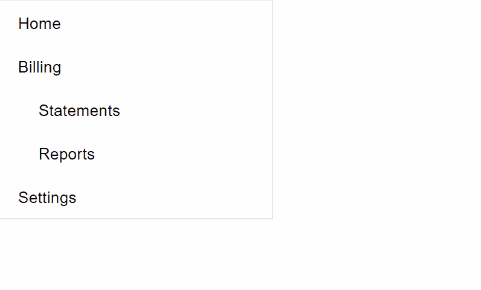
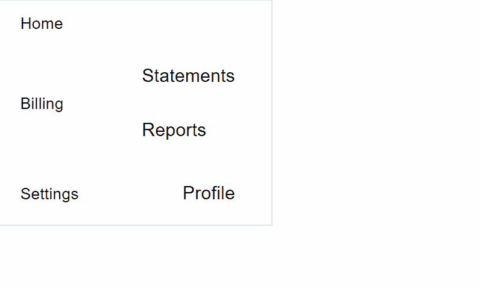
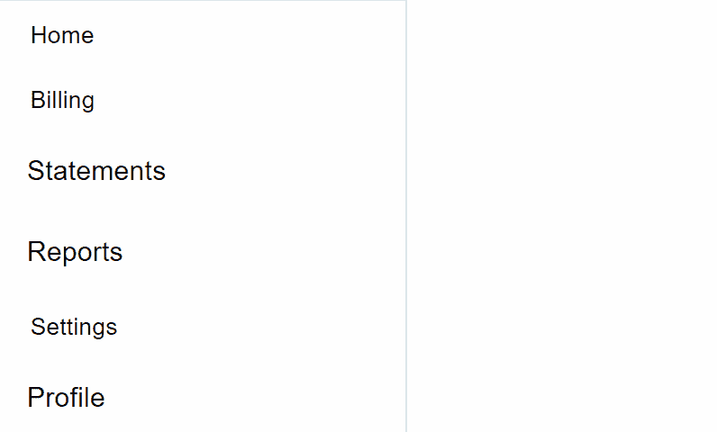
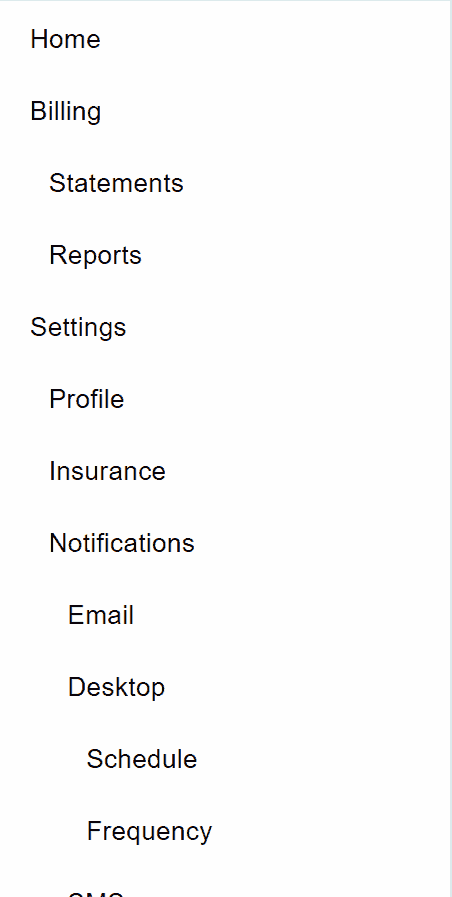
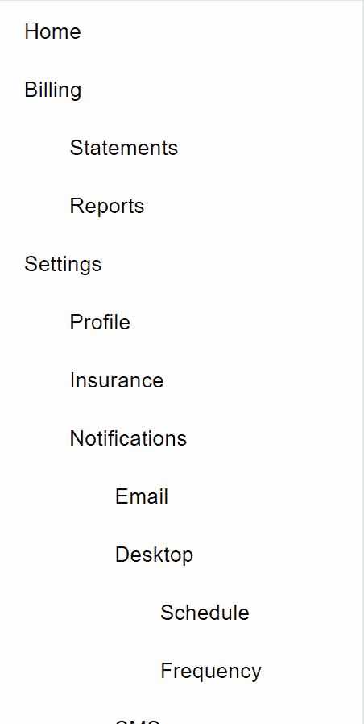

# 使用递归在 React 中创建一个现代动态侧边栏菜单

> 原文：<https://betterprogramming.pub/create-a-modern-dynamic-sidebar-menu-in-react-using-recursion-f757135045bc>

## React 中递归的威力



由[本多·金](https://unsplash.com/@bundo?utm_source=unsplash&utm_medium=referral&utm_content=creditCopyText)在 [Unsplash](https://unsplash.com/?utm_source=unsplash&utm_medium=referral&utm_content=creditCopyText) 拍摄的照片

由于其导航功能，网页中的侧栏是页面上最有用的组件之一。

今天我们将使用递归在 react 中构建一个现代侧边栏。递归是一种技术，在这种技术中，函数简单地重复调用自己，直到满足某个条件。在本文中使用递归时，递归的三个规则适用:

1.  函数应该有一个自毁的条件。
2.  该函数应该有一个基本条件。
3.  该函数应该调用自身。

侧边栏对于一个网页来说确实是必不可少的，即使它们的关注度并不是第一位的。这是因为它们可以帮助用户以不同的方式导航，比如他们可能感兴趣的内容，而不是逻辑导航菜单。

但是我们为什么要对侧边栏使用递归呢？与手动写出侧边栏条目相比，这有什么不同？如果你浏览互联网有一段时间了，你可能会遇到一个网站的侧边栏，并意识到一些侧边栏项目有子部分。有些网站有侧边栏，根据用户导航到的页面路径隐藏或呈现某些项目。这是强大的！

例如，如果我们看下面红色圆圈内的图像，编辑器部分是侧边栏的一个项目，紧接着下面的三个项目(代码编辑器、Markdown、文本编辑器)是子部分:



在这篇文章的结尾，你会看到这个看似复杂的工具条实际上只有 50 行代码。什么？！

下面是一个基本的例子，说明如何扩展这篇文章中的侧边栏组件，使其更时尚，同时保持简洁:



事不宜迟，我们开始吧。

在本教程中，我们将使用 [create-react-app](https://create-react-app.dev/docs/getting-started/) 快速生成一个 React 项目。

继续使用下面的命令创建一个项目。在本教程中，我将我们的项目称为 [modern-sidebar](https://github.com/jsmanifest/modern-sidebar) 。

```
npx create-react-app modern-sidebar
```

完成后，现在进入目录:

```
cd modern-sidebar
```

在主条目`src/index.js`中，我们将对其进行一点清理，这样我们可以只关注组件:

```
import React from 'react'
import ReactDOM from 'react-dom'
import App from './App'
import './styles.css'
import * as serviceWorker from './serviceWorker'ReactDOM.render(<App />, document.getElementById('root'))serviceWorker.unregister()
```

现在创建`src/App.js`:

```
import React from 'react'const App = () => <div />export default App
```

`App`将通过创建`Sidebar.js`来导入和使用我们的`Sidebar`组件，所以让我们继续创建:

```
import React from 'react'function Sidebar() {
  return null
}export default Sidebar
```

现在我要安装一个 CSS 库，但是你实际上可以实现侧边栏相同的工作功能，我们将建立没有它。我这样做的原因是，除了让图标随时可用之外，我还喜欢看到额外的涟漪效果。

```
npm install @material-ui/core @material-ui/icons
```

一旦安装完成，我们需要在用户界面中考虑一个基本结构，我们的侧边栏将建立在这个基础上。一个解决方案是使用无序列表(`<ul>`)元素来呈现列表项(`<li>`)。我们将从`@material-ui/core`导入`List`和`ListItem`，因为`List`组件本质上是一个`ul`元素，而`ListItem`组件本质上是一个`li`。

让我们开始在侧边栏中硬编码几个项目，来想象一下这会如何增强我们的信心。有时候，一点额外的自信可以帮助我们提高工作效率:

`disablePadding`和`dense`被用来稍微缩小每个物品的尺寸，`button`道具被用来添加令人眩晕的涟漪效果。

这是我们目前掌握的情况:



现在我们已经增强了信心，让我们继续定义`props.items`，它将被`Sidebar`使用来呈现它的项目。

也就是说，我们还将期待一个`items` prop，它是一个表示侧边栏菜单中每一项的对象数组。我们希望功能尽可能简单，否则我们可能会很快使组件过于复杂。

让我们首先在`App`组件中创建条目，并将其作为`props.items`传递给`Sidebar`:

我们现在将更新`Sidebar`组件来反映这个数组结构:

你可能已经注意到的一件事是，我们的边栏实在是太大了。侧边栏通常占据屏幕的一边，所以我们要做的是将其宽度缩小到合适的大小。我们将继续在它上面放置一个`200px`的`max-width`。所以我们将创建一个`div`元素来包装我们的`List`组件。

我们之所以创建另一个`div`元素，而不是直接在`List`组件上应用样式，是因为我们不想让`List`负责宽度大小。这样，将来我们可以选择将`List`抽象成一个可重用的侧边栏组件，它可以根据父元素的大小适应任何大小:

下面是`Sidebar.js`组件:

在`index.css`中，我们为`sidebar`类定义了 CSS 样式:

```
.sidebar {
  max-width: 240px;
  border: 1px solid rgba(0, 0, 0, 0.1);
}
```

Material-UI 实际上使用了自己的 [CSS 样式机制](https://material-ui.com/styles/basics/)，使用 CSS-in-JS 方法，但是在本文中我们将坚持使用常规 CSS，以免事情变得不必要的复杂。

我们已经可以让它像这样简单，就到此为止了。但是，它不支持子项。我们希望能够点击一个侧边栏项目，并让它下拉它的子项列表，如果它有任何。拥有子项有助于通过将附加项目分组到另一个侧边栏部分来组织侧边栏:



我们支持这个特性的方式是在每个侧边栏项目中允许另一个选项，组件将使用它来检测它的子项。(能感觉到*递归*来了吗？)

让我们更改`App`组件中的 items 数组，以传入子项:

为了能够呈现侧边栏项目的子项，我们必须在呈现侧边栏项目时注意`items`属性:

现在…看，我们耀眼的侧边栏组件！



如果你还不明白，这不是我们想要的侧边栏外观。

现在，由于我们不希望用户点击浏览器上的关闭按钮，然后再也不回到我们的网站，我们需要找到一种方法，使它看起来不仅对眼睛更有吸引力，对 DOM 也更有吸引力。

你会问，“你说的大教堂是什么意思？”

嗯，你仔细看，有问题！如果用户单击一个子项，呈现子项的父项也在使用 click 处理程序，因为它们是重叠的！这是不好的，会给用户体验带来一些讨厌的意外问题。

我们需要做的是将父元素与其子元素(子元素)分开，这样它们就可以相邻地呈现子元素，这样鼠标事件就不会发生冲突:

现在我们差不多可以重操旧业了！



从屏幕截图来看，我们似乎有了一个新问题:子项比顶级项大得多。我们必须找出一种方法来检测哪些是子项，哪些是顶级项。

我们可以对此进行硬编码，然后就到此为止:

但是，我们的侧边栏组件应该是动态的。理想情况下，我们希望它根据调用者作为道具传入的项目来生成项目。

我们将使用一个简单的`depth`道具，侧边栏项目将使用这个道具，根据深度，它们可以根据`depth`相应地调整自己的间距，不管它们在树中的位置有多低。我们还将把侧边栏项目提取到它自己的组件中，这样我们可以增加深度，而不必通过引入状态逻辑来使它变得复杂。

代码如下:

这是怎么回事？

嗯，我们声明了一些强大的道具来配置侧边栏预渲染阶段，如`depth`和`depthStep`。`SidebarItem`被提取到它自己的组件中，在它的渲染块中，它使用`depth`来计算它的间距。`depth`越高，它们在树中的位置就越深。

这一切都是可能的，因为这一行:

```
{
  items.map((subItem) => (
    <SidebarItem
      key={subItem.name}
      depth={depth + 1}
      depthStep={depthStep}
      {...subItem}
    />
  ))
}
```

每当一个新的子项列表变得更深时,`depth`就增加`1`。

并且递归存在于`SidebarItem`内部，因为它调用自己，直到不再有基本用例。换句话说，当数组为空时，这段代码会自动停止:

```
{
  items.map((subItem) => (
    <SidebarItem
      key={subItem.name}
      depth={depth + 1}
      depthStep={depthStep}
      {...subItem}
    />
  ))
}
```

现在让我们测试一下递归化的侧边栏组件:

> *src/App.js*



我们做到了！

让我们稍微摆弄一下`depthStep`，传入一个更高的值:

```
function App() {
  return (
    <div>
      <Sidebar items={items} />
    </div>
  )
}
```



# 结论

你可以选择从 [github 链接](https://github.com/jsmanifest/modern-sidebar)下载回购，并查看侧边栏的其他功能。它具有更奇特的功能，例如在渲染(侧边栏部分)中添加一个额外的层，这导致(分隔符)作为分隔符，侧边栏扩展/折叠，图标等。

我希望你发现这是有价值的，并期待在未来更多！