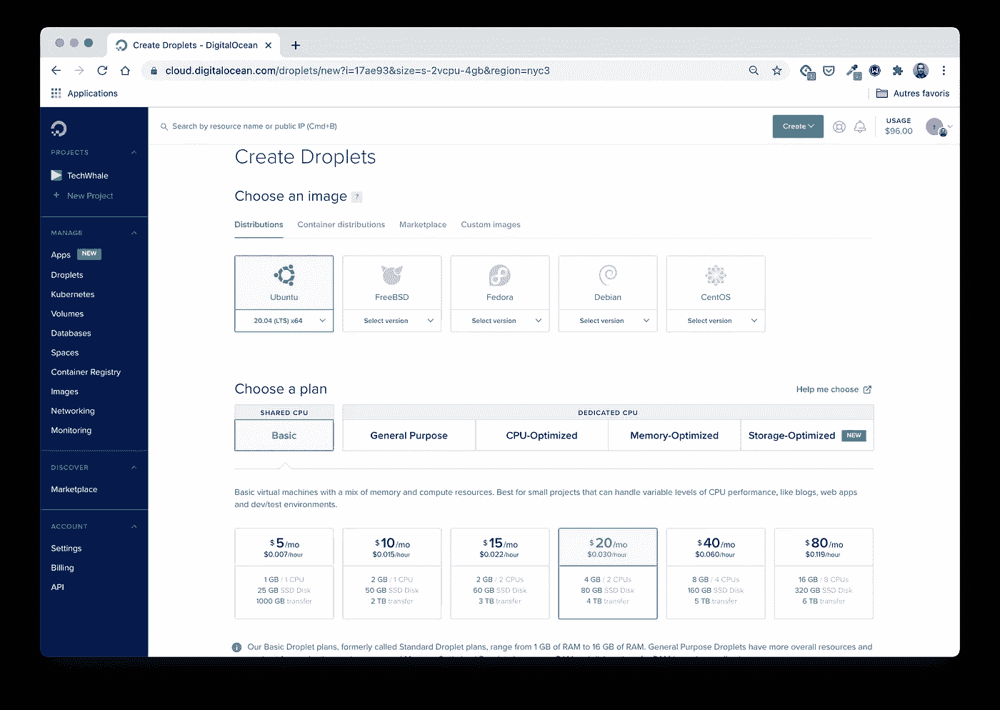
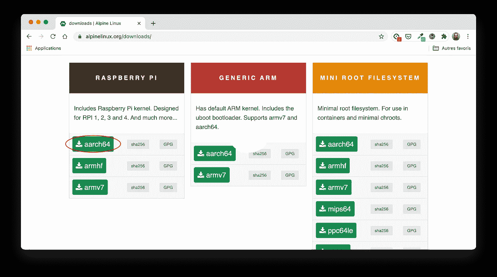
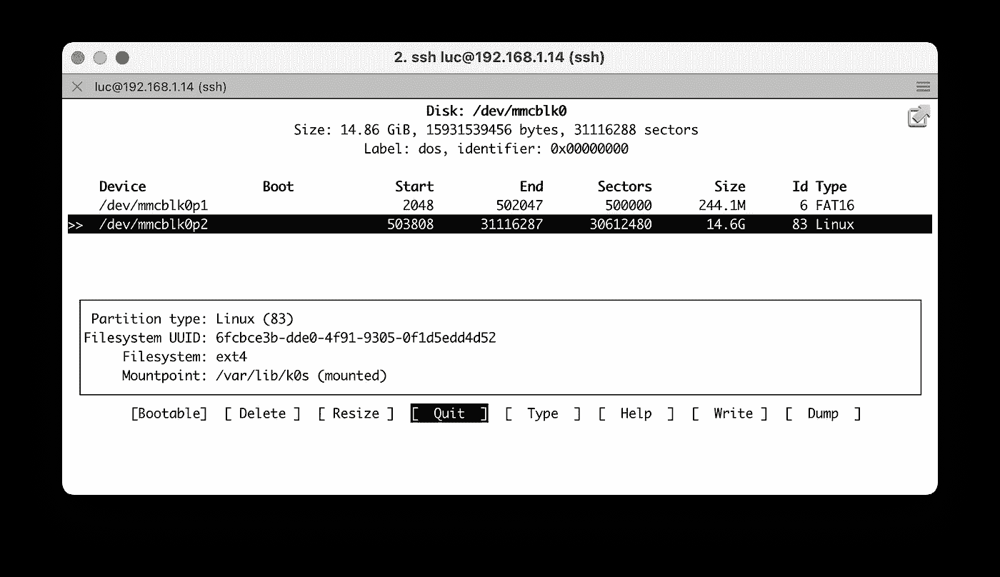
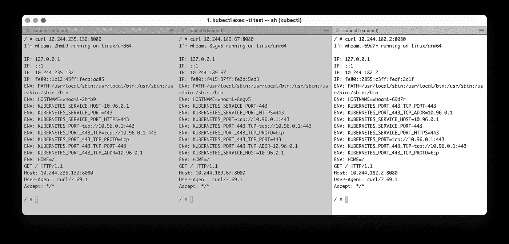

# 创建多架构 k0s 集群

> 原文：<https://betterprogramming.pub/create-a-multi-architecture-k0s-cluster-e265d24937b3>

## 跨标准 Ubuntu (amd64)和 Raspberry Pi (arm64)构建 k0s Kubernetes 集群


照片由 [Nareeta Martin](https://unsplash.com/@splashabout?utm_source=unsplash&utm_medium=referral&utm_content=creditCopyText) 在 [Unsplash](https://unsplash.com/s/photos/cluster?utm_source=unsplash&utm_medium=referral&utm_content=creditCopyText) 上拍摄

在之前的[文章中，](https://medium.com/better-programming/k0s-kubernetes-in-a-single-binary-224bb43f4520)我们介绍了 [k0s](https://k0sproject.io) 的基础知识，这是一个新的轻量级 Kubernetes 发行版，打包在一个 Go 二进制文件中。我们还使用通过 [Multipass](https://multipass.run) 创建的本地虚拟机设置了一个演示集群。

在这篇新文章中，我们将继续探索 k0s，并建立一个简单的集群，其中有一个主集群和三个工作集群。工作人员将在不同的架构上运行(amd64/arm64):

*   `master`:运行在[数字海洋](https://digitalocean.com)上的 Ubuntu 20.04
*   `worker1` : Ubuntu 20.04
*   `worker2` : RPI 4 运行 RPI OS 64 位
*   `worker3`:运行 Alpine Linux 的 RPI 4

主控运行在数字海洋上，而工人运行在家庭局域网的防火墙后面。员工之间也有完整的网络连接。

# 运行主节点

主节点是运行在数字海洋基础设施上的虚拟机。是标准的 Ubuntu 20.04 Linux 盒子。



使用干净的网络界面在数字海洋基础设施上创建虚拟机

一旦虚拟机启动并运行，我们需要在其中装入一个 shell，并使用以下命令安装 k0s 二进制文件:

```
**$ curl -sSLf get.k0s.sh | sudo sh** Downloading k0s from URL: [https://github.com/k0sproject/k0s/releases/download/v0.9.0/k0s-v0.9.0-**amd64**](https://github.com/k0sproject/k0s/releases/download/v0.9.0/k0s-v0.9.0-arm64)
```

**注意:**在上面命令的输出中，我们可以看到 amd64 版本已经被下载了。还有，k0s 0 . 9 . 0 版本是最新的(截止到 2020 年 12 月)。

接下来，我们使用默认配置将集群初始化为主节点。这个节点也可以定义为一个使用`--enable-worker`标志的工人。

```
$ k0s server
```

**注意:**这个命令在前台运行 k0s。对于真正的生产集群，我们可以使用 systemd 来管理这个过程。

然后从这个主机上的另一个终端，我们创建一个`join`令牌。我们需要保存这个令牌——因为我们将在接下来的步骤中使用它来添加工作节点。

```
$ k0s token create --role worker > join.token
```

为了访问我们的新集群(它还没有任何 worker 节点)，我们首先需要使用在主服务器上创建的配置文件来配置我们的本地 kubectl。这可以通过以下命令轻松完成:

```
# Get the kubeconfig file
$ ssh root@$MASTER cat /var/lib/k0s/pki/admin.conf > k0s.cfg# Configure kubectl
$ export KUBECONFIG=$PWD/k0s.cfg
```

**注意:**确保将`localhost`替换为`k0s.cfg`中主节点的外部 IP 地址。

然后，我们可以访问群集并检查节点。

```
**$ kubectl get no** No resources found
```

我们创建了一个单节点集群。该节点只是一个主节点，这就是为什么上一个命令没有列出它的原因。在下一步中，我们将添加第一个 worker 节点。

# 添加 Ubuntu 工作节点

这个工人将在 20.04 Ubuntu 机器上运行(英特尔 NUC)。

首先，我们需要安装 k0s 二进制文件，就像我们对主节点所做的那样。

接下来，我们使用以下命令运行 worker 节点:

**注意:**在运行这个命令之前，我们将上一步中生成的`join.token`文件复制到第一个 worker 节点上的`/tmp/join.token`中。使用`--token-file`选项，我们可以轻松分发令牌。

```
$ sudo k0s worker --token-file /tmp/join.token
```

接下来，我们确保我们的第一个 worker 出现在节点列表中:

```
**$ kubectl get no** NAME      STATUS   ROLES    AGE   VERSION
worker1   Ready    <none>   25s   v1.20.1-k0s1
```

此外，我们可以检查集群中运行的所有系统单元:

```
$ **kubectl get po -A**
NAMESPACE    NAME                        READY STATUS  RESTARTS  AGE
kube-system  calico-kube-controllers-... 1/1   Running 0         5m
kube-system  calico-node-7nzbf           1/1   Running 0         60s
kube-system  coredns-5c98d7d4d8-p96dn    1/1   Running 0         5m
kube-system  konnectivity-agent-77jkp    1/1   Running 0         60s
kube-system  kube-proxy-czm86            1/1   Running 0         60s
kube-system  metrics-server-7d475dd-...  1/1   Running 0         5m
```

`api-server`、`kube-controller-manager`和`kube-scheduler`没有在这里列出，因为它们是作为裸进程运行的(理解:它们没有在 Pods 中运行)。

**注意:** Calico 是创建 k0s 集群时默认使用的网络插件。可以使用 k0s 配置文件对其进行配置，以满足特定需求。Calico 是一个强大的解决方案，也是许多 Kubernetes 管理的网络插件。

添加第一个工人真的很容易。在接下来的步骤中，我们将添加额外的运行在 Raspberry Pi 4 上的 workers。

# 添加在 RPI 操作系统上运行的 Raspberry Pi Worker

我们现在将添加一个运行在 Raspberry Pi 4 上的 worker。在这一步中，我们将使用 k0s 的 arm64 版本(而 amd64 由主节点和第一个工作节点使用)。

在这一节中，我们将看到事情变得更加复杂。这不是 k0s 本身造成的，而是 RPI 内核的默认配置造成的，我们必须重新编译。

## 树莓 Pi 操作系统的安装

首先，我们创建一个带有 64 位 Raspberry Pi 操作系统的 SD 卡。64 位版本仍处于测试阶段，可以从这里下载。

**注意:**在本教程中，我们使用精简版，因为我们不需要桌面版。

[Raspberry Pi Imager](https://www.raspberrypi.org/blog/raspberry-pi-imager-imaging-utility/) 让 SD 卡的制作变得非常简单，因为我们只需要:

*   选择操作系统映像(Raspberry Pi OS Buster arm64 Lite)
*   选择 SD 卡的位置
*   启动副本
*   等几分钟，放松一下，喝杯咖啡


使用 Raspberry Pi 成像仪在 SD 卡上刷新 64 位 Raspberry Pi 操作系统

## 重建内核

立即运行 k0s worker 会导致错误，因为内核映像中缺少一个配置选项。更具体地说，这与 [CFS 带宽控制](https://www.kernel.org/doc/html/latest/scheduler/sched-bwc.html)有关，CFS 带宽控制允许我们定义 cgroups 来限制一个进程的 CPU 消耗。

首先，我们必须通过提供缺失的配置选项来重建内核。这似乎是一个令人印象深刻的任务，但谷歌搜索使事情变得相对容易。

**注意:**在 64 位 Raspberry Pi OS 64 的正式版本中，可能没有必要重新构建内核——本文将会更新以反映这些变化。

**注意:**下面的说明直接从树莓中完成。如果想从另一台机器上构建内核(交叉编译)，还需要其他指令。

*   首先，我们得到必要的工具和源代码

```
$ sudo apt install git bc bison flex libssl-dev make
$ git clone --depth=1 https://github.com/raspberrypi/linux
```

*   接下来，我们使用 RPI 4 的配置选项

```
$ cd linux
$ KERNEL=kernel8
$ make bcm2711_defconfig
```

*   接下来，我们需要确保下面的选项在`.config`文件中(如果它不在那里，添加它)

```
CONFIG_CFS_BANDWIDTH=y
```

*   我们现在可以构建新的内核映像了。这一步可能需要一些时间(在我的 RPI 4 上大约需要 30 分钟)，即使`-j4`选项允许我们并行编译。

```
**ARCH=arm64** make -j4 Image.gz modules dtbs
```

*   接下来，我们安装/复制构建的结果

```
sudo make modules_install
sudo cp arch/arm64/boot/dts/*.dtb /boot/
sudo cp arch/arm64/boot/dts/overlays/*.dtb* /boot/overlays/
sudo cp arch/arm64/boot/dts/overlays/README /boot/overlays/
sudo cp arch/arm64/boot/Image /boot/$KERNEL.img
```

*   最后是在`/boot/cmdline.txt`文件中添加具体的 cgroup 选项

```
cgroup_enable=cpuset cgroup_enable=memory cgroup_memory=1 
```

*   然后，我们可以重启设备

```
$ sudo reboot
```

现在，应该可以将此 RPI 作为工作节点添加到群集了。

## 作为工作节点加入

首先，我们安装 k0s 二进制文件，就像我们对前面的节点所做的那样。这一次，自动选择 arm64 版本。

```
**$ curl -sSLf get.k0s.sh | sudo sh**
Downloading k0s from URL: [https://github.com/k0sproject/k0s/releases/download/v0.9.0/k0s-v0.9.0-**arm64**](https://github.com/k0sproject/k0s/releases/download/v0.9.0/k0s-v0.9.0-arm64)
```

接下来，我们使用之前生成的`join.token`文件将 Raspberry 设备添加到集群中。

**注意:**在运行这个命令之前，我们将主节点上生成的`join.token`文件复制到 RPI 上的`/tmp/join.token`。

```
$ sudo k0s worker --token-file /tmp/join.token
```

接下来，我们要确保新员工已经准备好了。

```
**$ kubectl get no** NAME      STATUS   ROLES    AGE   VERSION
worker1   Ready    <none>   10m   v1.20.1-k0s1
worker2   Ready    <none>   21s   v1.20.1-k0s1
```

下一步，我们将添加另一个 Raspberry Pi worker——这个 worker 运行 Alpine Linux 而不是 RPI OS。

# 添加运行 Alpine Linux 的 Raspberry PI Worker

Alpine 是一个著名的 Linux 发行版，通常用作 Dockerfile 文件中的基本映像。这也是一个完整的 Linux 发行版，可以安装在工作站和许多设备上。在下一节中，我们将在 RPI 上安装 Alpine，并将其作为新的 worker 节点加入集群。

## 在 RPI 上安装 Alpine

首先，我们需要获得 Alpine Linux 版本。在[官方 Alpine Linux 网站](https://alpinelinux.org/downloads/)的下载部分我们可以找到的版本中，有一些是专门针对树莓 Pi 设备的。在本文的示例中，我们使用的是 aarch64 版本，因为它将安装在 RPI 4 上(这是一个 64 位设备)。



Alpine Linux 可用于许多设备

**注意:**在撰写本文时，当前版本是 Alpine 3.12。存档文件下载到一个名为`alpine-rpi-3.12.3-aarch64.tar`的文件中。

接下来，在一个空的 micro SD 卡上，我们创建一个 FAT32 分区，并将以前的 TAR 文件的内容提取到那个分区中。

然后，我们可以将 SD 卡插入 RPI 4 并启动它。

然后，我们运行`setup-alpine`实用程序脚本，这将有助于定义我们的 Alpine 发行版的主要配置:

*   键盘布局
*   主机名
*   网络接口的设置
*   Root 密码
*   时区
*   NTP 客户端
*   镜子
*   SSH 服务器

接下来，我们需要挂载 cgroups 虚拟文件系统。

```
/etc/init.d/cgroups start && rc-update add cgroups boot
```

我们还需要重新挂载`/media/mmcblk0p1`分区的读写。

```
mount -o remount,rw /media/mmcblk0p1
```

这将允许我们在`/cmdline.txt`文件的开头添加特定的 cgroup 选项:

```
cgroup_enable=cpuset cgroup_enable=memory cgroup_memory=1
```

并添加一些依赖项:

```
apk add iptables coreutils findutils curl
```

下一步是用 SD 卡的空闲空间创建一个新的分区。



/dev/mmcblk0p2 ext4 分区是用 SD 卡的可用空间创建的(本例中使用了 cfdisk)

在这一步之后，我们的 RPI 将在 SD 卡上看到两个分区:

*   `/dev/mmcblk0p1`:引导分区
*   `/dev/mmcblk0p2`:我们将使用的分区为 k0s 提供额外的存储空间

当我们在 RAM 中运行 Alpine 时(另一种安装方法可以通过正确的磁盘安装来完成)，我们需要提交我们的更改(通过 LBU 实用程序)，以便它们在重启后可用。

```
lbu commit -d
```

然后，我们可以重启设备:

```
reboot
```

## 作为工作节点加入

首先，我们将`/dev/mmcblk0p2`分区挂载到`/var/lib/k0s`中，这样 k0s 将有足够的空间来运行 Pods(这与 k0s 的需求无关，但与我们安装 Alpine 的方式有关)。

```
mkdir /var/lib/k0s
mount /dev/mmcblk0p2 /var/lib/k0s
```

接下来，我们安装 k0s 二进制文件，就像我们对前面的节点所做的那样。再次自动选择 arm64 版本。

```
**$ curl -sSLf get.k0s.sh | sh**
Downloading k0s from URL: Downloading k0s from URL: [https://github.com/k0sproject/k0s/releases/download/v0.9.0/k0s-v0.9.0-**arm64**](https://github.com/k0sproject/k0s/releases/download/v0.9.0/k0s-v0.9.0-arm64)
```

接下来，我们使用之前生成的`join.token`文件将 Raspberry 设备添加到集群中。

**注意:**按照前面的步骤，在运行这个命令之前，我们需要将`join.token`文件复制到这个 RPI 上的`/tmp/join.token`中。

```
$ k0s worker --token-file /tmp/join.token
```

接下来，我们要确保它已经准备好了。

```
**$ kubectl get no** NAME      STATUS   ROLES    AGE    VERSION
worker1   Ready    <none>   50m    v1.20.1-k0s1
worker2   Ready    <none>   40m    v1.20.1-k0s1
worker3   Ready    <none>   85s    v1.20.1-k0s1
```

我们的三工作节点集群现在已经启动并准备就绪。下一步，我们将部署一个示例应用程序，并确保它工作正常。

# 部署应用程序

首先，我们使用可用于几种架构的映像创建一个`DaemonSet`规范，并将其保存在`whoami.yaml`中。

**注意:**我们使用一个`DaemonSet`来确保在每个 worker 节点上部署一个 Pod。

```
**apiVersion**: apps/v1
**kind**: DaemonSet
**metadata**:
  **name**: whoami
  **labels**:
    **app**: whoami
**spec**:
  **selector**:
    **matchLabels**:
      **name**: whoami
  **template**:
    **metadata**:
      **labels**:
        **name**: whoami
    **spec**:
      **containers**:
      - **name**: whoami
        **image**: stefanscherer/whoami
```

接下来，我们用以下命令创建这个`DeamonSet`:

```
$ kubectl apply -f whoami.yaml
```

然后，我们验证每个工作人员是否正在运行一个 Pod，同时检索 Pod 的 IP 地址:

```
**$ kubectl get po -o custom-columns=NAME:.metadata.name,NODE:.spec.nodeName,IP:.status.podIP** NAME           NODE      IP
whoami-2hmb9   worker1   10.244.235.132
whoami-69d7r   worker3   10.244.182.2
whoami-8sgv5   worker2   10.244.189.67
```

接下来，我们运行一个除了等待什么也不做的测试舱。我们将验证它运行在哪个节点上(在本例中为`worker1`),并在这个新的 Pod 中获得一个 shell。

```
# Run a new Pod based on Alpine
**$ kubectl run test --image=alpine -- sleep 10000**# Check the host it is running on (you might get a different host) **$ kubectl get po -o custom-columns=NAME:.metadata.name,NODE:.spec.nodeName | grep test**
NAME   NODE
test   worker1# Get a shell inside the test Pod
**$ kubectl exec -ti test -- sh**
/ #
```

从这个新的单元中，我们可以确保我们可以访问每个`whoami`单元，无论它运行在哪个节点上:



一切正常——我们可以到达所有的`whoami`舱。这只是一个简单的例子，以确保连接工作正常。

# 结论

在跨不同基础设施和架构的集群上运行 k0s 非常容易(为 RPI 重新编译 Linux 内核与 k0s 无关，在 64 位 Raspberry Pi OS 的正式版本中可能也没有必要)。

这里需要注意一件重要的事情:我们不需要在路由器中为控制平面进程(运行在 DigitalOcean VM 上)和 kubelet(运行在每个 worker 上)打开一个端口来进行通信。这一部分由连接代理管理，它在一个工作者的 kubelet 和 API 服务器之间打开一个隧道。

然后，我们可以从任何地方访问控制平面(当然，通过安全组)，并将数据平面隔离在防火墙之后。

多架构集群的下一步将是添加一个运行在 Windows 机器(Windows Server 2019)上的额外工作节点。这将在 k0s 的未来版本中提供。敬请关注。