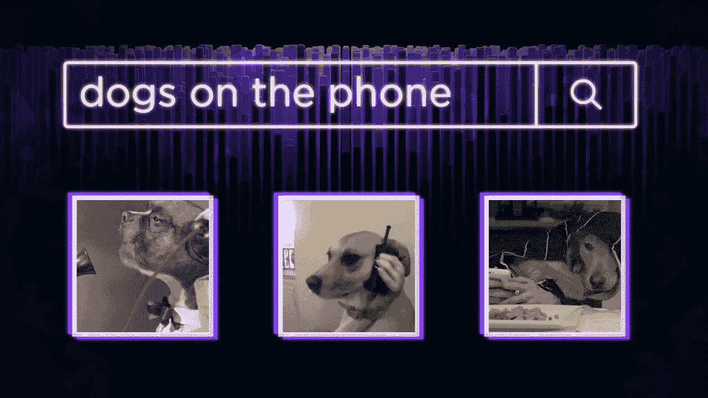
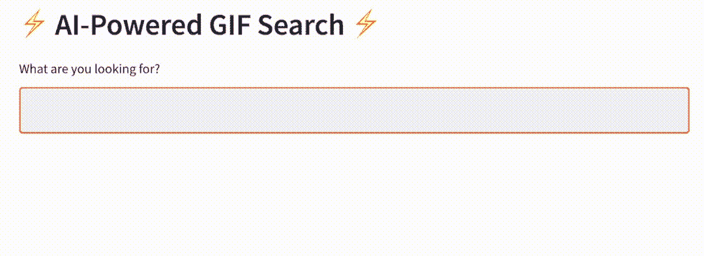
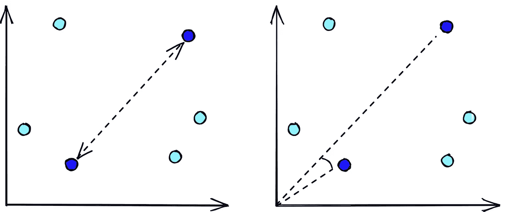
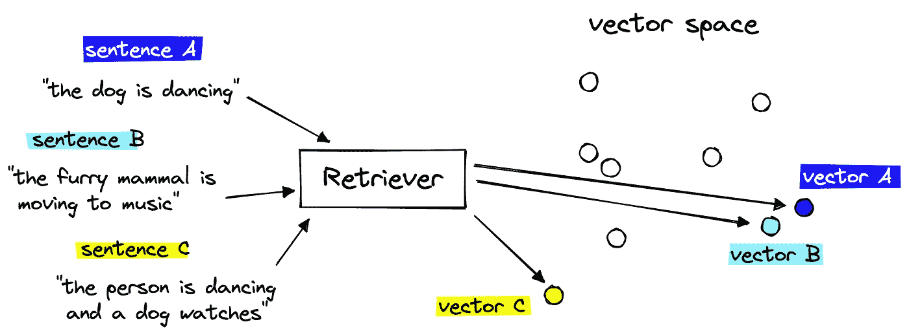
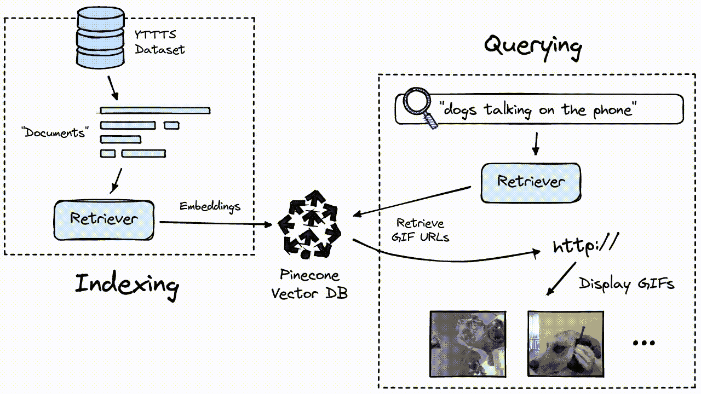
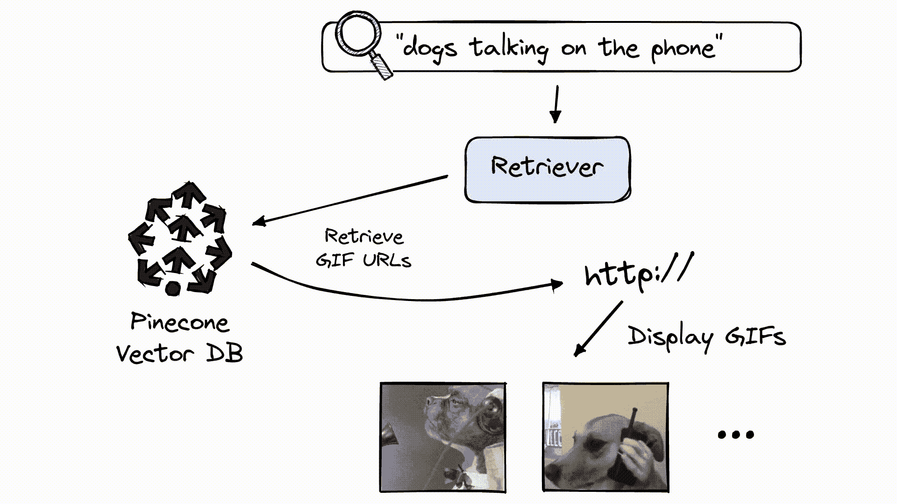

# 创建自然语言语义搜索来查找 gif

> 原文：<https://betterprogramming.pub/create-a-natural-language-semantic-search-to-find-gifs-81f9be79850e>

## 使用自然语言处理和语义搜索增强 GIF 发现



[文章最初发布在 Pinecone.io](https://www.pinecone.io/learn/gif-search/)

矢量搜索为世界上一些最流行的服务提供了动力。它提供你的谷歌搜索结果，在 Spotify 上发布[最好的播客，并在亚马逊[1][2]上占消费者购买量的至少*35%。*](https://www.pinecone.io/learn/spotify-podcast-search/)

在本文中，我们将使用应用于语言的向量搜索，称为*语义*搜索，来构建 GIF 搜索引擎。不像传统的搜索依赖于关键字匹配，语义搜索支持基于文本和图像背后的人类含义的搜索。

这意味着我们可以找到与自然语言提示高度相关的 gif。



GIF 搜索应用[的预览可在此处](https://share.streamlit.io/pinecone-io/playground/gif-search/src/server.py)获得。

像这样一个项目的管道简单而强大。它可以很容易地适应多种多样的任务，如[视频搜索](https://www.pinecone.io/learn/youtube-search/)或[回答超级碗问题](https://www.pinecone.io/learn/question-answering/)，或者，正如我们将看到的，查找 gif。

[*所有配套的笔记本和脚本都可以在这里找到*](https://github.com/pinecone-io/examples/tree/master/learn/projects/gif-search) 。

# GIF 数据集

我们将在这里使用在 GitHub 上找到的 TGIF 数据集。为了获得数据集，我们可以使用`wget`(或者，手动下载)并解压缩。

```
wget https://github.com/raingo/TGIF-Release/archive/master.zip

unzip master.zip
```

在这些解压后的文件中，我们应该能够在`data`目录中找到一个名为`tgif-v1.0.tsv`的文件。我们将使用*熊猫*加载文件，使用`\t`作为字段分隔符。

数据集包含 GIF URLs 及其自然语言描述。我们可以看看前五张 gif。

我们会发现有一些重复的 URL，但这些不一定表示重复的记录，因为一个*单个 GIF* 可以被分配多个描述。

# 搜索

搜索管道将在高层次上采用我们的自然语言查询，如*“一只在电话上说话的狗”*，并在现有的 GIF 描述中搜索任何与该查询具有类似*含义*的内容。

在这个上下文中，我们将含义为的*描述为*语义相似度*，两者都是加载的术语，可以指代许多事物。比如两个短语`"the dog eats lunch"`和`"the dog does not eat lunch"`相似吗？在这种情况下，这在很大程度上取决于我们的用例。*

再比如:下面两句话哪个最像？

```
A: the stock market took a turn for the worseB: how did the stock market do today?C: the stock market performed worse than expected
```

如果我们想找到意思相似的短语，那么显而易见的选择是`A`和`C`。将这些与`B`相提并论没有什么意义。然而，如果我们搜索相似的*问答对*，情况就不是这样了；在这种情况下，`B`应该与`A`和`C`非常匹配。

在*、【语义相似度】*的定义中，确定用例的需求是很重要的。对我们来说，我们真的想确定一般的相似性。也就是说，我们希望`A`和`C`匹配，而`B`不匹配其中任何一个。

为此，我们将把我们的短语转换成 [*密集向量嵌入*](https://www.pinecone.io/learn/dense-vector-embeddings-nlp/) 。这些密集矢量可以存储在 [*矢量数据库*](https://www.pinecone.io/learn/vector-database/) 中，我们可以非常快速地比较矢量，并根据欧几里德距离和余弦相似性等度量来识别最相似的矢量。



这两种度量都确定了向量的相似性(接近度)，但它们是基于距离(左)或角度相似性(右)来确定的。

向量数据库处理我们的向量嵌入的存储和快速搜索，但是我们仍然需要一种方法来创建这些嵌入。

为此，我们使用名为*检索器*的 NLP 转换器模型，这些模型被[微调用于创建*句子嵌入*](https://www.pinecone.io/learn/sentence-embeddings/) 。这些句子嵌入/向量可以*在数字上代表*它们所代表的文本后面的*含义*。



检索器模型能够获取两个语义相似的短语，并将它们编码为相似的向量。

将这两个组件放在一起给我们一个语义搜索管道，我们可以用它来检索给定查询的语义相似的 GIF 描述。



GIF 搜索管道涵盖了一次性索引步骤(左)和查询(右)。

让我们看看如何将所有这些放在一起。

# 正在初始化组件

我们将从初始化我们的检索器模型开始。许多最强大的检索器使用一个*句子转换器*架构，最好通过`sentence-transformers`库支持，通过`pip install sentence-transformers`安装。

为了找到句子转换模型，我们去[*huggingface.co/models*](https://huggingface.co/models)并且为*官方*句子转换模型搜索`sentence-transformers`。

然而，我们也可以使用其他模型，比如在 1B 培训对的[特别活动中训练的](https://discuss.huggingface.co/t/train-the-best-sentence-embedding-model-ever-with-1b-training-pairs/7354)`[all-MiniLM-L6-v2](https://huggingface.co/sentence-transformers/all-MiniLM-L6-v2)`句子转换器。我们将使用这种模式。

这里有几个重要的细节:

*   `max_sequence_length=128`表示该型号最多可以读取 *128 个*输入令牌。
*   `word_embedding_size=384`实际上是指*句的*嵌入大小。这意味着模型将输出输入文本的 384 维向量表示。

对于我们数据集的简短的几个单词的 GIF 描述，最大序列长度 *128* 比*足够多*。

在初始化我们的向量数据库时，我们需要使用*语句*嵌入大小，所以我们将它存储在上面的`embed_dim`变量中。

为了初始化我们的向量数据库，我们首先需要注册一个[免费的 Pinecone API 密匙](https://app.pinecone.io/)，并通过`pip install pinecone-client`安装 Pinecone Python 客户端。准备就绪后，我们初始化:

这里，我们指定一个索引名`'gif-search'`；随意选择你喜欢的任何东西。它只是一个名字。`metric`更重要，取决于所用的型号。

对于我们选择的模型，我们可以在其 [*模型卡*](https://huggingface.co/sentence-transformers/all-MiniLM-L6-v2) 中看到，它已经被训练使用*余弦相似度*，因此我们指定了`metric='cosine'`。替代指标包括`euclidean`和`dotproduct`。

我们已经初始化了向量数据库和检索器组件，所以我们可以继续嵌入和索引我们的数据。

# 索引

当我们对多个记录*并行执行这些步骤*时，嵌入和索引过程要快得多。然而，我们不能一次处理我们所有的记录，因为检索器模型必须将它嵌入的所有内容转移到片上存储器中，这是有限的。

为了避免这种限制，同时尽可能快地保持索引时间，我们在`64`的批次中处理所有内容。

这里我们从数据`df`中提取`batch`。我们通过我们的检索器模型对描述进行编码，创建元数据(涵盖*描述*和 *url* )，并创建一些字符串格式 id。这样，我们就有了创建*文档*所需的一切，它看起来会像这样:

```
(
   "some-id-value",
   [0.1, 0.2, 0.1, 0.4 ...],
   {
       'description': "something descriptive",
       'url': "https://xyz.com"
   }
)
```

当我们`upsert`这些*文件*到松果索引的时候，我们是分批的 *64* 做的。完成所有这些之后，我们使用`index.describe_index_stats()`来检查我们是否已经插入了所有的 *125，782* 文档。

# 询问

查询数据的最后一步包括:

1.  对类似于*“电话中的狗说话”*的查询进行编码，以创建*查询向量*，
2.  从松果中检索相似的*上下文向量*，
3.  从我们的元数据字段中找到的 URL 获取相关的 gif。



查询管道。

步骤*一*和*二*将由一个名为`search_gif`的函数执行:

为了显示 gif，我们使用指向正确 gif 的元数据 URL 来显示 HTML ``元素。我们使用`display_gif`函数来实现这一点:

让我们测试一些查询。

这看起来相当准确，所以我们设法很容易地把这个 GIF 搜索管道放在一起。通过[一点点额外的努力](https://github.com/pinecone-io/examples/blob/master/learn/projects/gif-search/app.py)，我们可以使用类似 [*Streamlit*](https://www.youtube.com/watch?v=QpISF8gMsjQ) 的东西将这些步骤转化为创建一个网络应用。

我们已经成功构建了一个 GIF 搜索工具，使用一个简单的语义搜索管道和现成的模型和松果。稍加调整，同样的管道可以应用于不同的领域。

向量搜索和语义搜索的易用性和潜力已经导致了这两种技术在大技术领域之外的大量研究和应用。

# 资源

[文章笔记本和脚本](https://github.com/pinecone-io/examples/tree/master/learn/projects/gif-search)

[1] M. Osborne，[零售品牌如何利用亚马逊的策略竞争并获胜](https://www.forbes.com/sites/forbesagencycouncil/2017/12/21/how-retail-brands-can-compete-and-win-using-amazons-tactics/) (2017)，福布斯

[2] L. Hardesty，[亚马逊推荐算法的历史](https://www.amazon.science/the-history-of-amazons-recommendation-algorithm) (2019)，亚马逊科学

[3]李彦宏等.艾尔。， [TGIF:动画 GIF 描述的新数据集和基准](https://arxiv.org/abs/1604.02748) (2016)，CVPR — *批准用于非商业研究目的*

**除另有说明外，所有图片均出自作者之手*